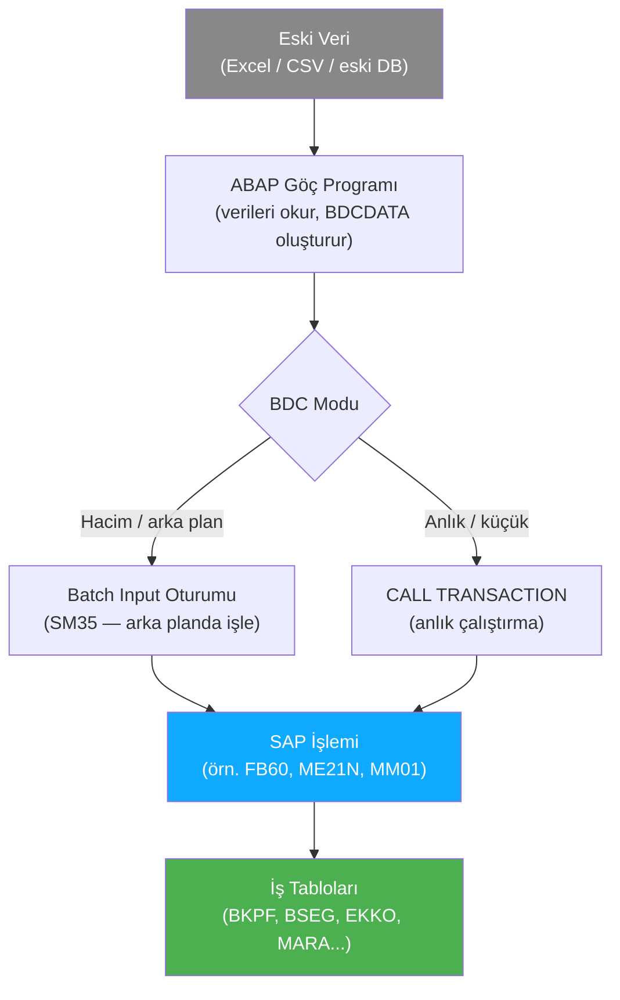
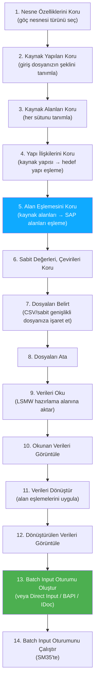

# Kısım 15: Veri Göçü — BDC & LSMW

*Eski verileri SAP'a yüklemek: bir bilgisayara makine hızında form doldurmayı öğretme sanatı.*

---

## ☕ Göç problemi, açıkça ifade edilmişse

Her SAP canlı sistemine geçişte şu konuşma yaşanır:

> İş birimi: "Eski sistemde Excel dosyasında 20.000 açık satın alma siparişimiz var. Hepsinin Pazartesi'ye kadar SAP'ta olması gerekiyor."
> Danışman: "Bunun için BDC veya LSMW kullanmamız gerekecek."
> Siz (yeni ABAP geliştirici): "...ne?"

Bu kısım bunun ne anlama geldiğini ve nasıl yapılacağını açıklıyor.

---

## 15.1 Göç Problemi: Eski Verileri SAP İşlemlerine Yüklemek

### 1️⃣ Benzetme

Bir Python scriptinizin 20.000 kez bir web formu doldurması gerektiğini hayal edin — kayıt başına 15 alanlı bir kayıt formu. Tarayıcıyı otomatikleştirmek için Selenium veya Playwright kullanırsınız: forma gidin, A alanını doldurun, B alanını doldurun, Gönder'e tıklayın, tekrarlayın.

BDC tam olarak budur — sadece "tarayıcı" SAP GUI, "form" ise bir SAP işlem ekranıdır.

### 2️⃣ Bunu zaten biliyorsun

```python
# Python Playwright benzetmesi — BDC'nin kavramsal olarak yaptığı şey
from playwright.sync_api import sync_playwright

data = [
    {"vendor": "100001", "amount": "1500.00", "gl_account": "400000"},
    {"vendor": "100002", "amount": "2300.00", "gl_account": "400000"},
    # ... Excel dosyasından 20.000 satır daha
]

with sync_playwright() as p:
    browser = p.chromium.launch()
    page = browser.new_page()

    for row in data:
        page.goto("http://sap-app/transaction/FB60")   # Satıcı Faturası
        page.fill("#vendor_field",  row["vendor"])
        page.fill("#amount_field",  row["amount"])
        page.fill("#gl_account",    row["gl_account"])
        page.click("#save_button")
        # Hataları kontrol et, sonucu kaydet
```

BDC aynı şeyi ABAP düzeyinde yapar — DOM seçicileri yerine **ekran numarası + alan adı** koordinatlarını belirtirsiniz.

### Temel veri yapısı: BDCDATA

Her BDC programı nihayetinde `BDCDATA` tipinde bir tabloyu doldurmakla ilgilidir. Her satır SAP'a şunlardan birini söyler:
- "Bu ekrana git" (`FNAM = 'BDC_OKCODE'` / `BDC_CURSOR` girişleri), ya da
- "Geçerli ekranda bu alana bu değeri koy."

```abap
" BDCDATA yapısı — bir ekran doldurma talimatı olarak düşünün
DATA ls_bdc TYPE bdcdata.

" Her satır şunlardan biridir:
"  - BDC_DYNPRO  → "bu programın ekran numarasına git"
"  - BDC_CURSOR  → "imleci bu alana getir"
"  - BDC_OKCODE  → "bu düğmeye/fonksiyon tuşuna bas"
"  - alan adı    → "bu alanı bu değere ayarla"
```

---

## 15.2 BDC — Batch Data Communication

### BDC'nin iki modu

| Mod | Nasıl | En iyi kullanım |
|------|-----|---------|
| **Batch Input Oturumu** | FM `BDC_OPEN_GROUP` / `BDC_INSERT` / `BDC_CLOSE_GROUP` aracılığıyla oturum nesnesi oluşturun, ardından SM35'te işleyin | Büyük hacimler, arka plan işleme, denetlenebilir |
| **CALL TRANSACTION** | `CALL TRANSACTION` FM'sini kodunuzda doğrudan çağırın | Anlık çalıştırma, daha küçük hacimler, daha basit hata yönetimi |



### Yardımcı FORM'lar kalıbı

Neredeyse tüm BDC programları iki standart yardımcı FORM rutini kullanır — `BDC_DYNPRO` ve `BDC_FIELD` — yerel bir BDCDATA tablosuna satır ekler. Bu kalıbı her eski BDC programında göreceksiniz:

```abap
*&---------------------------------------------------------------------*
*& BDC Yardımcı FORM'lar — bunları herhangi bir BDC programına ekleyin
*& (modern ABAP'ta bunları bir sınıfın metodları yaparsınız; klasik ABAP'ta
*&  yerel bir include veya altyordam havuzundaki FORM'lardır)
*&---------------------------------------------------------------------*

FORM bdc_dynpro USING prog dynr.
  " BDC'ye söyler: "bu programın ekran numarasına git"
  DATA: ls_bdcdata LIKE LINE OF gt_bdcdata.   " gt_bdcdata = global BDCDATA tablosu
  CLEAR ls_bdcdata.
  ls_bdcdata-program  = prog.
  ls_bdcdata-dynpro   = dynr.
  ls_bdcdata-dynbegin = 'X'.
  APPEND ls_bdcdata TO gt_bdcdata.
ENDFORM.

FORM bdc_field USING fnam fval.
  " Geçerli ekranda bir alan değeri ayarlar
  DATA: ls_bdcdata LIKE LINE OF gt_bdcdata.
  CLEAR ls_bdcdata.
  ls_bdcdata-fnam = fnam.
  ls_bdcdata-fval = fval.
  APPEND ls_bdcdata TO gt_bdcdata.
ENDFORM.
```

### CALL TRANSACTION örneği — FB60 aracılığıyla satıcı faturası deftere işleme

```abap
REPORT zbdc_vendor_invoice_load.

*----------------------------------------------------------------------*
* Tipler & Veri
*----------------------------------------------------------------------*
TYPES: BEGIN OF ty_invoice_data,
         vendor   TYPE lfa1-lifnr,    " satıcı numarası
         amount   TYPE bseg-wrbtr,    " tutar
         gl_acct  TYPE bseg-hkont,    " GL hesabı
         ref_doc  TYPE bkpf-xblnr,    " referans belge
       END OF ty_invoice_data.

DATA: gt_bdcdata   TYPE TABLE OF bdcdata,
      gt_messages  TYPE TABLE OF bdcmsgcoll,
      gs_options   TYPE ctu_params.

" Örnek veri — gerçekte bir dosya okumasından veya Z tablosundan SELECT ile gelir
DATA(lt_invoices) = VALUE TABLE OF ty_invoice_data(
  ( vendor = '0000100001' amount = '1500.00' gl_acct = '400000' ref_doc = 'INV-001' )
  ( vendor = '0000100002' amount = '2300.00' gl_acct = '400000' ref_doc = 'INV-002' )
).

*----------------------------------------------------------------------*
* CALL TRANSACTION seçenekleri
*----------------------------------------------------------------------*
gs_options-dismode = 'N'.    " N = görüntüsüz (arka plan), E = hata durumunda görüntüle
gs_options-updmode = 'S'.    " S = senkron güncelleme
gs_options-racommit = 'X'.   " Her işlem çağrısından sonra ABAP commit

*----------------------------------------------------------------------*
* ANA DÖNGÜ — fatura başına bir CALL TRANSACTION
*----------------------------------------------------------------------*
LOOP AT lt_invoices INTO DATA(ls_inv).

  REFRESH gt_bdcdata.
  REFRESH gt_messages.

  " ── Ekran 1: FB60 başlangıç ekranı ──
  PERFORM bdc_dynpro USING 'SAPMF05L' '0100'.
  PERFORM bdc_field  USING 'RF05L-NEWBS'     '31'.              " deftere işleme anahtarı 31 = satıcı faturası
  PERFORM bdc_field  USING 'RF05L-NEWKO'     ls_inv-vendor.
  PERFORM bdc_field  USING 'BDC_OKCODE'      '/00'.             " Enter

  " ── Ekran 2: Belge başlığı ──
  PERFORM bdc_dynpro USING 'SAPMF05L' '0300'.
  PERFORM bdc_field  USING 'BKPF-BLDAT'      sy-datum.          " belge tarihi
  PERFORM bdc_field  USING 'BKPF-BUDAT'      sy-datum.          " deftere işleme tarihi
  PERFORM bdc_field  USING 'BKPF-BUKRS'      '1000'.            " şirket kodu
  PERFORM bdc_field  USING 'BKPF-WAERS'      'USD'.             " para birimi
  PERFORM bdc_field  USING 'BKPF-XBLNR'      ls_inv-ref_doc.    " referans
  PERFORM bdc_field  USING 'RF05L-WRBTR'      ls_inv-amount.     " tutar
  PERFORM bdc_field  USING 'BDC_OKCODE'      '/00'.

  " ── Ekran 3: G/L mahsup satırı ──
  PERFORM bdc_dynpro USING 'SAPMF05L' '0300'.
  PERFORM bdc_field  USING 'RF05L-NEWBS'     '40'.              " deftere işleme anahtarı 40 = borç
  PERFORM bdc_field  USING 'RF05L-NEWKO'     ls_inv-gl_acct.
  PERFORM bdc_field  USING 'BDC_OKCODE'      '/00'.

  " ── Ekran 4: G/L kalem detayları ──
  PERFORM bdc_dynpro USING 'SAPMF05L' '0300'.
  PERFORM bdc_field  USING 'RF05L-WRBTR'     ls_inv-amount.
  PERFORM bdc_field  USING 'BDC_OKCODE'      'BU'.              " BU = Deftere İşle/Kaydet

  " ── İşlemi çalıştır ──
  CALL TRANSACTION 'FB60'
    USING    gt_bdcdata
    OPTIONS  FROM gs_options
    MESSAGES INTO gt_messages.

  " ── Sonucu değerlendir ──
  DATA(lv_success) = abap_false.

  LOOP AT gt_messages INTO DATA(ls_msg).
    IF ls_msg-msgtyp = 'S' AND ls_msg-msgnr = '344'.
      " F5 344 mesajı: "& belgesi deftere işlendi"
      lv_success = abap_true.
      WRITE: / |OK: Satıcı { ls_inv-vendor } | &
               |Ref { ls_inv-ref_doc } | &
               |Belge: { ls_msg-msgv1 }|.
    ELSEIF ls_msg-msgtyp = 'E' OR ls_msg-msgtyp = 'A'.
      WRITE: / |HATA: Satıcı { ls_inv-vendor } | &
               |Ref { ls_inv-ref_doc } | &
               |Mesaj: { ls_msg-msgtx }|.
    ENDIF.
  ENDLOOP.

ENDLOOP.

WRITE: / '--- Göç tamamlandı ---'.

*----------------------------------------------------------------------*
* BDC Yardımcı FORM'lar
*----------------------------------------------------------------------*
FORM bdc_dynpro USING prog TYPE c dynr TYPE c.
  DATA ls_bdcdata TYPE bdcdata.
  CLEAR ls_bdcdata.
  ls_bdcdata-program  = prog.
  ls_bdcdata-dynpro   = dynr.
  ls_bdcdata-dynbegin = 'X'.
  APPEND ls_bdcdata TO gt_bdcdata.
ENDFORM.

FORM bdc_field USING fnam TYPE c fval TYPE c.
  DATA ls_bdcdata TYPE bdcdata.
  CLEAR ls_bdcdata.
  ls_bdcdata-fnam = fnam.
  ls_bdcdata-fval = fval.
  APPEND ls_bdcdata TO gt_bdcdata.
ENDFORM.
```

> ⚠️ **C#/Python tuzağı:** Ekran numaraları (`'0100'`, `'0300'`) ve alan adları (`'BKPF-BLDAT'`) SAP ekran tasarımcısı adlarıdır. Bunları tahmin edemezsiniz — **SHDB** ile kayıt yaparsınız (bir sonraki bölüm). Program adları (`'SAPMF05L'`) her ekranın arkasındaki ABAP programlarıdır. Bir kayıt, buraya tam olarak ne yazmanız gerektiğini gösterir.

---

## 15.3 SHDB ile İşlem Kaydetmek

**SHDB** (Batch Input İşlem Kaydedici), bir işlemdeki manuel adımlarınızı kaydeder ve sizin için tam BDCDATA eşlemesini oluşturur. Bu, herhangi bir BDC projesi için temel ilk adımdır.

### SHDB nasıl kullanılır

1. Komut alanına `SHDB` yazın.
2. "New Recording"e tıklayın.
3. Bir kayıt adı girin (örn. `ZREC_FB60`) ve kaydedilecek işlemi girin (örn. `FB60`).
4. Start'a tıklayın — işlem kayıt modunda açılır.
5. **İşlemi gerçekçi test verileriyle manuel olarak doldurun.** Dokunduğunuz her alan ve bastığınız her Enter/Kaydet kaydedilir.
6. Bittiğinde, Stop Recording'e tıklayın.

Artık bir kaydınız var. SHDB şunu gösterir:

| Sütun | Ne söylediği |
|--------|------------------|
| Program | `BDC_DYNPRO` için ABAP program adı |
| Screen | `BDC_DYNPRO` için ekran numarası |
| Field Name | `BDC_FIELD` için alan adı |
| Field Value | Girdiğiniz değer (bunu şablon olarak kullanın, değişkenle değiştirin) |

7. Kayıttan otomatik olarak bir ABAP programı oluşturabilirsiniz: Kaydı seçin → Program → Generate Program. SAP, tüm `PERFORM bdc_dynpro` ve `PERFORM bdc_field` çağrıları doldurulmuş bir iskelet BDC raporu oluşturur. **Sabit kodlanmış test değerlerini veri değişkenlerinizle değiştirirsiniz.**

> 🧭 **İş hayatında:** SHDB kaydı → program oluştur → sabit kodlanmış değerleri değişkenlerle değiştir → 5 kayıt üzerinde test et → 50 üzerinde test et → tam göçü çalıştır. Bu gerçek iş akışıdır. Oluşturulan program çirkin ama doğrudur. Temizleyin, hata yönetimi ve günlükleme ekleyin, bitti.

---

## 15.4 LSMW — Düşük Kodlu Göç İş İstasyonu

**LSMW** (Legacy System Migration Workbench), veri göçü için rehberli, adım adım bir araçtır. Ham BDC kodu yazmadan yapılandırılmış, tekrarlanabilir bir göç süreci isteyen fonksiyonel danışmanlar ve geliştiriciler için tasarlanmıştır.

LSMW'ye **LSMW** işlemi aracılığıyla erişin.

### LSMW'nin 14 adımı

LSMW sizi sabit bir adım sırasından geçirir:



### LSMW göç türleri

Adım 1'de LSMW'nin verileri nasıl yükleyeceğini seçersiniz:

| Tür | Nasıl | Ne zaman kullanılır |
|------|-----|-------------|
| **Batch Input Recording** | Bir SHDB kaydı kullanır — en yaygın | BAPI'si olmayan herhangi bir işlem |
| **Batch Input (Standart)** | SAP'ın önceden oluşturulmuş kayıt nesnelerini kullanır | SAP'ın eşlediği standart iş nesneleri |
| **BAPI** | Sizin için bir BAPI çağırır | Uygun bir BAPI mevcut olduğunda (tercih edilen) |
| **IDoc** | IDoc'lar oluşturur | Alıcı sistem IDoc kullandığında |
| **Direct Input** | SAP'ın doğrudan giriş programlarını kullanır | Malzeme master, müşteri master özel programları |

> 💡 **Pratik ipucu:** "Batch Input Recording" ile LSMW en esnek seçenektir — işlemi SHDB'de kaydedersiniz, kaydı LSMW Adım 1'de referans alırsınız ve LSMW sizin için tüm alan eşleme kullanıcı arayüzünü yönetir. Bir CSV dosyası sağlarsınız; LSMW BDC mekanizmasını halleder.

### Adım 5'te alan eşleme

En önemli adım. Kaynak dosyanızdan her sütunu, SAP'ın kaydettiği karşılık gelen BDCDATA alanına eşlersiniz. Hesaplanmış veya sabit alanlar için LSMW size mini bir ABAP editörü sunar:

```abap
" LSMW alan eşleme ifadesi örneği (Adım 5 ABAP editöründe):

" Tarih alanını eşle — GGAAYYY kaynak biçiminden YYYYMMGG SAP biçimine dönüştür
BUDAT = |{ SOURCE_DATE+4(4) }{ SOURCE_DATE+2(2) }{ SOURCE_DATE(2) }|.

" Şirket kodu için sabit kullan (tüm kayıtlar için aynı)
BUKRS = '1000'.

" Tutarı dönüştür — kaynaktan binlik ayıracı kaldır
WRBTR = SOURCE_AMOUNT.   " zaten doğru sayısal biçimdeyse
```

---

## 15.5 Modern Alternatif: S/4HANA Migration Cockpit (LTMC / Fiori)

SAP'ın S/4HANA canlı sisteme geçiş göçleri için geçerli en iyi uygulama aracı, **SAP S/4HANA Migration Cockpit**'tir; eski sürümlerde **LTMC** veya Fiori uygulaması olarak ("Migrate Your Data") bulunur.

### Neden daha iyi

| Boyut | BDC / LSMW | Migration Cockpit |
|--------|-----------|-------------------|
| Arayüz | SAP GUI (SE38 / LSMW işlemi) | Fiori web kullanıcı arayüzü |
| Veri hazırlama | Manuel CSV/sabit genişlikli | Yerleşik doğrulama içeren Excel şablonları |
| Hata gösterimi | SM35 oturum günlüğü, okunması zor | Alan düzeyinde mesajlarla net hata listesi |
| Nesne kapsamı | Herhangi bir işlem | ~250 önceden oluşturulmuş göç nesnesi (BP, malzeme, açık kalemler vb.) |
| Simülasyon | Ayrı oturumda test çalıştırması | Yerleşik simüle modu |
| Denetlenebilirlik | Manuel günlükleme | Tam göç denetim izi |
| Clean core | Teknik olarak altında BDC kullanır | BAPI'ler ve yayımlanmış API'ler kullanır — clean core uyumlu |

### Nasıl çalışır (üst düzey)

1. "Migrate Your Data" Fiori uygulamasını açın (veya `LTMC` işlemini).
2. Bir göç projesi oluşturun.
3. Bir göç nesnesi seçin — örn. "Business Partner", "Open Purchase Orders", "General Ledger Account Master".
4. O nesne için Excel şablonunu indirin — her yapı için bir sayfa, SAP alan adlarıyla eşleşen sütun başlıklarıyla.
5. Şablonu eski verilerinizle doldurun.
6. Excel'i yükleyin.
7. Simülasyonu çalıştırın — her satır için net mesajlarla hatalar görünür.
8. Excel'deki hataları düzeltin, yeniden yükleyin.
9. Gerçek göçü çalıştırın.

> 🧭 **İş hayatında:** Bir S/4HANA uygulamasında biri "açık AR kalemlerini nasıl yükleriz?" diye sorarsa, cevap Migration Cockpit, nesne "Open Items in Accounts Receivable"dır. İhtiyacınız olan nesne Cockpit'in 250 nesneli kataloğunda yoksa, LSMW veya BDC'ye geri dönersiniz. Her ikisini de bilin.

> ⚠️ **C#/Python tuzağı:** Migration Cockpit işlevsel olarak bir ETL pipeline yazmaya benzer — Çıkar (eski sistemden Excel dışa aktarımı), Dönüştür (alanları temizle ve eşle), Yükle (Cockpit SAP'a yükler). Python veri mühendisleri deseni anında tanır. Cockpit, ABAP yazma ihtiyacını ortadan kaldıran, yönetilen, SAP'a özel bir ETL aracıdır.

---

## Karşılaştırma: BDC, LSMW ve Migration Cockpit

```text
   Python geliştirici olarak ETL yazıyorsunuz:
   ─────────────────────────────────────────────────────────────────
   pandas CSV okur               → LSMW düz dosyanızı okur (Adım 7-9)
   DataFrame.apply(transform)    → LSMW alan eşleme kuralları (Adım 5)
   requests.post(api, data=row)  → LSMW BDC oturumunu çalıştırır (Adım 13-14)
   pd.errors / logging           → SM35 oturum hataları / LSMW hata listesi

   Migration Cockpit karşılığı:
   ─────────────────────────────────────────────────────────────────
   Excel şablonunu doldur        → Çıkar/Dönüştür
   Cockpit'e yükle               → Yükle
   Simüle et                     → Kuru çalıştırma (--dry-run bayrağı)
   Çalıştır                      → Gerçek yükleme
```

---

## 🧠 Özet

- **BDC** (Batch Data Communication), SAP işlemlerini ekran düzeyinde otomatikleştirir — SAP için başsız Selenium. İki mod: `CALL TRANSACTION` (anlık) ve Batch Input Oturumu (SM35, arka plan).
- **BDCDATA** talimat tablosudur: `BDC_DYNPRO` (ekran gezintisi), `BDC_CURSOR` / `BDC_OKCODE` (düğmeler) ve alan değerlerinin satırları.
- **SHDB**, manuel adımlarınızı kaydeder ve BDCDATA eşlemesini sizin için oluşturur. Her zaman önce kayıt yapın, ardından kaydı temel alarak programınızı oluşturun.
- **LSMW**, BDC mekanizmasını 14 adımlı bir rehberli sihirbaza sarar. En esnek yaklaşım için "Batch Input Recording" seçin. Adım 5 (alan eşleme), zamanınızın çoğunu harcadığınız yerdir.
- **SAP S/4HANA Migration Cockpit** (LTMC / Fiori), S/4HANA canlı sistemlerine geçişlerde modern en iyi uygulamadır — Excel şablonları, yerleşik doğrulama, simülasyon modu, ~250 önceden oluşturulmuş nesne.
- Yeni S/4HANA uygulamaları için: önce Migration Cockpit, kapsanmayan nesneler için yedek olarak LSMW/BDC.

---

*[← İçindekiler](../content.md) | [← Önceki: Standart SAP'ı Geliştirmek (Enhancement)](14-abap-enhancements.md) | [Sonraki: CDS View'ları →](16-cds-views.md)*
