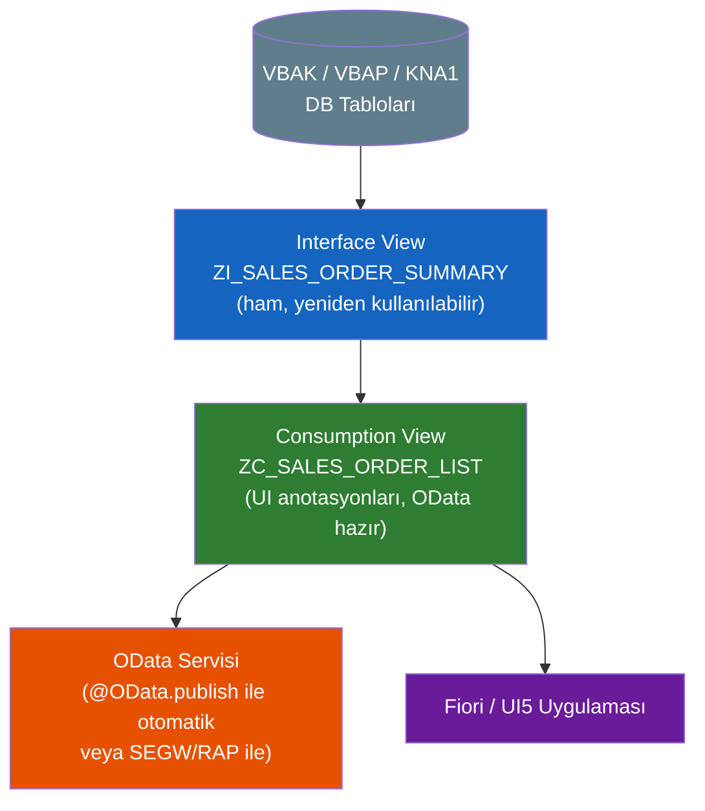
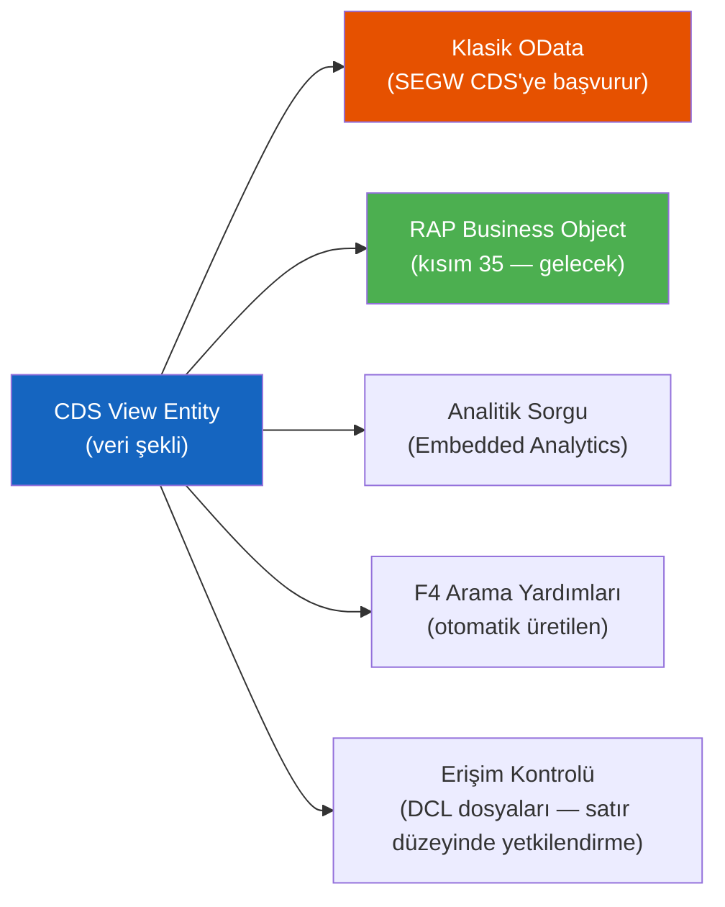

# Kısım 16: CDS View'ları (Core Data Services)

*Veritabanının ağır işi üstlendiği yer — ve kodunuzun çok daha kısaldığı yer.*

---

## ☕ Önce zihinsel model

Devasa, normalleştirilmiş tablolarla dolu bir SQL Server'ınız olduğunu hayal edin. Her rapor, Fiori uygulaması ya da API inşa ettiğinizde aynı beş tablolu JOIN'i yeniden yazıyorsunuz. Kimi zaman bir stored view'da, kimi zaman EF'de, kimi zaman bir controller içinde doğrudan. Mantık her yere dağılmış; performans tutarsız.

Şimdi şu dünyayı hayal edin: o JOIN'i bir kez, veritabanı motorunun optimize ettiği özel bir anotasyonlu view'da tanımlıyorsunuz — ve bu tanım hem OData API'nizi hem Fiori UI alan etiketlerini hem arama yardımlarını hem yetkilendirme denetimlerini otomatik olarak besliyor. Bir kez yazıyorsunuz; her şey bunu tüketiyor.

İşte bu **CDS — Core Data Services**. SAP'ın "mantığı veritabanına it" paradigması; HANA üzerinde son derece hızlı çalışıyor. Ham satırları ABAP'a çekip bellekte birleştirmek yerine (eski yöntem), verinin şeklini veritabanı düzeyinde tanımlıyorsunuz; ABAP sadece üstteki ince bir orkestrasyon katmanına dönüşüyor.

> 💡 **Neden şu an önemli:** S/4HANA CDS view'ları üzerine inşa ediliyor. Modern ABAP projelerinde çalışmak istiyorsanız CDS opsiyonel değil — OData servisleri, RAP nesneleri, Fiori uygulamaları ve analitik raporlama için temel. "S/4HANA ABAP" diyen iş ilanları aslında "CDS yazıyorsunuz" demek istiyor.

---

## 16.1 CDS neden var: code-to-data paradigması

### 1️⃣ Benzetme

Eski ABAP tarzı: depoya (veritabanı) kamyon sürmek, tüm stoğu yüklemek, ofise geri dönmek, orada sıralamak ve filtrelemek. Depo küçükken bu işe yarıyor. HANA yüzlerce gigabayt veri tutarken sıralama ve filtrelemeyi *depoda* yapıp sadece tam olarak ihtiyacınız olan paleti taşıyorsunuz.

CDS, depoya teslim ettiğiniz talimattır. Veritabanı onu okur ve tam istediğinizi verir — zaten birleştirilmiş, zaten filtrelenmiş, zaten şekillendirilmiş.

### 2️⃣ Bunu zaten biliyorsun

```csharp
// C# — Entity Framework projeksiyonu (koddaki bir "view")
var result = dbContext.SalesOrders
    .Include(so => so.Customer)
    .Where(so => so.Status == "OPEN")
    .Select(so => new SalesOrderDto
    {
        OrderId   = so.Id,
        Customer  = so.Customer.Name,
        NetAmount = so.NetAmount
    })
    .ToList();

// EF bunu SQL JOIN + WHERE + SELECT'e çevirir.
// Veritabanı işi yapar. Siz bir projeksiyon alırsınız.
```

```python
# Python — SQLAlchemy ORM sorgusu
from sqlalchemy.orm import joinedload

orders = (
    session.query(SalesOrder)
    .options(joinedload(SalesOrder.customer))
    .filter(SalesOrder.status == "OPEN")
    .with_entities(
        SalesOrder.id.label("order_id"),
        Customer.name.label("customer"),
        SalesOrder.net_amount
    )
    .all()
)
```

```sql
-- Klasik SQL CREATE VIEW
CREATE VIEW V_OPEN_ORDERS AS
SELECT so.id, c.name AS customer, so.net_amount
FROM   sales_orders so
JOIN   customers c ON c.id = so.customer_id
WHERE  so.status = 'OPEN';
```

Üçü de işi veritabanına itiyor ve size temiz bir projeksiyon sunuyor. CDS, ABAP/HANA karşılığıdır — ama daha zengin.

### 3️⃣ ABAP'taki karşılığı (CDS farkı)

Bir CDS view, SQL view'ın yaptığı her şeyi yapar *artı*:

| Özellik | SQL View | EF Projeksiyonu | CDS View |
|---------|----------|-----------------|----------|
| Hesaplamayı DB'ye it | ✅ | ✅ | ✅ |
| UI etiketleri için anotasyonlar | ❌ | ❌ | ✅ `@UI.lineItem` |
| OData olarak otomatik yayımla | ❌ | ❌ | ✅ `@OData.publish` |
| Satır içi yetkilendirme denetimi | ❌ | ❌ | ✅ `@AccessControl.authorizationCheck` |
| Association'lar (gezilebilir join'ler) | ❌ | Kısmi | ✅ |
| Parametreler (parametreli view gibi) | ❌ | ❌ | ✅ |
| Arama yardımı üretimi | ❌ | ❌ | ✅ `@Search.searchable` |
| HANA analitik küp desteği | ❌ | ❌ | ✅ |

Anotasyon katmanı CDS'yi SAP ekosisteminde bu kadar güçlü kılan şeydir. Bir kez anotasyon eklersiniz; framework gerisini halleder.

> 🧭 **İş hayatında:** "VDM — Virtual Data Model" terimini duyacaksınız. SAP'ın kendi CDS view'ları (S/4HANA ile gelen) katmanlara ayrılmıştır: Interface view'lar (ham, `I_`), Consumption view'lar (Fiori uygulamaları için, `C_`) ve Composite view'lar. Özel view'larınız çoğu projede aynı isimlendirme kuralını izler.

---

## 16.2 ADT'de ilk CDS view'ınız

CDS view'ları ADT'de (Eclipse, ABAP Development Tools ile) bulunur. Bunları SE80 veya SE11'de değil, paketinizdeki `.ddls` kaynak dosyaları olarak yazarsınız.

### ADT'de view oluşturma

1. Paketinize sağ tıklayın → **New → Other ABAP Repository Object → Core Data Services → Data Definition**
2. **Define View Entity** şablonunu seçin (modern sözdizimi — aşağıda daha fazlası)
3. Adını verin. Kural: interface view'lar için `ZI_` ön eki, consumption view'lar için `ZC_`.

### Modern sözdizimi: `DEFINE VIEW ENTITY`

SAP'ın iki nesil CDS sözdizimi vardır. Eskisi `DEFINE VIEW` (bazen "klasik CDS" denir). Modern olan — ve yazmanız gereken — `DEFINE VIEW ENTITY`'dir. RAP framework'üyle daha temiz eşleşir, daha iyi association desteği sunar ve SAP'ın tüm yeni geliştirmeler için önerdiği seçenektir.

> ⚠️ **C#/Python tuzağı:** Çevrimiçinde `DEFINE VIEW` kullanan (yani `ENTITY` olmayan) pek çok örnek göreceksiniz. Hâlâ çalışıyor, ama yeni kodunuzu bu şekilde yazmayın. 2004'ten kalma `HttpHandler` ile ASP.NET Web API controller yazmak gibi — geçerli, sadece dünyanın gidişatı değil.

### 2️⃣ Bunu zaten biliyorsun

```csharp
// C# — DbSet<SalesOrder>'dan basit LINQ projeksiyonu
public class SalesOrderSummaryDto
{
    public string OrderId    { get; set; }
    public string CustomerId { get; set; }
    public string OrderType  { get; set; }
    public decimal NetValue  { get; set; }
    public string Currency   { get; set; }
}

var summaries = dbContext.SalesOrders
    .Select(so => new SalesOrderSummaryDto
    {
        OrderId    = so.Vbeln,
        CustomerId = so.Kunnr,
        OrderType  = so.Auart,
        NetValue   = so.Netwr,
        Currency   = so.Waerk
    });
```

### 3️⃣ ABAP'taki karşılığı

```abap
" Dosya: ZI_SALES_ORDER_SUMMARY.ddls
" (ADT'de bir Data Definition olarak kaydedilir — bu kaynak dosyanın kendisidir)

@AbapCatalog.viewEnhancementCategory: [#NONE]
@AccessControl.authorizationCheck: #NOT_REQUIRED
@Metadata.ignorePropagatedAnnotations: true
@ObjectModel.usageType:{
    serviceQuality: #X,
    sizeCategory: #S,
    dataClass: #TRANSACTIONAL
}
@EndUserTexts.label: 'Sales Order Summary'

define view entity ZI_SALES_ORDER_SUMMARY
  as select from vbak                    -- VBAK = satış siparişi başlık tablosu
  association [0..*] to vbap as _Items
    on $projection.SalesOrder = _Items.vbeln
{
  key vbeln      as SalesOrder,          -- anahtar alan, CamelCase takma adıyla
      kunnr      as SoldToParty,
      auart      as OrderType,
      netwr      as NetValue,
      waerk      as TransactionCurrency,

      /* Biçimlendirilmiş tarih — aşağıya itilen HANA fonksiyonu */
      cast( erdat as abap.dats )         as CreationDate,

      /* Kalemlere sanal bağlantı — bu bir association, henüz JOIN değil */
      _Items
}
```

Dikkat edilmesi gerekenler:

- **`define view entity`** — modern anahtar kelime.
- **`as select from vbak`** — SQL'deki `FROM` gibi; `vbak` SAP satış siparişi başlık tablosudur.
- **`key vbeln`** — view'ın birincil anahtar alanını işaretler.
- **CamelCase takma adları** — CDS alanları için SAP isimlendirme kuralı; altta yatan sütun büyük harf (`vbeln`), açık ad ise `SalesOrder`'dır.
- **`_Items`** — association (gezinme, henüz JOIN değil). Bunu bir sonraki bölümde ele alacağız.

> 🛠️ **ADT'de:** `.ddls` dosyasını kaydettikten sonra **F8** tuşuna basarak etkinleştirin. Veriyi doğrudan Data Preview sekmesinde önizleyebilirsiniz. Sözdizimi hatası varsa ADT editörü VS Code gibi altlarını çizer.

### İkinci tablo ekleme (gerçek bir join)

```abap
@AbapCatalog.viewEnhancementCategory: [#NONE]
@AccessControl.authorizationCheck: #NOT_REQUIRED
@EndUserTexts.label: 'Sales Order with Customer Name'

define view entity ZI_SALES_ORDER_WITH_CUST
  as select from vbak
  inner join   kna1 on  kna1.kunnr = vbak.kunnr  -- KNA1 = müşteri ana verisi
{
  key vbak.vbeln  as SalesOrder,
      vbak.auart  as OrderType,
      vbak.netwr  as NetValue,
      vbak.waerk  as Currency,
      kna1.kunnr  as SoldToParty,
      kna1.name1  as CustomerName,
      kna1.land1  as Country
}
```

Bu sade bir INNER JOIN — SQL'inizdeki ya da EF `.Include()` kullanımınızdaki niyetle birebir aynı.

---

## 16.3 Association'lar, anotasyonlar ve parametreler

### 16.3.1 Association'lar — sonradan gezineceğiniz join

Association, iki view entity arasındaki *beyan edilmiş ilişkidir*. Bunu EF'deki navigation property gibi düşünün (`Customer.Orders`). JOIN, bir şey association'ı *kullanana* kadar gerçekleşmez — bunu genişleten başka bir view ya da OData `$expand` çağrısı.

```abap
define view entity ZI_SALES_ORDER_FULL
  as select from vbak
  " Association beyan et; join koşulu anahtardadır
  association [0..*] to ZI_SALES_ORDER_LINE as _Items
    on $projection.SalesOrder = _Items.SalesOrder
  association [1..1] to I_Customer          as _Customer
    on $projection.SoldToParty = _Customer.Customer
{
  key vbeln  as SalesOrder,
      kunnr  as SoldToParty,
      netwr  as NetValue,

  " Tüketicilerin gezinebilmesi için association'ları aç
      _Items,
      _Customer
}
```

```abap
" ZI_SALES_ORDER_LINE — kalem view'ı (basitleştirilmiş)
define view entity ZI_SALES_ORDER_LINE
  as select from vbap          -- VBAP = satış siparişi kalem tablosu
{
  key vbeln  as SalesOrder,
  key posnr  as SalesOrderItem,
      matnr  as Material,
      kwmeng as OrderQuantity,
      meins  as BaseUnit
}
```

```csharp
// C# EF karşılığı — modelde beyan edilen navigation property'ler
public class SalesOrder
{
    public string OrderId   { get; set; }
    public string SoldTo    { get; set; }
    public decimal NetValue { get; set; }

    // Navigation property'ler — EF bunları .Include() çağrısıyla JOIN'leyebilir
    public ICollection<SalesOrderItem> Items    { get; set; }
    public Customer                    Customer { get; set; }
}
```

Paralellik doğrudan. EF'de navigation property beyan edip `.Include()` çağırırsınız; CDS'de association beyan edersiniz ve tüketici `$expand` kullanır (OData'da) ya da başka bir CDS view'ında `\_Items`'a başvurur.

### 16.3.2 Anotasyonlar — sihirli katman

Anotasyonlar metadata dekoratörlerdir. C#'ta sınıflarda (`[HttpGet]`, `[Required]`) ya da Python'da (`@app.route`) gördünüz. CDS anotasyonları aynı şekilde çalışır — view'a veya alanlarına talimat eklerler.

En önemli anotasyon aileleri:

```abap
" ── VIEW ÜZERİNDE ──────────────────────────────────────────
@AbapCatalog.viewEnhancementCategory: [#NONE]   " dahili katalog ipucu

" Bu view'ı otomatik olarak OData servisi olarak yayımla (klasik yaklaşım)
@OData.publish: true

" Fiori uygulaması destekleyen view'larda bunu görürsünüz:
@UI.headerInfo: {
    typeName:       'Sales Order',
    typeNamePlural: 'Sales Orders',
    title: { type: #FIELD, value: 'SalesOrder' }
}

" ── ALANLARDA ─────────────────────────────────────────────
{
  key vbeln  as SalesOrder,

  " Bu alanı bir Fiori liste/tablo sütununda göster
  @UI.lineItem: [{ position: 10 }]
  " Nesne sayfası başlığında göster
  @UI.selectionField: [{ position: 10 }]
  " Arayüzdeki okunabilir etiket
  @EndUserTexts.label: 'Sales Order'

      vbeln  as SalesOrder,

  " Para birimi alanı — UI5'e hangi alanın para birimi kodunu tuttuğunu söyler
  @Semantics.amount.currencyCode: 'TransactionCurrency'
  @UI.lineItem: [{ position: 50 }]
      netwr  as NetValue,

      waerk  as TransactionCurrency,

  " Arama relevansı
  @Search.defaultSearchElement: true
  @Search.fuzzinessThreshold: 0.8
      kunnr  as SoldToParty
}
```

> ⚠️ **C#/Python tuzağı:** Anotasyonlar yorum gibi görünür (`@Something`), ama yorum DEĞİLdir — derlenir ve çalışma zamanı davranışını etkiler. Yanlış yazarsanız aktivasyon şifreli bir hatayla başarısız olur. ADT, anotasyon değerleri için kod tamamlama sunar (Ctrl+Space) — kullanın.

### 16.3.3 Parametreler — parametreli view

Bazen view düzeyinde çalışma zamanı değerine göre — mali yıl, şirket kodu gibi — filtrelemeniz gerekir. CDS parametreleri destekler:

```abap
define view entity ZI_FI_DOCUMENT_BY_YEAR
  with parameters
    p_gjahr : gjahr,               " mali yıl — DDIC tipi
    p_bukrs : bukrs                " şirket kodu
  as select from bkpf              " BKPF = muhasebe belgesi başlığı
{
  key belnr  as AccountingDocument,
      gjahr  as FiscalYear,
      bukrs  as CompanyCode,
      blart  as DocumentType,
      bldat  as DocumentDate,
      dmbtr  as AmountInLocalCurrency
}
where
      gjahr = $parameters.p_gjahr
  and bukrs = $parameters.p_bukrs
```

ABAP'tan parametreli olarak çağırma:

```abap
" Parametreli view'ı Open SQL ile kullan
SELECT *
  FROM zi_fi_document_by_year( p_gjahr = '2024', p_bukrs = '1000' )
  INTO TABLE @DATA(lt_docs).

" Parametreli SQL view veya tablo değeri döndüren fonksiyon çağrısıyla aynı
```

```csharp
// C# karşılığı — parametreli DB sorgusu / TVF
var docs = dbContext.FiDocuments
    .FromSqlInterpolated(
        $"SELECT * FROM V_FI_DOCUMENT_BY_YEAR({year}, {companyCode})")
    .ToList();
```

---

## 16.4 Interface view'lar ve consumption view'lar (VDM katmanlama)

SAP'ın standart CDS modeli üç katmana sahip. Özel projelerinizde genellikle iki katman kullanırsınız:



| Katman | Ön Ek | Amaç | UI anotasyonu var mı? |
|--------|-------|------|----------------------|
| Interface / Basic | `ZI_` veya `I_` | Ham tabloları birleştirir, her tüketici kullanabilir | Nadiren |
| Consumption | `ZC_` veya `C_` | Belirli bir uygulama için `@UI`, `@OData` ekler, yeniden yapılandırır | Evet |

Neden iki katman? Interface view'lar, Fiori uygulaması düzen değiştirse bile kararlı kalır. Consumption view'lar, altındaki veri mantığına dokunmadan her uygulamaya uyum sağlar. Aynı sebepten C#'ta DTO'yu domain modelinizden ayırırsınız.

> 🧭 **İş hayatında:** Kod incelemelerinde "bu interface view mu yoksa consumption view mu?" sorusunu duyacaksınız. `I_` view'a `@UI.lineItem` anotasyonu koyarsanız duyarsınız. Katmanları temiz tutun.

---

## 16.5 OData ve RAP için temel olarak CDS

CDS view'ları sadece JOIN yazmak için daha güzel bir yol değil. SAP'ın modern her şeyi üzerine inşa ettiği *temeltir*:



- **Kısım 18** OData büyük resmini ele alır ve CDS'ye sürekli atıfta bulunur.
- **Kısım 35** (RAP) neredeyse tamamen CDS-first — business object'inizi *CDS'de* tanımlarsınız ve RAP OData servisini otomatik üretir.

> 💡 **Anlaşılması gereken geçiş:** Klasik ABAP'ta kod yazıp zaman zaman tablo sorguluyordunuz. Modern S/4HANA ABAP'ta **önce CDS'de veri modelliyorsunuz** ve ABAP kodunu yalnızca modelin ifade edemediği iş mantığı için yazıyorsunuz. Veri şekli CDS'de yaşar; davranış ABAP sınıflarında. MVC veya clean architecture'dan bildiğiniz aynı sorumluluk ayrımı fikri.

---

## 🧠 Özet

| Kavram | C#/Python karşılığı | ABAP/CDS |
|--------|---------------------|----------|
| SQL CREATE VIEW | SQL View | `DEFINE VIEW ENTITY` |
| EF projeksiyonu / DTO şekli | `Select(x => new Dto {...})` | Takma adlı CDS alan listesi |
| Navigation property | `Customer.Orders` (EF) | CDS association `_Items` |
| Eager load | `.Include(x => x.Items)` | OData'da `$expand` veya başka bir view'da `\_Items` |
| Attribute / dekoratör | `[JsonPropertyName("x")]` | `@UI.lineItem`, `@OData.publish` |
| Parametreli tablo değer fonksiyonu | TVF / `FromSqlInterpolated` | CDS'de `with parameters` |
| Repository katmanı (veri şekli) | DbContext + DTO | Interface CDS view (`ZI_`) |
| ViewModel / API sözleşmesi | ViewModel / Response DTO | Consumption CDS view (`ZC_`) |

**Hatırlanacak beş şey:**
1. CDS = HANA üzerinde çalışan, ABAP belleğinde değil, anotasyonlu SQL view.
2. `DEFINE VIEW ENTITY` modern sözdizimidir — tüm yeni işlerde bunu kullanın.
3. Association'lar = navigation property'ler; tüketilene kadar JOIN maliyeti yoktur.
4. Anotasyonlar view'ı UI etiketleri, OData, arama ve yetkilendirmeye bağlar — tek gerçek kaynak.
5. CDS, RAP, OData ve Fiori'nin temelidir — bunu iyi öğrenirseniz geri kalanı kolaylaşır.

---

*[← İçindekiler](../content.md) | [← Önceki: Veri Göçü: BDC & LSMW](15-data-migration-lsmw-bdc.md) | [Sonraki: AMDP →](17-amdp.md)*
