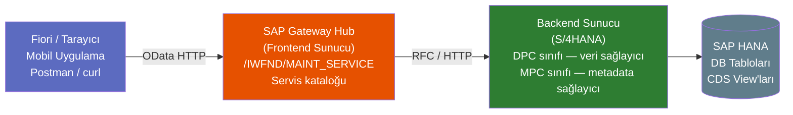

# Kısım 18: OData & REST — Büyük Resim

*VI. Bölümün girişi — bu kısmı anlarsanız sonraki sekiz kısım anlam kazanır.*

---

## ☕ Önce zihinsel model

REST'i zaten biliyorsunuz. ASP.NET Web API controller'ları ya da FastAPI endpoint'leri yazdınız. GET/POST/PUT/DELETE, JSON yanıtlar, durum kodları ve `HttpClient` veya `requests` kullanmayı biliyorsunuz. Bu bilginin tamamı buraya aktarılabilir.

OData REST'tir — ama **üstüne standartlaştırılmış bir sözcük dağarcığı eklenmiştir**. Her API ekibi kendi sorgu parametre adlarını ve URL kurallarını icat etmek yerine, OData bunları bir kez tanımlar: `$filter`, `$expand`, `$orderby`, `$top`, `$skip`, `$count`, `$select`. Her OData servisi aynı dili konuşur. OData bilen bir istemci *herhangi bir* OData servisini sorgulayabilir — tıpkı her SQL veritabanının satıcıdan bağımsız olarak `SELECT * FROM table WHERE x = y`'ye yanıt vermesi gibi.

**SAP Gateway**, SAP'ın OData sunucusudur. Fiori uygulamaları (ve diğer istemciler) ile S/4HANA arka uç sistemi arasında yer alır. Gateway mimarisini anlamak, VI. Bölümdeki her şeyin ön koşuludur.

> 🎯 **Bu kısım haritadır.** Burada hiçbir şey inşa etmiyoruz — 22–31. kısımlarda inşa ederken her parçanın tutarlı bir resme oturması için sizi yönlendiriyoruz. REST'i zaten iyi biliyor olsanız bile atlayın.

---

## 18.1 REST'i biliyorsunuz — OData ne ekliyor?

### 1️⃣ Benzetme

Sade REST bir telefon görüşmesi gibidir: siz ve karşı taraf kuralları giderek belirliyorsunuz. `GET /orders?status=open&limit=10` çalışır, ama yalnızca sunucu parametreyi `status` ve `limit` olarak adlandırmaya karar verdiyse. Başka bir sunucu `state` ve `pageSize` kullanıyor olabilir. Her API özel bir kar tanesidir.

OData standartlaştırılmış bir sözleşme gibidir: herkes "satırları filtrele"nin her zaman `$filter`, "sonuçları sınırla"nın her zaman `$top`, "ilgili kayıtları dahil et"in her zaman `$expand` olduğunu kabul eder. Bir kez öğrenirsiniz; her yerde çalışır.

### 2️⃣ Bunu zaten biliyorsun

```python
# Python — requests ile sade REST
import requests

# Her API'nin kendi parametre adları var — her seferinde belgeleri okumak zorundasınız
resp = requests.get(
    "https://api.example.com/orders",
    params={"status": "open", "limit": 10, "sort": "date_desc"}
)
orders = resp.json()
```

```csharp
// C# — sade ASP.NET Web API — özel sorgu parametreleri, standart yok
[HttpGet("orders")]
public IActionResult GetOrders(
    [FromQuery] string status,
    [FromQuery] int pageSize = 10,
    [FromQuery] string sortBy = "date")
{
    // ...
}
```

```
# OData — standartlaştırılmış URL, HERHANGİ bir OData servisinde aynı çalışır
GET /sap/opu/odata/sap/ZSALES_SRV/SalesOrderSet
    ?$filter=Status eq 'OPEN'
    &$top=10
    &$orderby=CreationDate desc
    &$select=SalesOrder,Customer,NetValue
    &$expand=Items
    &$inlinecount=allpages
```

OData URL'sinin her OData istemci kütüphanesinin anladığı standart bir grameri vardır. Her yeni servis için belge okumak zorunda değilsiniz — yalnızca `$metadata` belgesinde ne olduğunu bilmeniz yeterli (18.5'te geliyor).

### Sade REST'e OData'nın ekledikleri

| Özellik | Sade REST | OData |
|---------|-----------|-------|
| Sorgulama / filtreleme | Özel parametreler | `$filter` — standart sözdizimi |
| Sayfalama | Özel `page`/`limit` | `$top` + `$skip` |
| İlgili kayıtlar | Özel `include` | `$expand` |
| Alan seçimi | Özel `fields` | `$select` |
| Toplam sonuç sayısı | Özel veya başlık | `$inlinecount=allpages` veya `$count` |
| Sıralama | Özel `sort` | `$orderby` |
| Servis tanımı / şema | OpenAPI/Swagger (opsiyonel) | `$metadata` (her zaman mevcut) |
| Toplu istekler | Standart değil | `$batch` |

> 💡 **OData sürüm notu:** SAP Gateway çoğunlukla **OData v2** kullanır. OData v4 daha yeni sürümdür ve RAP (Kısım 35) v4 servisleri üretir. URL'de `/v2/` veya `/v4/` görürseniz bu ipucudur. VI. Bölümün büyük kısmı v2'yi öğretir — bugün çoğu SAP projesinde karşılaşacağınız şey.

---

## 18.2 OData URL kuralları

Tarayıcıda ve Postman'de test ederken her gün yazacağınız sözcük dağarcığı budur.

### Temel URL yapısı

```
https://<host>:<port>/sap/opu/odata/sap/<SERVIS_ADI>/<EntitySet>
```

Örnek:
```
https://my-s4.corp.com:44300/sap/opu/odata/sap/ZSALES_SRV/SalesOrderSet
```

| Bölüm | Anlamı |
|-------|--------|
| `/sap/opu/odata/sap/` | Sabit Gateway ön eki — her zaman aynı |
| `ZSALES_SRV` | Servis adınız (`/IWFND/MAINT_SERVICE`'de kayıtlı) |
| `SalesOrderSet` | Entity set adı (`SalesOrder` entity'lerinin koleksiyonu) |

### Sorgu seçenekleri

```
# C0001 müşterisi için satış siparişleri, açık durum, en yeni önce, sayfa başına 20
GET .../SalesOrderSet
    ?$filter=SoldToParty eq 'C0001' and LifecycleStatus eq 'N'
    &$orderby=CreationDate desc
    &$top=20
    &$skip=0
    &$select=SalesOrder,SoldToParty,NetAmountInTransCrcy,TransactionCurrency
    &$inlinecount=allpages
    &$format=json
```

```
# Anahtarla tek bir entity'ye git
GET .../SalesOrderSet('0000000100')

# İlgili entity set'e git (association)
GET .../SalesOrderSet('0000000100')/to_Item

# İlgili veriyi satır içi genişlet
GET .../SalesOrderSet('0000000100')?$expand=to_Item
```

### `$filter` ifade sözdizimi

```
# Eşitlik
$filter=Status eq 'OPEN'

# Karşılaştırma operatörleri: eq, ne, gt, ge, lt, le
$filter=NetValue gt 1000.00

# Mantıksal operatörler: and, or, not
$filter=Status eq 'OPEN' and SoldToParty eq 'C0001'

# String fonksiyonları
$filter=substringof('Acme', CustomerName)    " içerir
$filter=startswith(CustomerName, 'Ac')

# Tarih karşılaştırma (OData v2 — tarih literal biçimi)
$filter=CreationDate gt datetime'2024-01-01T00:00:00'
```

> ⚠️ **C#/Python tuzağı:** OData string literalleri **tek tırnak** kullanır, çift değil. `$filter=Status eq "OPEN"` başarısız olur; `$filter=Status eq 'OPEN'` doğrudur. Ayrıca URL'lerdeki OData anahtarları tırnaklıdır: `SalesOrderSet('0000000100')` — anahtar parantezin içinde, string tipindeyse tırnaklıdır.

---

## 18.3 SAP Gateway mimarisi

### 1️⃣ Benzetme

Bir resepsiyonu (Gateway hub'ı) ve arka ofis katı (arka uç S/4HANA sistemi) olan bir bina hayal edin. Ziyaretçiler (Fiori uygulamaları, mobil istemciler, üçüncü taraf sistemler) resepsiyonla konuşur. Resepsiyon hangi ofisin hangi isteği karşıladığını bilir ve iletir. Ofis (arka uç) gerçek işi yapar ve yanıtı resepsiyona iletir; resepsiyon onu güzel bir OData yanıtı olarak paketleyip ziyaretçiye sunar.

### Bileşenler



| Bileşen | Nerede | Ne yapar |
|---------|--------|---------|
| **Gateway Hub (Frontend Sunucu)** | Ayrı SAP sistemi veya gömülü | OData HTTP isteklerini alır; arka uca yönlendirir |
| **`/IWFND/MAINT_SERVICE`** | Frontend sunucu | Servis etkinleştirme ve kayıt konsolu |
| **MPC sınıfı** (Metadata Provider Class) | Arka uç | Entity type'ları, özellikleri, association'ları tanımlar — şema |
| **DPC sınıfı** (Data Provider Class) | Arka uç | GET_ENTITY, GET_ENTITYSET, CREATE_ENTITY vb. implemente eder — veri mantığı |
| **DPC_EXT sınıfı** | Arka uç | DPC sınıfının uzantısı — SİZİN kod yazdığınız yer |
| **SEGW** (Service Builder) | Arka uç | MPC + DPC oluşturma ve servisi kaydetme aracı (t-kodu) |

> 🧭 **İş hayatında:** Pek çok S/4HANA kurulumunda Gateway hub'ı ve arka uç **aynı sistemdedir** ("gömülü dağıtım"). "Embedded Gateway" ifadesini duyacaksınız. Mimari aynıdır; yalnızca frontend ve backend aynı SAP sistem örneğidir. `/IWFND/MAINT_SERVICE` o sistemde yine de vardır.

### Gömülü ve hub dağıtımı

```
Gömülü (en yaygın):                    Hub dağıtımı:
┌─────────────────────┐                ┌───────────┐    ┌───────────────┐
│  S/4HANA            │                │  Gateway  │    │  S/4HANA      │
│  ┌───────────────┐  │                │  Hub      │───▶│  Backend      │
│  │  GW Hub Katmanı│  │                │  /IWFND/  │    │  SEGW / DPC   │
│  │  SEGW / DPC   │  │                └───────────┘    └───────────────┘
│  └───────────────┘  │
│  HANA DB            │
└─────────────────────┘
```

---

## 18.4 SAP'ta OData inşa etmenin iki yolu

Bu yeni bir projede alacağınız en önemli yönelim kararıdır. İki farklı dünya vardır:

### Seçenek 1: SEGW — Service Builder (klasik, VI. Bölümün öğrettiği)

- **Araç:** Arka uç sistemindeki `SEGW` t-kodu.
- **Nasıl çalışır:** Bir GUI sihirbazında entity type'ları, entity set'leri ve association'ları tanımlarsınız. SEGW, MPC ve DPC sınıf iskeletlerini üretir. DPC sınıfını genişleterek (`ZCL_<SERVİS>_DPC_EXT`) iş mantığı eklersiniz.
- **Yaş:** SAP NetWeaver 7.31'den beri mevcut; gerçek dünya projelerinin büyük çoğunluğunda hâlâ baskın.
- **Ne zaman kullanırsınız:** Herhangi bir eski veya klasik ABAP sistemi (ECC veya eski S/4HANA), SEGW servisleri kullanan herhangi bir proje ve önümüzdeki birkaç yılda mevcut peyzajlarda yapacağınız çoğu OData çalışması.

### Seçenek 2: RAP — RESTful Application Programming Model (modern)

- **Araç:** ADT (Eclipse) — CDS View Entity'leri + Behavior Definition'lar + Behavior Implementation'lar.
- **Nasıl çalışır:** Bir CDS View Entity tanımlar, bir Behavior Definition (`.bdef`) yazar ve ABAP runtime OData v4 endpoint'lerini otomatik üretir. SEGW'ye gerek yok.
- **Yaş:** S/4HANA 1909'da tanıtıldı; tüm yeni geliştirmeler için stratejik yön.
- **Ne zaman kullanırsınız:** Yeni Greenfield S/4HANA projeleri, BTP ABAP Environment.
- **Kapsandığı yer:** Kısım 35.

> 🎯 **VI. Bölüm neden SEGW kullanıyor:** Karşılaşacağınız SAP projelerinin büyük çoğunluğu yıllardır çalışan sistemlerde. SEGW servisleri her yerde. DPC/MPC modelinin nasıl çalıştığını anlamak, mevcut kodun büyük miktarını bakım ve genişletme için zihinsel modeli size verir — ve 35. kısma geldiğinizde RAP'ın neden daha iyi olduğunu anlamanızı sağlar. İkisini de öğrenin.

```
VI. Bölüm yol haritası:
Kısım 18 — OData büyük resim (bu kısım, SEGW + Gateway)
Kısım 21 — Entity type'lar, özellikler, XML & JSON
Kısım 22 — Servis metotları, import parametreleri
Kısım 23 — GET_ENTITY & GET_ENTITYSET (veri okuma)
Kısım 24 — Arama stringleri ve sorgu seçenekleri
Kısım 25 — Oluşturma, Güncelleme & Silme
Kısım 26 — Association'lar
Kısım 27 — Başlık + kalem (klasik sipariş + satır kalemi deseni)
Kısım 28 — Function Import'lar
Kısım 29 — CREATE_DEEP_ENTITY
Kısım 30 — GET_EXPANDED_ENTITYSET
Kısım 31 — Dosya yükleme & indirme
```

---

## 18.5 `$metadata` belgesi ve servis etkinleştirme

### `$metadata` belgesi

Her OData servisinin bir `$metadata` endpoint'i vardır. Makine tarafından okunabilir şemadır — bir Swagger/OpenAPI spec'i gibi, ama XML olarak ve her zaman mevcuttur (kurulum gerektirmez).

```
GET https://my-s4.corp.com:44300/sap/opu/odata/sap/ZSALES_SRV/$metadata
```

Şunları açıklayan XML döner:
- Her EntityType (alanlar, tipler, anahtarlar)
- Her EntitySet (koleksiyonlar)
- Her NavigationProperty (association'lar)
- Her FunctionImport (RPC tarzı işlemler)

```xml
<!-- $metadata yanıtından bir parça -->
<EntityType Name="SalesOrderType">
  <Key>
    <PropertyRef Name="SalesOrder"/>
  </Key>
  <Property Name="SalesOrder"     Type="Edm.String" Nullable="false" MaxLength="10"/>
  <Property Name="SoldToParty"    Type="Edm.String" MaxLength="10"/>
  <Property Name="NetAmountInTransCrcy" Type="Edm.Decimal" Precision="16" Scale="3"/>
  <Property Name="TransactionCurrency" Type="Edm.String" MaxLength="5"/>
  <NavigationProperty Name="to_Item"
    Relationship="ZSALES_SRV.to_SalesOrderItem"
    FromRole="FromRole_SalesOrderItem"
    ToRole="ToRole_SalesOrderItem"/>
</EntityType>

<EntitySet Name="SalesOrderSet" EntityType="ZSALES_SRV.SalesOrderType"/>
```

> 💡 **Pratik ipucu:** Yeni bir OData servisiyle karşılaştığınızda önce `$metadata`'yı açın. Her şeyi söyler — alan adları, tipler, hangi navigation property'lerin mevcut olduğu, hangi FunctionImport'ların bulunduğu. Tarayıcı geliştirici araçlarında, genellikle Fiori uygulamasının yaptığı ilk XHR çağrısıdır.

### Servisi etkinleştirme — `/IWFND/MAINT_SERVICE`

SEGW'de arka uçta servis oluşturduktan sonra, istemcilerin erişebilmesi için Gateway hub'ında etkinleştirmeniz gerekir. Bu işlem `/IWFND/MAINT_SERVICE` t-koduyla yapılır.

**Yeni servisi etkinleştirme adımları:**

1. `/IWFND/MAINT_SERVICE` açın (Gateway / frontend sistemde).
2. **Add Service** tıklayın.
3. Sistem Alias'ını (arka ucunuza işaret eden RFC bağlantısı) girin ve teknik ada göre servisi arayın.
4. Servisi seçip **Add Selected Services** tıklayın.
5. Bir pakete ve transport'a atayın.
6. Servis artık canlı. Yerleşik **Gateway Client** (`/IWFND/GW_CLIENT`) ile test edin — bu SAP içindeki yerleşik Postman'inizdir.

```
/IWFND/GW_CLIENT — Gateway test istemcisi
  ┌──────────────────────────────────────────────────────┐
  │ Request URI: /sap/opu/odata/sap/ZSALES_SRV/$metadata │
  │ HTTP Metodu: GET                                     │
  │ [Execute]                                            │
  │                                                      │
  │ Yanıt:   200 OK                                      │
  │ Gövde:   <edmx:Edmx ...>...</edmx:Edmx>              │
  └──────────────────────────────────────────────────────┘
```

> 🧭 **İş hayatında:** `/IWFND/GW_CLIENT`'te gerçek zaman harcayacaksınız. Yer işareti koyun. Postman kurmadan OData çağrılarını test etmenin en hızlı yoludur. HTTP başlıkları ayarlayabilir, CREATE/UPDATE için istek gövdesi gönderebilir ve ham yanıtı inceleyebilirsiniz — hepsini SAP GUI içinden.

### Servis kataloğu

```
/IWFND/MAINT_SERVICE — Gateway hub'ındaki tüm etkin servisleri gösterir
  Filtrele:  Teknik Servis Adı (örn. ZSALES_SRV)
              Sistem Alias
              Paket

  İşlemler:  Etkinleştir / Devre Dışı Bırak
              Sil
              Hata günlüğü
              Test (GW Client açar)
              Metadata göster
```

> ⚠️ **C#/Python tuzağı:** Bir SEGW servisini `/IWFND/MAINT_SERVICE`'de etkinleştirmek, onu SEGW'de oluşturmaktan *ayrı bir adımdır*. Bir servis SEGW'nin "Generate and Publish" testinde çalışıyor ama Postman'den 404 dönüyorsa en yaygın neden, doğru sistemdeki `/IWFND/MAINT_SERVICE`'de etkinleştirilmemiş olmasıdır. Bu herkesin ilk seferinde tökezlediği yerdir.

---

## 🧠 Özet

| Kavram | C#/Python karşılığı | SAP OData |
|--------|---------------------|-----------|
| REST API | ASP.NET Web API / FastAPI | SAP Gateway + OData servisi |
| API şeması / Swagger | `swagger.json` / OpenAPI | `$metadata` XML belgesi |
| Sorgu parametreleri (özel) | `?status=open&limit=10` | `$filter`, `$top`, `$skip`, `$orderby` |
| İlgili veriyi önceden yükle | `.Include()` / `joinedload()` | `$expand` |
| Alan seçimi | `fields=x,y` (özel) | `$select` |
| API controller | Web API `ControllerBase` | DPC_EXT sınıf metodu |
| API model sınıfı | DTO / Response sınıfı | MPC sınıfı entity type |
| API oluşturucu / iskelet | Minimal API / attribute routing | SEGW (klasik) veya RAP (modern) |
| Servis kaydı | Program.cs `AddControllers()` | `/IWFND/MAINT_SERVICE` etkinleştirmesi |
| Tarayıcı içi API test aracı | Swagger UI | `/IWFND/GW_CLIENT` |

**Hatırlanacak beş şey:**
1. OData = REST + standartlaştırılmış sorgu sözcük dağarcığı (`$filter`, `$expand`, `$top` vb.).
2. SAP Gateway OData sunucusudur — istemcilerden gelen istekleri arka uç DPC mantığına yönlendirir.
3. MPC = şema (hangi alanlar var); DPC = uygulama (hangi veri döner).
4. SEGW klasik oluşturucudur (VI. Bölümün öğrettiği); RAP modern yoldur (Kısım 35).
5. Her OData servisinin bir `$metadata` belgesi vardır — yeni bir servisle karşılaştığınızda önce bunu okuyun.

---

*[← İçindekiler](../content.md) | [← Önceki: AMDP](17-amdp.md) | [Sonraki: RFC Web Servisleri: Consumer Proxy (SPROXY) →](19-consumer-proxy-sproxy.md)*
