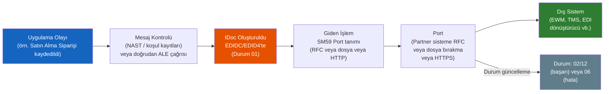
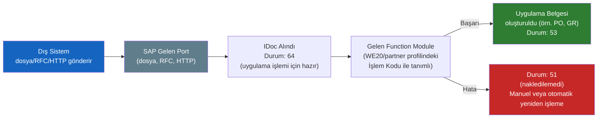

# Kısım 20: ALE & IDoc'lar — SAP'ın Klasik Mesajlaşması

*SAP'ın dahili mesaj veri yolu üzerindeki güçlü tipli mesajlar — Kafka'dan daha eski, dünya tedarik zincirlerini hâlâ yürütüyor.*

---

## ☕ Önce zihinsel model

Her dağıtık sistem sonunda aynı sorunu çözer: Sistem A, Sistem B'ye "bir şey oldu" demek zorunda. Belki SAP'ta bir satın alma siparişi oluşturuldu. Belki bir mal girişinin bir depo sistemine gitmesi gerekiyor. Belki merkezi SAP'taki bir müşteri ana verisi değişikliğinin beş uydu sisteme çoğaltılması gerekiyor.

Modern çözümler Kafka, RabbitMQ, Azure Service Bus, SNS/SQS kullanır. SAP'ın çözümü ise 1990'ların ortasında geliştirilmiş ve bugün SAP peyzajlarının büyük çoğunluğunda hâlâ çalışan **ALE/IDoc**'tur.

- **ALE** = Application Link Enabling — *kimin* *kiminle* ve *ne zaman* konuşacağına karar veren çerçeve.
- **IDoc** = Intermediate Document — veriyi taşıyan güçlü tipli mesaj zarfı.

Bir IDoc, Avro/Protobuf/JSON Schema yerine SAP'ın veri sözlüğünde tanımlanmış şemasıyla ve bir Kafka kümesi yerine SAP'ın kendi mesajlaşma katmanıyla katı biçimde tanımlanmış şemalı bir Kafka mesajıdır.

> 🧭 **İş hayatında:** IDoc bilgisi, ABAP geliştiricileri için en yaygın mülakat konularından biridir. Hiç yeni IDoc yazmayacak olsanız bile başarısız olanı hata ayıklamanız, takılıp kalan toplu işlemi yeniden işlemeniz ya da giden ve gelen akış arasındaki farkı açıklamanız *istenecektir*. Bu kısım tam olarak o konuşma için ihtiyacınız olanı verir.

---

## 20.1 IDoc: güçlü tipli mesaj zarfı

### 1️⃣ Benzetme

Her mesajın sadece bayt veya JSON değil, içine gömülü üç zorunlu parçayla sıkı yapılandırılmış bir nesne olduğu bir Kafka konusu hayal edin:

```
Kafka mesajı (modern):                   IDoc (SAP):
┌──────────────────────┐                ┌──────────────────────────┐
│ Başlıklar (metadata) │    ≈           │ Kontrol Kaydı             │
│   konu, bölüm        │                │   (kim gönderdi, kim alır,│
│   ofset, zaman damgası│                │    mesaj tipi, tarih)     │
├──────────────────────┤                ├──────────────────────────┤
│ Anahtar              │    ≈           │ (doğrudan karşılığı yok — │
│                      │                │  anahtar kontrol kaydında)│
├──────────────────────┤                ├──────────────────────────┤
│ Yük (bayt/JSON)      │    ≈           │ Veri Kayıtları            │
│   asıl mesaj         │                │   (iş verisinin kesimleri │
│                      │                │    — aşağıya bakın)       │
├──────────────────────┤                ├──────────────────────────┤
│ (Durum consumer      │    ≈           │ Durum Kayıtları           │
│  ofseti ile izlenir) │                │   (işleme geçmişi:        │
│                      │                │    gönderildi, teslim     │
│                      │                │    edildi, hata)          │
└──────────────────────┘                └──────────────────────────┘
```

Temel fark: bir IDoc **bir veritabanı tablosundaki tek belgedir** (kontrol kayıtları için `EDIDC`, veri kesimleri için `EDID4`, durum için `EDIDS`). "Broker" SAP'ın kendisidir. IDoc'leri herhangi bir SAP tablosu gibi sorgulayabilirsiniz — açıkça arşivlenmediği sürece sistemden asla silinmezler.

### Her IDoc'un üç parçası

#### 1. Kontrol Kaydı (tablo `EDIDC`)

Zarf başlığı. IDoc başına bir kayıt.

| Alan | Anlamı | Örnek |
|------|--------|-------|
| `DOCNUM` | Benzersiz IDoc numarası | `0000000000012345` |
| `MESTYP` | Mesaj tipi | `ORDERS` (satın alma siparişi) |
| `IDOCTP` | Temel IDoc tipi | `ORDERS05` |
| `SNDPRT` / `SNDPRN` | Gönderici partner tipi/numarası | `LS` / `S4HANA_DEV` |
| `RCVPRT` / `RCVPRN` | Alıcı partner tipi/numarası | `LS` / `EWM_SYSTEM` |
| `CREDAT` / `CRETIM` | Oluşturma tarihi/saati | `20240315` / `143022` |
| `STATUS` | Güncel işlem durumu | `02` = gönderildi, `53` = başarıyla teslim edildi |
| `DIRECT` | Yön | `1` = giden, `2` = gelen |

#### 2. Veri Kayıtları (tablo `EDID4`) — kesimler

Yük — her biri mesajdaki bir mantıksal varlığı temsil eden **kesim** (segment) listesi. Bunları her satırın yapısının bir DDIC tipiyle tanımlandığı güçlü tipli bir JSON dizisinin satırları gibi düşünün.

```
Bir Satın Alma Siparişi için ORDERS05 IDoc:
  E1EDK01  (Başlık kesimi — bir oluşum)
    ├─ satın alma org., belge tipi, para birimi
  E1EDP01  (Kalem kesimi — her satır kalemi için bir tane)
    ├─ kalem numarası, malzeme, miktar, birim
  E1EDP19  (Malzeme açıklaması — kalem başına)
  E1EDK14  (Org verisi — org birimi başına bir tane)
  E1EDKT1  (Başlık metinleri)
  E1EDPT1  (Kalem metinleri)
```

Her kesim tipi sabit bir DDIC yapısına sahiptir — alan adları, uzunluklar, tipler tanımlıdır ve değiştirilemez. Bu şemadır. Yeni IDoc tipi sürümü olmadan şema evrimi yoktur.

```csharp
// C# analoji — iç içe kesimli güçlü tipli mesaj
public class PurchaseOrderIdoc
{
    public IdocControlRecord Control  { get; set; }   // zarf
    public PurchaseOrderHeader Header { get; set; }   // E1EDK01
    public List<PurchaseOrderItem> Items { get; set; } // E1EDP01[]
    public List<PurchaseOrderText> Texts { get; set; } // E1EDKT1[]
}
```

#### 3. Durum Kayıtları (tablo `EDIDS`)

Bir IDoc'un geçtiği her durum değişikliğinin çalışan denetim günlüğü — oluşturuldu, porta iletildi, onaylandı, gelen işleme function module'üne teslim edildi, hatayla karşılaşıldı, yeniden işlendi. Her durum değişikliği yeni bir kayıt ekler.

Sürekli karşılaşacağınız durum kodları:

| Kod | Anlamı | Giden / Gelen |
|-----|--------|---------------|
| `01` | IDoc oluşturuldu | Her ikisi |
| `02` | Porta başarıyla iletildi | Giden |
| `03` | Veri porta iletildi | Giden |
| `06` | Çeviri sırasında hata | Giden |
| `12` | Gönderim başarılı | Giden |
| `30` | IDoc gönderime hazır | Giden |
| `51` | Uygulama belgesi deftere nakledilmedi | Gelen |
| `53` | Uygulama belgesi deftere nakledildi | Gelen |
| `64` | IDoc uygulamaya aktarılmaya hazır | Gelen |
| `68` | Hata — daha fazla işlem yok | Her ikisi |

> 💡 **Gelen tarafta mutlu son 53'tür.** 51 durumu, geldi ama nakledilemedi demektir — en sık düzeltmeniz istenecek şey budur. Bölüm 20.4'e bakın.

---

## 20.2 Temel tipler, mesaj tipleri ve partner profilleri

### IDoc tipleri ve mesaj tipleri — fark nedir?

| Terim | Nedir | Örnek |
|-------|-------|-------|
| **Temel IDoc tipi** (IDoc tipi) | Veri yapısı — kesimler + alanlar | `ORDERS05`, `DESADV01`, `MATMAS05` |
| **Mesaj tipi** | *İş anlamı* — IDoc'un neyi temsil ettiği | `ORDERS`, `DESADV`, `MATMAS` |
| **Uzatma IDoc tipi** | Ek kesimlerle temel tipin özel uzantısı | `ZORDERS05_EXT` |

Bir mesaj tipi birden fazla IDoc tipi sürümü tarafından taşınabilir. `ORDERS` (satın alma siparişi) bugün genellikle `ORDERS05` ile taşınır, ama eski sistemler `ORDERS04` kullanıyor olabilir. Mesaj tipi partner profillerinde yapılandırdığınız şeydir; IDoc tipi veri yapısıdır.

### Partner profilleri — WE20

**T-kodu: `WE20`**

Partner profilleri yönlendirmeyi tanımlar: *bu gönderici/alıcı çifti* için, *bu mesaj tipiyle*, *şunu* yap (bu function module'ü gelen için çağır, bu portu giden için kullan).

```
WE20 — Partner Profilleri
  Partner Numarası: S4HANA_DEV
  Partner Tipi:     LS (Mantıksal Sistem)
  ┌───────────────────────────────────────────────────────────┐
  │ Giden Parametreler                                        │
  │  Mesaj tipi: ORDERS                                       │
  │  IDoc tipi:  ORDERS05                                     │
  │  Port:       ZEWM_PORT (RFC veya dosya portu)             │
  │  Çıkış modu: IDoc'u hemen aktar                           │
  └───────────────────────────────────────────────────────────┘
  ┌───────────────────────────────────────────────────────────┐
  │ Gelen Parametreler                                        │
  │  Mesaj tipi: DESADV (teslimat bildirimi)                  │
  │  IDoc tipi:  DESADV01                                     │
  │  İşlem kodu: DESADV (gelen function module'ü tetikler)    │
  └───────────────────────────────────────────────────────────┘
```

> 🧭 **İş hayatında:** Bir IDoc akmıyorsa *önce* WE20'yi kontrol edin. Eksik veya yanlış partner profilleri "IDoc'lar geçmiyor" sorununun en sık 1 numaralı nedenidir. Özellikle: mesaj tipinin doğru partner numarası için yapılandırılıp yapılandırılmadığını, portun doğru olduğunu ve çıkış modunun "topla" olarak ayarlanmadığını kontrol edin.

---

## 20.3 Giden ve gelen akış

### Giden — SAP dış sisteme IDoc gönderir



**Temel giden parçalar:**
- **Mesaj kontrolü** (NAST): İş belgelerindeki çıktı koşulları (form için baskı çıktısı gibi, ama IDoc için). PO kaydedildiğinde NAST koşulları değerlendirir ve IDoc oluşturmayı tetikler.
- **Port**: WE21'de yapılandırılmış — IDoc'un SAP'tan nasıl çıkacağını tanımlar (RFC bağlantısı, dosya sistemi yolu, HTTP endpoint'i).
- **SM59**: RFC hedefleri — RFC portları için temel bağlantı yapılandırması.

### Gelen — SAP dış sistemden IDoc alır



**Temel gelen parçalar:**
- **İşlem kodu**: Bir mesaj tipini, IDoc'u işleyip uygulama belgesini oluşturan ABAP function module'üne bağlar (örn. mal girişi nakli, satış siparişi oluşturma).
- **Durum 64 → 53**: Mutlu son. Durum 64 = alındı ve bekliyor; durum 53 = uygulama belgesi başarıyla oluşturuldu.
- **Durum 51**: "Beni düzelt" durumu. Uygulama belgesi nakledilemedi. Teşhis koyar ve yeniden işlersiniz.

> ⚠️ **C#/Python tuzağı:** SAP'ta "gelen", *SAP'a giren* demektir (SAP alıyor). "Giden", SAP'ın *gönderdiği* demektir. Açık görünse de pek çok partner entegrasyon belgesi kendi sistemlerinin bakış açısını kullanır. Belge okurken "gelen/giden"in kimin perspektifinden olduğunu her zaman netleştirin.

---

## 20.4 İzleme ve yeniden işleme — günlük araç seti

Gerçek zamanınızı burada harcayacaksınız. IDoc'lar başarısız olur. Göreviniz onları bulmak, nedenini anlamak, kök nedeni düzeltmek ve yeniden işlemektir.

### WE02 / WE05 — IDoc görüntüleme

**T-kodu: `WE02`** (ayrıca `WE05` — biraz farklı düzen, aynı veri)

IDoc liste monitörü. IDoc'ları şunlara göre arayın:
- Mesaj tipi (örn. `ORDERS`)
- Durum (örn. başarısız gelen için `51`)
- Yön (gelen / giden)
- Partner numarası
- Tarih aralığı

```
WE02 — IDoc Listesi
  Seçim:
    Mesaj tipi:  ORDERS
    Durum:       51       ← başarısız gelen
    Tarih aralığı: 20240315 / 20240315
    Yön:         2        ← gelen

  Sonuçlar: 51 durumlu 3 IDoc
    → IDoc 0000000000012345   Durum 51   Hata: Malzeme M-100 bulunamadı
    → IDoc 0000000000012346   Durum 51   Hata: Tedarikçi V-200 sistemde yok
    → IDoc 0000000000012347   Durum 51   Hata: Mükerrer PO numarası
```

Bir IDoc'a girince şunları görürsünüz:
1. **Kontrol kaydı** — gönderici, alıcı, mesaj tipi, zaman damgaları
2. **Veri kesimleri** — gerçek yük (alan değerlerini okuyabilirsiniz)
3. **Durum kayıtları** — başarısız adımdaki hata mesajı dahil tam geçmiş

> 💡 **WE02'de IDoc okuma:** Kesimi genişletmek ve alan değerlerini görmek için çift tıklayın. Durum kayıtlarındaki hata mesajı (genellikle 51 durum metni) tam olarak neyin yanlış gittiğini söyler — "Malzeme X, Y tesisinde mevcut değil", "Mükerrer belge numarası", "Müşteri ana verisinde partner bulunamadı". Önce kök nedeni düzeltin, sonra yeniden işleyin.

### WE19 — Test aracı (IDoc kum havuzu)

**T-kodu: `WE19`**

WE19, mevcut bir IDoc'u alıp kesim verilerini düzenleyerek sıfırdan yeni bir IDoc oluşturmadan test olarak yeniden işlemenizi sağlar. Şunlar için paha biçilemez:
- Yapılandırma sorununu düzelttikten sonra gelen işlemeyi test etmek
- Gönderen sisteme ihtiyaç duymadan gelen mesajları simüle etmek
- Hata ayıklama: minimal bir IDoc oluşturup ne olduğunu test etmek

```
WE19 — IDoc İşleme Test Aracı
  Girdi IDoc numarası: 0000000000012345
  [Çalıştır]

  → IDoc düzenleyiciyi açar: herhangi bir kesim alanını düzenleyebilirsiniz
  → Sonra seçin: Gelen işleme   (gelen function module'ü çalıştır)
                 Giden gönderim  (yeniden gönder)
                 Yeni IDoc olarak kaydet
```

> 🧭 **İş hayatında:** Yeni bir EDI entegrasyonu devreye girdiğinde ve ilk test IDoc'ları başarısız olduğunda, WE19 yineleme yönteminizdir. Bir alanı düzeltin, WE19'da yeniden test edin, sonraki hatanın ne olduğunu görün. IDoc işleme için adım adım hata ayıklayıcıdır — dış partnerin yeniden göndermesini beklemekten çok daha hızlı.

### BD87 — Gelen IDoc yeniden işleme

**T-kodu: `BD87`**

BD87, başarısız gelen IDoc'ların **toplu yeniden işlenmesi** içindir. Kök nedeni düzelttikten sonra (eksik malzemeyi oluşturun, tedarikçi ana verisini düzeltin, yapılandırma sorununu giderin), BD87'de takılı IDoc'ları seçip yeniden işleyin — gelen function module'den tekrar geçerler.

```
BD87 — ALE Mesajları için Durum Monitörü
  Seçim:
    Durum: 51 (Hata: uygulama belgesi nakledilemedi)
    Tarih: Bugün

  Sonuçlar: 51 durumlu 47 IDoc
  → Tümünü seç
  → [Yeniden İşle]

  Yeniden işleme sonrası: 45 tanesi 53 (başarı) gösteriyor, 2 tanesi hâlâ 51
  → Kalan 2 için daha fazla araştırma
```

> ⚠️ **C#/Python tuzağı:** Bir IDoc'u yeniden işlemek yeni bir IDoc numarası oluşturmaz — aynı IDoc gelen function module'den tekrar geçer ve mevcut durum kayıtlarını günceller. Aynı IDoc beş kez yeniden işlendiyse WE02'de beş durum girdisi görürsünüz. Bu denetim izidir — başarılı yeniden işleme sonrasında bile IDoc durum kayıtlarını asla silmeyin.

### Kapsamlı izleme hızlı başvurusu

| T-kodu | Orada ne yaparsınız |
|--------|---------------------|
| `WE02` / `WE05` | IDoc görüntüleme: duruma, mesaj tipine, partnere, tarihe göre arama. Hata ayrıntılarını okuma. |
| `WE19` | Test ve hata ayıklama: IDoc verisini düzenleyin, manuel yeniden işleyin, gelen simüle edin |
| `BD87` | Kök neden düzeltildikten sonra başarısız gelen IDoc'ları (51/64 durumu) toplu yeniden işleme |
| `WE20` | Partner profilleri: yönlendirme, portlar, işlem kodları yapılandırma |
| `WE21` | Port tanımları: IDoc'ların gittiği yer (RFC, dosya, HTTP) |
| `WE30` | IDoc tipi editörü: kesim tanımlarını görüntüle |
| `WE31` | Kesim editörü: bir kesimin alan tanımlarını görüntüle |
| `SALE` | ALE yapılandırması: dağıtım modeli (hangi mesaj tipi hangi sisteme gider) |
| `SM58` | tRFC kuyruğu: IDoc'lar asenkron RFC kuyruklarında takılıysa |

---

## 🧠 Özet

| Kavram | Modern mesajlaşma karşılığı | SAP IDoc / ALE |
|--------|----------------------------|----------------|
| Mesaj / olay | Kafka mesajı / RabbitMQ mesajı | IDoc |
| Mesaj şeması | Avro / Protobuf / JSON Schema | Temel IDoc tipi (örn. `ORDERS05`) |
| Mesaj konusu / tipi | Kafka konu adı | Mesaj tipi (örn. `ORDERS`) |
| Mesaj başlığı/zarfı | Kafka kayıt metadata'sı | Kontrol kaydı (`EDIDC`) |
| Yük | Kafka mesaj değeri | Veri kesimleri (`EDID4`) |
| Consumer ofseti / ACK | Kafka consumer grup ofseti | Durum kayıtları (`EDIDS`) — `53` = işlendi |
| Ölü mektup kuyruğu | DLQ | 51 durumlu IDoc'lar — BD87 ile düzelt ve yeniden işle |
| Mesaj broker yapılandırması | Consumer grup + konu yapılandırması | Partner profilleri (`WE20`) |
| Bağlantı/endpoint yapılandırması | Consumer yapılandırmasındaki broker URL'si | Port tanımı (`WE21`) + RFC hedefi (`SM59`) |
| Şema kayıt defteri | Confluent Schema Registry | DDIC — `WE31`'de tanımlı kesim tipleri |
| Mesaj tekrarı | DLQ'dan yeniden tüket | `BD87` yeniden işleme / `WE19` test aracı |

**Hatırlanacak altı şey:**
1. Bir IDoc = kontrol kaydı (kim/ne/ne zaman) + veri kesimleri (yük) + durum kayıtları (denetim izi).
2. Giden = SAP gönderir; gelen = SAP alır. Kullandığınız perspektifi her zaman netleştirin.
3. Durum 53 = gelen başarı; durum 51 = gelen, uygulama belgesini nakledemedi — en yaygın düzeltme göreviniz budur.
4. WE02/WE05: IDoc'ları bulun ve okuyun. WE19: tek bir IDoc'u test edin ve hata ayıklayın. BD87: kök neden düzeltildikten sonra başarısız gelenleri toplu yeniden işleyin.
5. WE20'deki partner profilleri: bir IDoc akmıyorsa önce buraya bakın.
6. IDoc'lar kalıcıdır — veritabanında kalırlar ve tam durum geçmişine sahiptirler. Her zaman yeniden işleyebilirsiniz.

---

*[← İçindekiler](../content.md) | [← Önceki: RFC Web Servisleri: Consumer Proxy (SPROXY)](19-consumer-proxy-sproxy.md) | [Sonraki: Entity Type, Entity Set, XML & JSON →](21-odata-entity-types-xml-json.md)*
