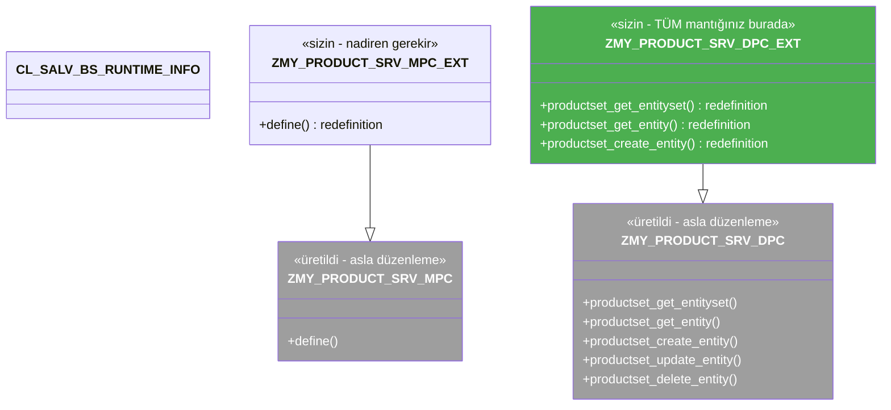

# Kısım 22: Servis Metotları & Import Parametreleri

*Kodunuzun gerçekte nerede yaşadığı, hangi metodun hangi HTTP fiiliyle eşleştiği ve istemcinin gönderdiğini nasıl okuduğunuz.*

---

## ☕ Önce büyük resim

Son kısımda veri modelini — verinizin *şeklini* — oluşturdunuz. Bu kısım ise *davranışı* ele alıyor: `GET /ProductSet`, `POST /ProductSet`, `DELETE /ProductSet('P-100')` gibi isteklere yanıt veren kodun nerede yazıldığını.

Yanıt her zaman şudur: **`*_DPC_EXT` sınıfında**. Bu kısımın geri kalanı, bunun tam olarak ne anlama geldiğinin ayrıntısıdır.

---

## 22.1 MPC/DPC sınıf ailesi — hangisine kod yazıyorsunuz

### 1️⃣ Benzetme

SAP'ın SEGW modelinizden tüm doğru metot imzaları taslaklandırılmış şekilde ürettiği bir taban controller hayal edin. Bu taban controller'ı asla düzenlemezsiniz çünkü SEGW onu üzerine yazar. Bunun yerine ondan kalıtım alır ve ihtiyaç duyduğunuz metotları *yeniden tanımlarsınız* (override edersiniz). O alt sınıf, sizin `_EXT` sınıfınızdır.

### 2️⃣ Bunu zaten biliyorsun

```csharp
// C# benzetmesi — asla dokunmadığınız üretilmiş bir taban
// (kod üretecinin bunu ürettiğini hayal edin)
public abstract class ProductServiceBase
{
    public virtual IEnumerable<Product> GetEntitySet() => throw new NotImplementedException();
    public virtual Product GetEntity(string key)      => throw new NotImplementedException();
    public virtual Product CreateEntity(Product body) => throw new NotImplementedException();
    public virtual Product UpdateEntity(string key, Product body) => throw new NotImplementedException();
    public virtual void    DeleteEntity(string key)   => throw new NotImplementedException();
}

// SİZ bunu yazarsınız — uzantı sınıfı:
public class ProductServiceImpl : ProductServiceBase
{
    public override IEnumerable<Product> GetEntitySet()
    {
        return _db.Products.ToList();   // mantığınız burada
    }
}
```

### 3️⃣ ABAP'taki karşılığı

SEGW dört sınıf üretir. İşte tam tablo:

```
ZMY_PRODUCT_SRV_MPC          ← Model Provider taban   (YENİDEN OLUŞTURULUR — asla dokunmayın)
  └── ZMY_PRODUCT_SRV_MPC_EXT  ← Model Provider Ext  (sizin — nadiren gerekir)

ZMY_PRODUCT_SRV_DPC          ← Data Provider taban    (YENİDEN OLUŞTURULUR — asla dokunmayın)
  └── ZMY_PRODUCT_SRV_DPC_EXT  ← Data Provider Ext   (sizin — TÜM mantığınız burada)
```



**MPC (Model Provider)**, `$metadata`'yı yönetir. Dinamik metadata oluşturmak gerekmiyorsa — örneğin özelleştirme tablolarına göre çalışma zamanında özellik eklemek — `_MPC_EXT`'ye neredeyse hiç dokunmazsınız.

**DPC (Data Provider)** tüm veri işlemlerini yönetir. `_DPC_EXT` sizin evinizdir.

> ⚠️ **C#/Python tuzağı:** DPC taban sınıfı (`_DPC`), varsayılan olarak `cx_sy_no_handler` (implemente edilmemiş) fırlatan metot taslakları içerir. Bir işlem çağırıp ürkütücü bir 501 hatası alırsanız, `_DPC_EXT`'te metodu yeniden tanımlamayı unutmuşsunuz demektir. Bu normal ve beklenen bir durumdur — SEGW yalnızca imzaları üretir, implementasyonları değil.

### SE24'te _DPC_EXT'yi açma

`SE24` transaction'ı → `ZMY_PRODUCT_SRV_DPC_EXT` sınıf adını girin → **Change**'e tıklayın. **Methods** sekmesine gidin. SEGW'nin bildiği her işlemi, tümü tabandan miras alınmış olarak görürsünüz. Override etmeye başlamak için bir metoda sağ tıklayın → **Redefine**.

> 🧭 **İş hayatında:** Ayrıca SEGW ağacında (entity set satırı altındaki **Service Implementation** altında) bir metot adına doğrudan çift tıklayabilirsiniz; bu, sizi doğrudan doğru metoda kaydırılmış şekilde `SE24`'ü açar. Bu daha hızlı bir iş akışıdır.

---

## 22.2 Metot → HTTP fiili eşlemesi

İşte işin ilk haftasında ezberleyeceğiniz tablo:

| HTTP Fiili + URL örneği | OData işlemi | Override edilecek DPC_EXT metodu |
|---|---|---|
| `GET /ProductSet` | Koleksiyon okuma | `PRODUCTSET_GET_ENTITYSET` |
| `GET /ProductSet('P-100')` | Tek entity okuma | `PRODUCTSET_GET_ENTITY` |
| `POST /ProductSet` | Yeni entity oluşturma | `PRODUCTSET_CREATE_ENTITY` |
| `PUT /ProductSet('P-100')` | Tam güncelleme | `PRODUCTSET_UPDATE_ENTITY` |
| `PATCH /ProductSet('P-100')` | Kısmi güncelleme (OData v2'de MERGE) | `PRODUCTSET_UPDATE_ENTITY` (aynı metot!) |
| `DELETE /ProductSet('P-100')` | Silme | `PRODUCTSET_DELETE_ENTITY` |

Kalıba dikkat edin: **`<EntitySetAdı>_<İŞLEM>`** biçiminde büyük harflerle, ayraç olarak alt çizgi.

`SalesOrderHeaderSet` için `SALESORDERHEADERSET_GET_ENTITYSET` ve benzeri olur.

> 💡 **PATCH vs PUT:** OData v2, kısmi güncellemeler için `MERGE` fiilini kullanır (HTTP standardlaşmadan önce SAP'ın tanımladığı bir HTTP uzantısı); ancak modern istemciler `PATCH` gönderir. SAP çerçevesi her ikisini de aynı `UPDATE_ENTITY` metoduna yönlendirir. Farklı davranış gerekiyorsa metot içinde `io_tech_request_context->get_http_method( )` ile ayırt edebilirsiniz.

### Tam metot imzası (GET_ENTITYSET)

`SE24`'te `PRODUCTSET_GET_ENTITYSET`'i yeniden tanımladığınızda ABAP size şu imzayı gösterir:

```abap
METHOD productset_get_entityset.
  " Import:
  "   IV_ENTITY_NAME        TYPE string
  "   IV_ENTITY_SET_NAME    TYPE string
  "   IV_SOURCE_NAME        TYPE string
  "   IT_FILTER_SELECT_OPTIONS TYPE /IWBEP/T_MGW_SELECT_OPTION
  "   IS_PAGING             TYPE /IWBEP/S_MGW_PAGING
  "   IT_KEY_TAB            TYPE /IWBEP/T_MGW_TECH_PAIRS
  "   IT_NAVIGATION_PATH    TYPE /IWBEP/T_MGW_NAVIGATION_PATH
  "   IT_ORDER              TYPE /IWBEP/T_MGW_SORTING_ORDER
  "   IS_FILTER_SELECT_OPTIONS TYPE /IWBEP/S_MGW_SELECT_OPTION
  "   IO_TECH_REQUEST_CONTEXT TYPE REF TO /IWBEP/IF_MGW_REQ_ENTITYSET
  "
  " Changing:
  "   CT_DATA               TYPE TABLE   " ← sonuçları buraya doldurun
  "
  " Exporting:
  "   ES_RESPONSE_CONTEXT   TYPE /IWBEP/IF_MGW_APPL_SRV_RUNTIME=>TY_S_MGW_RESPONSE_CONTEXT

ENDMETHOD.
```

İlk görüşte bunaltıcı görünür. Her parametreyi 22.3. bölümde tek tek ele alacağız.

---

## 22.3 İstemcinin gönderdiğini okuma — io_tech_request_context ve arkadaşları

### 1️⃣ Benzetme

Herhangi bir web çerçevesinde "request context" nesnesi, istemcinin gönderdiği her şeyi bulduğunuz yerdir: route parametreleri, sorgu dizesi değerleri, gövde, başlıklar. OData / DPC_EXT'te bu nesne `io_tech_request_context`'tir.

### 2️⃣ Bunu zaten biliyorsun

```csharp
// ASP.NET Web API — gelen veriyi nasıl alırsınız
[HttpGet("{id}")]
public IActionResult GetById(
    string id,                          // route param  → IT_KEY_TAB
    [FromQuery] string filter,          // ?$filter=... → IT_FILTER_SELECT_OPTIONS
    [FromQuery] int top = 50,           // ?$top=       → IS_PAGING-top
    [FromQuery] int skip = 0,           // ?$skip=      → IS_PAGING-skip
    [FromQuery] string orderby = "")    // ?$orderby=   → IT_ORDER
{
    // ...
}
```

```python
# FastAPI karşılığı
@app.get("/ProductSet")
def get_products(
    product_id: str | None = None,   # route param   → IT_KEY_TAB
    filter: str | None = None,       # $filter       → IT_FILTER_SELECT_OPTIONS
    top: int = 50,                   # $top          → IS_PAGING
    skip: int = 0,                   # $skip         → IS_PAGING
    orderby: str = ""                # $orderby      → IT_ORDER
):
    ...
```

### 3️⃣ ABAP'taki karşılığı — temel import parametrelerini çözelim

#### IT_KEY_TAB — route parametreleri (anahtar)

```abap
" Tip: /IWBEP/T_MGW_TECH_PAIRS
" URL'deki anahtar için ad-değer çiftleri tablosu:
"   GET /ProductSet('P-100')  → IT_KEY_TAB: { name='ProductId', value='P-100' }

" Tek bir anahtarı okuma (en yaygın kalıp):
DATA(lv_product_id) = VALUE #( it_key_tab[ name = 'ProductId' ]-value
                                OPTIONAL ).

" Ya da kolaylık metodunu kullanın:
io_tech_request_context->get_keys(
  IMPORTING
    et_key_tab = DATA(lt_keys) ).
READ TABLE lt_keys WITH KEY name = 'ProductId' INTO DATA(ls_key).
DATA(lv_product_id) = ls_key-value.
```

#### IT_FILTER_SELECT_OPTIONS — $filter ifadeleri

```abap
" Tip: /IWBEP/T_MGW_SELECT_OPTION
" Her giriş bir alan + ranges tablosu (SIGN/OPTION/LOW/HIGH) içerir.
" Bu, raporlarda ve seçim ekranlarında zaten karşılaştığınız ABAP ranges kavramıdır.

LOOP AT it_filter_select_options INTO DATA(ls_filter).
  CASE ls_filter-property.
    WHEN 'Price'.
      " ls_filter-select_options, doğrudan
      " SELECT WHERE field IN ranges yapısına aktarılabilecek bir ranges tablosudur.
  ENDCASE.
ENDLOOP.
```

#### IS_PAGING — $top ve $skip

```abap
" Tip: /IWBEP/S_MGW_PAGING
" IS_PAGING-top  = $top değeri  (0 = gönderilmedi → tümünü döndür)
" IS_PAGING-skip = $skip değeri (0 = gönderilmedi → baştan başla)

DATA(lv_top)  = is_paging-top.   " ör. 25
DATA(lv_skip) = is_paging-skip.  " ör. 50 (51. satırdan başla)
```

#### IT_ORDER — $orderby

```abap
" Tip: /IWBEP/T_MGW_SORTING_ORDER
" Her satır: özellik adı + sıralama yönü (artan/azalan)

LOOP AT it_order INTO DATA(ls_order).
  " ls_order-property  = 'Price'
  " ls_order-order     = /IWBEP/IF_MGW_APPL_SRV_RUNTIME=>GC_SORT_ORDER-ascending
ENDLOOP.
```

#### io_tech_request_context — zengin istek nesnesi

```abap
" /IWBEP/IF_MGW_REQ_ENTITYSET arayüzü pek çok yardımcı metot sunar:

" Ham $filter dizesi (kendiniz ayrıştırmak isterseniz):
DATA(lv_filter_string) = io_tech_request_context->get_osql_where_clause( ).

" $search değeri (serbest metin arama):
DATA(lv_search) = io_tech_request_context->get_search_expression( ).

" $inlinecount=allpages bayrağı:
DATA(lv_inlinecount) = io_tech_request_context->get_inlinecount( ).

" $select ile istenen alanlar:
DATA(lt_select_props) = io_tech_request_context->get_select_properties( ).

" HTTP metodu (GET/POST/PUT/PATCH/DELETE/MERGE):
DATA(lv_http_method) = io_tech_request_context->get_http_method( ).
```

> 💡 `io_tech_request_context`, DPC_EXT içindeki en büyük yardımcınızdır. Hiç kullanmayacağınız kadar çok metodu vardır. ADT veya SE24'te `io_tech_request_context->` yazarak tüm metotlara kod tamamlama ile göz atabilirsiniz.

---

## 22.4 Veriyi döndürme ve durum/mesaj ayarlama

### Veriyi döndürme

`ct_data` / `er_entity` changing/exporting parametreleri, çerçeveye veriyi geri vermenin yoludur.

```abap
" GET_ENTITYSET için — CT_DATA'yı doldurun (genel tablo)
DATA ls_product TYPE zcl_zmy_product_srv_mpc=>ts_product.  " üretilmiş tip
ls_product-product_id = 'P-100'.
ls_product-name       = 'Precision Lathe T500'.
ls_product-price      = '4250.00'.
ls_product-currency   = 'EUR'.
APPEND ls_product TO ct_data.

" GET_ENTITY için — ER_ENTITY'yi doldurun (yapı referansı)
er_entity = ls_product.
```

Çerçeve `ct_data` / `er_entity`'yi otomatik olarak XML veya JSON'a dönüştürür. Yalnızca ABAP yapısını doldurursunuz — JSON kodlayıcı asla yazmazsınız.

### Satır içi sayı ayarlama (sayfalama için)

```abap
" Sayfalanmış dilimi SELECT ettikten sonra istemciye toplam kayıt sayısını bildirin.
" Bu, yanıttaki @odata.count / $inlinecount alanını doldurur.
es_response_context-inlinecount = lv_total_count.
```

### İş hatalarını fırlatma

```abap
" Doğrulama hatası için standart OData business exception'ı fırlatın:
RAISE EXCEPTION TYPE /iwbep/cx_mgw_busi_exception
  EXPORTING
    textid   = /iwbep/cx_mgw_busi_exception=>business_error
    http_status_code = /iwbep/cx_mgw_busi_exception=>gcs_http_status_codes-bad_request
    message  = 'Price must be greater than zero'.

" Çerçeve bunu yakalar ve düzgün bir OData hata yanıtına dönüştürür:
" HTTP 400
" { "error": { "code": "...", "message": { "lang": "en", "value": "Price must..." } } }
```

> ⚠️ **C#/Python tuzağı:** DPC_EXT metodunda düz `cx_root` veya `cx_sy_*` exception'ı FIRLAT MAYIN — bu genel bir 500 hatasına neden olur. Beklenen iş hataları için her zaman `/IWBEP/CX_MGW_BUSI_EXCEPTION` kullanın; böylece istemci düzgün bir OData hata gövdesi alır. Bunu kısım 25'te ayrıntılı olarak ele alıyoruz.

### GET_ENTITYSET için yanıt bağlamı

```abap
" es_response_context, /IWBEP/IF_MGW_APPL_SRV_RUNTIME=>TY_S_MGW_RESPONSE_CONTEXT tipindedir
" En sık ayarladığınız alan:
es_response_context-inlinecount = <sayfalama öncesi toplam satır sayısı>.
```

---

## ☕ Hepsini bir araya getirme — minimal GET_ENTITYSET iskeleti

İşte kısım 23'te gerçek SELECT'i doldurmadan önce tüm parçaların birlikte çalıştığını gösteren bir iskelet:

```abap
METHOD productset_get_entityset.

  " ── 1. Sayfalama parametrelerini oku ──────────────────────────────────
  DATA(lv_top)  = is_paging-top.
  DATA(lv_skip) = is_paging-skip.

  " ── 2. Filter'ı oku (kısım 24'te düzgünce kullanacağız) ──────────────
  " Şimdilik her filtreyi sessizce kabul et
  DATA lt_price_range TYPE RANGE OF kbetr.

  LOOP AT it_filter_select_options INTO DATA(ls_sel_opt)
      WHERE property = 'Price'.
    APPEND LINES OF ls_sel_opt-select_options TO lt_price_range.
  ENDLOOP.

  " ── 3. Üretilen MPC tipine göre sonuç tablosunu tanımla ───────────────
  DATA lt_products TYPE TABLE OF zcl_zmy_product_srv_mpc=>ts_product.

  " ── 4. SELECT (basitleştirilmiş — kısım 23 bunu genişletir) ───────────
  SELECT matnr AS product_id
         maktx AS name            " MAKT'a join üzerinden
    INTO CORRESPONDING FIELDS OF TABLE @lt_products
    FROM mara
    UP TO 100 ROWS.

  " ── 5. Sonuçları döndür ───────────────────────────────────────────────
  ct_data = CORRESPONDING #( lt_products ).

ENDMETHOD.
```

Bu iskeletin üzerine kısımlar 23–25'te gerçek projeye hazır bir şey inşa ediyoruz.

---

## 🧠 Özet

- İki sınıf ailesi: **MPC** (model/metadata) ve **DPC** (veri). `_EXT` sonekli alt sınıflar size aittir — geri kalanı SEGW tarafından yeniden üretilir.
- **Tüm mantığınız `*_DPC_EXT`'te yaşar**. Taban `_DPC`'yi asla düzenlemeyin.
- Metot adlandırma kalıbı: **`<ENTITYSETADI>_<İŞLEM>`** — ör. `PRODUCTSET_GET_ENTITYSET`, `PRODUCTSET_CREATE_ENTITY`.
- İstek parametreleri: `IT_KEY_TAB` (route anahtarları), `IT_FILTER_SELECT_OPTIONS` (WHERE koşulları), `IS_PAGING` ($top/$skip), `IT_ORDER` ($orderby) ve `IO_TECH_REQUEST_CONTEXT` (her şey).
- `CT_DATA` (koleksiyon) veya `ER_ENTITY` (tekli) doldurarak veriyi döndürün. Çerçeve serileştirir — JSON asla yazmayın.
- Hatalar için her zaman `/IWBEP/CX_MGW_BUSI_EXCEPTION` fırlatın — düz exception değil.

---

*[← İçindekiler](../content.md) | [← Önceki: Entity Type, Entity Set, XML & JSON](21-odata-entity-types-xml-json.md) | [Sonraki: Veri Okuma: GET_ENTITY & GET_ENTITYSET →](23-odata-read-crud-get-entity.md)*
