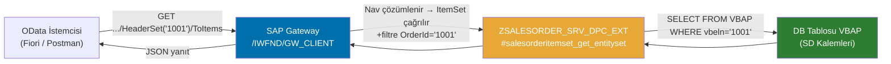

# Kısım 26: Association'lar — Principal ve Dependent Entity Set'ler

*OData servisine SalesOrderHeader'ın SalesOrderItem'a sahip olduğunu nasıl öğretirsiniz — ve URL bunu nasıl ifade eder.*

---

## 26.1 Association nedir? ☕

SQL Server'daki foreign key ilişkisini hayal edin:

```sql
-- SQL Server
CREATE TABLE SalesOrderHeader (
    OrderId   VARCHAR(10) PRIMARY KEY,
    Customer  VARCHAR(10),
    NetAmount DECIMAL(15,2)
);

CREATE TABLE SalesOrderItem (
    OrderId  VARCHAR(10),
    ItemNo   VARCHAR(6),
    Material VARCHAR(18),
    Quantity DECIMAL(13,3),
    FOREIGN KEY (OrderId) REFERENCES SalesOrderHeader(OrderId)
);
```

Bu `FOREIGN KEY` kısıtı SQL Server'a "her kalem *bir başlığa aittir*" demektedir. Şimdi bu ilişkiyi **URL**'ye gömdüğünüzü hayal edin; böylece bir istemci şunu diyebilir:

```http
GET /sap/opu/odata/sap/ZSALESORDER_SRV/SalesOrderHeaderSet('0000001001')/ToItems
```

…ve servis, başlıktan kalemlerine otomatik olarak *geçiş yapar*. İşte bu bir **OData association**'dır.

### Üç temel parça

| OData kavramı | SQL karşılığı | EF Core karşılığı |
|---|---|---|
| **Association** | FOREIGN KEY kısıt tanımı | Navigation property türü |
| **Referential constraint** | FK sütun eşlemesi (Principal PK → Dependent FK) | `HasForeignKey(...)` |
| **Navigation property** | JOIN yolu (sütun değil — bir yön) | `virtual ICollection<Item> Items` |

> 💡 SEGW'nin kullandığı OData v2'de navigation property'ler entity type üzerinde bulunur. İstemci, tek varlık URL'sine `/<NavPropName>` ekler ve servis çağrıyı *dependent* varlığın `GET_ENTITYSET` metoduna yönlendirir; kaynak anahtar özel bir segment parametresiyle iletilir — `io_tech_request_context` size *nasıl buraya ulaştığınızı* söyler.

---

## 26.2 Bunu zaten biliyorsun

### C# — Entity Framework navigation property

```csharp
// C# / EF Core
public class SalesOrderHeader
{
    public string OrderId   { get; set; }
    public string Customer  { get; set; }
    public decimal NetAmount { get; set; }

    // Navigation property — EF, FK'yi otomatik olarak takip eder
    public virtual ICollection<SalesOrderItem> Items { get; set; }
}

public class SalesOrderItem
{
    public string OrderId  { get; set; }   // FK
    public string ItemNo   { get; set; }
    public string Material { get; set; }
    public decimal Quantity { get; set; }

    public virtual SalesOrderHeader Header { get; set; }
}

// Fluent API eşlemesi
modelBuilder.Entity<SalesOrderHeader>()
    .HasMany(h => h.Items)
    .WithOne(i => i.Header)
    .HasForeignKey(i => i.OrderId);
```

`context.SalesOrderHeaders.Include(h => h.Items)` çağırdığınızda EF, FK'yi çözer — OData'da `$expand=ToItems` ile yapılan işlemin tam karşılığıdır.

### Python — SQLAlchemy relationship

```python
# Python / SQLAlchemy
class SalesOrderHeader(Base):
    __tablename__ = "sales_order_header"
    order_id   = Column(String(10), primary_key=True)
    customer   = Column(String(10))
    net_amount = Column(Numeric(15, 2))
    items      = relationship("SalesOrderItem", back_populates="header")

class SalesOrderItem(Base):
    __tablename__ = "sales_order_item"
    order_id  = Column(String(10), ForeignKey("sales_order_header.order_id"), primary_key=True)
    item_no   = Column(String(6),  primary_key=True)
    material  = Column(String(18))
    quantity  = Column(Numeric(13, 3))
    header    = relationship("SalesOrderHeader", back_populates="items")
```

---

## 26.3 ABAP'taki karşılığı — SEGW'de nasıl kurulur 🛠️

### SEGW'de adım adım (işlem kodu `SEGW`)

Projenizi (`ZSALESORDER_SRV`) açın. Kısım 23–25'ten itibaren zaten **SalesOrderHeader** ve **SalesOrderItem** entity type'larınız var. Şimdi bunları birbirine bağlayın.

#### 1 — Association oluşturma

Nesne ağacında **Associations → Create** üzerine sağ tıklayın.

| Alan | Değer |
|---|---|
| Association name | `SalesOrderHeader_To_Items` |
| Principal entity type | `SalesOrderHeader` |
| Principal cardinality | `1` |
| Dependent entity type | `SalesOrderItem` |
| Dependent cardinality | `Many` |

#### 2 — Referential Constraint'i ayarlama

Hâlâ association editöründeyken **Referential Constraints** sekmesine geçin:

| Principal property | Dependent property |
|---|---|
| `OrderId` | `OrderId` |

Bu, framework'e şunu söyler: başlıktaki `OrderId` anahtarı, kalemdeki `OrderId` ile aynı sütundur. Gateway çalışma zamanı bunu SQL oluşturmak için kullanır — ya da siz `GET_ENTITYSET` içinde kendiniz kullanırsınız.

#### 3 — Navigation Property ekleme

**SalesOrderHeader** entity type'ınızın altında **Navigation Properties → Create** üzerine sağ tıklayın:

| Alan | Değer |
|---|---|
| Navigation property name | `ToItems` |
| Association | `SalesOrderHeader_To_Items` |
| From role | `Principal` |
| To role | `Dependent` |

İsteğe bağlı olarak **SalesOrderItem** üzerine ters navigation ekleyin:

| Alan | Değer |
|---|---|
| Navigation property name | `ToHeader` |
| Association | `SalesOrderHeader_To_Items` |
| From role | `Dependent` |
| To role | `Principal` |

#### 4 — Entity Set'leri Association Set'e atama

Metadata XML'i, iki **EntitySet** adını association ile bağlayan bir **AssociationSet** gerektirir. SEGW, **Association Sets → Create** üzerine sağ tıkladığınızda bunu otomatik olarak oluşturur:

| Alan | Değer |
|---|---|
| Association Set name | `SalesOrderHeader_To_ItemsSet` |
| Association | `SalesOrderHeader_To_Items` |
| Entity Set 1 | `SalesOrderHeaderSet` |
| Entity Set 2 | `SalesOrderItemSet` |

#### 5 — Generate

**Generate** düğmesine basın (ya da `F8`). SEGW, `ZSALESORDER_SRV_MPC`'yi (model provider sınıfı) ve `ZSALESORDER_SRV_DPC_EXT`'deki stub'ı (uzantı sınıfınız) yeniden oluşturur. Metadata belgesi artık association'ı dışa aktarmaktadır.

```xml
<!-- $metadata'dan alıntı, generate sonrası -->
<Association Name="SalesOrderHeader_To_Items">
  <End Type="ZSALESORDER_SRV.SalesOrderHeader" Multiplicity="1"   Role="Principal" />
  <End Type="ZSALESORDER_SRV.SalesOrderItem"   Multiplicity="*"   Role="Dependent" />
  <ReferentialConstraint>
    <Principal Role="Principal">
      <PropertyRef Name="OrderId" />
    </Principal>
    <Dependent Role="Dependent">
      <PropertyRef Name="OrderId" />
    </Dependent>
  </ReferentialConstraint>
</Association>

<NavigationProperty
  Name="ToItems"
  Relationship="ZSALESORDER_SRV.SalesOrderHeader_To_Items"
  FromRole="Principal"
  ToRole="Dependent" />
```

---

## 26.4 DPC_EXT'te navigation'ı implement etme 🔁

İstemci `SalesOrderHeaderSet('1001')/ToItems` adresine istek yaptığında, gateway framework **SalesOrderItem** entity set'inin `GET_ENTITYSET` metodunu çağırır — ancak *navigation bağlamını* da geçirir; böylece bir nav property aracılığıyla buraya geldiğinizi ve kaynak anahtarın ne olduğunu anlarsınız.

Anahtar nesne `io_tech_request_context`'tir. Navigation zincirinin ne kadar derin olduğunu öğrenmek için `get_navigation_path( )` metodunu çağırın; referential constraint'ten framework'ün otomatik doldurduğu `filter_select_options`'ı kullanın.

```abap
CLASS zsalesorder_srv_dpc_ext DEFINITION
  INHERITING FROM zsalesorder_srv_dpc
  FINAL
  CREATE PUBLIC.

PUBLIC SECTION.
  METHODS salesorderitemset_get_entityset REDEFINITION.
ENDCLASS.

CLASS zsalesorder_srv_dpc_ext IMPLEMENTATION.

  METHOD salesorderitemset_get_entityset.
    "-----------------------------------------------------------------------
    " İki durum için de çağrılır:
    "   GET /SalesOrderItemSet?$filter=OrderId eq '1001'
    "   GET /SalesOrderHeaderSet('1001')/ToItems
    " Navigation durumunda framework, io_filter_select_options'ı referential
    " constraint'ten otomatik olarak doldurur.
    "-----------------------------------------------------------------------

    DATA: lt_items  TYPE TABLE OF zsalesorder_item,
          ls_item   TYPE zsalesorder_item,
          ls_entity TYPE zcl_zsalesorder_srv_mpc=>ts_salesorderitem.

    " --- OrderId filtresini al (her iki çağrı yolunda da mevcut) -----------
    DATA(lt_filters) = io_tech_request_context->get_filter( )->get_filter_select_options( ).

    DATA lv_order_id TYPE vbeln_va.
    LOOP AT lt_filters INTO DATA(ls_filter) WHERE property = 'OrderId'.
      LOOP AT ls_filter-select_options INTO DATA(ls_opt).
        IF ls_opt-option = 'EQ'.
          lv_order_id = ls_opt-low.
        ENDIF.
      ENDLOOP.
    ENDLOOP.

    " --- Nasıl geldiğimizi kontrol et (direkt mi, navigation mı) -----------
    DATA(lv_is_navigation) = abap_false.
    TRY.
      DATA(lo_nav) = io_tech_request_context->get_navigation_path( ).
      IF lo_nav IS NOT INITIAL.
        lv_is_navigation = abap_true.
        " Navigation için framework, get_source_key( ) üzerinden anahtarı da
        " sağlayabilir — çok anahtarlı senaryolarda kullanışlıdır
      ENDIF.
    CATCH cx_root. " Navigation path mevcut değil (direkt çağrı)
    ENDTRY.

    " --- Veritabanı okuma --------------------------------------------------
    IF lv_order_id IS NOT INITIAL.
      SELECT vbeln AS order_id,
             posnr AS item_no,
             matnr AS material,
             kwmeng AS quantity,
             vrkme  AS uom,
             netwr  AS net_value
        FROM vbap
        INTO TABLE @lt_items
        WHERE vbeln = @lv_order_id.
    ELSE.
      " Filtre olmadan direkt çağrı — sayfalama uygula
      DATA(lv_skip) = io_tech_request_context->get_top_skip_inline_count(
                        )-skip.
      DATA(lv_top)  = io_tech_request_context->get_top_skip_inline_count(
                        )-top.
      IF lv_top IS INITIAL.
        lv_top = 100.  " Güvenlik sınırı
      ENDIF.

      SELECT vbeln AS order_id,
             posnr AS item_no,
             matnr AS material,
             kwmeng AS quantity,
             vrkme  AS uom,
             netwr  AS net_value
        FROM vbap
        INTO TABLE @lt_items
        UP TO @lv_top ROWS
        OFFSET @lv_skip.
    ENDIF.

    " --- OData entity'ye eşle ---------------------------------------------
    LOOP AT lt_items INTO ls_item.
      CLEAR ls_entity.
      ls_entity-order_id  = ls_item-order_id.
      ls_entity-item_no   = ls_item-item_no.
      ls_entity-material  = ls_item-material.
      ls_entity-quantity  = ls_item-quantity.
      ls_entity-uom       = ls_item-uom.
      ls_entity-net_value = ls_item-net_value.
      APPEND ls_entity TO et_entityset.
    ENDLOOP.

  ENDMETHOD.

ENDCLASS.
```

> ⚠️ **C#/Python tuzağı:** Ayrı bir "navigation handler" metodunu override etmeyi bekleyebilirsiniz — Web API'deki ayrı bir route gibi. Böyle bir şey yoktur. Framework sadece *dependent* entity set'in normal `GET_ENTITYSET`'ini çağırır, ancak referential constraint'ten alınan filtre önceden doldurulmuş olarak gelir. Bağlamı anlamak için her zaman `io_tech_request_context`'ten okuyun; tek bir kod yolu olduğunu varsaymayın.

---

## 26.5 Çalışan örnek — tam istek/yanıt akışı 🎯

### İstek: başlıktan kalemlerine geçiş

```http
GET /sap/opu/odata/sap/ZSALESORDER_SRV/SalesOrderHeaderSet('0000001001')/ToItems
Accept: application/json
```

### Yanıt

```json
{
  "d": {
    "results": [
      {
        "__metadata": {
          "type": "ZSALESORDER_SRV.SalesOrderItem",
          "uri": "/sap/opu/odata/sap/ZSALESORDER_SRV/SalesOrderItemSet(OrderId='0000001001',ItemNo='000010')"
        },
        "OrderId":   "0000001001",
        "ItemNo":    "000010",
        "Material":  "LAPTOP-X1",
        "Quantity":  "2.000",
        "Uom":       "EA",
        "NetValue":  "2400.00"
      },
      {
        "__metadata": {
          "type": "ZSALESORDER_SRV.SalesOrderItem",
          "uri": "/sap/opu/odata/sap/ZSALESORDER_SRV/SalesOrderItemSet(OrderId='0000001001',ItemNo='000020')"
        },
        "OrderId":   "0000001001",
        "ItemNo":    "000020",
        "Material":  "MOUSE-USB",
        "Quantity":  "1.000",
        "Uom":       "EA",
        "NetValue":  "29.99"
      }
    ]
  }
}
```

### İstek: kalemden başlığına geri dönüş

```http
GET /sap/opu/odata/sap/ZSALESORDER_SRV/SalesOrderItemSet(OrderId='0000001001',ItemNo='000010')/ToHeader
Accept: application/json
```

> 🧭 **İş hayatında:** Mülakatçılar "bir istemci belirli bir siparişin kalemlerini nasıl alır?" sorusunu çok sever. Beklenen cevap yukarıdaki navigation URL'sidir — `SalesOrderItemSet` üzerinde bir filtre değil. Her ikisi de çalışır, ancak navigation, *OData'ya özgü* yanıttır ve modeli anladığınızı gösterir.

### Mimari harita



---

## 🧠 Özet

- **Association**, bir **referential constraint** (hangi property FK) ile iki entity type arasındaki adlandırılmış ilişkidir.
- **Navigation property**, istemcilere ilişkiyi geçmek için bir URL yolu sağlar: `HeaderSet('x')/ToItems`.
- SEGW'de: Association oluşturun → Referential Constraint'i ayarlayın → Navigation Property'leri oluşturun → Association Set oluşturun → Generate.
- Kodda: Yalnızca dependent tarafta `GET_ENTITYSET`'i override edersiniz. Framework, constraint'ten filtreleri önceden doldurur. Çağrı yolunu tespit etmek için `io_tech_request_context`'i kullanın.
- Ters navigation (`ToHeader`), başlık tarafında bir `GET_ENTITY` yeniden tanımı gerektirir (aynı model — yalnızca tek varlık döndürür).

*[← İçindekiler](../content.md) | [← Önceki: Create, Update & Delete](25-odata-create-update-delete.md) | [Sonraki: Header + Item Verisi →](27-odata-header-and-item.md)*
