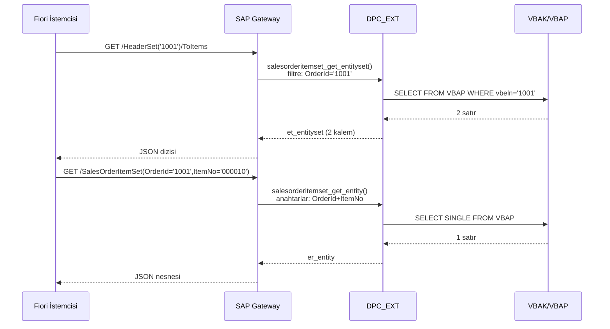

# Kısım 27: Header + Item Verisi Tek Serviste

*SAP'ta her yerde karşınıza çıkan satış siparişi deseni — OData ile temiz biçimde modelleme ve sunma.*

---

## 27.1 Header/item neden SAP'ta *her yerde* var? ☕

Herhangi bir SD danışmanına dünyalarındaki en önemli tabloyu sorun; gözlerini kırpmadan `VBAK` (satış siparişi başlığı) diyecekler. İkincisi için sorun — `VBAP` (satış siparişi kalemi). SAP'taki her iş belgesi bu iki katmanlı yapıyı izler:

| İş belgesi | Başlık tablosu | Kalem tablosu |
|---|---|---|
| Satış Siparişi | VBAK | VBAP |
| Teslimat | LIKP | LIPS |
| Fatura (Billing Document) | VBRK | VBRP |
| Satın Alma Siparişi | EKKO | EKPO |
| Muhasebe Belgesi | BKPF | BSEG |

Desen hep aynıdır: başlık tablosundaki bir satır *belgenin ne olduğunu* tanımlar (müşteri, tarih, toplam), kalem tablosundaki *N* satır ise *içinde ne olduğunu* anlatır (satır kalemleri, malzemeler, miktarlar).

### Bu şekil neden?

Bir alışveriş sepetini düşünün. Sepetin tek bir teslimat adresi, tek bir ödeme yöntemi, tek bir indirim kodu vardır. Ama elli farklı ürün içerebilir. Elli ürünün tüm ayrıntılarını tek bir "sepet" satırına sıkıştırmak kabus olurdu — bu yüzden ikiye bölünür: bir başlık, çok sayıda kalem. SAP, 40 yıldır her modülde bu deseni izlemiştir. İlk biletinizin ilk gününde bununla karşılaşacaksınız.

> 🧭 **İş hayatında:** Kıdemli bir danışman stand-up'ta "VBAK/VBAP" dediğinde "satış siparişi başlığına ve kalemlerine bak" demek istiyor. "BKPF/BSEG" dediğinde ise muhasebe belgesi ve satır kalemlerini düşünün. Bu çiftleri öğrenin — her mülakatta karşınıza çıkar.

---

## 27.2 Bunu zaten biliyorsun

### C# — iç içe aggregate root

```csharp
// C# — aynı desen, sadece OOP biçiminde
public record SalesOrderHeader
{
    public string   OrderId    { get; init; }
    public string   Customer   { get; init; }
    public DateTime OrderDate  { get; init; }
    public decimal  NetAmount  { get; init; }
    public string   Currency   { get; init; }
    public string   Status     { get; init; }

    // "N" tarafı — kalem koleksiyonu
    public List<SalesOrderItem> Items { get; init; } = new();
}

public record SalesOrderItem
{
    public string  OrderId   { get; init; }   // Başlığa FK
    public string  ItemNo    { get; init; }
    public string  Material  { get; init; }
    public decimal Quantity  { get; init; }
    public string  Uom       { get; init; }
    public decimal NetValue  { get; init; }
}

// Web API — yalnızca başlığı döndür
[HttpGet("{orderId}")]
public async Task<SalesOrderHeader> GetHeader(string orderId) { ... }

// Web API — bir başlığa ait kalemleri döndür
[HttpGet("{orderId}/items")]
public async Task<List<SalesOrderItem>> GetItems(string orderId) { ... }

// Web API — başlığı kalemlerle birlikte döndür
[HttpGet("{orderId}/full")]
public async Task<SalesOrderHeader> GetHeaderWithItems(string orderId)
{
    var header = await _repo.GetHeader(orderId);
    header = header with { Items = await _repo.GetItems(orderId) };
    return header;
}
```

### Python — dataclass aggregate

```python
from dataclasses import dataclass, field
from typing import List

@dataclass
class SalesOrderItem:
    order_id: str
    item_no:  str
    material: str
    quantity: float
    uom:      str
    net_value: float

@dataclass
class SalesOrderHeader:
    order_id:   str
    customer:   str
    order_date: str
    net_amount: float
    currency:   str
    status:     str
    items: List[SalesOrderItem] = field(default_factory=list)

# FastAPI — navigation endpoint
@app.get("/orders/{order_id}/items")
def get_items(order_id: str) -> List[SalesOrderItem]:
    return db.query(SalesOrderItem).filter_by(order_id=order_id).all()
```

Oluşturmak üzere olduğunuz OData servisi de *aynı şeydir* — yalnızca Web API rotaları yerine SAP'ın OData sözcük dağarcığını kullanır.

---

## 27.3 ABAP'taki karşılığı — her iki entity set'i bağlama 🛠️

Kısım 26'dan itibaren zaten iki entity type ve association'ınız var. Bu kısım *eksiksiz servisi* ele alır — her iki entity set implement edilmiş, nav property çalışıyor ve gerçek bir Fiori uygulamasının kullanacağı her çağrı yolunu gösteren URL örnekleri mevcut.

### Entity type tanımları (özet)

```abap
"-----------------------------------------------------------------------
" MPC_EXT'de (ZSALESORDER_SRV_MPC_EXT) — yalnızca özel property eklemek için
" SEGW normalde bunu DDIC yapısından otomatik oluşturur
"-----------------------------------------------------------------------
CLASS zsalesorder_srv_mpc_ext DEFINITION
  INHERITING FROM zsalesorder_srv_mpc
  FINAL
  CREATE PUBLIC.
ENDCLASS.
CLASS zsalesorder_srv_mpc_ext IMPLEMENTATION.
  " define( )'i yalnızca DDIC'te olmayan property eklerseniz genişletin
ENDCLASS.
```

Oluşturulan MPC, `SalesOrderHeader`'ı şu property'lerle tanımlar:

| Property | ABAP alanı | Tür | Anahtar? |
|---|---|---|---|
| `OrderId` | `VBELN` | `Edm.String` | ✓ |
| `Customer` | `KUNNR` | `Edm.String` | |
| `OrderDate` | `AUDAT` | `Edm.DateTime` | |
| `NetAmount` | `NETWR` | `Edm.Decimal` | |
| `Currency` | `WAERK` | `Edm.String` | |
| `Status` | `GBSTK` | `Edm.String` | |

Ve `SalesOrderItem`:

| Property | ABAP alanı | Tür | Anahtar? |
|---|---|---|---|
| `OrderId` | `VBELN` | `Edm.String` | ✓ |
| `ItemNo` | `POSNR` | `Edm.String` | ✓ |
| `Material` | `MATNR` | `Edm.String` | |
| `Quantity` | `KWMENG` | `Edm.Decimal` | |
| `Uom` | `VRKME` | `Edm.String` | |
| `NetValue` | `NETWR` | `Edm.Decimal` | |

### DPC_EXT — her iki entity set implement edilmiş

```abap
CLASS zsalesorder_srv_dpc_ext DEFINITION
  INHERITING FROM zsalesorder_srv_dpc
  FINAL
  CREATE PUBLIC.

PUBLIC SECTION.
  " Başlık CRUD
  METHODS salesorderheaderset_get_entity    REDEFINITION.
  METHODS salesorderheaderset_get_entityset REDEFINITION.
  " Kalem okuma (navigation + direkt)
  METHODS salesorderitemset_get_entityset   REDEFINITION.
  METHODS salesorderitemset_get_entity      REDEFINITION.

PRIVATE SECTION.
  " Ortak yardımcılar
  METHODS map_vbak_to_entity
    IMPORTING is_vbak    TYPE vbak
    RETURNING VALUE(rs_entity) TYPE zcl_zsalesorder_srv_mpc=>ts_salesorderheader.

  METHODS map_vbap_to_entity
    IMPORTING is_vbap    TYPE vbap
    RETURNING VALUE(rs_entity) TYPE zcl_zsalesorder_srv_mpc=>ts_salesorderitem.

ENDCLASS.

CLASS zsalesorder_srv_dpc_ext IMPLEMENTATION.

  "=========================================================================
  " BAŞLIK — tek varlık (GET /SalesOrderHeaderSet('1001'))
  "=========================================================================
  METHOD salesorderheaderset_get_entity.

    DATA(ls_key) = io_tech_request_context->get_keys( ).
    DATA lv_order_id TYPE vbeln_va.
    READ TABLE ls_key INTO DATA(ls_k) WITH KEY name = 'OrderId'.
    lv_order_id = ls_k-value.

    SELECT SINGLE *
      FROM vbak
      INTO @DATA(ls_vbak)
      WHERE vbeln = @lv_order_id.

    IF sy-subrc <> 0.
      RAISE EXCEPTION TYPE /iwbep/cx_mgw_busi_exception
        EXPORTING
          textid = /iwbep/cx_mgw_busi_exception=>entity_not_found.
    ENDIF.

    er_entity = map_vbak_to_entity( ls_vbak ).

  ENDMETHOD.

  "=========================================================================
  " BAŞLIK — entity set (GET /SalesOrderHeaderSet)
  "=========================================================================
  METHOD salesorderheaderset_get_entityset.

    DATA lt_vbak TYPE TABLE OF vbak.

    " Basit implementasyon — üretim kodu filtre/sıralama/sayfalama ekler
    SELECT vbeln, kunnr, audat, netwr, waerk, gbstk
      FROM vbak
      INTO CORRESPONDING FIELDS OF TABLE @lt_vbak
      UP TO 200 ROWS.

    LOOP AT lt_vbak INTO DATA(ls_vbak).
      APPEND map_vbak_to_entity( ls_vbak ) TO et_entityset.
    ENDLOOP.

  ENDMETHOD.

  "=========================================================================
  " KALEM — entity set (direkt + navigation)
  "   GET /SalesOrderItemSet?$filter=OrderId eq '1001'
  "   GET /SalesOrderHeaderSet('1001')/ToItems
  "=========================================================================
  METHOD salesorderitemset_get_entityset.

    DATA lt_vbap TYPE TABLE OF vbap.
    DATA lv_order_id TYPE vbeln_va.

    " OrderId'yi $filter'dan veya referential constraint'ten al
    DATA(lt_filters) = io_tech_request_context->get_filter(
                         )->get_filter_select_options( ).

    LOOP AT lt_filters INTO DATA(ls_filter) WHERE property = 'OrderId'.
      LOOP AT ls_filter-select_options INTO DATA(ls_opt).
        IF ls_opt-option = 'EQ' AND ls_opt-low IS NOT INITIAL.
          lv_order_id = ls_opt-low.
        ENDIF.
      ENDLOOP.
    ENDLOOP.

    IF lv_order_id IS NOT INITIAL.
      SELECT vbeln, posnr, matnr, kwmeng, vrkme, netwr
        FROM vbap
        INTO CORRESPONDING FIELDS OF TABLE @lt_vbap
        WHERE vbeln = @lv_order_id.
    ELSE.
      SELECT vbeln, posnr, matnr, kwmeng, vrkme, netwr
        FROM vbap
        INTO CORRESPONDING FIELDS OF TABLE @lt_vbap
        UP TO 200 ROWS.
    ENDIF.

    LOOP AT lt_vbap INTO DATA(ls_vbap).
      APPEND map_vbap_to_entity( ls_vbap ) TO et_entityset.
    ENDLOOP.

  ENDMETHOD.

  "=========================================================================
  " KALEM — tek varlık
  "   GET /SalesOrderItemSet(OrderId='1001',ItemNo='000010')
  "=========================================================================
  METHOD salesorderitemset_get_entity.

    DATA(ls_keys) = io_tech_request_context->get_keys( ).
    DATA lv_order_id TYPE vbeln_va.
    DATA lv_item_no  TYPE posnr_co.

    READ TABLE ls_keys INTO DATA(ls_k1) WITH KEY name = 'OrderId'.
    READ TABLE ls_keys INTO DATA(ls_k2) WITH KEY name = 'ItemNo'.
    lv_order_id = ls_k1-value.
    lv_item_no  = ls_k2-value.

    SELECT SINGLE vbeln, posnr, matnr, kwmeng, vrkme, netwr
      FROM vbap
      INTO @DATA(ls_vbap)
      WHERE vbeln = @lv_order_id
        AND posnr = @lv_item_no.

    IF sy-subrc <> 0.
      RAISE EXCEPTION TYPE /iwbep/cx_mgw_busi_exception
        EXPORTING
          textid = /iwbep/cx_mgw_busi_exception=>entity_not_found.
    ENDIF.

    er_entity = map_vbap_to_entity( ls_vbap ).

  ENDMETHOD.

  "=========================================================================
  " PRIVATE YARDIMCILAR — eşleme rutinleri
  "=========================================================================
  METHOD map_vbak_to_entity.
    rs_entity-order_id   = is_vbak-vbeln.
    rs_entity-customer   = is_vbak-kunnr.
    rs_entity-order_date = is_vbak-audat.
    rs_entity-net_amount = is_vbak-netwr.
    rs_entity-currency   = is_vbak-waerk.
    rs_entity-status     = is_vbak-gbstk.
  ENDMETHOD.

  METHOD map_vbap_to_entity.
    rs_entity-order_id  = is_vbap-vbeln.
    rs_entity-item_no   = is_vbap-posnr.
    rs_entity-material  = is_vbap-matnr.
    rs_entity-quantity  = is_vbap-kwmeng.
    rs_entity-uom       = is_vbap-vrkme.
    rs_entity-net_value = is_vbap-netwr.
  ENDMETHOD.

ENDCLASS.
```

> ⚠️ **C#/Python tuzağı:** `map_*` private metodlarına dikkat edin. ABAP'ın örtük nesne eşleyicisi yoktur (AutoMapper gibi bir şey yok). Alanları elle bağlarsınız ya da böyle bir yardımcı yazarsınız. Sıkıcıdır ama açıktır — takımdaki her geliştirici tam olarak neyin neyle eşlendiğini hiçbir sihir olmadan görebilir.

---

## 27.4 Gerçek yanıtlarla tam URL rehberi 🎯

Aşağıda gerçek bir Fiori uygulamasının bu servise karşı çağıracağı beş URL deseni ve örnek yanıtlar yer almaktadır. Tümünü `/IWFND/GW_CLIENT`'ta test edin.

### URL 1 — Tüm başlıkları listele

```http
GET /sap/opu/odata/sap/ZSALESORDER_SRV/SalesOrderHeaderSet?$format=json
```

```json
{
  "d": {
    "results": [
      {
        "__metadata": { "type": "ZSALESORDER_SRV.SalesOrderHeader" },
        "OrderId":    "0000001001",
        "Customer":   "0000001000",
        "OrderDate":  "/Date(1716508800000)/",
        "NetAmount":  "2429.99",
        "Currency":   "USD",
        "Status":     "A"
      }
    ]
  }
}
```

### URL 2 — Tek başlık

```http
GET /sap/opu/odata/sap/ZSALESORDER_SRV/SalesOrderHeaderSet('0000001001')?$format=json
```

### URL 3 — Kalemlere geçiş (nav property)

```http
GET /sap/opu/odata/sap/ZSALESORDER_SRV/SalesOrderHeaderSet('0000001001')/ToItems?$format=json
```

```json
{
  "d": {
    "results": [
      {
        "OrderId": "0000001001", "ItemNo": "000010",
        "Material": "LAPTOP-X1",  "Quantity": "2.000",
        "Uom": "EA", "NetValue": "2400.00"
      },
      {
        "OrderId": "0000001001", "ItemNo": "000020",
        "Material": "MOUSE-USB",  "Quantity": "1.000",
        "Uom": "EA", "NetValue": "29.99"
      }
    ]
  }
}
```

### URL 4 — Filtreli direkt kalem sorgusu

```http
GET /sap/opu/odata/sap/ZSALESORDER_SRV/SalesOrderItemSet?$filter=OrderId eq '0000001001'&$format=json
```

*Aynı kalemleri döndürür — sadece navigation yerine ItemSet'e direkt filtre ile gidilmiştir.*

### URL 5 — Bileşik anahtarla tek kalem

```http
GET /sap/opu/odata/sap/ZSALESORDER_SRV/SalesOrderItemSet(OrderId='0000001001',ItemNo='000010')?$format=json
```

```json
{
  "d": {
    "OrderId":  "0000001001",
    "ItemNo":   "000010",
    "Material": "LAPTOP-X1",
    "Quantity": "2.000",
    "Uom":      "EA",
    "NetValue": "2400.00"
  }
}
```

> 💡 URL 4 ve URL 3'ün aynı veriyi döndürdüğüne dikkat edin. İş hayatında, başlık anahtarınız varsa URL 3'ü (navigation) tercih edin — semantik olarak daha temizdir ve bazı Fiori kontrolleri, association metadata'sından otomatik olarak bu URL'yi oluşturur.

### Servis çağrı akışı



> 🧭 **İş hayatında:** Bir Fiori List-Detail uygulaması (çok yaygın bir SAP deseni) genellikle ana listeyi doldurmak için `HeaderSet`'i, kullanıcı bir satıra dokunduğunda ise `HeaderSet('x')/ToItems`'ı çağırır. İlk OData biletinizde tam olarak bunu oluşturmanız veya düzeltmeniz istenecektir.

---

## 🧠 Özet

- Header/item deseni (`VBAK/VBAP`, `EKKO/EKPO`, `BKPF/BSEG`) SAP için temeldir ve biletlerinizin büyük bölümünde karşınıza çıkacaktır.
- Eksiksiz bir header+item servisi şunları gerektirir: iki entity type, iki entity set, referential constraint içeren bir association ve iki navigation property.
- DPC_EXT'te her iki entity type için `GET_ENTITY` ve `GET_ENTITYSET`'i yeniden tanımladınız. Nav property yalnızca önceden doldurulmuş bir filtreyle kalem `GET_ENTITYSET`'ine yönlendirir.
- Private yardımcı metodlar (`map_*`) alan eşlemesini açık ve test edilebilir tutar.
- Beş URL deseni, bir Fiori uygulamasının ihtiyaç duyacağı tüm erişim modlarını kapsar — devretmeden önce tümünü `/IWFND/GW_CLIENT`'ta test edin.

*[← İçindekiler](../content.md) | [← Önceki: Association'lar](26-odata-associations.md) | [Sonraki: Function Import →](28-odata-function-import.md)*
