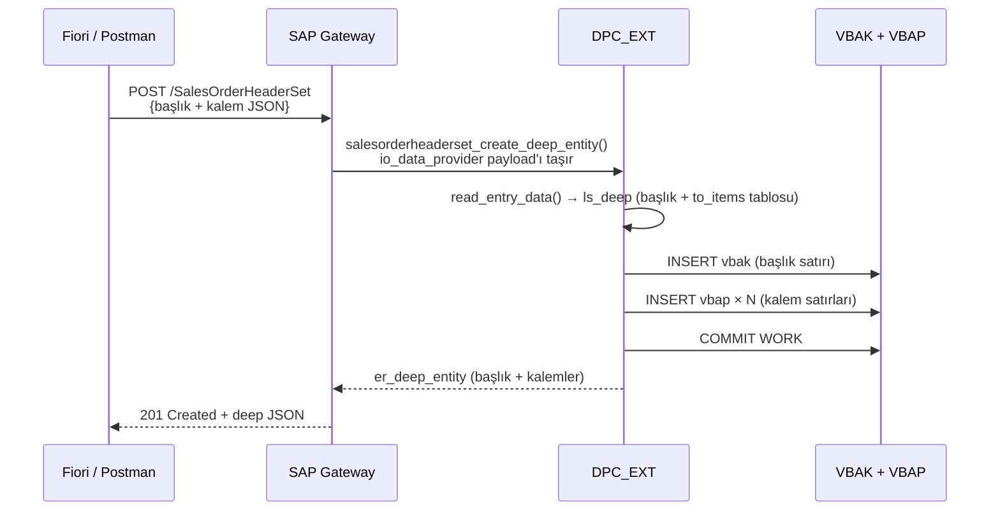

# Kısım 29: CREATE_DEEP_ENTITY

*Tek, işlemsel bir OData isteğiyle bir başlığı ve tüm kalemlerini nasıl POST edersiniz.*

---

## 29.1 Sorun — bir HTTP çağrısı, iki tablo ☕

Fiori'de "Yeni Satış Siparişi" ekranı oluşturuyorsunuz. Kullanıcı şunları doldurur:
- Sipariş başlığı (müşteri, tarih, notlar)
- On satır kalem (malzeme, miktar, fiyat)

C# veya Python dünyasında başlığı ve iç içe kalem dizisini içeren tek bir JSON nesnesi POST ederdiniz. Web API veya FastAPI endpoint'i tümünü alır, doğrular, başlık satırını yazar, kalem satırlarını yazar, commit yapar — atomik olarak.

SEGW ile OData v2'de bunun mekanizması `CREATE_DEEP_ENTITY` olarak adlandırılır. "Deep" (derin) kelimesi şu anlama gelir: tek bir işlemsel HTTP POST'ta bir üst varlık **ve** alt varlıkları, iç içe geçmiş halde.

Deep create olmadan şunları yapmanız gerekirdi:
1. `POST /SalesOrderHeaderSet` → yeni `OrderId`'yi al
2. Her kalem için tek tek `POST /SalesOrderItemSet`

Bu on round-trip demektir, atomiklik yoktur ve istemci yanıtları kendisi birleştirmek zorundadır. Deep create bu üç sorunu tek seferde çözer.

---

## 29.2 Bunu zaten biliyorsun

### C# — Web API'ye iç içe POST gövdesi

```csharp
// C# — Web API'de kabul edeceğiniz istek modeli
public record CreateSalesOrderRequest
{
    public string Customer  { get; init; }
    public string Currency  { get; init; }
    public string Notes     { get; init; }

    // İç içe kalemler — "deep" kısım
    public List<CreateSalesOrderItemRequest> Items { get; init; } = new();
}

public record CreateSalesOrderItemRequest
{
    public string  Material { get; init; }
    public decimal Quantity { get; init; }
    public string  Uom      { get; init; }
}

// Web API endpoint'i
[HttpPost]
public async Task<IActionResult> CreateOrder([FromBody] CreateSalesOrderRequest req)
{
    // Doğrula
    if (!req.Items.Any())
        return BadRequest("En az bir kalem gereklidir");

    // İşlem başlat
    await using var tx = await _db.BeginTransactionAsync();
    try
    {
        var header = await _orderRepo.CreateHeader(req);         // INSERT VBAK
        foreach (var item in req.Items)
            await _orderRepo.CreateItem(header.OrderId, item);   // INSERT VBAP
        await tx.CommitAsync();
        return CreatedAtAction(nameof(GetOrder), new { orderId = header.OrderId }, header);
    }
    catch
    {
        await tx.RollbackAsync();
        throw;
    }
}
```

İstek gövdesi:
```json
{
  "Customer": "0000001000",
  "Currency": "USD",
  "Notes": "Acil sipariş",
  "Items": [
    { "Material": "LAPTOP-X1", "Quantity": 2, "Uom": "EA" },
    { "Material": "MOUSE-USB", "Quantity": 1, "Uom": "EA" }
  ]
}
```

### Python — Pydantic iç içe modelle FastAPI

```python
from pydantic import BaseModel
from typing import List

class ItemIn(BaseModel):
    material: str
    quantity: float
    uom: str

class OrderIn(BaseModel):
    customer: str
    currency: str
    notes: str
    items: List[ItemIn]

@app.post("/orders", status_code=201)
async def create_order(body: OrderIn):
    async with db.transaction():
        order_id = await db.execute(INSERT_HEADER, body)
        for item in body.items:
            await db.execute(INSERT_ITEM, order_id, item)
    return {"order_id": order_id}
```

OData `CREATE_DEEP_ENTITY` çağrısı aynı JSON gövdesini (iç içe varlık) alır ve tek bir ABAP metoduna yönlendirir. Şimdi bunu oluşturalım.

---

## 29.3 Deep yapı ve io_data_provider 🛠️

### Deep yapı kavramı

SEGW, `MPC_EXT`'te bir "deep structure" türü oluşturur — başlık verilerini ve bir kalem iç tablosu içeren alanları olan bir yapı. Bunu, gömülü `List<Items>` ile C# `CreateSalesOrderRequest`'inizin ABAP karşılığı olarak düşünün.

Oluşturulan tür kabaca şöyle görünür:

```abap
" ZSALESORDER_SRV_MPC'de otomatik oluşturulmuş — basitleştirilmiş illüstrasyon
TYPES:
  BEGIN OF ts_salesorderheader_deep,
    " Tüm başlık property'leri ...
    order_id   TYPE string,
    customer   TYPE string,
    order_date TYPE d,
    net_amount TYPE p DECIMALS 2,
    currency   TYPE string,
    status     TYPE string,
    " İç içe koleksiyon — SEGW bunu nav property adından isimlendirmiştir
    to_items   TYPE STANDARD TABLE OF ts_salesorderitem WITH EMPTY KEY,
  END OF ts_salesorderheader_deep.
```

`to_items` iç tablosu, Kısım 26'da tanımladığınız **navigation property**'den adlandırılmıştır (`ToItems`). SEGW bunu ABAP türünde küçük harfe çevirir.

### SEGW'de deep create'i etkinleştirme

SEGW'de **SalesOrderHeader** entity set'inizi açın. Entity set'in özelliklerinde **"Create with deep insert"** seçeneğini işaretleyin. Kaydedin ve generate edin.

Bu, gateway çalışma zamanına şunu söyler:
- `SalesOrderHeaderSet`'e yapılan POST'ta iç içe JSON gövdesini (başlık + kalem dizisi) kabul et
- `CREATE_ENTITY` yerine `CREATE_DEEP_ENTITY`'ye yönlendir

---

## 29.4 CREATE_DEEP_ENTITY'yi yeniden tanımlama 🔁

```abap
CLASS zsalesorder_srv_dpc_ext DEFINITION
  INHERITING FROM zsalesorder_srv_dpc
  FINAL
  CREATE PUBLIC.

PUBLIC SECTION.
  METHODS salesorderheaderset_create_deep_entity REDEFINITION.

ENDCLASS.

CLASS zsalesorder_srv_dpc_ext IMPLEMENTATION.

  "=========================================================================
  " CREATE_DEEP_ENTITY
  " Çağıran: POST /SalesOrderHeaderSet — gövdede iç içe kalemler
  "=========================================================================
  METHOD salesorderheaderset_create_deep_entity.
    " Metod imzası (SEGW tarafından oluşturulmuş):
    "   io_data_provider  REF TO /iwbep/if_mgw_entry_provider
    "   er_deep_entity    TYPE ts_salesorderheader_deep (çıktı)
    "   — artı standart istek bağlamı parametreleri

    " --- 1. İstek gövdesinden deep payload'ı oku --------------------------
    DATA ls_deep TYPE zcl_zsalesorder_srv_mpc=>ts_salesorderheader_deep.

    " io_data_provider->read_entry_data, ls_deep'i JSON gövdesinden doldurur;
    " iç içe kalem iç tablosu dahil.
    io_data_provider->read_entry_data( IMPORTING es_data = ls_deep ).

    " --- 2. Doğrula -------------------------------------------------------
    IF ls_deep-customer IS INITIAL.
      RAISE EXCEPTION TYPE /iwbep/cx_mgw_busi_exception
        EXPORTING
          textid  = /iwbep/cx_mgw_busi_exception=>business_error
          message = 'Müşteri gereklidir'.
    ENDIF.

    IF ls_deep-currency IS INITIAL.
      RAISE EXCEPTION TYPE /iwbep/cx_mgw_busi_exception
        EXPORTING
          textid  = /iwbep/cx_mgw_busi_exception=>business_error
          message = 'Para birimi gereklidir'.
    ENDIF.

    IF ls_deep-to_items IS INITIAL.
      RAISE EXCEPTION TYPE /iwbep/cx_mgw_busi_exception
        EXPORTING
          textid  = /iwbep/cx_mgw_busi_exception=>business_error
          message = 'En az bir kalem gereklidir'.
    ENDIF.

    " --- 3. Yeni sipariş numarası üret (basitleştirilmiş) -----------------
    "     Gerçek serviste bir numara aralığı nesnesi veya BAPI çağırırsınız.
    "     SD siparişleri için standart: BAPI_SALESORDER_CREATEFROMDAT2.
    DATA lv_new_order_id TYPE vbeln_va.

    CALL FUNCTION 'NUMBER_GET_NEXT'
      EXPORTING
        nr_range_nr = '01'
        object      = 'ZSD_ORDER'
      IMPORTING
        number      = lv_new_order_id
      EXCEPTIONS
        OTHERS      = 1.

    IF sy-subrc <> 0.
      RAISE EXCEPTION TYPE /iwbep/cx_mgw_busi_exception
        EXPORTING
          textid  = /iwbep/cx_mgw_busi_exception=>business_error
          message = 'Sipariş numarası üretilemedi'.
    ENDIF.

    " --- 4. BAPI başlık yapısını oluştur -----------------------------------
    "     Gerçek SD siparişleri BAPI_SALESORDER_CREATEFROMDAT2 kullanır.
    "     Burada açıklama amaçlı direkt INSERT ile gösteriyoruz.
    DATA ls_vbak TYPE vbak.
    ls_vbak-vbeln = lv_new_order_id.
    ls_vbak-kunnr = ls_deep-customer.
    ls_vbak-audat = sy-datum.
    ls_vbak-waerk = ls_deep-currency.
    ls_vbak-gbstk = 'A'.   " Açık

    " --- 5. Başlığı yaz ---------------------------------------------------
    INSERT vbak FROM ls_vbak.
    IF sy-subrc <> 0.
      RAISE EXCEPTION TYPE /iwbep/cx_mgw_busi_exception
        EXPORTING
          textid  = /iwbep/cx_mgw_busi_exception=>business_error
          message = 'Başlık insert başarısız'.
    ENDIF.

    " --- 6. Kalemleri yaz -------------------------------------------------
    DATA ls_vbap TYPE vbap.
    DATA lv_item_counter TYPE posnr_co VALUE '000010'.

    LOOP AT ls_deep-to_items INTO DATA(ls_item).
      CLEAR ls_vbap.
      ls_vbap-vbeln  = lv_new_order_id.
      ls_vbap-posnr  = lv_item_counter.
      ls_vbap-matnr  = ls_item-material.
      ls_vbap-kwmeng = ls_item-quantity.
      ls_vbap-vrkme  = ls_item-uom.
      ls_vbap-netwr  = ls_item-net_value.

      INSERT vbap FROM ls_vbap.
      IF sy-subrc <> 0.
        " Her şeyi geri al — işlemsel bütünlük
        ROLLBACK WORK.
        RAISE EXCEPTION TYPE /iwbep/cx_mgw_busi_exception
          EXPORTING
            textid  = /iwbep/cx_mgw_busi_exception=>business_error
            message = |{ ls_item-material } kalemi insert başarısız|.
      ENDIF.

      " Kalem sayacını 10'ar artır (SAP kuralı: 000010, 000020 ...)
      lv_item_counter = lv_item_counter + 10.
    ENDLOOP.

    " --- 7. Commit ---------------------------------------------------------
    COMMIT WORK AND WAIT.

    " --- 8. Deep dönüş varlığını oluştur -----------------------------------
    "     Doğru, DB tarafından oluşturulan değerleri döndürmek için DB'den geri oku
    SELECT SINGLE *
      FROM vbak
      INTO @DATA(ls_vbak_final)
      WHERE vbeln = @lv_new_order_id.

    DATA lt_vbap_final TYPE TABLE OF vbap.
    SELECT *
      FROM vbap
      INTO TABLE @lt_vbap_final
      WHERE vbeln = @lv_new_order_id.

    " Çıktı deep entity'sini doldur
    er_deep_entity-order_id   = ls_vbak_final-vbeln.
    er_deep_entity-customer   = ls_vbak_final-kunnr.
    er_deep_entity-order_date = ls_vbak_final-audat.
    er_deep_entity-net_amount = ls_vbak_final-netwr.
    er_deep_entity-currency   = ls_vbak_final-waerk.
    er_deep_entity-status     = ls_vbak_final-gbstk.

    LOOP AT lt_vbap_final INTO DATA(ls_vbap_final).
      DATA(ls_item_entity) = VALUE zcl_zsalesorder_srv_mpc=>ts_salesorderitem(
        order_id  = ls_vbap_final-vbeln
        item_no   = ls_vbap_final-posnr
        material  = ls_vbap_final-matnr
        quantity  = ls_vbap_final-kwmeng
        uom       = ls_vbap_final-vrkme
        net_value = ls_vbap_final-netwr
      ).
      APPEND ls_item_entity TO er_deep_entity-to_items.
    ENDLOOP.

  ENDMETHOD.

ENDCLASS.
```

> ⚠️ **C#/Python tuzağı:** `io_data_provider->read_entry_data( )` çağrısı, SAP'ın Web API'deki `[FromBody]`'ye veya FastAPI'deki `body: OrderIn`'e eşdeğeridir — gelen JSON'ı tiplenmiş ABAP yapınıza seri durumdan çıkarır. İç içe `to_items` tablosu, SEGW'de "create with deep insert" etkinleştirdiyseniz ve navigation property tanımlıysa otomatik olarak doldurulur. Kalem göndermesine rağmen tablo boş geliyorsa ABAP'taki nav property adının JSON anahtarıyla tam eşleşip eşleşmediğini kontrol edin (JSON büyük/küçük harf duyarlıdır).

> 💡 Kalem döngüsündeki `ROLLBACK WORK` önemlidir — herhangi bir kalem insert edilemezse başlık dahil her şeyi geri alırsınız. Bu sizin işlemsel sınırınızdır. Gerçek projede bunu `TRY...CATCH` içine alın ve yeniden fırlatmadan önce her zaman catch bloğunda rollback yapın.

---

## 29.5 İstek gövdesi, /IWFND/GW_CLIENT'ta test ve yanıt 🎯

### JSON istek gövdesi

```json
{
  "Customer": "0000001000",
  "Currency": "USD",
  "ToItems": [
    {
      "Material": "LAPTOP-X1",
      "Quantity": "2.000",
      "Uom": "EA",
      "NetValue": "2400.00"
    },
    {
      "Material": "MOUSE-USB",
      "Quantity": "1.000",
      "Uom": "EA",
      "NetValue": "29.99"
    }
  ]
}
```

Not: iç içe dizi anahtarı `"ToItems"`'dır — OData metadata'daki navigation property adıyla tam eşleşmeli (büyük/küçük harf duyarlı).

### HTTP çağrısı

```http
POST /sap/opu/odata/sap/ZSALESORDER_SRV/SalesOrderHeaderSet
Content-Type: application/json
Accept: application/json
X-CSRF-Token: <token>

<yukarıdaki gövde>
```

### /IWFND/GW_CLIENT'ta test

1. `/IWFND/GW_CLIENT`'ı açın.
2. Method = `POST`.
3. URI = `/sap/opu/odata/sap/ZSALESORDER_SRV/SalesOrderHeaderSet`.
4. Yukarıdaki JSON'ı **Request Body** sekmesine yapıştırın.
5. Başlıklar ekleyin: `Content-Type: application/json`, `Accept: application/json`.
6. Önce bir CSRF token alın (GET $metadata isteğini `X-CSRF-Token: Fetch` ile yapın) ve dönen token'ı yapıştırın.
7. Execute.

### Başarılı yanıt (HTTP 201 Created)

```json
{
  "d": {
    "__metadata": {
      "type": "ZSALESORDER_SRV.SalesOrderHeader",
      "uri": "/sap/opu/odata/sap/ZSALESORDER_SRV/SalesOrderHeaderSet('0000001002')"
    },
    "OrderId":    "0000001002",
    "Customer":   "0000001000",
    "OrderDate":  "/Date(1716595200000)/",
    "NetAmount":  "0.00",
    "Currency":   "USD",
    "Status":     "A",
    "ToItems": {
      "results": [
        {
          "OrderId":  "0000001002", "ItemNo": "000010",
          "Material": "LAPTOP-X1",  "Quantity": "2.000",
          "Uom": "EA", "NetValue": "2400.00"
        },
        {
          "OrderId":  "0000001002", "ItemNo": "000020",
          "Material": "MOUSE-USB",  "Quantity": "1.000",
          "Uom": "EA", "NetValue": "29.99"
        }
      ]
    }
  }
}
```

Yanıt kendisi bir **deep entity**'dir — başlık ve gömülü kalemler. Framework bunu, metodda `er_deep_entity-to_items`'ı doldurduğunuz için oluşturur.



> 🧭 **İş hayatında:** Gerçek bir SD senaryosunda `vbak` / `vbap`'e *asla* direkt INSERT yapmazsınız. `BAPI_SALESORDER_CREATEFROMDAT2`'yi çağırır, döndürülen sipariş numarasını ve RETURN tablosundaki hata mesajlarını alır, ardından commit yaparsınız. Direkt DB manipülasyonu değişim belgelerini, fiyatlandırmayı, kullanılabilirlik kontrollerini ve iş akışı tetikleyicilerini atlar. BAPI doğru giriş noktasıdır. Buradaki `INSERT` yalnızca deep-create mekanizmasını net biçimde öğretmek içindir.

---

## 🧠 Özet

- `CREATE_DEEP_ENTITY`, tek bir işlemsel HTTP POST'ta bir üst varlığı **ve** alt varlıklarını POST etmek için OData v2 / SEGW mekanizmasıdır.
- Entity set başına SEGW'de etkinleştirin: **"Create with deep insert"** seçeneğini işaretleyin.
- Deep ABAP türü otomatik oluşturulur — nav property adından adlandırılmış bir iç tablo alanı ekler.
- `io_data_provider->read_entry_data( IMPORTING es_data = ls_deep )` seri durumdan çıkarmayı yapar.
- Yazmaya başladıktan sonra herhangi bir hata durumunda her zaman `ROLLBACK WORK` kullanın, ardından exception'ı yeniden fırlatın.
- Yanıtta tam oluşturulan belgeyi döndürmek için `er_deep_entity`'yi (iç içe kalem tablosu dahil) doldurun.
- Üretimde SD/MM/FI yazmaları için her zaman BAPI'lerden geçin — asla direkt DB INSERT yapmayın.

*[← İçindekiler](../content.md) | [← Önceki: Function Import](28-odata-function-import.md) | [Sonraki: GET_EXPANDED_ENTITYSET →](30-odata-get-expanded-entityset.md)*
