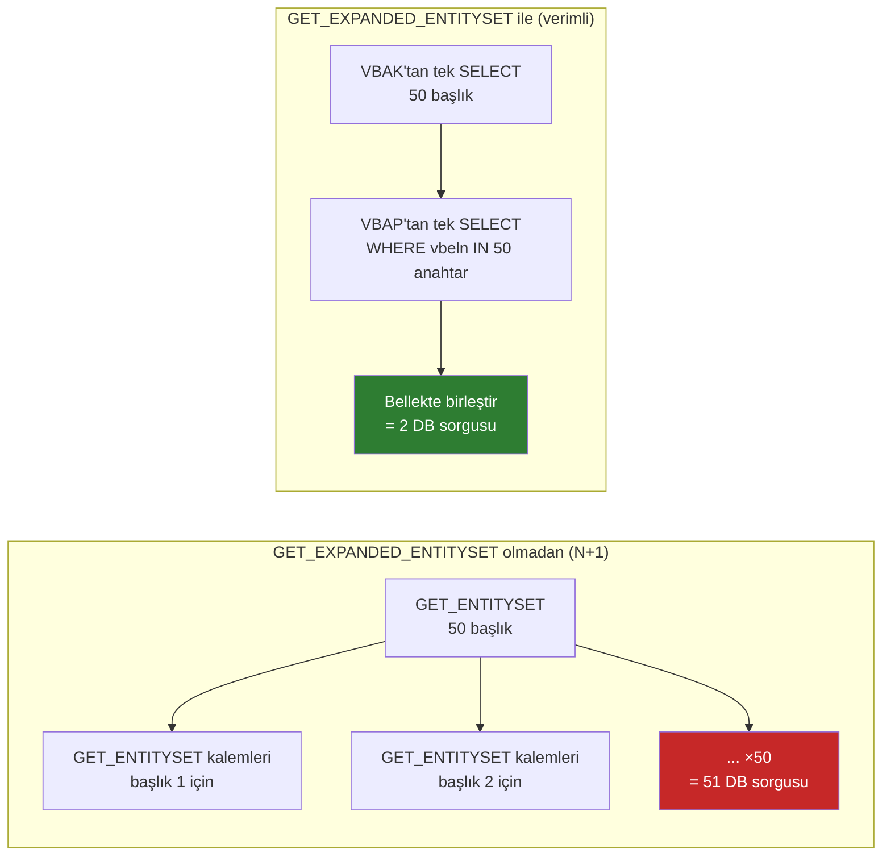

# Kısım 30: GET_EXPANDED_ENTITYSET

*$expand neden var, performans için neden bu metodu kendiniz implement etmeniz gerekiyor ve bunu doğru nasıl yaparsınız.*

---

## 30.1 $expand sorunu ve bu metodu neden yeniden tanımlıyorsunuz ☕

Bir Fiori List-Detail ekranı oluşturdunuz. Ana liste tüm satış siparişi başlıklarını gösteriyor. Kullanıcı bir başlığa tıklıyor — detay görünümü başlığı *ve* kalemlerini birlikte yüklüyor. Fiori uygulaması GET isteğine `?$expand=ToItems` ekliyor.

Sizin tarafınızda herhangi bir çalışma olmadan, gateway framework `$expand`'ı otomatik olarak *yönetebilir*; başlık için `GET_ENTITY`'yi çağırır, ardından her başlık için kalemler adına bir kez `GET_ENTITYSET`'i çağırır. Tek bir başlık için bu iyidir. Kalemleriyle birlikte expand edilmiş 50 başlık listesi için bu şu demektir:

- 50 satır için başlıklara `GET_ENTITYSET`'e 1 çağrı
- Her başlık için kalemlere 50 ayrı `GET_ENTITYSET` çağrısı

İşte bu **N+1 sorunu**. Lazy loading etkinken Entity Framework kullandıysanız, performansın tam olarak aynı şekilde nasıl mahvolduğunu görmüşsünüzdür.

### EF lazy loading ile paralellik

```csharp
// C# — EF Core ile lazy loading (N+1 tuzağı)
var headers = await db.SalesOrderHeaders.ToListAsync();       // 1 sorgu
foreach (var h in headers)
{
    // h.Items'a her erişim AYRI bir veritabanı round-trip'i tetikler!
    foreach (var item in h.Items)                              // N sorgu
        Console.WriteLine(item.Material);
}

// Düzeltme — Include() ile eager loading
var headers = await db.SalesOrderHeaders
    .Include(h => h.Items)          // Tek JOIN sorgusu — 1 round-trip
    .ToListAsync();
```

`GET_EXPANDED_ENTITYSET`, SAP'ın `.Include(h => h.Items)` karşılığıdır. Başlıkları VE kalemleri birlikte getiren tek verimli bir sorgu yazarsınız, ardından sonucu bellekte birleştirirsiniz. Framework, N+1 varsayılan davranışı yerine bu metodu çağırır.

> 💡 İki benzer metod vardır:
> - `GET_EXPANDED_ENTITYSET` — `GET /SalesOrderHeaderSet?$expand=ToItems` için çağrılır (liste)
> - `GET_EXPANDED_ENTITY` — `GET /SalesOrderHeaderSet('1001')?$expand=ToItems` için çağrılır (tek varlık)
>
> Her ikisini de implement edin. Bu kısım entityset sürümünü kapsar; entity sürümü aynı deseni izler ancak tek bir başlık okur.

---

## 30.2 Bunu zaten biliyorsun

### C# — EF Core'da eager loading

```csharp
// C# — verimli, tek sorgulu yaklaşım
[HttpGet]
public async Task<List<SalesOrderHeaderDto>> GetAllWithItems()
{
    return await db.SalesOrderHeaders
        .Include(h => h.Items)
        .Select(h => new SalesOrderHeaderDto
        {
            OrderId   = h.OrderId,
            Customer  = h.Customer,
            NetAmount = h.NetAmount,
            Items     = h.Items.Select(i => new SalesOrderItemDto
            {
                ItemNo   = i.ItemNo,
                Material = i.Material,
                Quantity = i.Quantity
            }).ToList()
        })
        .ToListAsync();
}
```

Veritabanına bir round-trip. Bir sonuç kümesi. Tüm alt elemanlar gömülü.

### Python — SQLAlchemy joinedload ile

```python
from sqlalchemy.orm import joinedload

# Python — verimli eager load
headers = (
    db.query(SalesOrderHeader)
    .options(joinedload(SalesOrderHeader.items))
    .all()
)

result = [
    {
        "order_id": h.order_id,
        "customer": h.customer,
        "items": [
            {"item_no": i.item_no, "material": i.material, "quantity": i.quantity}
            for i in h.items
        ]
    }
    for h in headers
]
```

ABAP'ta aynı yaklaşım geliyor — başlıklar için bir SELECT, tüm kalemleri için bir SELECT, bellekte birleştirme.

---

## 30.3 Expanded yanıtı oluşturma — teknik parçalar 🛠️

### GET_EXPANDED_ENTITYSET'teki temel import parametreleri

Framework yeniden tanımladığınız metodu çağırdığında, kullanacağınız parametreler şunlardır:

| Parametre | Ne olduğu |
|---|---|
| `io_expand` | $expand'da hangi nav property'lerin istendiğini açıklayan nesne |
| `et_expanded_clause` | Çıktı tablosu — hangi expand düğümlerini döndürdüğünüzü belirtirsiniz |
| `et_expanded_tech_clause` | Teknik çıktı — dahili nav property tanımlayıcılarıyla eşlenir |
| `io_tech_request_context` | Tam istek bağlamı (filtreler, sayfalama, vb.) |
| `et_entityset` | Ana çıktınuz — expand edilmiş varlıklar koleksiyonu |

"Expanded entity" aslında bir deep yapıdır (Kısım 29 ile aynı kavram, yalnızca okuma için). SEGW, `ts_salesorderheader_deep`'i oluşturur — gömülü tablo olarak `to_items` içeren başlık türü.

### Expand tanımlayıcısı: et_expanded_clause

Framework'e "ToItems expansion'ını ben yönettim" demeniz gerekir. `et_expanded_clause`'u doldurmazsanız, framework kendi varsayılan expansion mantığını sizinkinin üstüne çalıştırmayı deneyebilir — en iyi ihtimalle çift çalışma, en kötü ihtimalle yanlış veri.

```abap
" Framework'e: 'ToItems' expand'ını ben yönettim
DATA(ls_expand) = VALUE /iwbep/s_mgw_tech_request(
  nav_prop_name = 'ToItems'
).
APPEND ls_expand TO et_expanded_clause.
```

---

## 30.4 GET_EXPANDED_ENTITYSET'in tam implementasyonu 🔁

```abap
CLASS zsalesorder_srv_dpc_ext DEFINITION
  INHERITING FROM zsalesorder_srv_dpc
  FINAL
  CREATE PUBLIC.

PUBLIC SECTION.
  METHODS salesorderheaderset_get_expanded_entityset REDEFINITION.

ENDCLASS.

CLASS zsalesorder_srv_dpc_ext IMPLEMENTATION.

  "=========================================================================
  " GET_EXPANDED_ENTITYSET
  " Çağıran: GET /SalesOrderHeaderSet?$expand=ToItems
  " Hedef: N+1 çağrı yerine tek verimli DB round-trip
  "=========================================================================
  METHOD salesorderheaderset_get_expanded_entityset.
    " Kullandığımız imza parametreleri:
    "   io_expand               — hangi nav property'lerin expand edileceğini tanımlar
    "   io_tech_request_context — filtre/sayfalama/sıralama bilgisini verir
    "   et_entityset            — TYPE TABLE OF ts_salesorderheader_deep
    "   et_expanded_clause      — expansion'ı üstlendiğimizi bildirmek için doldurmamız gerekir
    "   et_expanded_tech_clause — et_expanded_clause'un teknik karşılığı

    " --- 0. $expand=ToItems istendi mi belirle ----------------------------
    DATA(lv_expand_items) = abap_false.
    DATA(lt_expand_nodes) = io_expand->get_expand_list( ).

    LOOP AT lt_expand_nodes INTO DATA(ls_expand_node).
      IF ls_expand_node-nav_prop_name = 'ToItems'.
        lv_expand_items = abap_true.
      ENDIF.
    ENDLOOP.

    " --- 1. Filtreler + sayfalama oku -------------------------------------
    DATA lv_filter_order_id TYPE vbeln_va.
    DATA lv_top             TYPE i.
    DATA lv_skip            TYPE i.

    DATA(lt_filters) = io_tech_request_context->get_filter(
                         )->get_filter_select_options( ).

    LOOP AT lt_filters INTO DATA(ls_filter) WHERE property = 'OrderId'.
      LOOP AT ls_filter-select_options INTO DATA(ls_opt).
        IF ls_opt-option = 'EQ'.
          lv_filter_order_id = ls_opt-low.
        ENDIF.
      ENDLOOP.
    ENDLOOP.

    DATA(ls_paging) = io_tech_request_context->get_top_skip_inline_count( ).
    lv_top  = ls_paging-top.
    lv_skip = ls_paging-skip.
    IF lv_top = 0.
      lv_top = 200.  " Güvenlik sınırı
    ENDIF.

    " --- 2. Eşleşen tüm başlıkları tek sorguda getir ---------------------
    DATA lt_vbak TYPE TABLE OF vbak.

    IF lv_filter_order_id IS NOT INITIAL.
      SELECT *
        FROM vbak
        INTO TABLE @lt_vbak
        WHERE vbeln = @lv_filter_order_id.
    ELSE.
      SELECT *
        FROM vbak
        INTO TABLE @lt_vbak
        ORDER BY vbeln
        UP TO @lv_top ROWS
        OFFSET @lv_skip.
    ENDIF.

    IF lt_vbak IS INITIAL.
      RETURN.  " Döndürülecek bir şey yok — et_entityset boş kalır
    ENDIF.

    " --- 3. Kalemleri TEK sorguda almak için tüm sipariş ID'lerini topla -
    DATA lt_order_ids TYPE RANGE OF vbeln_va.
    LOOP AT lt_vbak INTO DATA(ls_h).
      APPEND VALUE #( sign = 'I' option = 'EQ' low = ls_h-vbeln )
             TO lt_order_ids.
    ENDLOOP.

    " --- 4. O başlıklara ait TÜM kalemleri getir — tek SELECT ------------
    DATA lt_vbap TYPE TABLE OF vbap.

    IF lv_expand_items = abap_true.
      SELECT *
        FROM vbap
        INTO TABLE @lt_vbap
        WHERE vbeln IN @lt_order_ids.

      " Binary search için kalemleri sırala
      SORT lt_vbap BY vbeln posnr.
    ENDIF.

    " --- 5. Deep entity'leri bellekte birleştir ---------------------------
    DATA ls_deep TYPE zcl_zsalesorder_srv_mpc=>ts_salesorderheader_deep.

    LOOP AT lt_vbak INTO ls_h.
      CLEAR ls_deep.

      " Başlık alanlarını eşle
      ls_deep-order_id   = ls_h-vbeln.
      ls_deep-customer   = ls_h-kunnr.
      ls_deep-order_date = ls_h-audat.
      ls_deep-net_amount = ls_h-netwr.
      ls_deep-currency   = ls_h-waerk.
      ls_deep-status     = ls_h-gbstk.

      " Kalemleri ekle (binary search — ek DB çağrısı yok)
      IF lv_expand_items = abap_true.
        LOOP AT lt_vbap INTO DATA(ls_i) WHERE vbeln = ls_h-vbeln.
          APPEND VALUE zcl_zsalesorder_srv_mpc=>ts_salesorderitem(
            order_id  = ls_i-vbeln
            item_no   = ls_i-posnr
            material  = ls_i-matnr
            quantity  = ls_i-kwmeng
            uom       = ls_i-vrkme
            net_value = ls_i-netwr
          ) TO ls_deep-to_items.
        ENDLOOP.
      ENDIF.

      APPEND ls_deep TO et_entityset.
    ENDLOOP.

    " --- 6. Framework'e ToItems expansion'ını yönettiğimizi söyle --------
    "     Bu olmadan framework kendi başına yeniden expand etmeye çalışabilir.
    IF lv_expand_items = abap_true.
      APPEND VALUE #( nav_prop_name = 'ToItems' ) TO et_expanded_clause.
      APPEND VALUE #( nav_prop_name = 'ToItems' ) TO et_expanded_tech_clause.
    ENDIF.

  ENDMETHOD.

ENDCLASS.
```

> ⚠️ **C#/Python tuzağı:** Adım 3 — tüm sipariş ID'lerini bir range tablosuna (`lt_order_ids`) toplamak ve SELECT'te `IN @lt_order_ids` kullanmak — SQL'deki `WHERE vbeln IN (SELECT vbeln FROM @lt_vbak)` ya da EF'in `Where(i => orderIds.Contains(i.OrderId))`'ının ABAP karşılığıdır. Bu, N ayrı sorguyu tek bir toplu sorguyla değiştiren temel numaradır. Bunu atlayıp başlık döngüsü içinde loop-SELECT yaparsanız, N+1 sorununa geri dönersiniz.

> ⚠️ **C#/Python tuzağı:** Adım 5, `LOOP AT lt_vbap INTO DATA(ls_i) WHERE vbeln = ls_h-vbeln` kullanır — `lt_vbap` zaten sıralı olduğu için burada temiz çalışır. Büyük tablolarda üretim kodu için hash/sorted key ekleyin ve O(n²) karmaşıklığından kaçınmak için `READ TABLE` veya binary search kullanın.

---

## 30.5 Test ve performans notları 🎯

### Test URL'si

```http
GET /sap/opu/odata/sap/ZSALESORDER_SRV/SalesOrderHeaderSet?$expand=ToItems&$format=json
```

### Beklenen yanıt şekli

```json
{
  "d": {
    "results": [
      {
        "__metadata": { "type": "ZSALESORDER_SRV.SalesOrderHeader" },
        "OrderId":    "0000001001",
        "Customer":   "0000001000",
        "OrderDate":  "/Date(1716508800000)/",
        "NetAmount":  "2429.99",
        "Currency":   "USD",
        "Status":     "A",
        "ToItems": {
          "results": [
            { "OrderId": "0000001001", "ItemNo": "000010", "Material": "LAPTOP-X1", "Quantity": "2.000", "NetValue": "2400.00" },
            { "OrderId": "0000001001", "ItemNo": "000020", "Material": "MOUSE-USB", "Quantity": "1.000", "NetValue": "29.99" }
          ]
        }
      },
      {
        "__metadata": { "type": "ZSALESORDER_SRV.SalesOrderHeader" },
        "OrderId":    "0000001002",
        "Customer":   "0000002000",
        "OrderDate":  "/Date(1716595200000)/",
        "NetAmount":  "500.00",
        "Currency":   "EUR",
        "Status":     "B",
        "ToItems": {
          "results": [
            { "OrderId": "0000001002", "ItemNo": "000010", "Material": "KEYBOARD", "Quantity": "3.000", "NetValue": "500.00" }
          ]
        }
      }
    ]
  }
}
```

Her başlık kalemlerini satır içinde gömülü olarak içerir — `"ToItems": { "results": [...] }`.

### Tek varlık durumu için GET_EXPANDED_ENTITY de implement edin

```http
GET /sap/opu/odata/sap/ZSALESORDER_SRV/SalesOrderHeaderSet('0000001001')?$expand=ToItems
```

```abap
METHOD salesorderheaderset_get_expanded_entity.
  " Aynı yapı — bir başlık oku, kalemlerini oku, birleştir, döndür

  DATA(ls_keys) = io_tech_request_context->get_keys( ).
  READ TABLE ls_keys INTO DATA(ls_k) WITH KEY name = 'OrderId'.
  DATA(lv_order_id) = ls_k-value.

  SELECT SINGLE * FROM vbak INTO @DATA(ls_vbak) WHERE vbeln = @lv_order_id.

  IF sy-subrc <> 0.
    RAISE EXCEPTION TYPE /iwbep/cx_mgw_busi_exception
      EXPORTING textid = /iwbep/cx_mgw_busi_exception=>entity_not_found.
  ENDIF.

  DATA lt_vbap TYPE TABLE OF vbap.
  SELECT * FROM vbap INTO TABLE @lt_vbap WHERE vbeln = @lv_order_id.

  er_entity-order_id   = ls_vbak-vbeln.
  er_entity-customer   = ls_vbak-kunnr.
  er_entity-order_date = ls_vbak-audat.
  er_entity-net_amount = ls_vbak-netwr.
  er_entity-currency   = ls_vbak-waerk.
  er_entity-status     = ls_vbak-gbstk.

  LOOP AT lt_vbap INTO DATA(ls_i).
    APPEND VALUE zcl_zsalesorder_srv_mpc=>ts_salesorderitem(
      order_id  = ls_i-vbeln  item_no   = ls_i-posnr
      material  = ls_i-matnr  quantity  = ls_i-kwmeng
      uom       = ls_i-vrkme  net_value = ls_i-netwr
    ) TO er_entity-to_items.
  ENDLOOP.

  APPEND VALUE #( nav_prop_name = 'ToItems' ) TO et_expanded_clause.
  APPEND VALUE #( nav_prop_name = 'ToItems' ) TO et_expanded_tech_clause.

ENDMETHOD.
```

### Performans karşılaştırması



> 🧭 **İş hayatında:** Bu optimizasyon olmadan `$expand` kullanan bir Fiori uygulaması, ciddi bir veri hacminde zaman aşımına uğrar. `$expand` performans ayarı, kıdemli danışmanların kod incelemesinde kontrol ettiği ilk şeylerden biridir. "GET_EXPANDED_ENTITYSET'i implement ettiniz mi?" sorusu OData rollerindeki mülakatların yaygın sorusudur.

---

## 🧠 Özet

- `$expand=ToItems`, OData servisine tek bir yanıtta kalemler koleksiyonunu her başlığın içine gömmesini söyler.
- Override olmadan framework, her başlık için N+1 ayrı çağrıya geri döner — bu lazy loading performans tuzağıdır.
- `GET_EXPANDED_ENTITYSET` sizin override noktanızdır. Önce başlıkları getirin, tüm anahtarlarını toplayın, tüm kalemleri tek sorguda getirin, bellekte birleştirin.
- Framework'e expansion'ı yönettiğinizi bildirmek için her zaman `et_expanded_clause` ve `et_expanded_tech_clause`'u doldurun — aksi halde çift expand yapabilir.
- Tek varlık `?$expand=` durumu için `GET_EXPANDED_ENTITY` (tekil) da implement edin.
- Desen EF Core'un `.Include()`'una veya SQLAlchemy'nin `joinedload()`'una özdeştir — bir sorgu, kodda birleştirilmiş.

*[← İçindekiler](../content.md) | [← Önceki: CREATE_DEEP_ENTITY](29-odata-create-deep-entity.md) | [Sonraki: OData'da Dosya Yükleme & İndirme →](31-odata-file-upload-download.md)*
