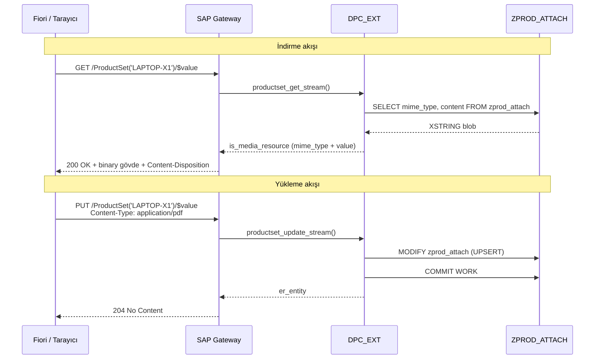

# Kısım 31: OData'da Dosya Yükleme & İndirme

*Bir OData entity'sini dosya endpoint'ine nasıl dönüştürürsünüz — GET_STREAM ve CREATE_STREAM ile PDF, resim ve ek dosya sunumu.*

---

## 31.1 OData'da binary içerik — media entity'ler ☕

Sıradan bir REST API'de ayrı bir dosya endpoint'iniz olurdu:

```
GET  /api/products/LAPTOP-X1/datasheet    → PDF baytlarını döndürür
POST /api/products/LAPTOP-X1/datasheet    → PDF yüklemesini kabul eder
```

ASP.NET Core'da `FileStreamResult`, FastAPI'de `StreamingResponse` döndürürsünüz. HTTP yanıt gövdesi ham dosya baytlarıdır; `Content-Type` başlığı istemciye ne aldığını söyler.

OData v2'nin birinci sınıf eşdeğer kavramı vardır: **media entity** (medya bağlantı girişi veya MLE olarak da adlandırılır). Bir entity type'ı media entity olarak işaretlediğinizde:

- `GET /ProductSet('LAPTOP-X1')/$value` binary içeriği akıtır
- `PUT /ProductSet('LAPTOP-X1')/$value` yeni binary içerik yükler

Entity'nin normal property'leri (ad, açıklama vb.) düz entity URL'sinden erişilebilir olmaya devam eder. Binary stream, `/$value` son ekinde yaşar.

### Üç adımlı zihinsel model

| Benzetme | Ne olduğu |
|---|---|
| Her klasörün dışında metadata etiketleri olan bir dolap... | ...ve içinde gerçek belge |
| `GET /products/x/datasheet` → FileStreamResult | `GET /ProductSet('x')/$value` → stream |
| Upload endpoint'inde `[FromForm] IFormFile file` | OData `CREATE_STREAM` / `UPDATE_STREAM` |

---

## 31.2 Bunu zaten biliyorsun

### C# — ASP.NET Core'da dosya indirme

```csharp
// C# — ürün teknik dokümanı indirme
[HttpGet("{productId}/datasheet")]
public async Task<IActionResult> DownloadDatasheet(string productId)
{
    var attachment = await _attachRepo.GetDatasheet(productId);
    if (attachment == null)
        return NotFound();

    return File(
        fileContents: attachment.Content,
        contentType:  attachment.MimeType,   // örn. "application/pdf"
        fileDownloadName: $"{productId}_datasheet.pdf"
    );
}

// C# — ürün teknik dokümanı yükleme
[HttpPost("{productId}/datasheet")]
public async Task<IActionResult> UploadDatasheet(
    string productId,
    [FromForm] IFormFile file)
{
    using var ms = new MemoryStream();
    await file.CopyToAsync(ms);
    await _attachRepo.SaveDatasheet(productId, ms.ToArray(), file.ContentType);
    return Ok();
}
```

### Python — FastAPI dosya endpoint'leri

```python
from fastapi import UploadFile
from fastapi.responses import Response

@app.get("/products/{product_id}/datasheet")
async def download_datasheet(product_id: str):
    attachment = await db.get_datasheet(product_id)
    if not attachment:
        raise HTTPException(404)
    return Response(
        content      = attachment.content,
        media_type   = attachment.mime_type,
        headers      = {"Content-Disposition": f"attachment; filename={product_id}.pdf"}
    )

@app.post("/products/{product_id}/datasheet")
async def upload_datasheet(product_id: str, file: UploadFile):
    content = await file.read()
    await db.save_datasheet(product_id, content, file.content_type)
    return {"status": "saved"}
```

Şimdi aynı şeyi SEGW + DPC_EXT ile yapalım.

---

## 31.3 SEGW'de entity'yi media entity olarak işaretleme 🛠️

### Adım 1 — Entity type'ı işaretle

SEGW'de **Product** entity type'ını açın. **Properties** sekmesinde **"IsMediaLinkEntry"** (bazen "Has Stream" olarak etiketlenir) seçeneğini işaretleyin.

Bu otomatik olarak birkaç şey yapar:
- `$metadata`'daki `<EntityType>`'a `m:HasStream="true"` ekler
- Gateway çalışma zamanına `/$value` isteklerini `GET_STREAM`'e ve `CREATE_STREAM` / `UPDATE_STREAM`'e yönlendirmesini söyler

```xml
<!-- Media entity olarak işaretlendikten sonra $metadata -->
<EntityType Name="Product" m:HasStream="true">
  <Key><PropertyRef Name="ProductId" /></Key>
  <Property Name="ProductId"    Type="Edm.String" Nullable="false" />
  <Property Name="ProductName"  Type="Edm.String" />
  <Property Name="Description"  Type="Edm.String" />
  <Property Name="MimeType"     Type="Edm.String" />
  <Property Name="FileName"     Type="Edm.String" />
</EntityType>
```

### Adım 2 — Binary'yi saklamak için Z tablosu ekle

Demo amacıyla SE11'de basit bir Z tablosu `ZPROD_ATTACH` tanımlayın:

| Alan | Tür | Açıklama |
|---|---|---|
| `PRODUCT_ID` | `CHAR 18` | Anahtar — Ürün ID |
| `MIME_TYPE`  | `CHAR 100` | MIME türü (örn. application/pdf) |
| `FILE_NAME`  | `CHAR 255` | Orijinal dosya adı |
| `CONTENT`    | `RAWSTRING` | Binary içerik (LOB) |
| `CHANGED_AT` | `TIMESTAMP` | Son değiştirme zamanı |
| `CHANGED_BY` | `UNAME` | Son değiştiren |

> 💡 Üretim SAP sisteminde genellikle `SRGBTBREL` / `SOFFLOIO`'da saklanan **GOS (Generic Object Services)** eklerini `GOS_API_*` fonksiyon modülü aracılığıyla kullanırsınız. Z tablosu yaklaşımı öğretimi açık tutar. Her iki desen de `GET_STREAM` ile çalışır.

### Adım 3 — SEGW'de Generate

Generate'e basın. DPC uzantı sınıfı artık yeniden tanımlama için `GET_STREAM`, `CREATE_STREAM` ve `UPDATE_STREAM` stub metodlarına sahip olacaktır.

---

## 31.4 GET_STREAM implement etme (indirme) 🔁

```abap
CLASS zsalesorder_srv_dpc_ext DEFINITION
  INHERITING FROM zsalesorder_srv_dpc
  FINAL
  CREATE PUBLIC.

PUBLIC SECTION.
  METHODS productset_get_stream    REDEFINITION.
  METHODS productset_create_stream REDEFINITION.
  METHODS productset_update_stream REDEFINITION.

ENDCLASS.

CLASS zsalesorder_srv_dpc_ext IMPLEMENTATION.

  "=========================================================================
  " GET_STREAM — indirme
  " Çağıran: GET /ProductSet('LAPTOP-X1')/$value
  "=========================================================================
  METHOD productset_get_stream.
    " Anahtar parametreler:
    "   iv_entity_name   — 'Product'
    "   it_key_tab       — (ad, değer) çiftleri tablosu: ProductId='LAPTOP-X1'
    "   is_media_resource — doldurmamız gereken çıktı yapısı:
    "       value         — XSTRING (binary baytlar)
    "       mime_type     — string
    "       inline_count  — burada kullanılmıyor

    " --- 1. Anahtardan ürün ID'sini oku -------------------------------------
    DATA lv_product_id TYPE matnr.
    READ TABLE it_key_tab INTO DATA(ls_key) WITH KEY name = 'ProductId'.
    lv_product_id = ls_key-value.

    " --- 2. Z tablosundan binary'yi oku ------------------------------------
    SELECT SINGLE mime_type, file_name, content
      FROM zprod_attach
      INTO @DATA(ls_attach)
      WHERE product_id = @lv_product_id.

    IF sy-subrc <> 0.
      RAISE EXCEPTION TYPE /iwbep/cx_mgw_busi_exception
        EXPORTING textid = /iwbep/cx_mgw_busi_exception=>entity_not_found.
    ENDIF.

    " --- 3. Medya kaynağı çıktı yapısını doldur ----------------------------
    "     is_media_resource, /iwbep/s_mgw_media_resource türündedir
    is_media_resource-mime_type = ls_attach-mime_type.
    is_media_resource-value     = ls_attach-content.

    " --- 4. Tarayıcıların "Farklı Kaydet..." yapması için Content-Disposition ayarla
    "     Başlık, istek bağlamının yanıt işleyicisi aracılığıyla iletilir.
    DATA(lv_disposition) =
      |attachment; filename="{ ls_attach-file_name }"|.

    io_tech_request_context->get_response(
      )->set_header_field(
          iv_name  = 'Content-Disposition'
          iv_value = lv_disposition ).

  ENDMETHOD.

  "=========================================================================
  " CREATE_STREAM — yükleme (ilk kez, entity anahtarı zaten biliniyor)
  " Çağıran: POST /ProductSet  (binary gövdeli Content-Type ile)
  "   VEYA:  PUT  /ProductSet('LAPTOP-X1')/$value  (yeni içerikle)
  "
  " Not: CREATE_STREAM, stream entity ile birlikte oluşturulduğunda çağrılır.
  "      UPDATE_STREAM sonraki yüklemeler içindir.
  "      Pratikte pek çok geliştirici her ikisini de özdeş implement eder.
  "=========================================================================
  METHOD productset_create_stream.
    " Anahtar parametreler:
    "   is_media_resource — girdi: mime_type + value (baytlar)
    "   it_key_tab        — entity anahtarları
    "   er_entity         — çıktı: döndürülecek entity kaydı
    "   is_entity_data    — isteğe bağlı: stream ile birlikte POST edilen entity property'leri

    " --- 1. İstekten entity anahtarını + meta veriyi oku ------------------
    DATA lv_product_id TYPE matnr.
    READ TABLE it_key_tab INTO DATA(ls_key) WITH KEY name = 'ProductId'.
    lv_product_id = ls_key-value.

    IF lv_product_id IS INITIAL.
      RAISE EXCEPTION TYPE /iwbep/cx_mgw_busi_exception
        EXPORTING
          textid  = /iwbep/cx_mgw_busi_exception=>business_error
          message = 'ProductId gereklidir'.
    ENDIF.

    " --- 2. Gelen stream'i doğrula ----------------------------------------
    IF is_media_resource-value IS INITIAL.
      RAISE EXCEPTION TYPE /iwbep/cx_mgw_busi_exception
        EXPORTING
          textid  = /iwbep/cx_mgw_busi_exception=>business_error
          message = 'Binary içerik alınamadı'.
    ENDIF.

    " --- 3. Slug başlığından veya varsayılandan dosya adını türet ----------
    DATA lv_mime_type TYPE string.
    DATA lv_file_name TYPE string.

    lv_mime_type = is_media_resource-mime_type.

    " Content-Disposition veya Slug başlığından dosya adını almayı dene
    io_tech_request_context->get_request(
      )->get_header_field(
          EXPORTING iv_name  = 'Slug'
          IMPORTING ev_value = lv_file_name ).

    IF lv_file_name IS INITIAL.
      " Ürün + MIME türüne göre oluşturulmuş ada geri dön
      DATA(lv_extension) = COND string(
        WHEN lv_mime_type = 'application/pdf' THEN 'pdf'
        WHEN lv_mime_type CS 'image/png'      THEN 'png'
        WHEN lv_mime_type CS 'image/jpeg'     THEN 'jpg'
        ELSE 'bin'
      ).
      lv_file_name = |{ lv_product_id }_datasheet.{ lv_extension }|.
    ENDIF.

    " --- 4. Z tablosuna yaz (UPSERT — hem oluşturma hem güncellemeyi karşılar) -
    DATA ls_attach TYPE zprod_attach.
    ls_attach-product_id = lv_product_id.
    ls_attach-mime_type  = lv_mime_type.
    ls_attach-file_name  = lv_file_name.
    ls_attach-content    = is_media_resource-value.
    ls_attach-changed_at = cl_abap_tstmp=>utclong2tstmp(
                             cl_abap_utclong=>get_utc_current( ) ).
    ls_attach-changed_by = sy-uname.

    MODIFY zprod_attach FROM ls_attach.

    IF sy-subrc <> 0.
      RAISE EXCEPTION TYPE /iwbep/cx_mgw_busi_exception
        EXPORTING
          textid  = /iwbep/cx_mgw_busi_exception=>business_error
          message = 'Ek kaydedilemedi'.
    ENDIF.

    COMMIT WORK AND WAIT.

    " --- 5. Entity metadata'sını döndür (binary değil — o $value'da) ------
    er_entity-product_id  = lv_product_id.
    er_entity-mime_type   = lv_mime_type.
    er_entity-file_name   = lv_file_name.

  ENDMETHOD.

  "=========================================================================
  " UPDATE_STREAM — mevcut bir eki değiştir
  " Çağıran: PUT /ProductSet('LAPTOP-X1')/$value
  "=========================================================================
  METHOD productset_update_stream.
    " İmzası CREATE_STREAM ile özdeştir.
    " Basitçe delege edebiliriz — aynı MODIFY mantığı hem insert hem update'i karşılar.
    productset_create_stream(
      EXPORTING
        is_media_resource       = is_media_resource
        it_key_tab              = it_key_tab
        is_entity_data          = is_entity_data
        io_tech_request_context = io_tech_request_context
      IMPORTING
        er_entity = er_entity ).

  ENDMETHOD.

ENDCLASS.
```

> ⚠️ **C#/Python tuzağı:** ASP.NET Core'da dosyayı döndürmeden önce controller'da yanıt başlıklarını ayarlarsınız. ABAP'ta bunları `io_tech_request_context->get_response( )->set_header_field(...)` aracılığıyla ayarlarsınız. Mekanizma aynıdır — HTTP yanıt nesnesini değiştiriyorsunuz — ancak ona ulaşma yolu SAP gateway istek bağlamı hiyerarşisinden geçmektedir.

> ⚠️ **C#/Python tuzağı:** `is_media_resource-value`, ABAP'ta onaltılık kodlu binary string olan `XSTRING` türündedir. Konsola yazdırmayı denemeyin; anlamsız görünür. `STRING`'e dönüştürmeyin — binary veriyi bozarsınız. Opak bir blob olarak ele alın, doğrudan DB sütununa/sütunundan aktarın.

---

## 31.5 Content-Type, Content-Disposition ve tam HTTP akışı 🎯

### İndirme isteği ve yanıt başlıkları

```http
GET /sap/opu/odata/sap/ZSALESORDER_SRV/ProductSet('LAPTOP-X1')/$value
Accept: application/pdf
Authorization: Basic <base64>
```

Yanıt:
```http
HTTP/1.1 200 OK
Content-Type: application/pdf
Content-Disposition: attachment; filename="LAPTOP-X1_datasheet.pdf"
Content-Length: 204832

%PDF-1.7...
(binary içerik)
```

### Yükleme isteği

```http
PUT /sap/opu/odata/sap/ZSALESORDER_SRV/ProductSet('LAPTOP-X1')/$value
Content-Type: application/pdf
X-CSRF-Token: <token>
Slug: LAPTOP-X1_datasheet.pdf

%PDF-1.7...
(binary içerik)
```

Yanıt:
```http
HTTP/1.1 204 No Content
```

> 💡 `Slug` başlığı, media entity'ye yükleme yaparken önerilen dosya adını geçmek için bir OData kuralıdır. Zorunlu değildir — yoksa yukarıdaki `CREATE_STREAM`'de gösterildiği gibi kodunuz oluşturulmuş bir ada geri dönmelidir.

### İlk yükleme: entity + stream'i birlikte oluşturmak için POST

```http
POST /sap/opu/odata/sap/ZSALESORDER_SRV/ProductSet
Content-Type: application/pdf
X-CSRF-Token: <token>
Slug: LAPTOP-X1_datasheet.pdf

<binary içerik>
```

POST gövdesi binary olduğundan (JSON değil) gateway, `CREATE_STREAM`'i çağırır. Ürün meta verilerini (ad, açıklama) aynı anda ayarlamak için `multipart/related` formatında POST yaparsınız — ancak pratikte çoğu SAP projesi önce entity'yi oluşturur (standart JSON POST ile), ardından stream'i ayrı bir PUT ile gönderir.

### /IWFND/GW_CLIENT'ta test

1. `/IWFND/GW_CLIENT`'ı açın.
2. Method = `GET`, URI = `/sap/opu/odata/sap/ZSALESORDER_SRV/ProductSet('LAPTOP-X1')/$value`.
3. Execute — yanıt gövdesi ham binary olacaktır. HTTP yanıt koduna ve `Content-Type` başlığına bakın.
4. Yükleme için: metodu `PUT` olarak değiştirin, aynı URI'yi yapıştırın, istek başlıklarına `Content-Type: application/pdf` ekleyin, küçük bir test binary payload'ı ekleyin.

> 🧭 **İş hayatında:** Media entity stream'leri en yaygın şu durumlarda kullanılır:
> - Ürün teknik dokümanları (PDF)
> - Müşteri tarafından yüklenen fotoğraflar / kimlik belgeleri
> - Rapor çıktıları (ABAP'tan oluşturulan PDF)
> - OData stream'leri aracılığıyla açılan GOS (Generic Object Services) ekleri
>
> GOS deseni özellikle yaygındır — pek çok SAP iş nesnesi (PM emirleri, satın alma siparişleri, satıcı master) zaten GOS ek altyapısına sahiptir. Bunu OData stream'lerine sarmak tekrarlayan bir danışmanlık görevidir.

### Tam etkileşim diyagramı



---

## 🧠 Özet

- **Media entity**, `m:HasStream="true"` olan bir OData entity type'ıdır. İstemciler binary'ye `/<EntitySet>('<anahtar>')/$value` adresinden erişir.
- SEGW'de entity type'ı işaretleyin → **IsMediaLinkEntry**'yi işaretleyin → Generate.
- `GET_STREAM`, `is_media_resource-value`'yu (XSTRING) ve `is_media_resource-mime_type`'ı doldurur. Dosya kaydetme davranışı için `Content-Disposition`'ı yanıt nesnesi aracılığıyla ayarlayın.
- `CREATE_STREAM` ve `UPDATE_STREAM`, binary'yi `is_media_resource-value`'da alır. Upsert deseni için depolama tablonuzda `MODIFY` kullanın.
- `Slug` istek başlığı yükleme sırasında önerilen dosya adını taşır.
- `XSTRING`'i asla `STRING`'e dönüştürmeyin — binary veriyi bozarsınız.
- Üretimde depolama backend'i olarak GOS eklerini (`GOS_API_*` fonksiyon modülleri aracılığıyla) kullanmayı düşünün — tüm SAPGUI işlemlerindeki SAP standart ek görüntüleme altyapısıyla entegre olur.

*[← İçindekiler](../content.md) | [← Önceki: GET_EXPANDED_ENTITYSET](30-odata-get-expanded-entityset.md) | [Sonraki: Google Form → SAP Entegrasyonu →](32-google-form-integration.md)*
