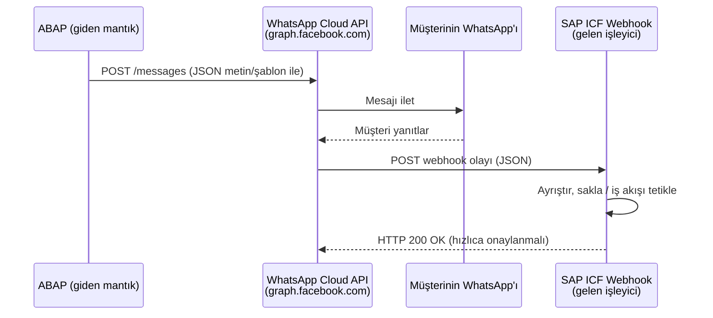

# Kısım 33: ABAP'tan WhatsApp Entegrasyonu

*Sipariş onayları göndermek ve müşteri yanıtlarını almak — tümü ABAP'tan, tümü WhatsApp Cloud API üzerinden.*

---

## ☕ Neden WhatsApp?

WhatsApp'ın 2 milyarı aşkın aktif kullanıcısı var. Brezilya, Hindistan, Almanya, Türkiye ve Orta Doğu gibi pek çok pazarda birincil iş iletişim kanalı bu. Bu bölgelerdeki SAP mağazaları giderek artan bir biçimde kargo bildirimlerini, ödeme hatırlatmalarını ve randevu onaylarını SMS veya e-posta yerine WhatsApp üzerinden göndermek istiyor.

Geliştirici perspektifinden bakıldığında WhatsApp Cloud API (Meta/Facebook'tan) yalnızca bir REST API'sidir. Bir URL'ye JSON POST edersin. Bunun sonucunda bir WhatsApp mesajı oluşması Meta'nın sorunudur. ABAP tarafındaki görevin: JSON'ı oluştur ve URL'yi çağır. Her ikisini de daha önce yaptın. Bu kısım sana yalnızca API'nin tam şeklini ve ABAP tesisatını gösteriyor.

---

## 33.1 Senaryo

Müşteri, SAP üzerinde bir e-ticaret deposu işletiyor. Bir sipariş kargoya çıktığında (SD'de mal çıkışı deftere nakledildiğinde) şunu istiyorlar:

1. **Giden:** SAP, müşteriye bir WhatsApp mesajı gönderiyor — "4500001234 numaralı siparişiniz kargoya çıktı. Takip: DHL 1234567890."
2. **Gelen:** Müşteri "DURUM" yazarak otomatik yanıt alabilir ya da siparişi bir müşteri temsilcisi takibine işaretlemek için "İPTAL" yazabilir.



> 🧭 **İş hayatında:** Aynı model — ABAP'tan giden HTTP POST + gelen ICF webhook — Telegram, Slack, Teams ve neredeyse her modern mesajlaşma API'si için de çalışır. Bunu bir kez öğren, model tekrar eder.

---

## 33.2 WhatsApp Cloud API Temelleri

### İhtiyacın olanlar (hepsi geliştirme için ücretsiz kurulabilir)

1. **Meta Developer hesabı** — [developers.facebook.com](https://developers.facebook.com)
2. "WhatsApp" ürünü eklenmiş bir **Meta Uygulaması**.
3. **Test telefon numarası** — Meta sana ücretsiz bir tane veriyor; işletme doğrulamasına gerek kalmadan en fazla 5 alıcı numarasına mesaj gönderebilirsin.
4. **Kalıcı bir access token** — ya da test için panelden geçici bir token.
5. **Webhook URL'si** — SAP ICF uç noktanız, internet üzerinden erişilebilir (veya dev ortamında SAP Cloud Connector / ngrok aracılığıyla).

### Temel tanımlayıcılar

| Terim | Anlamı | Nasıl görünür |
|---|---|---|
| `phone_number_id` | Meta sistemindeki gönderen WhatsApp numarasının kimliği | `123456789012345` (sayısal) |
| `access_token` | API çağrıları için Bearer token | `EAADxxxxxx...` (uzun dize) |
| `to` | Alıcının telefon numarası | `+491771234567` (uluslararası format) |

### `/messages` uç noktası

```http
POST https://graph.facebook.com/v20.0/{phone_number_id}/messages
Authorization: Bearer {access_token}
Content-Type: application/json
```

En sık kullanacağın iki mesaj türü:

**Serbest biçimli metin** (yalnızca müşteri sana önce mesaj gönderdikten sonraki 24 saat içinde izin verilir):
```json
{
  "messaging_product": "whatsapp",
  "to": "+491771234567",
  "type": "text",
  "text": { "body": "4500001234 numaralı siparişiniz kargoya çıktı!" }
}
```

**Onaylı şablon** (ilk giden mesajı göndermenin tek yolu; Meta onayı gerektirir — 1–2 gün sürer):
```json
{
  "messaging_product": "whatsapp",
  "to": "+491771234567",
  "type": "template",
  "template": {
    "name": "order_shipped",
    "language": { "code": "en_US" },
    "components": [
      {
        "type": "body",
        "parameters": [
          { "type": "text", "text": "4500001234" },
          { "type": "text", "text": "DHL 1234567890" }
        ]
      }
    ]
  }
}
```

> ⚠️ **C#/Python tuzağı:** Test modunda şablon kullanmadan kendi doğrulanmış numarana serbest biçimli metin gönderebilirsin. Üretimde **tüm ilk temaslı giden mesajlar onaylı şablon kullanmak zorundadır.** Bu, canlıya geçen herkesin ilk seferinde takıldığı noktadır.

---

## 33.3 ABAP'tan Gönderme

### 1. Benzetme

ABAP'tan WhatsApp mesajı göndermek, C#'ta `HttpClient` ile veya Python'da `requests` ile herhangi bir REST API'yi çağırmakla tamamen aynıdır. Bir JSON dizisi oluşturursun, başlıkları ayarlarsın, bir URL'ye POST edersin ve HTTP durum kodunu kontrol edersin.

### 2. Bunu zaten biliyorsun

```csharp
// C# — HttpClient yaklaşımı
var client = new HttpClient();
client.DefaultRequestHeaders.Authorization =
    new AuthenticationHeaderValue("Bearer", accessToken);

var body = new {
    messaging_product = "whatsapp",
    to = "+491771234567",
    type = "text",
    text = new { body = $"Siparişiniz {orderId} kargoya çıktı!" }
};

var response = await client.PostAsJsonAsync(
    $"https://graph.facebook.com/v20.0/{phoneNumberId}/messages",
    body);

var responseText = await response.Content.ReadAsStringAsync();
```

```python
# Python — requests
import requests, json

headers = {
    "Authorization": f"Bearer {access_token}",
    "Content-Type": "application/json"
}
payload = {
    "messaging_product": "whatsapp",
    "to": "+491771234567",
    "type": "text",
    "text": {"body": f"Siparişiniz {order_id} kargoya çıktı!"}
}
resp = requests.post(
    f"https://graph.facebook.com/v20.0/{phone_number_id}/messages",
    headers=headers,
    json=payload
)
print(resp.status_code, resp.json())
```

### 3. ABAP'taki karşılığı

ABAP'ın iki HTTP istemci API'si vardır. Modern sistemlerde `IF_WEB_HTTP_CLIENT` kullan (SAP_BASIS 7.54 / ABAP Platform 1909'dan itibaren kullanılabilir) — daha temiz. Eski sistemlerde `CL_HTTP_CLIENT`'a dön.

#### Modern: IF_WEB_HTTP_CLIENT (önerilen, ABAP 1909+)

```abap
CLASS zcl_whatsapp_sender DEFINITION PUBLIC FINAL CREATE PUBLIC.
  PUBLIC SECTION.
    METHODS send_order_shipped
      IMPORTING
        iv_recipient_phone TYPE string
        iv_order_id        TYPE vbeln
        iv_tracking_no     TYPE string
      RETURNING
        VALUE(rv_success)  TYPE abap_bool.

  PRIVATE SECTION.
    CONSTANTS:
      gc_base_url   TYPE string VALUE 'https://graph.facebook.com',
      gc_api_ver    TYPE string VALUE 'v20.0',
      gc_phone_id   TYPE string VALUE '123456789012345',   " telefon numarası ID'n
      gc_token      TYPE string VALUE 'EAADxxxxxxxxxx'.    " Canlıda Secure Store'da sakla!
ENDCLASS.

CLASS zcl_whatsapp_sender IMPLEMENTATION.

  METHOD send_order_shipped.

    DATA: lo_http_dest  TYPE REF TO if_http_destination,
          lo_http_client TYPE REF TO if_web_http_client,
          lo_request     TYPE REF TO if_web_http_request,
          lo_response    TYPE REF TO if_web_http_response,
          lv_url         TYPE string,
          lv_body        TYPE string,
          lv_status      TYPE i.

    TRY.
        " ── 1. Hedef URL'yi oluştur ───────────────────────────────────
        lv_url = |{ gc_base_url }/{ gc_api_ver }/{ gc_phone_id }/messages|.

        " ── 2. HTTP hedefi oluştur (SSL destekli) ──────────────────────
        lo_http_dest = cl_http_destination_provider=>create_by_url( lv_url ).
        lo_http_client = cl_web_http_client_manager=>create_by_http_destination(
                           lo_http_dest ).

        " ── 3. JSON gövdesini oluştur ────────────────────────────────────
        " Basitlik için dize şablonları kullanılıyor; üretimde güvenlik için
        " /UI2/CL_JSON veya CL_SXML_STRING_WRITER kullan.
        lv_body = |\{"messaging_product":"whatsapp",| &&
                  |"to":"{ iv_recipient_phone }",| &&
                  |"type":"text",| &&
                  |"text":\{"body":"Siparişiniz { iv_order_id } kargoya çıktı! | &&
                  |Takip: { iv_tracking_no }"\}\}|.

        " ── 4. İsteği ayarla ─────────────────────────────────────────────
        lo_request = lo_http_client->get_http_request( ).
        lo_request->set_method( if_web_http_client=>post ).
        lo_request->set_header_field(
          i_name  = 'Content-Type'
          i_value = 'application/json' ).
        lo_request->set_header_field(
          i_name  = 'Authorization'
          i_value = |Bearer { gc_token }| ).
        lo_request->set_text( lv_body ).

        " ── 5. Çalıştır ───────────────────────────────────────────────────
        lo_response = lo_http_client->execute(
                        if_web_http_client=>post ).
        lv_status = lo_response->get_status( )-code.

        IF lv_status >= 200 AND lv_status < 300.
          rv_success = abap_true.
          " İsteğe bağlı: yanıt JSON'ından wa_id'yi logla
        ELSE.
          " Hata gövdesini hata ayıklama için logla
          MESSAGE lo_response->get_text( ) TYPE 'W'.
          rv_success = abap_false.
        ENDIF.

      CATCH cx_http_no_current_session
            cx_http_not_found
            cx_web_http_client_error INTO DATA(lx_error).
        MESSAGE lx_error->get_text( ) TYPE 'E'.
        rv_success = abap_false.
    ENDTRY.

  ENDMETHOD.

ENDCLASS.
```

#### Klasik: CL_HTTP_CLIENT (SAP_BASIS 7.40 ve öncesi)

```abap
" IF_WEB_HTTP_CLIENT bulunmayan eski sistemler için
DATA: lo_client   TYPE REF TO cl_http_client,
      lv_status   TYPE i,
      lv_reason   TYPE string.

cl_http_client=>create_by_url(
  EXPORTING
    url                = |https://graph.facebook.com/v20.0/{ lc_phone_id }/messages|
  IMPORTING
    client             = lo_client
  EXCEPTIONS
    argument_not_found = 1
    plugin_not_active  = 2
    internal_error     = 3
    OTHERS             = 4 ).

IF sy-subrc <> 0.
  " Oluşturma hatasını işle
ENDIF.

lo_client->request->set_method( if_http_request=>co_request_method_post ).
lo_client->request->set_header_field(
  name  = 'Content-Type'
  value = 'application/json' ).
lo_client->request->set_header_field(
  name  = 'Authorization'
  value = |Bearer { lc_token }| ).
lo_client->request->set_cdata( lv_body ).

lo_client->send( ).
lo_client->receive( ).
lo_client->response->get_status(
  IMPORTING code   = lv_status
            reason = lv_reason ).
```

> ⚠️ **C#/Python tuzağı:** `CL_HTTP_CLIENT=>create_by_url`, STRUST'ta (`SSL client SSL Client (Standard)`) içe aktarılmış `graph.facebook.com` için bir **SSL sertifikası** gerektirir. `ICMAN` veya `SSL handshake failed` hataları alıyorsan nedeni budur — sertifika zincirini içe aktarması için basis yöneticinizden yardım iste ya da geliştirme sisteminde `STRUST` işlemini kendin kullan.

### ABAP'ta güvenli JSON oluşturma

Basit durumlar için dize şablonları işe yarar. Tırnak işaretleri veya ters eğik çizgi içerebilecek kullanıcı verileri (ad, adres) için JSON serileştiriciyi kullan:

```abap
" /UI2/CL_JSON ile yapılandırılmış JSON oluşturma (7.40 SP08'den itibaren kullanılabilir)
TYPES: BEGIN OF ty_text,
         body TYPE string,
       END OF ty_text.

TYPES: BEGIN OF ty_wa_msg,
         messaging_product TYPE string,
         to                TYPE string,
         type              TYPE string,
         text              TYPE ty_text,
       END OF ty_wa_msg.

DATA ls_msg TYPE ty_wa_msg.
ls_msg-messaging_product = 'whatsapp'.
ls_msg-to                = iv_recipient_phone.
ls_msg-type              = 'text'.
ls_msg-text-body         = |Siparişiniz { iv_order_id } kargoya çıktı!|.

DATA(lv_json) = /ui2/cl_json=>serialize(
                  data         = ls_msg
                  pretty_name  = /ui2/cl_json=>pretty_mode-camel_case ).
```

> 💡 `/UI2/CL_JSON`, klasik ABAP'taki fiili standart JSON kütüphanesidir. ABAP yapılarını JSON'a serileştirir ve geri seriden çıkarır. `pretty_name` parametresi `MY_FIELD`'ın `myField` (camelCase) mi yoksa `MY_FIELD` (büyük harf) mi olacağını denetler. WhatsApp'ın API'si snake_case kullandığından `pretty_mode-low_case` geçir ya da yapı alan adlarını elle eşle.

---

## 33.4 SAP'a Alma — Webhook

Bir müşteri WhatsApp mesajına yanıt verdiğinde, Meta webhook URL'ne bir JSON yükü POST eder. Bunu almak için SAP'ta bir HTTP uç noktası sunman gerekir.

### ICF düğümü kurulumu (SICF)

`SICF` işleminde:
1. `/default_host/sap/zgwa/webhook` yoluna git.
2. Yeni bir `webhook` düğümü oluştur, işleyici sınıfı olarak `ZCL_WHATSAPP_WEBHOOK`'u ata.
3. Düğümü etkinleştir.

> 🧭 **İş hayatında:** İnternete açık webhook'lar için bunu normalde SAP Cloud Connector veya bir API Gateway'in arkasına koyarsın. Geliştirme/test için `ngrok` gibi araçlar yerel SAP sistemine geçici bir genel HTTPS tüneli oluşturur. Meta, webhook kaydı için HTTPS zorunlu kılar.

### Webhook doğrulaması (tek seferlik zorluk)

Webhook URL'sini Meta'nın panosuna kaydettiğinde, uç noktaya sahip olduğunu doğrulamak için `hub.challenge` içeren bir `GET` isteği gönderir. Zorluk değerini geri yankılamalısın.

```abap
" ZCL_WHATSAPP_WEBHOOK=>handle_request'in bir parçası
IF server->request->get_method( ) = 'GET'.
  DATA(lv_mode)      = server->request->get_form_field( 'hub.mode' ).
  DATA(lv_token)     = server->request->get_form_field( 'hub.verify_token' ).
  DATA(lv_challenge) = server->request->get_form_field( 'hub.challenge' ).

  " Doğrulama tokenin — Meta panosuna kaydederken belirle
  IF lv_mode = 'subscribe' AND lv_token = 'MY_VERIFY_TOKEN_ABC123'.
    server->response->set_status( code = 200 reason = 'OK' ).
    server->response->set_cdata( lv_challenge ).
  ELSE.
    server->response->set_status( code = 403 reason = 'Forbidden' ).
  ENDIF.
  RETURN.
ENDIF.
```

### Gelen mesajların işlenmesi

```abap
" ZCL_WHATSAPP_WEBHOOK=>handle_request'in POST dalı
METHOD if_http_extension~handle_request.

  " ── Her zaman hızlıca onay ver (Meta ~5 sn içinde 200 gelmezse yeniden dener) ──
  server->response->set_status( code = 200 reason = 'OK' ).
  server->response->set_cdata( '{}' ).
  server->response->set_header_field(
    name = 'Content-Type' value = 'application/json' ).

  IF server->request->get_method( ) = 'POST'.
    DATA(lv_body) = server->request->get_cdata( ).

    " ── JSON'u yapıya ayrıştır ────────────────────────────────────────
    " Basitleştirilmiş: göndereni, metni ve mesaj ID'sini oku
    " Gerçek kodda, tam Meta webhook şemasını işlemek için
    " (changes/value/messages) uygun tip eşlemesiyle /UI2/CL_JSON kullan

    TYPES: BEGIN OF ty_wa_text,
             body TYPE string,
           END OF ty_wa_text.

    TYPES: BEGIN OF ty_wa_message,
             id   TYPE string,
             from TYPE string,
             type TYPE string,
             text TYPE ty_wa_text,
           END OF ty_wa_message.

    TYPES ty_messages TYPE STANDARD TABLE OF ty_wa_message WITH EMPTY KEY.

    " Gerçek Meta yükü iç içedir:
    " { "entry": [{ "changes": [{ "value": { "messages": [...] } }] }] }
    " Kısaca, messages dizisini zaten çıkardığını varsayıyoruz:
    DATA lt_messages TYPE ty_messages.
    " ... (/UI2/CL_JSON veya CL_SXML_STRING_READER ile ayrıştır) ...

    LOOP AT lt_messages INTO DATA(ls_msg).
      CASE to_upper( ls_msg-text-body ).
        WHEN 'STATUS'.
          " Sipariş durumu göndermek için async RFC / arka plan işi tetikle
          zcl_whatsapp_sender=>send_order_status_reply(
            iv_phone = ls_msg-from ).
        WHEN 'CANCEL' OR 'İPTAL'.
          " Müşteri temsilcisi takibi için iptal talebini Z-tablosuna kaydet
          INSERT INTO zwa_cancel_req VALUES @(
            VALUE zwa_cancel_req(
              wa_msg_id  = ls_msg-id
              phone      = ls_msg-from
              req_ts     = sy-datum
              status     = 'OPEN' ) ).
        WHEN OTHERS.
          " Analitik için tanınmayan mesajı logla
          " ...
      ENDCASE.
    ENDLOOP.
  ENDIF.

ENDMETHOD.
```

> ⚠️ **C#/Python tuzağı:** **Önce 200 döndür, sonra işle.** ABAP mantığın ~5 saniyeden uzun sürerse, Meta teslimayı başarısız olarak işaretler ve yeniden dener — aynı mesajı birden çok kez işlersin. İşleyicinin en üstünde 200'ü döndür, sonra işi yap. Ağır işlemler için arka plan işi sıraya koy (`CL_ABAP_BEHV` veya `UPDATE TASK`'ta basit bir fonksiyon modülü aracılığıyla).

---

## 33.5 Test + Maliyet ve Sandbox Notları

### Meta sandbox'ta test

1. Meta Developer panosunda **WhatsApp → API Setup** bölümüne git.
2. Sağlanan test telefon numarasını kullan (format: `+1 555 xxx xxxx`).
3. Kişisel numaranı alıcı olarak ekle (Meta önce kendi numarana mesaj gönderimini zorunlu kılar — test sandbox için bir "opt-in").
4. Şablonları test etmek için panodaki **"Mesaj Gönder"** düğmesini kullan.
5. Panoda gösterilen access token ile gerçek SAP servisini test etmek için `curl` veya Postman kullan.

### SAP webhook'unu yerel olarak test et

```bash
# ICF uç noktana Meta gelen webhook çağrısını simüle et
curl -X POST https://your-sap-host/sap/zgwa/webhook \
  -H "Content-Type: application/json" \
  -d '{
    "entry": [{
      "changes": [{
        "value": {
          "messages": [{
            "id": "wamid.test123",
            "from": "+491771234567",
            "type": "text",
            "text": { "body": "STATUS" }
          }]
        }
      }]
    }]
  }'
```

### Maliyet notları

| Kademe | Maliyet |
|---|---|
| **Geliştirme** | Ücretsiz — telefon numarası başına aylık 1.000 ücretsiz konuşmaya kadar |
| **Üretim** | Konuşma başına ücretlendirilir (24 saatlik pencere), ülkeye göre değişir — yaklaşık €0,02–€0,10 konuşma başına |
| **Şablon mesajlar** | Penceredeki ilk mesajda bile ücretlendirilir |
| **Serbest biçimli yanıtlar** | 24 saatlik müşteri hizmetleri penceresinde ücretsiz |

> 💡 Kavram kanıtı veya küçük bir dahili araç için (diyelim ki günde 50 kargo bildirimi), maliyet gerçekten önemsizdir. Canlıya geçmeden önce iş numarası kaydı ve Meta İşletme Doğrulaması konusunu müşteriyle tartıştığınızdan emin ol — birkaç gün sürer ve resmi şirket belgeleri gerektirir.

---

## 🧠 Özet

- WhatsApp Cloud API yalnızca bir REST API'dir — Bearer token ile JSON POST et, diğer servisler gibi.
- ABAP tarafında: göndermek için `IF_WEB_HTTP_CLIENT` (modern) veya `CL_HTTP_CLIENT` (klasik) kullan; almak için bir `IF_HTTP_EXTENSION` ICF işleyicisi sun.
- Giden HTTPS çağrıları için STRUST'ta SSL sertifikalarını unutma.
- Webhook'undan her zaman hemen HTTP 200 döndür, ardından eş zamanlı olmayan şekilde işle.
- Üretim giden mesajları Meta onaylı şablon kullanmak zorundadır — onay süresi için önceden plan yap.
- Bu senaryo + Google Forms entegrasyonu (Kısım 32), CV'nde etkileyici bir iki projeli "entegrasyon portföyü" bölümü oluşturur.

---

*[← İçindekiler](../content.md) | [← Önceki: Google Form → SAP Entegrasyonu](32-google-form-integration.md) | [Sonraki: ABAP Geliştiriciler İçin Fiori & UI5 →](34-fiori.md)*
