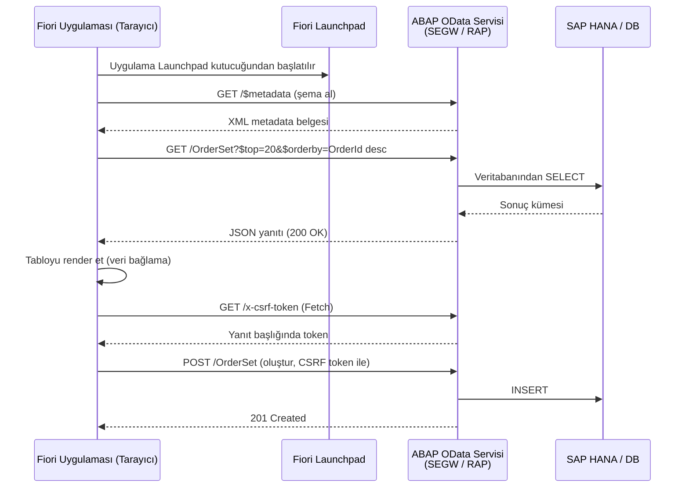
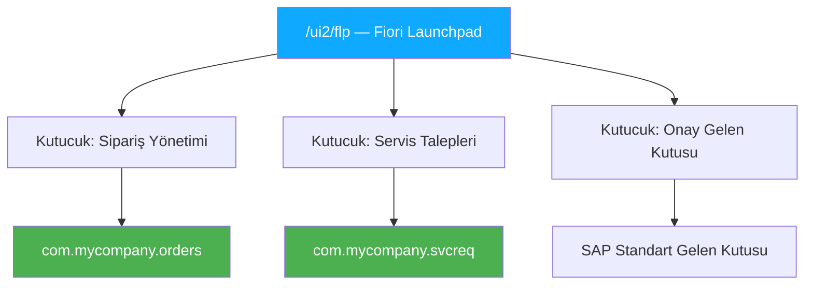

# Kısım 34: ABAP Geliştiriciler İçin Fiori & UI5

*SAP'ın modern web UX'i — nedir, nasıl çalışır ve OData servislerinin bunu nasıl beslediği.*

---

## ☕ Şimdiye kadar olan bölüm — ve şimdi neden UI önemli

Son düzine kısımda servisler inşa ettin. Okuma, oluşturma, güncelleme, silme işlemleri yapan OData uç noktaları. Bir Google Form entegrasyonu. WhatsApp bildirimleri. Güzel, kullanışlı, görünmez arka uç çalışması.

Ama bir noktada proje yöneticin şunu söyleyecek: "Bunu güzel bir ekranda görebilir miyiz?" İşte o an Fiori sahneye giriyor.

Fiori, SAP'ın modern web kullanıcı arayüzü platformudur. SAP GUI'nin 1992'de tasarlanmış gibi göründüğüne dair (çok haklı) eleştirinin yanıtıdır — çünkü büyük bölümü öyleydi. Fiori 2013 civarında piyasaya çıktı ve o tarihten beri SAP'ın stratejik UI yönü oldu. S/4HANA rollerini hedefliyorsan Fiori bilgisi beklenir, isteğe bağlı değil.

İyi haber: React, Angular veya Vue anlıyorsan, düşündüğünden çok daha hızlı adapte olursun.

---

## 34.1 Fiori Nedir

### Benzetme

Fiori'yi SAP'ın bir tasarım sistemi + bileşen kütüphanesi + dağıtım platformunun hepsi bir arada eşdeğeri olarak düşün. Yalnızca görsel bir stil kılavuzu değil — şunları da kapsar:

- **SAPUI5**: JavaScript çerçevesi (SAP'ın Angular sürümü olarak düşün)
- **OpenUI5**: SAPUI5'in açık kaynak sürümü (aynı motor, SAP lisansı gerekmez)
- **Fiori Tasarım Kılavuzları**: SAP'ın Google Material Design eşdeğeri — düzen, renk, etkileşim kuralları
- **Fiori Launchpad (FLP)**: Tüm Fiori uygulamalarının yaşadığı tarayıcı tabanlı portal, bir Windows Başlat menüsü veya web uygulama başlatıcısına eşdeğer

Müşterinin "bunun için bir Fiori uygulaması istiyoruz" demesi genellikle iki şeyden birini ifade eder:
1. **Fiori Elements uygulaması** — OData ek açıklamalarından kendini oluşturan metadata güdümlü bir UI. Minimum JS gerektirir. Hızlı inşa edilir.
2. **Freestyle UI5 uygulaması** — Tam tasarım özgürlüğüne sahip elle kodlanmış bir UI5 uygulaması. Daha fazla emek, daha fazla esneklik.

> 🧭 **İş hayatında:** Çoğu kurumsal projede özel UI çalışmasının %80'i Fiori Elements'tir (hızlı ve tutarlı). Freestyle UI5, gereksinimler gerçekten oluşturulan UI ile karşılanamadığında kullanılır — karmaşık sürükle-bırak, yoğun özelleştirilmiş düzenler, gömülü görselleştirmeler. Fiori Elements ihtiyacı karşılıyorsa freestyle inşa etme.

---

## 34.2 UI5 ve Bildiğin Çerçeveler

### Zihinsel model

| Kavram | React/Angular/Vue | SAPUI5 |
|---|---|---|
| Bileşen | `<MyComponent />` | SAPUI5 denetimi (örn. `sap.m.Button`) |
| Şablon / işaretleme | JSX / HTML şablonu | XML View (`.view.xml`) |
| Denetleyici mantığı | Bileşen sınıfı / TS dosyası | Denetleyici (`.controller.js` / `.controller.ts`) |
| Veri bağlama | Durum / props / `@Input` | MVC + Model bağlama (JSON Model, OData Model) |
| Yönlendirici | React Router / Angular Router | `sap.ui.core.routing.Router` |
| Paket yöneticisi | npm | npm / SAP CDN |
| Derleme aracı | webpack / Vite | UI5 Tooling (`@ui5/cli`) |
| Tasarım sistemi | Material UI / Tailwind | SAPUI5 denetimleri + Fiori Kılavuzları |

SAPUI5 **MVC modelini** katı biçimde takip eder:
- **Model** — veri (bir JSON model veya OData V2/V4 model)
- **View** — UI'yi bildirimsel olarak tanımlayan XML view
- **Controller** — olayları ve mantığı işleyen JavaScript/TypeScript sınıfı

### Basit bir UI5 XML View

```xml
<!-- webapp/view/OrderList.view.xml -->
<mvc:View
    controllerName="com.mycompany.orders.controller.OrderList"
    xmlns:mvc="sap.ui.core.mvc"
    xmlns="sap.m"
    xmlns:core="sap.ui.core"
    displayBlock="true">

    <Page title="Açık Siparişler" showNavButton="false">
        <content>
            <!-- /OrderSet OData varlık setine bağlı tablo -->
            <Table id="ordersTable"
                   items="{/OrderSet}"
                   mode="SingleSelectMaster"
                   selectionChange=".onOrderSelected">
                <columns>
                    <Column><Text text="Sipariş No"/></Column>
                    <Column><Text text="Müşteri"/></Column>
                    <Column><Text text="Durum"/></Column>
                    <Column><Text text="Toplam"/></Column>
                </columns>
                <items>
                    <ColumnListItem>
                        <cells>
                            <ObjectIdentifier title="{OrderId}"/>
                            <Text text="{CustomerName}"/>
                            <ObjectStatus text="{Status}"
                                state="{= ${Status} === 'OPEN' ? 'Warning' :
                                          ${Status} === 'SHIPPED' ? 'Success' : 'None'}"/>
                            <ObjectNumber number="{NetAmount}"
                                         unit="{Currency}"/>
                        </cells>
                    </ColumnListItem>
                </items>
            </Table>
        </content>
    </Page>

</mvc:View>
```

### Eşleşen denetleyici

```javascript
// webapp/controller/OrderList.controller.js
sap.ui.define([
    "sap/ui/core/mvc/Controller",
    "sap/ui/model/odata/v2/ODataModel",
    "sap/m/MessageToast"
], function(Controller, ODataModel, MessageToast) {
    "use strict";

    return Controller.extend("com.mycompany.orders.controller.OrderList", {

        onInit: function() {
            // OData model genellikle bileşen düzeyinde (manifest.json) ayarlanır
            // ve this.getView().getModel() aracılığıyla erişilebilir.
            // Burada view düzeyinde başlatma yapabiliriz.
            var oModel = this.getOwnerComponent().getModel();
            oModel.attachRequestFailed(function(oEvent) {
                MessageToast.show("OData isteği başarısız: " +
                    oEvent.getParameter("message"));
            });
        },

        onOrderSelected: function(oEvent) {
            var oItem    = oEvent.getParameter("listItem");
            var sOrderId = oItem.getBindingContext().getProperty("OrderId");

            // Detay view'a git
            this.getOwnerComponent().getRouter().navTo("detail", {
                orderId: encodeURIComponent(sOrderId)
            });
        }

    });
});
```

> ⚠️ **C#/Python tuzağı:** UI5, ES6 `import` yerine `sap.ui.define` / AMD tarzı modül yükleme kullanır. Bu tarihsel bir kalıntıdır — UI5, ES6 modüllerinden önce doğdu. TypeScript destekli modern UI5 `import`'a izin verir, ancak gerçek dünya kod tabanlarının pek çoğu hâlâ AMD stilini kullanır. Bu seni şaşırtmasın.

### OData modelinin nasıl bağlandığı

`manifest.json`'da (Angular'ın `app.module.ts`'ine eşdeğer uygulama tanımlayıcısı):

```json
{
  "sap.app": {
    "id": "com.mycompany.orders",
    "type": "application",
    "dataSources": {
      "mainService": {
        "uri": "/sap/opu/odata/sap/ZORDERS_SRV/",
        "type": "OData",
        "settings": { "odataVersion": "2.0" }
      }
    }
  },
  "sap.ui5": {
    "models": {
      "": {
        "dataSource": "mainService",
        "settings": {
          "defaultOperationMode": "Server",
          "autoExpandSelect": true
        }
      }
    }
  }
}
```

Bu yapılandırıldıktan sonra `{/OrderSet}` veya `{OrderId}` gibi her XML view bağlaması otomatik olarak ABAP OData servisine gider. UI5 OData model, CSRF token alma, toplu istekler ve önbelleğe almayı şeffaf biçimde işler — hiç XHR/fetch kodu yazmazsın.

> 💡 `""` model anahtarı "varsayılan model" anlamına gelir. XML'inde `{/OrderSet}`, "varsayılan modelin `/OrderSet` varlık setinden oku" demektir. Adlandırılmış modeller `{modelAdı>/...}` biçimini kullanır.

---

## 34.3 Fiori Elements ve Freestyle UI5

### Fiori Elements — "yapılandırma üzerinden kural" yaklaşımı

Fiori Elements, OData servisinin **ek açıklamalarından** tüm sayfaları (Liste Raporu, Nesne Sayfası, İş Listesi, Analitik Liste Sayfası) üretir. CDS ek açıklamaları yazarsın; Fiori Elements bunları okur ve çalışma zamanında UI'yi oluşturur.

Şöyle düşün: CDS view'ın şema, ek açıklamaların yapılandırma ve Fiori Elements bu yapılandırmayı çalışan bir Fiori uygulamasına dönüştüren çerçeve. JavaScript view'ları yok, denetleyiciler yok (ya da çok az).

```cds
-- Fiori Elements Liste Raporunu yönlendiren CDS ek açıklamaları
@UI.lineItem: [
  { position: 10, label: 'Sipariş No',  value: #VALUE, importance: #HIGH },
  { position: 20, label: 'Müşteri',     value: #VALUE, importance: #HIGH },
  { position: 30, label: 'Net Tutar',   value: #VALUE },
  { position: 40, label: 'Durum',       value: #VALUE,
    criticality: #StatusCriticality }
]
@UI.selectionField: [
  { position: 10, element: 'Status' },
  { position: 20, element: 'CustomerName' }
]
define view entity ZC_OrderList
  as projection on ZI_Order
{
  key OrderId,
      CustomerName,
      @Semantics.amount.currencyCode: 'Currency'
      NetAmount,
      Currency,
      Status,
      StatusCriticality  -- hesaplanmış: 1=kırmızı, 2=sarı, 3=yeşil
}
```

Filtreleme, sıralama ve sütun seçimiyle tam işlevli, SAP standardında bir liste raporu almak için bu yeterli — sıfır JavaScript.

### Hangisi seçilir

| Senaryo | Kullan |
|---|---|
| Standart usta-detay, liste raporu, nesne sayfası | **Fiori Elements** |
| Basit formlu onay iş akışı | **Fiori Elements** |
| Karmaşık sürükle-bırak çizelgeleme panosu | **Freestyle UI5** |
| D3 ile özel grafik/görselleştirme | **Freestyle UI5** |
| Standart bir SAP Fiori uygulamasını genişletme | **Fiori Elements + UI5 Esnekliği** |
| Paydaş demosu için hızlı prototipleme | **Fiori Elements** (en hızlı) |

> 🧭 **İş hayatında:** Çoğu genç ABAP geliştiricisi iş ilanı artık "Fiori Elements"i bir beceri olarak listeliyor. SAP, ek açıklama güdümlü UI'yi güçlü biçimde destekliyor. Önce Fiori Elements öğren — doğrudan Kısım 16'daki CDS bilginden yararlanır.

---

## 34.4 Bir Fiori Uygulaması OData Servisine Nasıl Konuşur

Bir Fiori uygulaması ile ABAP OData servisi arasındaki konuşma, Kısım 23–30'dan sonra tam olarak beklediğin şeydir:



Tarayıcı hiçbir zaman doğrudan veritabanıyla konuşmaz — her şey OData servisin üzerinden geçer. Bu nedenle iyi tasarlanmış OData servisleri (iyi yetkilendirme kontrolleri, anlamlı hata mesajları, mantıklı varlık yapıları) Fiori geliştirmeyi hızlı ve ABAP ekibini mutlu kılar.

---

## 34.5 Fiori Launchpad, Araçlar ve Dağıtım

### Fiori Launchpad (FLP)

Launchpad (tarayıcı URL'nde `/ui2/flp`), tüm Fiori uygulamalarının içinde çalıştığı kapsayıcıdır. Bunu SAP için tarayıcının "masaüstü"sü gibi düşün — kutucuklar, gruplar ve bildirimler. Bir Fiori uygulaması dağıttığında bu Launchpad'e bir kutucuk ekliyorsun.



### SAP Business Application Studio (BAS)

Fiori geliştirmesi için yerel IDE'yi bırak. **SAP Business Application Studio**'yu kullan — SAP'ın bulut tabanlı IDE'si (düşün: "tarayıcıda VS Code, Fiori için önceden yapılandırılmış"). SAP BTP üzerinden kullanılabilir ve şunları içerir:

- **Fiori tools** (tüm Fiori Elements yer planları için yeoman oluşturucular)
- Yerleşik UI5 dil sunucusu (XML view'ları için otomatik tamamlama)
- Doğrudan SAP sistem bağlantısı (hedef servisi aracılığıyla)
- Canlı yeniden yükleme ile önizleme

Yerel olarak çalışmak zorundaysan VS Code'a **SAP Fiori Tools** uzantısını yükle. Aynı oluşturucuları verir.

### BAS'ta Fiori Elements uygulaması oluşturma (adımlar)

1. BAS'ı aç → Şablondan Yeni Proje → SAP Fiori Uygulaması.
2. **Liste Raporu Nesne Sayfası**'nı seç (en yaygın yer planı).
3. OData servisini seç (hedef aracılığıyla SAP sistemine bağlan).
4. Ana varlık tipini seç (`OrderSet`).
5. BAS eksiksiz uygulama iskeleti oluşturur — `manifest.json`, view, denetleyici taslakları.
6. Canlı SAP sistemine karşı önizlemek için **Çalıştır**'a bas.

Oluşturulan `manifest.json`, uygulamayı OData servisine otomatik olarak bağlar. Sütunları, filtreleri ve eylemleri özelleştirmek için yalnızca CDS/OData tarafına ek açıklamalar eklemen yeterli.

### ABAP'a dağıtım (BSP / ABAP Deposu)

```bash
# BAS'tan veya yerelden Fiori tools CLI kullanarak dağıt
npx fiori deploy --config ui5-deploy.yaml

# Ya da BAS GUI aracılığıyla: Çalıştır → Uygulamayı Dağıt
```

Bu, derlenmiş uygulamayı ABAP MIME Deposuna yükler (işlem `SE38` / `ZABAPGIT` raporu veya BSP uygulaması aracılığıyla). Dağıtımın ardından bir Launchpad kutucuğu eklemek için uygulamayı **SPRO → SAP Fiori → Yapılandır** bölümünde kaydet.

> 🧭 **İş hayatında:** Pek çok mağazada Fiori dağıtımı ve Launchpad kutucuk yapılandırması "Fiori yöneticisi" rolü tarafından yapılır. Akışı anlamak gerekir, ancak ilk günden itibaren Launchpad yapılandırmasını kendin yapmayabilirsin.

---

## 🧠 Özet

- **SAPUI5**, SAP'ın JavaScript çerçevesidir — MVC mimarisi, XML view'lar, JavaScript denetleyiciler, OData model bağlama. Angular'a benzetme yapılabilir.
- **Fiori Elements**, CDS ek açıklamalarından UI üretir — neredeyse hiç JavaScript gerekmez. Yeni geliştirme için tercih edilen yaklaşım budur.
- **Freestyle UI5** tam tasarım kontrolüne ihtiyaç duyduğunda; tutumlu kullan.
- Bir Fiori uygulaması, **OData V2/V4 modeli** aracılığıyla OData servisiyle konuşur — Bölüm VI'da inşa ettiğin aynı servisler.
- **SAP Business Application Studio** tercih edilen IDE; Fiori tools oluşturucuları dakikalar içinde çalışan bir uygulama verir.
- Kısım 16'daki CDS ek açıklamaları + Bölüm VI'daki OData + Fiori Elements = çok az ekstra kodla tam, modern, dağıtılabilir bir SAP uygulaması.

Sırada RAP var — CDS, OData V4 ve davranış mantığını tek, tutarlı, modern bir geliştirme modeline birleştiren çerçeve. Her şeyin bir araya geldiği yer Kısım 35.

---

*[← İçindekiler](../content.md) | [← Önceki: ABAP'tan WhatsApp Entegrasyonu](33-whatsapp-integration.md) | [Sonraki: RAP: RESTful Application Programming (Final) →](35-rap-restful-application-programming.md)*
