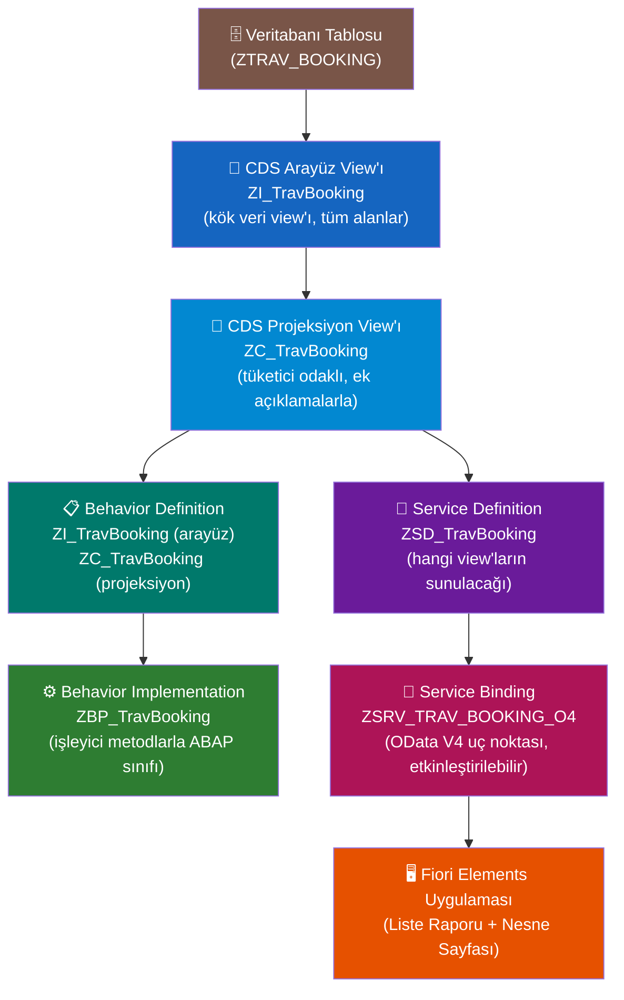
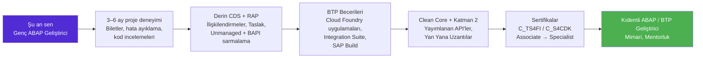

# Kısım 35: RAP — RESTful Application Programming (Final)

*Öğrendiğin her şeyi — CDS, OData V4, davranış mantığı ve Fiori — tek bir tutarlı, modern geliştirme modeline birleştiren çerçeve.*

---

## ☕ Geldik

Bu kitaba C# veya Python geliştiricisi olarak, kod yazabilen ama SAP'ın terminolojisinde kaybolmuş biri olarak başladın. Artık raporlar, diyalog programları, OData CRUD servisleri, bir Google Forms entegrasyonu, bir WhatsApp bildirim servisi ve bir Fiori uygulaması inşa ettin. `SE11`, `SE37`, `SEGW`, `SICF`, CDS view'ları ve Open SQL'i biliyorsun.

Bu kısım final — ve bu ünvanı hak ediyor. RAP (RESTful Application Programming) yalnızca başka bir teknoloji değil. SAP'ın şu soruya verdiği yanıt: *"Bugün sıfırdan SAP geliştirmesini tasarlasaydık ne inşa ederdik?"*

Yanıt, veritabanının, API'nin, iş mantığının ve UI'nin aynı dili konuştuğu katmanlı, model güdümlü, OData V4 öncelikli bir çerçevedir. Bu gerçekten iyi mühendislik. Ve şu an SAP'ın istihdam ettiği beceri bu.

Gerçek bir şey inşa edelim.

---

## 35.1 RAP Nedir — ve Neden SEGW'nin Yerini Alıyor

### Eski yöntemin sorunu

Bölüm VI'da SEGW (SAP Gateway Servis Oluşturucu) kullandın. Çalışıyor. Ama sorunları var:

- **Standart metin patlaması.** Bir OData servisi oluşturmak; varlık tipleri, varlık setleri, ilişkilendirmeler, eşlemeler oluşturmayı, ardından 20+ işleyici metodunu uygulamayı gerektiriyordu — çoğu aynı (`MERGE_ENTITY`, `UPDATE_ENTITY`'yi çağırır, vb.).
- **Tek gerçek kaynak yok.** Veritabanı tablosu, ABAP yapısı, OData varlık tipi ve UI ek açıklamaları hepsi farklı yerlerde yaşıyor, ayrı ayrı bakımı yapılıyor, birbirinden sapıyor.
- **Çerçeve yönetimli kalıcılık yok.** SEGW, tüm DB işlemlerini sana bırakıyordu — her metodda `INSERT`, `UPDATE`, `DELETE`, `SELECT`. Her yerde yinelenen mantık.
- **Yalnızca OData V2 (yerel olarak).** V4 yok, taslak işleme yok, çok büyük çabalamadan derin işlemler yok.

### RAP'ın sana verdiği

RAP modeli tersine çevirir. **Verinin nasıl göründüğünü** (CDS view'lar) ve **hangi işlemlere izin verildiğini** (Behavior Definition) tanımlarsın, RAP çerçevesi şunları halleder:

- Tüm OData V4 maruziyeti (service definition + service binding = tamam)
- Managed senaryolarda kalıcılık (çerçeve `INSERT`/`UPDATE`/`DELETE`'i yazar)
- Taslak işleme (devam eden kayıt, at, etkinleştir — yerleşik)
- Örnek yetkilendirme, özellik denetimi (kayıt başına hangi alanlar düzenlenebilir?)
- İyimser kilitleme için ETag'ler
- Derin işlemler (başlık ve kalemleri tek çağrıda kaydet)

> 💡 Benzetme: SEGW, ham `HttpContext`'te REST API yazmak ve tüm SQL'ini elle yazmak gibidir. RAP, ASP.NET Core'un denetleyici iskeletiyle Entity Framework Core kullanmak gibidir — çerçeve tesisatı işler, sen iş kurallarını yazarsın.

> 🧭 **İş hayatında:** S/4HANA 1909 veya daha yenisi / BTP ABAP Ortamındaki **herhangi bir yeni** özel uygulama için RAP kullan. SEGW tabanlı servisler bakımı yapılır, genişletilmez. S/4HANA Greenfield projeleri için işe alımcılar RAP'ı açıkça listeler. Mülakatçılar sorar: "Managed ve unmanaged RAP arasındaki fark nedir?" — bunu 35.3'te yanıtlayacağız.

---

## 35.2 RAP Yığını, Katman Katman

RAP, her biri altındakinin üzerine inşa edilen bir eserler yığınıdır. Bütün şey şöyle görünür:



| Katman | Nedir | Senin analojin |
|---|---|---|
| **Veritabanı Tablosu** | Kalıcılık alanlarına sahip DDIC tablosu | SQL tablosu / EF varlık sınıfı |
| **Arayüz View'ı** | "Tam" CDS view'ı — tüm alanlar, filtreleme yok | Alan modeli / veri varlığı |
| **Projeksiyon View'ı** | Tüketici odaklı CDS — alan alt kümesi + ek açıklamalar | DTO / API yanıt şekli + Swagger ek açıklamaları |
| **Behavior Definition** | Hangi işlemler mevcut (CRUD, eylemler, doğrulamalar) | `[HttpPost]` / rota metadata'sı + doğrulayıcılar |
| **Behavior Implementation** | Kuralları uygulayan ABAP sınıfı | Servis sınıfı / Denetleyici uygulaması |
| **Service Definition** | Hangi view'ların sunulduğunu bildirir | ASP.NET rota kaydı |
| **Service Binding** | Gerçek OData V4 uç noktası, etkinleştirilebilir | Yayımlanan API uç noktası |

> 💡 Arayüz View'ı ile Projeksiyon View'ının ayrılması kasıtlıdır. Arayüz view'ı dahili veri sözleşmendir — kararlı, kapsamlı. Projeksiyon view'ı tüketici başına sunduğun şeydir — potansiyel olarak farklı kullanım durumları için farklı projeksiyonlar.

---

## 35.3 Managed ve Unmanaged — Mülakat Sorusu

Bu en yaygın RAP mülakat sorusudur. İşte net yanıt:

### Managed senaryo

**RAP çerçevesi kalıcılığı yönetir** — Z-tablona nasıl `INSERT`, `UPDATE` ve `DELETE` yapacağını bilir. Behavior Definition'ı `managed;` ile açıklarsın ve yalnızca çerçevenin çıkaramayacağı mantığı sağlarsın (doğrulamalar, determinasyonlar, özel eylemler).

**Ne zaman kullanılır:** Yeni bir Z-tablosunda greenfield uygulama inşa ediyorsan. Veri modeli senin tanımladığındır.

```abap
" Behavior Definition parçası — managed
managed; " <-- çerçeve CRUD kalıcılığını işler

define behavior for ZI_TravBooking alias Booking
  persistent table ztrav_booking
  lock master
  authorization master ( instance )
  etag master LastChangedAt
{
  create;
  update;
  delete;

  field ( readonly ) BookingId, LastChangedAt, CreatedBy;
  field ( mandatory ) CustomerId, FlightDate, FlightPrice;

  determination SetInitialStatus on modify { create; }
  validation    CheckFlightDate  on save    { create; update; }

  action ConfirmBooking result [1] $self;
  action CancelBooking;

  mapping for ztrav_booking corresponding
  {
    BookingId      = booking_id;
    CustomerId     = customer_id;
    FlightDate     = flight_date;
    FlightPrice    = flight_price;
    CurrencyCode   = currency_code;
    Status         = booking_status;
    CreatedBy      = created_by;
    LastChangedAt  = last_changed_at;
  }
}
```

### Unmanaged senaryo

**Kalıcılığı kendin yönetirsin** — genellikle mevcut mantığı sardığın için: BAPI'ler, fonksiyon modülleri, standart olmayan anahtarlarla karmaşık eski tablolar. Çerçeve metodlarını çağırır, ama sen `INSERT`/`UPDATE`/`DELETE`'i (veya BAPI çağrılarını) yazarsın.

**Ne zaman kullanılır:** Eski bir süreci modernize ediyorsan. OData V4 arayüzü ve Fiori Elements UI istiyorsun ama gerçek kaydetme mantığı mevcut BAPI'lardan geçmek zorunda.

```abap
" Behavior Definition parçası — unmanaged
unmanaged; " <-- kalıcılığı ben yönetiyorum

define behavior for ZI_TravBooking alias Booking
  implementation in class zbp_trav_booking unique
{
  create;
  update;
  delete;
  ...
}
```

```abap
" Behavior Implementation — unmanaged, save( ) metodunu kendin uyguluyorsun
METHOD save_modified.
  " Çerçeve değişiklikleri toplar ve save_modified'ı bir kez çağırır.
  " Oluşturulacak, güncellenecek, silinecek varlık tabloları alırsın.
  
  LOOP AT create-booking INTO DATA(ls_create).
    " Burada BAPI veya INSERT çağır
    BAPI_BOOKING_CREATE( ... ).
  ENDLOOP.

  LOOP AT update-booking INTO DATA(ls_update).
    BAPI_BOOKING_CHANGE( ... ).
  ENDLOOP.

  LOOP AT delete-booking INTO DATA(ls_delete).
    BAPI_BOOKING_DELETE( ... ).
  ENDLOOP.
ENDMETHOD.
```

> 🧭 **İş hayatında:** Yeni S/4HANA projelerinde managed varsayılandır. Unmanaged, "BAPI'ı RAP ile sar" geçiş projeleri içindir — mevcut iş mantığının henüz değiştirilemediği ama müşterinin modern bir UI istediği brownfield uygulamalarında çok yaygındır.

---

## 35.4 Tam Managed RAP Uygulaması İnşa Et — Adım Adım

Bir **Seyahat Rezervasyonu** uygulaması inşa edeceğiz. Bir kısma sığacak kadar basit, tüm katmanları gösterecek kadar gerçekçi. Uygulama, seyahat rezervasyonları oluşturmanı, görüntülemeni, güncellemenı ve silmeni sağlar.

### Adım 1: Veritabanı Tablosu

ADT veya SE11'de `ZTRAV_BOOKING`'i oluştur:

```abap
@EndUserText.label : 'Seyahat Rezervasyonları'
@AbapCatalog.enhancement.category : #NOT_EXTENSIBLE
@AbapCatalog.tableCategory : #TRANSPARENT
@AbapCatalog.deliveryClass : #A
@AbapCatalog.dataMaintenance : #RESTRICTED

define table ztrav_booking {
  key client        : abap.clnt not null;
  key booking_id    : /dmo/booking_id not null;   " ya da abap.numc(8)
  customer_id       : /dmo/customer_id;
  flight_date       : /dmo/flight_date;
  flight_price      : /dmo/flight_price;
  currency_code     : /dmo/currency_code;
  booking_status    : /dmo/booking_status;        " 'N'=Yeni,'B'=Rezerve,'X'=İptal
  created_by        : syuname;
  last_changed_at   : timestampl;
}
```

> 💡 SAP'ın ABAP Uçuş Referans Senaryosu (`/DMO/` tipleri) standart eğitim veri modelidir — pratik yapmak için harika. Kullan. Gerçek projeler SE11'deki kendi alan tiplerini kullanır.

### Adım 2: CDS Arayüz View'ı ("I_" view'ı)

```cds
@AbapCatalog.viewEnhancementCategory: [#NONE]
@AccessControl.authorizationCheck: #CHECK
@EndUserText.label: 'Seyahat Rezervasyonu - Arayüz View'ı'
@Metadata.ignorePropagatedAnnotations: true
@ObjectModel.usageType:{
  serviceQuality: #X,
  sizeCategory: #S,
  dataClass: #MIXED
}

define root view entity ZI_TravBooking
  as select from ztrav_booking
{
  key booking_id      as BookingId,
      customer_id     as CustomerId,
      flight_date     as FlightDate,
      flight_price    as FlightPrice,
      currency_code   as CurrencyCode,
      booking_status  as Status,
      created_by      as CreatedBy,
      last_changed_at as LastChangedAt
}
```

Temel ek açıklamalar:
- `define root view entity` — bu bir RAP kök düğümüdür (alt değil)
- `@AccessControl.authorizationCheck: #CHECK` — çerçeveye CDS erişim denetimini (DCL nesneleri) zorunlu kılmasını söyler. Erken geliştirmede `#NOT_REQUIRED` kullan, canlıya geçmeden önce `#CHECK`'e geç.

### Adım 3: CDS Projeksiyon View'ı ("C_" view'ı)

```cds
@EndUserText.label: 'Seyahat Rezervasyonu - Projeksiyon View'ı'
@AccessControl.authorizationCheck: #NOT_REQUIRED

@UI.headerInfo: {
  typeName:       'Rezervasyon',
  typeNamePlural: 'Rezervasyonlar',
  title:          { type: #STANDARD, value: 'BookingId' },
  description:    { type: #STANDARD, value: 'CustomerId' }
}

define root view entity ZC_TravBooking
  provider contract transactional_query
  as projection on ZI_TravBooking
{
  @UI.facet: [
    { id: 'BookingInfo', type: #IDENTIFICATION_REFERENCE,
      label: 'Rezervasyon Detayları', position: 10 }
  ]

  @UI.lineItem:        [{ position: 10, importance: #HIGH }]
  @UI.identification:  [{ position: 10 }]
  key BookingId,

  @UI.lineItem:        [{ position: 20, importance: #HIGH }]
  @UI.identification:  [{ position: 20 }]
  @UI.selectionField:  [{ position: 10 }]
  CustomerId,

  @UI.lineItem:        [{ position: 30 }]
  @UI.identification:  [{ position: 30 }]
  FlightDate,

  @Semantics.amount.currencyCode: 'CurrencyCode'
  @UI.lineItem:        [{ position: 40 }]
  @UI.identification:  [{ position: 40 }]
  FlightPrice,

  CurrencyCode,

  @UI.lineItem: [{ position: 50, criticality: 'StatusCriticality',
                   criticalityRepresentation: #WITH_ICON }]
  @UI.identification: [{ position: 50 }]
  @UI.selectionField: [{ position: 20 }]
  Status,

  @UI.hidden: true
  case Status
    when 'N' then 2   " Sarı = Yeni
    when 'B' then 3   " Yeşil = Rezerve
    when 'X' then 1   " Kırmızı = İptal
    else 0
  end                 as StatusCriticality,

  CreatedBy,
  LastChangedAt
}
```

> ⚠️ **C#/Python tuzağı:** Projeksiyon view'ındaki `@UI.*` ek açıklamaları, Fiori Elements UI'yi yönlendiren şeylerdir — hangi alanların listede (`@UI.lineItem`), detay formunda (`@UI.identification`) ve filtre çubuğunda (`@UI.selectionField`) görüneceğini bildirirler. UI'yi arka uçtan bu şekilde denetlersin — JavaScript gerekmez.

### Adım 4: Behavior Definition (Arayüz düzeyi)

ADT'de oluştur: `ZI_TravBooking`'e sağ tıkla → Yeni Behavior Definition.

```abap
managed; " Çerçeve CRUD kalıcılığını işler

define behavior for ZI_TravBooking alias Booking
  persistent table ztrav_booking
  lock master
  authorization master ( instance )
  etag master LastChangedAt
{
  " ── Standart CRUD işlemleri ────────────────────────────────────────────
  create;
  update;
  delete;

  " ── Salt okunur alanlar (çerçeve istemcinin bunları değiştirmesine izin vermez)
  field ( readonly ) BookingId, CreatedBy, LastChangedAt;
  field ( numbering : managed ) BookingId;  " çerçeve anahtarı atar

  " ── Zorunlu alanlar (oluşturmada boş olamaz) ────────────────────────────
  field ( mandatory ) CustomerId, FlightDate, FlightPrice, CurrencyCode;

  " ── Determinasyonlar (alan değerlerini otomatik hesapla) ─────────────────
  determination SetInitialStatus  on modify { create; }
  determination SetLastChangedAt  on modify { create; update; }

  " ── Doğrulamalar (iş kuralları ihlal edilirse kaydı reddet) ─────────────
  validation CheckFlightDate    on save { create; update; }
  validation CheckCustomerExist on save { create; }

  " ── Özel eylem (standart CRUD'un ötesinde) ─────────────────────────────
  action ( features : instance ) ConfirmBooking result [1] $self;
  action ( features : instance ) CancelBooking;

  " ── Eşleme: CDS alan adları ↔ DB sütun adları ──────────────────────────
  mapping for ztrav_booking corresponding
  {
    BookingId     = booking_id;
    CustomerId    = customer_id;
    FlightDate    = flight_date;
    FlightPrice   = flight_price;
    CurrencyCode  = currency_code;
    Status        = booking_status;
    CreatedBy     = created_by;
    LastChangedAt = last_changed_at;
  }
}
```

### Adım 5: Behavior Definition (Projeksiyon düzeyi)

```abap
projection;

define behavior for ZC_TravBooking alias Booking
{
  use create;
  use update;
  use delete;

  use action ConfirmBooking;
  use action CancelBooking;
}
```

Projeksiyon behavior definition incedir — yalnızca "bu işlemleri arayüz behavior'ından sun" der. Her tüketicinin yapmasına izin verilen şeyleri burada kısıtlayabilirsin (örn. salt okunur bir tüketicinin projeksiyonu `use create` içermez).

### Adım 6: Behavior Implementation Sınıfı

Behavior definition'ı kaydettiğinde ADT sınıf iskeletini otomatik oluşturur. Metodları doldur:

```abap
CLASS zbp_trav_booking DEFINITION PUBLIC ABSTRACT FINAL
  INHERITING FROM cl_abap_behavior_handler.

  PRIVATE SECTION.

    METHODS set_initial_status    FOR DETERMINE ON MODIFY
      IMPORTING keys FOR Booking~SetInitialStatus.

    METHODS set_last_changed_at   FOR DETERMINE ON MODIFY
      IMPORTING keys FOR Booking~SetLastChangedAt.

    METHODS check_flight_date     FOR VALIDATE ON SAVE
      IMPORTING keys FOR Booking~CheckFlightDate.

    METHODS check_customer_exist  FOR VALIDATE ON SAVE
      IMPORTING keys FOR Booking~CheckCustomerExist.

    METHODS confirm_booking       FOR MODIFY
      IMPORTING keys FOR ACTION Booking~ConfirmBooking
                RESULT result.

    METHODS cancel_booking        FOR MODIFY
      IMPORTING keys FOR ACTION Booking~CancelBooking.

    METHODS get_instance_features FOR INSTANCE FEATURES
      IMPORTING keys    REQUEST    requested_features
                RESULT  result.

ENDCLASS.

CLASS zbp_trav_booking IMPLEMENTATION.

  " ── Determinasyon: oluşturmada Status = 'N' (Yeni) ayarla ─────────────
  METHOD set_initial_status.
    READ ENTITIES OF zi_travbooking IN LOCAL MODE
      ENTITY Booking
        FIELDS ( Status ) WITH CORRESPONDING #( keys )
      RESULT DATA(lt_bookings).

    " Yalnızca boşsa ayarla (yeni oluşturulmuş)
    DELETE lt_bookings WHERE Status IS NOT INITIAL.
    CHECK lt_bookings IS NOT INITIAL.

    MODIFY ENTITIES OF zi_travbooking IN LOCAL MODE
      ENTITY Booking
        UPDATE FIELDS ( Status )
          WITH VALUE #( FOR booking IN lt_bookings
                          ( %tky   = booking-%tky
                            Status = 'N' ) ).
  ENDMETHOD.

  " ── Determinasyon: LastChangedAt damgala ───────────────────────────────
  METHOD set_last_changed_at.
    DATA(lv_now) = cl_abap_context_info=>get_system_date( ) &&
                   cl_abap_context_info=>get_system_time( ).  " basitleştirme

    GET TIME STAMP FIELD DATA(lv_ts).

    MODIFY ENTITIES OF zi_travbooking IN LOCAL MODE
      ENTITY Booking
        UPDATE FIELDS ( LastChangedAt )
          WITH VALUE #( FOR key IN keys
                          ( %tky         = key-%tky
                            LastChangedAt = lv_ts ) ).
  ENDMETHOD.

  " ── Doğrulama: FlightDate gelecekte olmalı ──────────────────────────────
  METHOD check_flight_date.
    READ ENTITIES OF zi_travbooking IN LOCAL MODE
      ENTITY Booking
        FIELDS ( FlightDate ) WITH CORRESPONDING #( keys )
      RESULT DATA(lt_bookings).

    LOOP AT lt_bookings INTO DATA(ls_booking).
      IF ls_booking-FlightDate < cl_abap_context_info=>get_system_date( ).
        APPEND VALUE #(
          %tky        = ls_booking-%tky
          %state_area = 'VALIDATE_FLIGHT_DATE'
        ) TO reported-booking.

        APPEND VALUE #(
          %tky = ls_booking-%tky
        ) TO failed-booking.

        APPEND VALUE #(
          %tky = ls_booking-%tky
          %msg = new_message(
            id      = 'ZTR_BOOKING'
            number  = '001'
            severity = if_abap_behv_message=>severity-error
            v1      = ls_booking-FlightDate )
        ) TO reported-booking.
      ENDIF.
    ENDLOOP.
  ENDMETHOD.

  " ── Doğrulama: Müşteri /DMO/CUSTOMER'da bulunmalı ────────────────────
  METHOD check_customer_exist.
    READ ENTITIES OF zi_travbooking IN LOCAL MODE
      ENTITY Booking
        FIELDS ( CustomerId ) WITH CORRESPONDING #( keys )
      RESULT DATA(lt_bookings).

    SELECT customer_id
      FROM /dmo/customer
      FOR ALL ENTRIES IN @lt_bookings
      WHERE customer_id = @lt_bookings-CustomerId
      INTO TABLE @DATA(lt_valid_customers).

    LOOP AT lt_bookings INTO DATA(ls_booking).
      IF NOT line_exists(
            lt_valid_customers[
              table_line = ls_booking-CustomerId ] ).

        APPEND VALUE #( %tky = ls_booking-%tky ) TO failed-booking.
        APPEND VALUE #(
          %tky = ls_booking-%tky
          %msg = new_message_with_text(
            severity = if_abap_behv_message=>severity-error
            text     = |{ ls_booking-CustomerId } numaralı müşteri mevcut değil| )
        ) TO reported-booking.
      ENDIF.
    ENDLOOP.
  ENDMETHOD.

  " ── Özel Eylem: ConfirmBooking ──────────────────────────────────────────
  METHOD confirm_booking.
    READ ENTITIES OF zi_travbooking IN LOCAL MODE
      ENTITY Booking
        FIELDS ( Status ) WITH CORRESPONDING #( keys )
      RESULT DATA(lt_bookings).

    " Yalnızca 'Yeni' ise onayla
    DELETE lt_bookings WHERE Status <> 'N'.

    MODIFY ENTITIES OF zi_travbooking IN LOCAL MODE
      ENTITY Booking
        UPDATE FIELDS ( Status )
          WITH VALUE #( FOR b IN lt_bookings
                          ( %tky  = b-%tky
                            Status = 'B' ) )  " 'B' = Rezerve
      REPORTED DATA(lt_reported).

    APPEND LINES OF lt_reported TO reported.

    " Güncellenen varlıkları eylem sonucu olarak döndür
    READ ENTITIES OF zi_travbooking IN LOCAL MODE
      ENTITY Booking ALL FIELDS WITH CORRESPONDING #( keys )
      RESULT DATA(lt_result).

    result = VALUE #( FOR b IN lt_result
                        ( %tky   = b-%tky
                          %param = b ) ).
  ENDMETHOD.

  " ── Özel Eylem: CancelBooking ─────────────────────────────────────────
  METHOD cancel_booking.
    MODIFY ENTITIES OF zi_travbooking IN LOCAL MODE
      ENTITY Booking
        UPDATE FIELDS ( Status )
          WITH VALUE #( FOR key IN keys
                          ( %tky  = key-%tky
                            Status = 'X' ) ).  " 'X' = İptal
  ENDMETHOD.

  " ── Örnek Özellik Denetimi: zaten Rezerve edilmişse Onayla'yı devre dışı bırak ──
  METHOD get_instance_features.
    READ ENTITIES OF zi_travbooking IN LOCAL MODE
      ENTITY Booking
        FIELDS ( Status ) WITH CORRESPONDING #( keys )
      RESULT DATA(lt_bookings)
      FAILED failed.

    result = VALUE #(
      FOR ls_booking IN lt_bookings
        LET confirm_feature =
          COND #( WHEN ls_booking-Status = 'N'
                  THEN if_abap_behv=>fc-o-enabled
                  ELSE if_abap_behv=>fc-o-disabled )
            cancel_feature =
          COND #( WHEN ls_booking-Status = 'X'
                  THEN if_abap_behv=>fc-o-disabled
                  ELSE if_abap_behv=>fc-o-enabled )
        IN
          ( %tky                        = ls_booking-%tky
            %action-ConfirmBooking      = confirm_feature
            %action-CancelBooking       = cancel_feature ) ).
  ENDMETHOD.

ENDCLASS.
```

> 💡 `IN LOCAL MODE` kritiktir. RAP işleyicisi içinden çağrıldığında yetkilendirme ve taslak işlemeyi atlar — kendi tamponunu okuyorsun, veritabanına yeniden isabet etmiyorsun. Determinasyon ve doğrulamalarda her zaman kullan.

### Adım 7: Service Definition

```abap
@EndUserText.label: 'Seyahat Rezervasyonu Servisi'

define service ZSD_TravBooking {
  expose ZC_TravBooking as Booking;
}
```

### Adım 8: Service Binding

ADT'de: Service Definition'a sağ tıkla → Yeni Service Binding:
- Ad: `ZSRV_TRAV_BOOKING_O4`
- Bağlama tipi: **OData V4 — UI** (Fiori için) veya **OData V4 — Web API** (saf REST tüketimi için)

**Etkinleştir**'e tıkla → **Yayımla**'ya tıkla. Artık şu adreste canlı bir OData V4 uç noktanız var:
```
/sap/opu/odata4/sap/zsrv_trav_booking_o4/srvd/sap/zsd_travbooking/0001/
```

Bu URL'deki `$metadata` belgesi tüm varlık tiplerini, eylemleri ve ilişkilendirmeleri tanımlar — CDS'inden ve behavior definition'ından otomatik oluşturulmuş.

---

## 35.5 Canlı OData V4 — ve Üstüne Fiori Elements Uygulaması

### OData V4 uç noktasını test et

ADT'nin service binding'inden, varlık setinin yanındaki **Önizleme** (oynat düğmesi) düğmesine tıkla. BAS veya ADT yerleşik önizlemesi canlı servisine karşı Fiori Elements liste raporu açar.

Ya da curl/Postman ile test et:

```http
GET /sap/opu/odata4/sap/zsrv_trav_booking_o4/srvd/sap/zsd_travbooking/0001/Booking
Authorization: Basic ...
Accept: application/json

# Yanıt
{
  "@odata.context": "$metadata#Booking",
  "value": [
    {
      "BookingId": "00000001",
      "CustomerId": "000001",
      "FlightDate": "2025-12-15",
      "FlightPrice": "450.00",
      "CurrencyCode": "EUR",
      "Status": "N",
      "StatusCriticality": 2
    }
  ]
}
```

```http
# Rezervasyon oluştur (OData V4 — bazı bağlamalarda CSRF token gerekmez!)
POST /sap/opu/odata4/.../Booking
Content-Type: application/json

{
  "CustomerId": "000001",
  "FlightDate": "2026-03-20",
  "FlightPrice": "320.00",
  "CurrencyCode": "EUR"
}
```

```http
# ConfirmBooking eylemini tetikle
POST /sap/opu/odata4/.../Booking('00000001')/ConfirmBooking
Content-Type: application/json
{}
```

### Fiori Elements uygulamasını oluştur

1. SAP Business Application Studio'da: **Şablondan Yeni Proje → SAP Fiori Uygulaması**.
2. **Liste Raporu Nesne Sayfası**'nı seç.
3. Sistemine bağlan, OData V4 servisi `ZSRV_TRAV_BOOKING_O4`'ü ve `Booking` varlığını seç.
4. BAS eksiksiz uygulamayı oluşturur. **Önizleme**'ye bas — ek açıklamalarından tamamen işlevsel bir liste raporu, filtreler (`@UI.selectionField`'dan), liste sütunları (`@UI.lineItem`'dan), detay Nesne Sayfası (`@UI.identification` ve `@UI.facet`'ten) ve **Rezervasyonu Onayla** ile **Rezervasyonu İptal Et** eylem düğmeleri — hepsi ek açıklamalarından.

Öğrendiklerine geri bağlantı:
- **Kısım 16**'daki CDS view'ları her RAP katmanının temelidir.
- OData V4 uç noktası **Bölüm VI**'daki her şeydir, ama otomatik olarak üretilmiş.
- Fiori Elements uygulaması tam **Kısım 34**'ün anlattığı şeydir — ek açıklama güdümlü, minimal JS.
- Taslak işleme (taslak olarak kaydet, sonra devam et) behavior definition'a tek bir ekstra anahtar kelimeyle kullanılabilir: `with draft table ztrav_booking_d;` — bunun için başka bir tam kısım gerekir, ama artık nereye bakacağını biliyorsun.

---

## 35.6 Sırada Ne Var — Kıdemli Geliştiriciye Yol Haritası

Temel müfredatı bitirdin. İşte sırada ne olduğuna ve her aşamanın genellikle ne kadar sürdüğüne dair dürüst bir harita.



### Dürüst beceri öncelik listesi

**İlk işinde — bunlara odaklan:**

1. **Mevcut ABAP kodunu oku ve anla.** Çoğu genç seviye iş, oradakileri korumak ve genişletmektir. Yazmaktan çok okumada iyi ol.
2. **Open SQL ve performans.** Yavaş SELECT sorguları en yaygın hata kategorisidir. `EXPLAIN`'i öğren, `SELECT *`'dan kaçın, veritabanı indekslerini anla.
3. **Hata ayıklama.** ADT'deki ABAP hata ayıklayıcı (kesme noktaları, izleme noktaları, nesne inceleme) en iyi arkadaşın. Hızlı ol.
4. **Taşıma yönetimi.** Geliştirme → kalite → üretim taşıma zincirini anla (SE09/SE10). Taşımayı yanlış serbest bırakmak üretime zarar vermenin yoludur.

> 💡 **İlk gün bunu oku:** **[Clean ABAP stil kılavuzu](https://github.com/SAP/styleguides/blob/main/clean-abap/CleanABAP.md)** (GitHub'da `SAP/styleguides`). Kısa, ücretsiz ve gözden geçirenlerin kullandığı kontrol listesi bu. Bunu bilmek "çalışan kod yazar" ile "ekibin bakımı seve seve yaptığı kod yazar" arasındaki farkı yaratır — ki bu tam anlamıyla genç ve orta seviye arasındaki farktır. Öne çıkan noktalara [Kısım 11.6](11-abap-oop.md) sayfasına bakabilirsin.

**6 ay sonra — bunları ekle:**

5. **RAP + CDS ek açıklamaları.** Buradan başladın. Daha derin git: ilişkilendirmeler, taslak, `@AccessControl` ile yetkilendirme nesneleri.
6. **BTP temelleri.** SAP Business Technology Platform geleceğidir. Ücretsiz bir BTP deneme hesabı oluştur. Üstüne bir şey inşa et — bir Integration Suite iFlow, bir BTP ABAP Ortamı servisi veya bir CAP uygulaması.
7. **Clean Core.** Kavramı anla: SAP standart nesnelerini değiştirme, bunun yerine genişlet. Yayımlanan API'ler (`@Released` ile işaretlenmiş) uzantılardan SAP işlevselliğini çağırmanın clean-core uyumlu yoludur.

**18 ay sonra — bunlar seni kıdemli yapar:**

8. **Mimari.** RAP mı yoksa CAP (Cloud Application Programming modeli — SAP'ın BTP için Node.js/Java çerçevesi) ne zaman kullanılır. Ne zaman yığın üzerinde, ne zaman yan yana genişletme yapılır.
9. **Integration Suite.** OData, REST, SOAP, IDoc — hepsi BTP'deki SAP Integration Suite tarafından aracılık edilir. Bunu anlamak seni kurumsal entegrasyon projeleri için değerli kılar.
10. **Mentorluk ve kod incelemesi.** "Bunu inşa edebiliyorum"dan "bunu inşa etmeyi birine öğretebiliyorum"a geçiş, kıdemli olmaya geçiştir.

### Yatırıma değer sertifikalar

| Sertifikasyon | Seviye | Odak |
|---|---|---|
| `C_TS4FI_2023` | Associate | SAP S/4HANA Mali Muhasebe için |
| `C_TS4CO_2023` | Associate | S/4HANA Controlling |
| `C_S4CDK_2023` | Associate | SAP S/4HANA Cloud, **geliştirici** sürümü |
| `C_BTP200` | Associate | SAP BTP |
| `P_S4FIN_2023` | Professional | S/4HANA Finance |

> 🧭 **İş hayatında:** Odağın teknikse önce hedeflenecek iki sertifika `C_S4CDK` (geliştirici) ve `C_BTP200`'dür. ABAP çalışmanın yanı sıra FI/CO fonksiyonel yapılandırması üzerinde çalışıyorsan fonksiyonel modül sertifikaları (`C_TS4FI`, `C_TS4CO`) değerlidir.

### Pratik sistemler — birini çalıştır

| Seçenek | En uygun |
|---|---|
| **SAP BTP ABAP Deneme** | RAP, CDS, clean core — geleceğe yönelik yığın |
| **ABAP Platform Developer Edition (Docker)** | Dizüstünde tam klasik yığın |
| **SAP CAP on BTP** | RAP'ın BTP için Node.js/Java eşdeğerini öğrenmek |
| **SAP Discovery Center** | Ücretsiz BTP kredileriyle rehberli uygulamalı görevler |

> ☕ Yazardan bir not: En hızlı ilerleyen geliştiricilerin kendi zamanlarında şeyler inşa edenler olduğunu gördüm — öğretici tekrarları değil, gerçek küçük projeler. Gerçekten veri kaydeden bir Google Form entegrasyonu. Gerçekten tetiklenen bir WhatsApp bildirimi. Gerçekten bir sorunu çözen bir RAP uygulaması. Tam olarak bu üçünü inşa ettin. Bu temel. İnşa etmeye devam et.

---

## 🧠 Özet

35 kısımda şunları bir araya getirdin:

| Beceri | Kısımlar | SAP eşdeğeri... |
|---|---|---|
| ABAP sözdizimi + modern ifadeler | 06–07 | C# / Python sözdizimi |
| DDIC tabloları + yapılar | 05 | SQL şeması + EF varlıkları |
| Raporlar + ALV | 08 | Konsol uygulamaları + veri ızgaraları |
| ABAP OOP | 11 | C# sınıfları + arayüzler |
| RFC + BAPI | 12–13 | Uzak prosedür çağrıları + SDK metodları |
| CDS View'ları | 16 | LINQ sorguları + görünüm modelleri |
| OData (SEGW) | 18–31 | ASP.NET Web API (eski yol) |
| Google Forms entegrasyonu | 32 | Webhook alıcı + REST istemci |
| WhatsApp entegrasyonu | 33 | Giden HTTP istemci + webhook işleyici |
| Fiori / UI5 | 34 | React/Angular + Material Design |
| RAP | 35 | EF Core + ASP.NET Core iskelet (modern yol) |

Artık SAP'ı anlamayan bir C# veya Python geliştiricisi değilsin. C# ve Python de konuşan bir ABAP geliştiricisisin — ve bu kombinasyon gerçekten nadir ve gerçekten değerlidir.

Git bir şeyler inşa et. İşi kazan. Ve bir dahaki sefere RAP'ı bir sonraki yeni gelene anlatan kıdemli olduğunda geri dön.

---

*[← İçindekiler](../content.md) | [← Önceki: ABAP Geliştiriciler İçin Fiori & UI5](34-fiori.md) | [Sonraki: Ek A: C#/Python ↔ ABAP Hızlı Başvuru →](appendix-a-csharp-abap-cheatsheet.md)*
