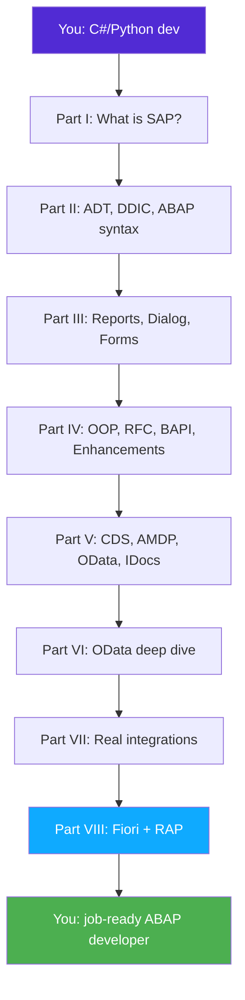

# Preface: How to Read This Book

> *"The first principle is that you must not fool yourself — and you are the easiest person to fool."* — Richard Feynman

---

## ☕ Let's be honest about where you are

You can code. You've shipped C# services, maybe Python scripts and APIs. You understand classes, collections, LINQ or list comprehensions, async, REST, and an ORM. So why does walking into an SAP project feel like landing on another planet?

Because SAP isn't a *language* problem — it's a *world* problem. The language (ABAP) is the easy part; you'll be productive in it within days. The hard part is the vocabulary, the tooling, the 40 years of conventions, and the fact that in SAP **the database is the center of the universe**, not an afterthought behind an ORM.

This book teaches the **delta** — the difference between what you already know and what an SAP team expects you to know. We don't waste your time re-explaining loops.

## 🎯 The goal: job-ready, fast

Every chapter is written to move you toward one outcome: **passing the interview and surviving your first months on an ABAP team.** That means:

- Real **transaction codes** (`SE11`, `SE37`, `SE80`, `SEGW`, `SE38`) so you can actually find things.
- Real **table and BAPI names** that come up in interviews (`MARA`, `VBAK`, `BKPF`, `BAPI_ACC_DOCUMENT_POST`).
- Honest notes on **what's legacy vs. what's the future** (so you don't over-invest in dying skills).
- Hands-on builds you can put in a **portfolio**.

## 🔁 The three-pass method

Every new concept in this book is explained three times, in this order:

1. **The analogy** — what it *is*, in one plain mental picture.
2. **"You already know this"** — the C# (and often Python) equivalent, in code.
3. **The ABAP way** — the real ABAP, plus where to find it in the system.

Here's the method in action, with the single most important data structure in ABAP — the **internal table**.

### 1️⃣ The analogy

An *internal table* is an in-memory list of rows that all share the same shape. That's it. It's the workhorse of ABAP: you `SELECT` database rows into one, loop over it, change it, and write it back.

### 2️⃣ You already know this

```csharp
// C#
public record Customer(int Id, string Name, string City);

var customers = new List<Customer>();
customers.Add(new Customer(1, "Acme", "Berlin"));

foreach (var c in customers.Where(c => c.City == "Berlin"))
    Console.WriteLine($"{c.Id}: {c.Name}");
```

```python
# Python
customers = []
customers.append({"id": 1, "name": "Acme", "city": "Berlin"})

for c in [c for c in customers if c["city"] == "Berlin"]:
    print(f'{c["id"]}: {c["name"]}')
```

### 3️⃣ The ABAP way

```abap
" ABAP — a structure (the row shape) + an internal table (the list)
TYPES: BEGIN OF ty_customer,
         id   TYPE i,
         name TYPE string,
         city TYPE string,
       END OF ty_customer.

DATA customers TYPE STANDARD TABLE OF ty_customer WITH EMPTY KEY.

customers = VALUE #( ( id = 1 name = 'Acme' city = 'Berlin' ) ).

LOOP AT customers INTO DATA(c) WHERE city = 'Berlin'.
  WRITE: / c-id, c-name.
ENDLOOP.
```

Notice the shape of the lesson: same idea, three angles. The ABAP `LOOP AT ... WHERE` is your `foreach + Where`. `VALUE #( )` is your collection initializer. `DATA(c)` is `var c`. You're not learning to program — you're learning **new spellings for things you already do.**

> 💡 **Mapping like this is the whole book.** Keep [Appendix A](appendix-a-csharp-abap-cheatsheet.md) open in a second tab — it's the running C#/Python ↔ ABAP dictionary.

## 🗺️ A map of the journey



Read it front to back if you're new to SAP. If you already know the basics and just need OData, jump to **Part VI** — but skim **Chapter 18** first so the vocabulary lands.

## 🛠️ Set up a place to practice (do this now)

You learn ABAP by typing ABAP. Pick one:

| Option | Cost | Best for |
|--------|------|----------|
| **SAP BTP ABAP Environment (Trial)** | Free trial | Modern ABAP, CDS, RAP — the future-facing stack |
| **ABAP Platform Trial (Docker image)** | Free, local | Full classic stack (SE80, SEGW, DDIC) on your laptop |
| **A practice tenant from your employer** | — | If you already have an offer/role |

> 🐳 The Docker-based **ABAP Platform Trial** ("Developer Edition") gives you a full on-prem-style system — `SE11`, `SE37`, `SE80`, `SEGW`, the works — on your own machine. We point to it throughout. See [Appendix D](appendix-d-resources.md) for exact setup steps and links.

## 📐 Conventions used in this book

- Code is always labeled: ```` ```abap ````, ```` ```csharp ````, ```` ```python ````.
- **Transaction codes** look like this: `SE11`. Type them into the SAP GUI command field.
- Boxes like the one below flag the traps that catch C#/Python developers specifically:

> ⚠️ **C#/Python gotcha:** ABAP is **case-insensitive** for keywords and names, **1-indexed** for table rows (`LOOP AT itab INDEX 1` is the first row), and uses `=` for both assignment and comparison depending on context. Your muscle memory will fight you for a week. That's normal.

- 🧭 **On the job** boxes tell you how a concept shows up in real tickets and interviews.

## 🚦 Ready?

You're not starting from zero. You're a developer learning a new dialect and a new neighborhood. Let's get you fluent — and hired.

➡️ Start with **[Chapter 1: SAP & ERP, Explained for a Developer](01-sap-erp-introduction.md)**.

---

*[← Back to Table of Contents](../content.md) | [Next: Chapter 1 →](01-sap-erp-introduction.md)*
