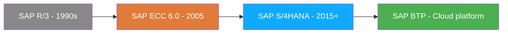
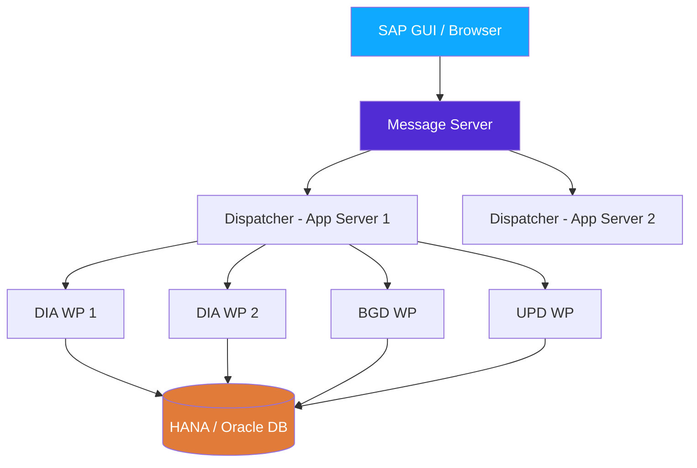

# Chapter 1: SAP & ERP, Explained for a Developer

> *"Before you can write a line of ABAP, you need to know what problem the whole system is solving."*

---

## ☕ Why this chapter exists

Most SAP tutorials skip straight to code. But you can write syntactically perfect ABAP and still be completely useless on a team if you don't understand *what SAP is for* and *why it's built the way it is*. Five minutes in a standup will have a functional consultant throwing words at you like "material master", "client", "mandant", "production system" — and you need those words to land.

This chapter is the orientation flight. No code yet. Just the mental model you need so that everything in Part II actually sticks.

---

## 1.1 🗺️ What an ERP Actually Is

### 1️⃣ The analogy

Imagine a company — say, a manufacturer that makes car parts. They have:

- A **warehouse team** that tracks raw materials and finished goods
- A **sales team** that takes customer orders
- A **finance team** that sends invoices and tracks payments
- A **production team** that schedules what gets made and when

Now imagine each of those teams used *their own separate software*, each with their own database. Sales records an order in Salesforce. Warehouse tracks stock in some old Access database. Finance books the invoice in QuickBooks. Production manages schedules in a spreadsheet.

Every day there are meetings — literally meetings — just to answer: *do we have enough stock to fulfill that order?* Because nobody's system talks to the other systems. Data is copied, emailed, and reconciled manually. It's a mess.

An **ERP (Enterprise Resource Planning)** system solves this with one idea: **one shared database for the whole company.** When the sales team records an order, the warehouse immediately sees the demand. When the warehouse ships, finance sees it and can invoice. When finance gets paid, the cash position updates in real-time. No spreadsheets. No sync meetings. One source of truth.

SAP is the world's most widely deployed ERP. That's it. That's what SAP is.

### 2️⃣ You already know this (from a data architecture angle)

If you've worked in microservices, you know the opposite pattern:

```csharp
// Microservices world: each service owns its own database
// OrderService → orders_db (PostgreSQL)
// InventoryService → inventory_db (PostgreSQL)
// FinanceService → finance_db (PostgreSQL)

// Sharing data between them requires:
// - REST calls / message queues
// - Event-driven sync
// - "Eventually consistent" trade-offs
// - A lot of infrastructure
```

```python
# Python / Django world: same pattern
# Each app has models.py and its own DB migrations
# Cross-app queries require serializers, API calls, or painful DB joins across schemas
```

Microservices get you scalability and team autonomy. But they make *business process integrity* hard — what happens if the payment event fires but the inventory update fails?

### 3️⃣ The SAP way

SAP's answer is the opposite of microservices: **one giant, tightly integrated database** where all modules write to and read from shared tables. Sales, Finance, Logistics, HR — they all talk to the same underlying HANA (or Oracle/MSSQL on older systems) database.

```
     Sales Order        Goods Issue         Invoice Posted
         │                   │                    │
         ▼                   ▼                    ▼
   ┌──────────┐       ┌──────────────┐    ┌──────────────┐
   │  VBAK    │       │    MKPF      │    │    BKPF      │
   │  VBAP    │       │    MSEG      │    │    BSEG      │
   │  (SD)    │       │    (MM/IM)   │    │    (FI)      │
   └──────────┘       └──────────────┘    └──────────────┘
         │                   │                    │
         └───────────────────┴────────────────────┘
                             │
                    ONE SAP DATABASE
```

When a sales order (table `VBAK`) is created, and goods are issued (table `MKPF`/`MSEG`), and an invoice is posted (table `BKPF`/`BSEG`) — all of that is in the same database, fully consistent. That's why companies trust SAP for their most critical processes.

> ⚠️ **C#/Python gotcha:** You're used to thinking about *services* as the unit of work. In SAP, think about *business documents* (orders, deliveries, invoices) as the unit. The code exists to create, validate, change, and report on those documents.

> 🧭 **On the job:** When a stakeholder says "the sales order isn't updating the stock", that's not a bug in "the sales service" — it's a document-flow problem across multiple SAP modules. Understanding this mental model will save you hours of confused debugging.

---

## 1.2 🗺️ SAP ECC vs S/4HANA vs SAP BTP — The Lay of the Land

This is the question you'll hear in every interview: *"Do you have S/4 experience?"* Here's the honest answer to what it means.



### SAP ECC (ERP Central Component) — the "old world"

ECC 6.0 is the version most large enterprises still run today. It was built in the 1990s-2000s and runs on top of traditional databases (Oracle, MSSQL, DB2). Think of it as a very mature, very stable, very large monolith. Millions of customers. Thousands of customizations. It works.

SAP announced **end of mainstream maintenance for ECC in 2027** (extended to 2030 for customers who pay). So everyone is slowly migrating to S/4HANA. "Slowly" means you will be working on ECC systems for many years to come.

### SAP S/4HANA — the "new world"

S/4HANA is the next-generation ERP, built specifically to run on **SAP HANA** (SAP's own in-memory columnar database). The big differences for a developer:

| Topic | ECC | S/4HANA |
|-------|-----|---------|
| Database | Oracle / MSSQL / DB2 / HANA | HANA only |
| Data model | Complex (many redundant aggregate tables) | Simplified (fewer tables, more CDS views) |
| ABAP version | Up to ~7.50 | 7.54+ with new syntax |
| UI default | SAP GUI (transaction-based) | Fiori (browser-based) |
| Programming model | Classic ABAP + OOP | RAP (RESTful Application Programming) |
| Availability | On-premise | On-premise or cloud (RISE) |

The key simplification: in ECC, tables like `BSEG` (accounting line items) were spread across aggregate tables for performance (`BSIS`, `BSAS`, `BSID`, etc.). In S/4, HANA is fast enough to query `ACDOCA` (the universal journal) directly. Fewer tables, cleaner model.

### SAP BTP (Business Technology Platform) — the cloud layer

BTP is SAP's platform-as-a-service cloud offering. Think of it as SAP's answer to Azure or AWS — a place to build extensions, integrations, and new apps *outside* of the core ERP. You can write Node.js, Java, Python, or ABAP Cloud on BTP.

For an ABAP developer, **SAP BTP ABAP Environment** is the most relevant BTP service — it's a cloud-hosted ABAP system where you write clean, modern ABAP and deploy without managing any Basis infrastructure.

> 🧭 **On the job:** If a job posting says "S/4HANA experience preferred", they want you to know: HANA-specific CDS views, the ACDOCA table, modern ABAP syntax, and Fiori. If it says "BTP", they likely want ABAP Cloud, RAP, and OData services. Don't panic if you only have ECC experience — the ABAP core is 80% the same.

---

## 1.3 🗺️ The Client Concept (Mandant) — Like Multi-Tenancy, But Baked In

### 1️⃣ The analogy

Every SAP system has multiple **clients** (German: *Mandant*). Think of a client like a completely separate company living inside the same physical database. Client 100 could be "Production — real business data". Client 200 could be "Quality Assurance". Client 300 could be "Development / Sandbox". Same database server, completely separate data.

When you log in to SAP GUI, the very first thing you type is the client number. Then your username. Then your password. The client shapes *everything you see* — the customizing settings, the business data, the user authorizations.

### 2️⃣ You already know this

In the .NET/Python world you've probably seen multi-tenancy implemented at the application layer:

```csharp
// Common multi-tenancy patterns in ASP.NET Core
// Option A: separate databases per tenant
services.AddDbContext<AppDbContext>(opts =>
    opts.UseSqlServer(GetConnectionStringForTenant(tenantId)));

// Option B: shared DB with tenant discriminator column
public class Order
{
    public int TenantId { get; set; }   // ← discriminator
    public string OrderNumber { get; set; }
    // ...
}

// Every query filters by TenantId
var orders = db.Orders.Where(o => o.TenantId == currentTenant.Id);
```

```python
# Django multi-tenancy (django-tenants library)
# Each tenant gets its own schema, or a shared schema with tenant_id column
class Order(models.Model):
    tenant = models.ForeignKey(Tenant, on_delete=models.CASCADE)
    order_number = models.CharField(max_length=20)
```

### 3️⃣ The ABAP / SAP way

SAP uses Option B — but it's *not* optional and *not* added by the application. Every single transparent table in SAP has **MANDT** (client) as its first primary key field. Period. No exceptions for business data tables.

```abap
" What the table definition of MARA (material master) actually looks like:
" SE11 → Table MARA → Fields
"
" MANDT  MANDT   3   Client       ← ALWAYS first, ALWAYS part of PK
" MATNR  MATNR  18   Material Number
" ERSDA  DATUM   8   Created On
" ERNAM  USNAM  12   Created By
" ...

" When you SELECT in ABAP, the client is filtered automatically:
SELECT * FROM mara INTO TABLE @DATA(lt_materials)
  WHERE matnr = '000000000000000001'.
" SAP implicitly adds: AND mandt = sy-mandt
" sy-mandt is the current login client — ABAP injects it for you.
```

The system variable `SY-MANDT` always holds the client you're logged into. You never need to add `MANDT = SY-MANDT` to your WHERE clause — Open SQL does it behind the scenes. But you need to *know* it's there, because:

1. When you look at a table in SE16N (data browser), client 100's data is invisible from client 200.
2. When you do a cross-client SELECT (very rarely needed, for config/customizing), you use `CLIENT SPECIFIED`.
3. In interviews you'll be asked about this — and candidates who don't know often confuse "why can't I see my data?" issues in sandboxes.

> ⚠️ **C#/Python gotcha:** You can't accidentally query another client's data with a normal SELECT — the MANDT filter is automatic. But if you're doing raw native SQL (EXEC SQL or ADBC), the automatic filtering is *gone*. Never bypass Open SQL for business data.

> 🧭 **On the job:** Your DEV system is almost always client 100. QA is client 200 (or similar). Production is client 300 (or similar). You transport code between them (see Chapter 3). But business data never moves that way — it stays in its own client. This is why "I created test data in DEV and it's not in QA" is a classic new-joiner confusion moment.

---

## 1.4 🛠️ Where ABAP Runs: The NetWeaver Application Server

### 1️⃣ The analogy

When you write an ASP.NET Core app, you have a request pipeline: client → Kestrel (or IIS) → middleware → controller → database. Requests come in, get processed by worker threads, responses go out.

SAP has something structurally similar called the **SAP NetWeaver Application Server for ABAP (AS ABAP)**. It's the runtime that executes your ABAP code, manages sessions, handles database connections, and serves the SAP GUI clients.

### 2️⃣ You already know this

```
  ASP.NET Core / Python WSGI
  ────────────────────────────────────────────────────
  Browser / client
       │
       ▼
  Reverse proxy (nginx / IIS)
       │
       ▼
  Kestrel / Gunicorn   ← process manager, multiple worker processes
       │
  Worker threads (ThreadPool)  ← each handles one HTTP request
       │
       ▼
  Controller / View / WSGI app
       │
       ▼
  Database (SQL Server / PostgreSQL)
```

### 3️⃣ The ABAP / SAP AS way

```
  SAP NetWeaver AS ABAP
  ────────────────────────────────────────────────────
  SAP GUI / Browser (Fiori)
       │
       ▼
  Message Server  ← like a load balancer, routes logon to an app server
       │
       ▼
  Dispatcher  ← like Kestrel/Gunicorn — receives requests, queues them
       │
  Work Processes (WP)  ← the actual ABAP executors (6 types below)
       │
       ▼
  Database (HANA / Oracle / MSSQL)
```

**Work process types** — you'll see these in SM50 (process overview) and SM66 (global WP overview):

| Type | Abbrev | What it does | C# analogy |
|------|--------|--------------|------------|
| Dialog | DIA | Handles interactive SAP GUI screen requests | HTTP request worker |
| Background | BGD | Runs scheduled jobs (batch programs) | Background service / Hangfire job |
| Update | UPD | Asynchronous database updates | Message queue consumer |
| Enqueue | ENQ | Lock management (prevents concurrent data corruption) | Distributed lock manager |
| Spool | SPO | Print and output jobs | Print spooler |
| Message | MSG | Intra-app-server routing (one per system) | Load balancer process |

> ⚠️ **C#/Python gotcha:** There is no concept of "unlimited worker threads" in SAP. The number of dialog work processes is a fixed, small number configured by Basis (often 10–30 per app server). **Long-running operations should NOT run in dialog.** That's what background jobs (transaction SM36/SM37) are for — just like you'd push slow operations to a queue in a C# web app.

> 🧭 **On the job:** When users complain "SAP is slow / frozen", it's often because all dialog work processes are occupied. SM50 is where Basis (the SAP ops team) diagnoses this. Knowing this makes you sound senior in conversations with Basis colleagues.



### The memory model — program context

One more thing that surprises C#/Python developers: ABAP programs are **stateless between screen steps by default** in classic dialog programming. Each round-trip to the server can be handled by a *different* work process. The user's session data (called "ABAP memory" or "roll area") is serialized and stored in shared memory between steps.

This is not unlike how ASP.NET session state works — but it's much more rigid, and it has direct implications for how you design Module Pool (dialog) programs (Chapter 9).

---

## 1.5 🧭 What a Day on an ABAP Team Looks Like

Knowing the tech is necessary but not sufficient. You also need to understand the *human system* you're dropping into.

### The cast of characters

| Role | What they do | Your relationship |
|------|-------------|-------------------|
| **ABAP Developer** | You. Writes and debugs ABAP code. | — |
| **Functional Consultant** | Knows the *business process* (SD, MM, FI expert). Writes functional specs, configures SAP. | Your primary requirements source. |
| **Basis Administrator** | SAP ops/infra. Manages system landscape, transports, performance, user access. | The person you ask when something is broken at the system level. |
| **Project Manager / SAP Architect** | Oversees the project, makes design decisions. | Escalation path for design questions. |
| **End User / Key User** | The people who actually use SAP daily. Report bugs, attend UAT. | Testers. Their sign-off matters. |

### The ABAP developer's typical workflow

```
Morning standup
  │
  ├─ Pick up ticket from JIRA / ServiceNow / SAP Solution Manager
  │     "Add new field to sales order report"
  │
  ├─ Read the functional spec (written by the functional consultant)
  │     "When VBAK-AUART = 'ZOR', show field VBKD-BSTKD in column 5"
  │
  ├─ Develop in DEV client (SE38 / ADT in Eclipse)
  │     Write ABAP, debug with /h breakpoints
  │
  ├─ Unit test in DEV
  │     Does it compile? Does it run on test data?
  │
  ├─ Release transport request (SE10)
  │     Your change is packaged into a Transport Request (TR)
  │
  ├─ Transport to QA (Basis executes STMS)
  │     Basis moves the TR from DEV to QA system
  │
  ├─ UAT in QA
  │     Functional consultant + key users test on QA
  │
  └─ Transport to PRD (Production)
        After sign-off, Basis moves TR to Production
```

### The transport system — your version of git push to prod

The biggest mental shift for a developer coming from a CI/CD world: **there is no `git push`**. Your code changes travel via **Transport Requests (TRs)**, managed in transaction **SE10**. A transport request is a locked bundle of changes (ABAP programs, table definitions, customizing settings) that moves as a unit from DEV → QA → PRD via the **Transport Management System (STMS)**.

Think of it like this:

```
  Git-based CI/CD world:
  git commit → git push → PR review → merge → CI pipeline → deploy to prod

  SAP transport world:
  ABAP change saved → assigned to TR (like a commit) →
  TR released (like "push") → Basis imports to QA (like "deploy to staging") →
  UAT sign-off → Basis imports to PRD (like "deploy to prod")
```

> ⚠️ **C#/Python gotcha:** You don't "deploy" to Production. Basis does. Your job ends at "release the transport request". This feels weird at first, but it's actually a safety net — no developer can directly touch production without a controlled process.

> 🧭 **On the job:** The most common new-developer mistake is working in the **wrong client**. Always confirm: Am I in the DEV client? Did I assign my work to a transport request? If you develop in QA's client, your changes will vanish at the next import. SE10 is your friend — check it constantly.

### The functional spec — your requirements document

Unlike web product teams with user stories and Figma mocks, SAP teams typically work from **functional specifications** — sometimes Word docs, sometimes tickets, sometimes SAP Solution Manager documentation. The functional consultant writes these. They describe the business logic, the table fields involved, the transaction where users will run the program, and what the output should look like.

Learning to *read* a functional spec — specifically to spot which tables and fields are involved — is a core ABAP developer skill that no ABAP syntax tutorial ever teaches.

---

## 🧠 Recap

- **ERP = one shared database** for the whole company. SAP is the world's most deployed ERP. As a developer, you're building things that help *business processes* (orders, invoices, deliveries) flow correctly through that shared data.
- **ECC is the legacy world** (still dominant), **S/4HANA is the target** for most enterprises, and **BTP** is SAP's cloud platform for extensions. Know the difference for interviews.
- **The client (Mandant)** is SAP's built-in multi-tenancy. Every table has a MANDT column. DEV/QA/PRD are separate clients. `SY-MANDT` gives you the current client in ABAP.
- **AS ABAP** runs your code through work processes (Dialog, Background, Update, etc.) — the number is finite. Push heavy work to background jobs, not dialog.
- **Transports, not deployments.** Your code moves DEV → QA → PRD via Transport Requests (SE10/STMS). Basis runs the imports.
- **Functional consultants are your PM + analyst.** Read their specs carefully — they contain the table names and field logic you'll code against.

---

*[← Contents](../content.md) | [← Previous: Preface](00-preface.md) | [Next: The SAP Modules →](02-sap-modules.md)*
