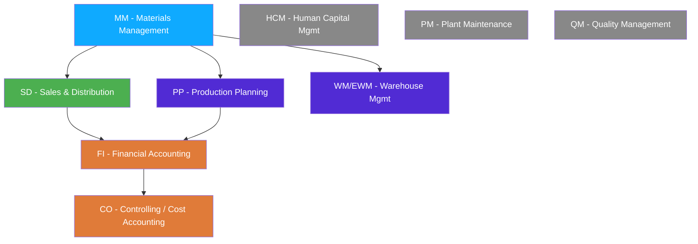

# Chapter 2: The SAP Modules Without the Jargon

> *"You don't have to be a functional expert — but you do have to speak the language."*

---

## ☕ Why you need to know this

You're a developer. You write code, not business processes. So why do you need to know what "MM" or "FI" means?

Because every ABAP ticket you'll ever work on is framed in module language. A functional consultant will hand you a spec that says:

> *"When the SD sales order is created, check the MM material master for the MRP type, and if it's set to 'PD', trigger the PP production order creation and block the FI posting until approval."*

If you don't know what SD, MM, MRP, PP, and FI mean — even roughly — you can't ask the right clarifying questions. You'll mis-read the spec and write wrong code. And in an interview, when someone asks "do you have any MM experience?", you need to know whether to say yes or no.

This chapter gives you the *developer's* understanding of SAP modules — not the deep functional knowledge (that's what functional consultants spend years on), but enough to hold the conversation and find the right tables.

---

## 2.1 🗺️ The Core Modules — One Clear Line Each

Think of SAP modules like bounded contexts in DDD, or microservices in a well-designed architecture — each covers a business domain, has its own data, its own vocabulary, and its own set of transactions.



### MM — Materials Management
Everything about *procuring goods and managing inventory*. Purchase orders, goods receipts, vendor invoices (invoice verification), inventory management, and the **material master** (the central record for every product the company buys, makes, or sells).

**You'll touch MM when:** managing stock, creating purchase orders in code, or any inbound goods flow.

---

### SD — Sales & Distribution
Everything about *selling to customers*. Sales orders, deliveries, shipments, billing/invoicing, pricing, customer master. The classic flow is: Inquiry → Quotation → **Sales Order** → **Delivery** → **Goods Issue** → **Billing Document**.

**You'll touch SD when:** anything involves a customer placing an order, shipping goods out, or generating an invoice.

---

### FI — Financial Accounting (External)
The general ledger, accounts payable, accounts receivable, bank accounting, asset accounting. Every business event that has a financial impact creates a **document** in FI — a posting with debit and credit line items in table `BSEG`.

**You'll touch FI when:** posting financial documents, reading account balances, or any integration that involves money moving.

---

### CO — Controlling (Internal Accounting)
Where Finance looks *inward* at the company — cost centers, profit centers, internal orders, product costing. FI is "what did we report to the tax authority?"; CO is "where did the money actually go inside the company?"

**You'll touch CO when:** allocating costs, reporting on profitability, or working with cost center assignments.

---

### PP — Production Planning
Managing the manufacturing process. Bills of materials (BOMs), routings, production orders, MRP (Material Requirements Planning — the algorithm that figures out what to make and when). If MM is about buying, PP is about making.

**You'll touch PP when:** building integrations between shop-floor systems, production order confirmations, or capacity planning.

---

### HCM — Human Capital Management (now SAP SuccessFactors)
Everything about employees — payroll, time management, org structure, hiring. On older systems this is SAP HR/HCM. Modern SAP pushes this to **SuccessFactors**, a cloud suite.

**You'll touch HCM when:** building HR integrations, payroll interfaces, or headcount reporting.

---

### PM — Plant Maintenance
Managing physical assets — machines, facilities, vehicles. Maintenance orders, equipment master, notification of breakdowns. Think of it as the "service tickets for machines" module.

**You'll touch PM when:** building maintenance workflows, IoT-to-SAP integrations, or asset lifecycle reporting.

---

### QM — Quality Management
Inspection plans, quality notifications, goods receipt inspection, defect recording. Sits between MM (goods receipt) and PP (production) to ensure quality gates.

**You'll touch QM when:** building inspection workflows or quality-related reporting.

---

### WM/EWM — Warehouse Management / Extended Warehouse Management
Bin-level warehouse management — which shelf, which bin, which transfer order. WM is the classic module; EWM is the modern, more powerful replacement.

**You'll touch WM/EWM when:** building warehouse automation interfaces (barcode scanners, conveyor systems, RFID).

---

## 2.2 🔁 How Modules Share Data — The Document Flow

Here's the single most important concept in SAP integration: **the document flow**.

### 1️⃣ The analogy

Think about buying something on Amazon. A single customer action ("place order") creates a chain reaction: an order record, then a warehouse pick task, then a shipping label, then a carrier handoff record, then a payment capture, then an accounting entry. One click, many documents, all linked.

SAP works exactly like this — but for enterprise business. One business transaction creates and updates multiple documents across multiple modules, all linked together in a traceable chain.

### 2️⃣ You already know this

```csharp
// In a microservices world, this would be an event chain:
// OrderPlaced event → triggers InventoryReserved event
//                  → triggers PaymentProcessed event
//                  → triggers ShipmentCreated event

// Each service handles its own domain and publishes events.
// Tracing requires correlation IDs across multiple service logs.
```

```python
# In Django / Python:
# You'd implement this as signals, Celery tasks, or explicit workflow orchestration.
# Cross-service linking is often via foreign keys in separate databases or
# a saga pattern with compensating transactions.
```

### 3️⃣ The ABAP / SAP way

In SAP, the entire chain is **within one database** and linked by document numbers. Transaction `VA03` (display sales order) shows you a **document flow** button — press it and you see the entire chain from quotation to invoice, all linked.

A classic order-to-cash flow:

```
VA01: Create Sales Order (VBAK/VBAP)
  │
  ↓
VL01N: Create Outbound Delivery (LIKP/LIPS)
  │
  ↓
VL02N: Post Goods Issue → triggers inventory decrement (MSEG) + FI posting (BKPF/BSEG)
  │
  ↓
VF01: Create Billing Document (VBRK/VBRP) → triggers FI invoice (BKPF/BSEG)
  │
  ↓
F-28: Customer payment received (BKPF/BSEG cleared)
```

Every step creates documents that reference the previous step. The linkage lives in tables like `VBFA` (Sales Document Flow) — a single table that says "SD document X was followed by SD document Y".

```abap
" Read the document flow for a sales order:
SELECT vbelv  " preceding document number
       posnv  " preceding item
       vbeln  " subsequent document number
       posnn  " subsequent item
       vbtyp_n " document type of subsequent doc
  FROM vbfa
  INTO TABLE @DATA(lt_flow)
  WHERE vbelv = '0000001234'.  " your sales order number

" This gives you: order → delivery → billing, all linked.
```

> 🧭 **On the job:** When a user says "the billing document is wrong" — before you touch code, run `VA03` on the sales order, click the **Document Flow** button, and trace through the chain. 90% of the time you'll identify whether it's an SD configuration issue, an MM stock problem, or an FI posting failure before writing a single line of code.

---

## 2.3 🗺️ Which Tables Belong to Which Module

This is the table you'll mentally reach for when someone says a module name. Burn these into memory before your first interview.

| Module | Key Tables | What they store | Transaction to view |
|--------|-----------|-----------------|---------------------|
| **MM** | `MARA` | Material master — general data (material number, type, unit) | MM03 / SE16N |
| **MM** | `MARC` | Material master — plant-specific data (MRP type, storage) | MM03 / SE16N |
| **MM** | `MARD` | Material master — storage location stock levels | MMBE / SE16N |
| **MM** | `EKKO` | Purchasing document header (purchase orders) | ME23N |
| **MM** | `EKPO` | Purchasing document item | ME23N |
| **MM** | `MSEG` | Material document items (goods movements) | MB03 |
| **MM** | `MKPF` | Material document header | MB03 |
| **SD** | `VBAK` | Sales document header (sales orders, quotations) | VA03 |
| **SD** | `VBAP` | Sales document items | VA03 |
| **SD** | `LIKP` | Delivery header | VL03N |
| **SD** | `LIPS` | Delivery items | VL03N |
| **SD** | `VBRK` | Billing document header | VF03 |
| **SD** | `VBRP` | Billing document items | VF03 |
| **SD** | `VBFA` | Sales document flow (links documents) | VA03 → Doc Flow |
| **SD** | `KNA1` | Customer master — general data | XD03 |
| **FI** | `BKPF` | Accounting document header | FB03 |
| **FI** | `BSEG` | Accounting document line items | FB03 |
| **FI** | `SKA1` | G/L account master (chart of accounts) | FS00 |
| **FI** | `SKAT` | G/L account descriptions | FS00 |
| **FI/S4** | `ACDOCA` | Universal journal (S/4HANA replaces many FI tables) | SE16N |
| **MM** | `LFA1` | Vendor master — general data | XK03 |
| **PP** | `AUFK` | Production order header | CO03 |
| **PP** | `AFKO` | Production order header (routing) | CO03 |
| **PP** | `MAST` | Material to BOM link | CS03 |
| **HCM** | `PA0001` | HR master — organizational assignment | PA20 |
| **HCM** | `PA0002` | HR master — personal data | PA20 |

> 💡 **Pro tip:** In any SAP system, transaction **SE16N** (Table Browser) lets you browse any table's data directly. In an interview exercise, it's often the fastest way to understand what data a table holds. Type `SE16N` → enter the table name → hit Enter.

> ⚠️ **C#/Python gotcha:** Many SAP tables have cryptic 4-6 character names inherited from the 1980s. `BKPF` is "BuchhaltungsKopF" (accounting header in German). `VBAK` is "VerkaufsBeleg AKtiv" (active sales document). You don't need to memorize the German etymology — just memorize which module they belong to and what they represent.

---

## 2.4 🎯 Why You Must Speak "Module"

### Reading a functional spec without module knowledge

Let's make this concrete. Here's a real-world functional spec excerpt (sanitized):

> *"Requirement: Z-Report ZSD_OPEN_ITEMS — For each open sales order (VBAK-GBSTK not equal to 'C'), read the corresponding customer name from KNA1, the material description from MARA/MAKT, the confirmed delivery date from VBEP, and the outstanding AR balance from BSID. Display as ALV."*

If you know the modules, this spec is immediately actionable:

| What the spec says | What you know |
|-------------------|--------------|
| `VBAK-GBSTK not equal to 'C'` | SD: open sales order (GBSTK is "Overall processing status", 'C' = completed) |
| `KNA1` | SD: customer master — join on VBAK-KUNNR |
| `MARA/MAKT` | MM: material master + text table (MAKT has descriptions by language) |
| `VBEP` | SD: Sales document schedule lines (confirmed delivery dates) |
| `BSID` | FI: open items for accounts receivable |

You can now sketch the SELECT structure before asking a single clarifying question. If you don't know these modules, you'd be paralyzed.

### Asking the right clarifying questions

Module knowledge also tells you *what questions to ask*:

> "The spec mentions BSID for AR balance — do we need to show the total open amount across all invoices for a customer, or just the amount linked to this specific sales order? And should we include disputed items (payment blocks)?"

That's a developer asking a smart question because they know FI document structure. A developer who doesn't know FI would either skip the question (and build the wrong thing) or ask something too vague to be useful.

### In interviews

Almost every ABAP developer interview includes module questions:

- *"Which module does BKPF belong to?"* (FI — accounting document header)
- *"What is the relationship between VBAK and VBAP?"* (header/item of a sales document)
- *"If I want to find all open purchase orders, which table do I look at?"* (EKKO/EKPO)
- *"What does MRP stand for and which module runs it?"* (Material Requirements Planning, PP)

You don't need to be a functional consultant. But you need to know enough to answer questions like these confidently.

> 🧭 **On the job:** The best ABAP developers I've seen aren't the ones who know the most syntax — they're the ones who can read a functional spec quickly, identify all the tables involved, and ask precise clarifying questions before writing code. Module knowledge is what enables that skill.

---

## 🧠 Recap

- **MM** (procurement/inventory), **SD** (sales/delivery), **FI** (external accounting), **CO** (internal cost control), **PP** (manufacturing), **HCM** (HR), **PM** (plant maintenance), **QM** (quality) — each is a bounded business domain with its own tables and transactions.
- **Document flow** is how modules share data: a sales order triggers a delivery, which triggers a goods issue, which triggers an accounting posting. All linked in one database. Use `VBFA` to navigate the SD flow.
- **Key tables to memorize:** MARA/MARC (MM), VBAK/VBAP (SD), KNA1 (customers), BKPF/BSEG (FI), EKKO/EKPO (purchasing). Know which module they belong to and what they store.
- **SE16N** is your table browser — use it constantly to understand what data is in a table.
- **Reading a functional spec** is a core skill. Module knowledge turns cryptic field names like `VBAK-GBSTK` and table references like `BSID` into something actionable.

---

*[← Contents](../content.md) | [← Previous: SAP & ERP for a Developer](01-sap-erp-introduction.md) | [Next: Types of SAP Projects →](03-sap-project-types.md)*
