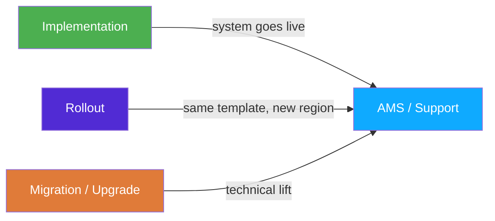
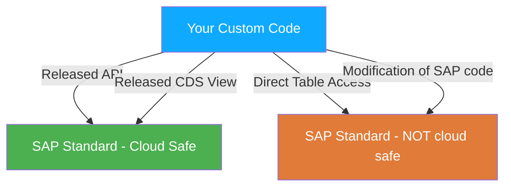
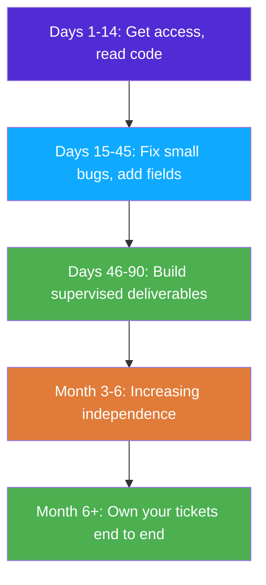

# Chapter 3: Types of SAP Projects (and Where You'll Fit)

> *"Knowing which type of project you're walking into changes everything about how you should prepare."*

---

## ☕ The interview question nobody asks — but should

Most candidates prepare for technical interviews: ABAP syntax, table names, debugging. Almost nobody prepares for the *context* question: *"What type of SAP engagement have you worked on?"*

That question matters because an ABAP developer on a greenfield S/4HANA implementation is doing completely different work from one doing production support on a 15-year-old ECC system. The tooling, the pressure, the deliverables, the skills you need most — all different.

This chapter is the map of those different worlds, and an honest look at what junior/new developers are actually asked to do in each.

---

## 3.1 🗺️ The Four Types of SAP Projects

### 3.1.1 Implementation (Greenfield / Brownfield)

**What it is:** A company that doesn't have SAP (or is replacing their old SAP with a fresh one) goes through an implementation project. This is typically an 18-month to 3-year engagement involving a large team from a consulting firm (Accenture, Deloitte, Capgemini, IBM, etc.) plus the client's internal IT.

**Greenfield** means starting from scratch — no existing customizations. You configure SAP from a clean state, build custom Z-programs where standard SAP doesn't cover the requirement, and eventually go live.

**Brownfield** means migrating an existing ECC system to S/4HANA *while keeping existing customizations*. The old data moves over; custom code is refactored to be compatible with S/4HANA's changed data model.

**What developers actually do:**
- Build custom reports (ALV reports, interactive lists)
- Write custom enhancements to standard SAP processes (user exits, BAdIs)
- Build interfaces to external systems (RFC, IDocs, web services, OData)
- Write data migration programs (BDC, LSMW, direct BAPI calls)
- Debug and fix issues found in integration testing and UAT

**Pace and pressure:** High. There are strict deadlines (go-live dates), large teams with many dependencies, and formal project gates (Unit Test, Integration Test, UAT, Regression Test, Go-Live). A bug that holds up go-live is expensive. Overtime is common in the final sprint.

**For a C#/Python dev:** This is the closest to a startup-style push you'll find in SAP. Fast learning, lots of variety, lots of exposure to the full SAP landscape. If you're new to SAP, landing on an implementation project as a junior developer is intense — but you learn an enormous amount quickly.

> 🧭 **On the job:** On an implementation project you'll hear the phrase "WRICEF" constantly. It stands for **W**orkflows, **R**eports, **I**nterfaces, **C**onversions (data migration), **E**nhancements, and **F**orms. At the start of the project, the team produces a WRICEF list — a register of all custom objects to be built. As a junior developer, you'll be assigned WRICEF items with varying complexity ratings (usually 1–3, or S/M/L).

---

### 3.1.2 AMS / Application Managed Services (Support)

**What it is:** After a system goes live, it needs ongoing support — bugs get reported, small changes are requested, performance issues arise. This is called **AMS** (Application Managed Services) or simply **support**. Many consulting firms have dedicated AMS practices; some companies have their own internal SAP support teams.

**What developers actually do:**
- Fix production bugs (often with an SLA — "P1 incidents must be resolved within 4 hours")
- Make small enhancements to existing programs ("add this field to the report", "change this validation logic")
- Investigate performance issues (slow queries, heavy background jobs)
- Do root-cause analysis on failed background jobs (SM37)
- Write small utilities and programs for one-off data fixes (but beware — even "one-off" programs in SAP need transports)

**Pace and pressure:** Cyclical. Some weeks are quiet; some weeks a critical process breaks in production and everyone scrambles. Incident severity levels (P1/P2/P3) dictate your response time. The highest-stakes moments are month-end / year-end close in FI, when finance runs all their period-end processes and any failure is business-critical.

**For a C#/Python dev:** This is the best environment to *deepen* your SAP knowledge. You're dealing with real production data, real business impact, and a wide variety of problems. The pressure teaches you to debug fast and communicate clearly with business users. The downside: you might spend years fixing the same poorly written 2007-era program instead of building anything new.

> ⚠️ **C#/Python gotcha:** In AMS, you often can't refactor a program "properly" because of regression risk and change freeze periods. You'll write precise surgical fixes rather than clean rewrites. This is frustrating for developers who want to write beautiful code. Learn to make peace with it — and add a comment explaining what the old code was doing wrong, so the next developer doesn't suffer.

---

### 3.1.3 Rollout

**What it is:** A company already has SAP running in one region (say, Germany) and wants to extend it to another region (say, Poland, Brazil, or the US). The existing system is the "template" — the new country gets the same configuration with local adaptations (language, tax law, payment methods, local currency).

**What developers actually do:**
- Adapt existing custom programs for country-specific requirements (output forms in local language, country-specific tax logic)
- Localize print forms (Smartforms / Adobe Forms) with new languages and legal content
- Handle country-specific interfaces (local e-invoicing regulations, local banking formats)
- Migrate local data (customer master, vendor master, opening balances)
- Fix issues discovered because the template doesn't account for local business differences

**Pace and pressure:** Moderate. There's a go-live deadline but the scope is more contained than a full implementation. The bigger challenge is often political — local teams want to deviate from the template, and the project has to balance standardization vs. local requirements.

**For a C#/Python dev:** Rollout projects are a good entry point. The code is already written; you're adapting and extending it. You learn by reading existing code, which teaches you SAP conventions faster than writing from scratch.

---

### 3.1.4 Migration / Upgrade

**What it is:** Two distinct things often lumped together:

- **Technical Upgrade:** Upgrading the SAP version (e.g., ECC 6.0 EHP5 → EHP8, or SAP Basis 7.40 → 7.55). Less about functionality, more about compatibility.
- **ECC → S/4HANA Migration:** The big one. Moving from ECC to S/4HANA. This is what most of the market is focused on right now (2024-2026+). It can be done as a "brownfield" conversion (keeping the existing system) or a "selective data migration" (taking only clean data to a greenfield S/4).

**What developers actually do on S/4 migration:**
- **Custom code remediation:** Running the **ABAP Test Cockpit (ATC)** and **Custom Code Migration app** to find code that uses obsolete table/field names that were changed or removed in S/4 (e.g., `BSEG` is still there, but `BSIS`/`BSID`/`BSAS` are replaced by `ACDOCA`).
- Adapting CDS views and queries that relied on old aggregate tables.
- Testing all custom programs in the S/4 sandbox and fixing incompatibilities.
- Sometimes rewriting reports to use new CDS-based Virtual Data Models (VDMs) instead of direct table access.

> 🧭 **On the job:** The ATC (ABAP Test Cockpit) is the automated code scanner that checks your ABAP for S/4HANA compatibility, clean-core compliance, and coding quality issues. Transaction `ATC` or via ADT in Eclipse. You'll run it on every custom program before migration sign-off. Learning to interpret and fix ATC findings is a *very* marketable skill right now.

---

## 3.2 ☁️ On-Prem vs RISE/Cloud — What Changes for You as a Developer

### The classic on-premise SAP landscape

Traditional SAP: the company owns servers in their own data center (or a colocation facility), runs the SAP software themselves, and their own Basis team manages everything. This is still the majority of SAP deployments today.

As a developer, you work in SAP GUI (or ADT), you have access to SE38/SE11/SE80, you can browse any table in SE16N, and you have broad access to the system.

### RISE with SAP (cloud ERP)

**RISE with SAP** is SAP's managed-cloud offering. The customer still runs SAP S/4HANA, but SAP (or a hyperscaler like AWS/Azure/GCP) manages the infrastructure. The customer pays a subscription. It's "your SAP, hosted and managed by SAP".

For you as a developer, the biggest change is **clean core** — a strict discipline required in cloud deployments:

| Capability | On-Prem | RISE/Cloud |
|-----------|---------|-----------|
| Modifying SAP standard objects | Allowed (but discouraged) | Forbidden |
| Direct table access to standard tables | Unrestricted | Restricted via released APIs |
| Custom Z-tables | Unrestricted | Allowed in your own namespace |
| Classic BAdI/User Exit | Allowed | Allowed (some deprecated) |
| Modern in-app extensions (BAdI via ADT, Key User tools) | Supported | Required / preferred |

**Clean core** means: don't touch SAP's standard objects. Use only **released APIs** — official, versioned, SAP-supported interfaces. If a CDS view or BAPI is "released" (you can check in the ABAP Development Tools with the "API State" property), you can use it. If it's not released, you shouldn't depend on it.

> ⚠️ **C#/Python gotcha:** Coming from .NET/Python, you're used to being able to look at a library's source code and depend on any internal method if you need to. In SAP Cloud/clean core, you **cannot** depend on internal SAP implementation details. If you read from `BSEG` directly in a cloud system, SAP might change the table structure in a future upgrade and break your code — and it's your problem, not SAP's, because `BSEG` is not a released API. Use released CDS views like `I_JournalEntry` instead.

### SAP BTP ABAP Environment

This is the fully cloud-native option. No SAP GUI. No SE80. You develop exclusively in **ADT (Eclipse)**. You use only **released APIs**. Classic reports and Module Pools don't exist here — everything is OData + Fiori or RAP.

The upside: you're writing the most modern, forward-compatible ABAP possible. The downside: you lose access to the classic toolkit that still dominates most real-world support tickets.

> 🧭 **On the job:** Most companies in 2024-2026 are somewhere in the middle — running on-premise S/4 or RISE, wanting to move toward clean core but still carrying years of classic custom code. The developer who can work in *both* worlds (fix the old `SE38` report AND write a new RAP service) is the most valuable.

---

## 3.3 👥 Roles on an SAP Team — Compared to What You Know

As a C#/Python developer you know roles like: developer, tech lead, DevOps engineer, product manager, QA. SAP projects have a different cast of characters. Here's the translation table.

| SAP Role | What they do | Closest equivalent you know |
|----------|-------------|----------------------------|
| **ABAP Developer** | Writes custom ABAP code: reports, enhancements, interfaces, forms | Backend / full-stack developer |
| **Functional Consultant** | Configures SAP for the business process, writes functional specs, does UAT | Business Analyst + QA + product owner combined |
| **Basis Administrator** | Manages the SAP infrastructure: system landscape, transports, performance tuning, user access | DevOps / SRE / System Admin |
| **Solution Architect / SAP Architect** | Designs the end-to-end solution, makes technology choices (RAP vs. classic, which integration pattern) | Software Architect / Principal Engineer |
| **Project Manager (PM)** | Runs the project: timelines, budget, stakeholder communication | Project Manager / Scrum Master |
| **Key User** | A business-side subject matter expert who helps define requirements and does UAT | Domain expert / Product Owner proxy |

### The ABAP developer's relationship with each role

**With the Functional Consultant:** This is your most important relationship. The FC writes the spec; you build it. When the spec is ambiguous (and it often is), you need to ask the right questions without making the FC feel like you're second-guessing them. Good questions: *"The spec says to read the customer name — should I use KNA1-NAME1 or the name from the sales order header VBAK-KUNNR → KNA1?"* That's specific and shows you've done your homework.

**With Basis:** You need Basis to import your transports. Never pressure Basis to skip the change management process — if they import at the wrong time and break production, it becomes a shared problem. Build a good relationship: when Basis has a system outage, ask if you can help test. They remember that.

**With Key Users:** They test your code. They don't care about code quality — they care about "does it do what I asked?" Learn to communicate in their language (business terms, not technical ones). When they report a bug, ask them to show you step-by-step in the test system. Developers who insist "it works for me" without watching the user reproduce it are a liability.

> 🧭 **On the job:** On every SAP project, the unwritten hierarchy is: **Functional Consultant defines what; ABAP Developer defines how; Basis defines when** (when the transport goes to production). Understanding this triangle prevents 80% of the political friction new developers experience.

---

## 3.4 🎯 The Junior Developer's First 90 Days

Let's be concrete. If you land your first ABAP role — whether it's a consulting firm, a client-side team, or an AMS shop — here's what the first 90 days typically look like.

### Days 1–14: Access and orientation

You spend most of this time getting access to things. SAP security authorizations are complex — you'll need access to DEV, QA, and eventually production. Each requires separate authorizations. This is normal and not a reflection on you.

**What you'll do:**
- Get SAP GUI installed and log into the DEV system
- Set up ADT (ABAP in Eclipse) — this will be Chapter 4
- Get access to the transport system (SE10)
- Receive your first "reading assignment": look at existing custom programs to understand coding standards
- Shadow a senior developer while they work on a ticket

**Transactions you'll open:** SE38, SE11, SE16N, SE80, SE10.

### Days 15–45: First real tickets

You'll be assigned simple tickets — "beginner tax" items that senior developers don't want to spend time on.

**Typical first tickets:**
- Fix a syntax error or short dump (runtime error) in an existing report — look in transaction `ST22` for short dump analysis
- Add a field to an existing ALV report (someone wants to see one more column)
- Change a text in an existing print form
- Write a simple selection screen program that reads a table and displays results

> 💡 **What makes a good junior developer stand out:** Don't just fix the bug — understand *why* it happened. When you fix a short dump, write a comment in the code explaining what was wrong and what you changed. Mention it in your ticket notes. Senior developers notice when juniors dig into root causes instead of just patching symptoms.

### Days 46–90: Building something with supervision

By the 6-week mark you should have enough context to build something end-to-end. It will be supervised, and a senior developer will review your code — but it will be yours.

**Typical supervised deliverables:**
- A complete ALV report reading from 2–3 tables with proper selection screen and authority checks
- A custom enhancement (BAdI or user exit) that adds a validation to an existing SAP process
- A simple RFC-enabled function module that exposes data to an external system
- A data migration utility (read from a CSV or legacy table, validate, load via BAPI)

> ⚠️ **C#/Python gotcha:** The biggest trap for new ABAP developers with a programming background is **over-engineering**. SAP business users don't care about your clean architecture patterns. They care about correctness and performance. Write code that works, is clearly readable, and is easy to change. Resist the urge to create six layers of abstraction for a 200-line report.

### The learning curve is real — but it's not what you expect

Here's the honest truth: the ABAP *language* will feel comfortable within 2–3 weeks if you already program. What will feel uncomfortable for 3–6 months is everything else:

- Knowing *which* tables to read for a given requirement
- Knowing *which* standard SAP function module or BAPI exists so you don't reinvent the wheel
- Understanding the transport system deeply enough to not accidentally break something
- Navigating the SAP GUI efficiently (there are keyboard shortcuts that make you 3x faster — learn them)
- Building a mental model of how a business process (procure-to-pay, order-to-cash) maps to SAP documents and tables

All of those are experience problems, not intelligence problems. They improve fast, and everyone who's been in SAP for a year has been exactly where you are now.

### Practical things to do in your first 90 days

1. **Build a personal "cheat sheet" in Markdown** — every time you discover a table, BAPI, or transaction you didn't know, add it. By day 90 you'll have 50 entries; by month 6 you'll have 200.
2. **Read existing code with SE38** — open any custom program (names starting with `Z` or `Y`) and trace through what it does. Reading other people's ABAP is the fastest way to learn patterns and idioms.
3. **Use SE16N as your first debugging step** — before you set a breakpoint, look at the actual data in the tables the program is reading. Is the data there? Is it in the right client?
4. **Learn the `ST22` short dump analyzer** — it tells you exactly which line caused a runtime error and why. This saves enormous time.
5. **Ask your functional consultant to walk you through the business process once** — before you write code for a module you've never seen, ask for a 30-minute demo in the system. Watch them create a sales order or post an invoice. The table joins will make much more sense.

---

## 🧠 Recap

- **Four project types:** Implementation (build new), AMS/Support (maintain existing), Rollout (expand to new regions), Migration/Upgrade (move to S/4HANA). Each has different pace, different types of work, and different learning opportunities.
- **On-prem vs cloud:** RISE/cloud requires **clean core** — only use released APIs, no modifying SAP standard. On-prem is more flexible but less future-proof. Most real projects are somewhere in between.
- **The SAP team triangle:** Functional Consultant (what), ABAP Developer (how), Basis (when/where). Building good working relationships with FCs and Basis makes you far more effective.
- **First 90 days reality check:** The ABAP syntax is the easy part. The table knowledge, business process understanding, and transport discipline are what take time. Be patient with yourself.
- **Best junior habits:** Build a personal cheat sheet, read existing Z-programs, use SE16N before setting breakpoints, and always ask "why did this bug happen?" not just "what do I patch?".

---

*[← Contents](../content.md) | [← Previous: The SAP Modules](02-sap-modules.md) | [Next: ABAP on Eclipse / ADT →](04-abap-on-eclipse-adt.md)*
