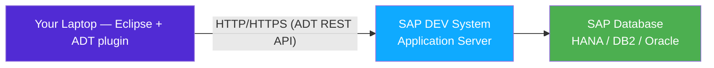
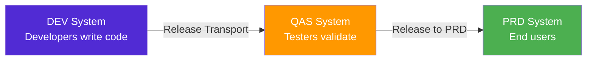

# Chapter 4: ABAP on Eclipse (ADT) — Your New Visual Studio

*From SE80 dinosaur to Eclipse powerhouse — and why modern SAP teams never look back.*

---

## ☕ Let's start with a confession

The first time most people open classic SAP — they click into `SE80`, the "ABAP Workbench" — they think the same thing: *"Is this... from 1998? Are they serious?"*

Yes, it kind of is. And yes, they were serious — for a long time.

But here's the thing: **SAP teams that still live inside SE80 are increasingly in the minority.** Modern ABAP development happens in **ADT** (ABAP Development Tools), a plugin that turns Eclipse into a fully capable ABAP IDE. If you've lived in Visual Studio or VS Code, ADT will feel like home much faster than SE80 ever would.

This chapter gets you productive in ADT as fast as possible. We cover the setup, the mental model, the keyboard shortcuts you'll miss from Visual Studio, and the one SAP concept that has no real parallel in .NET or Python: **transports**.

---

## 4.1 ADT vs SE80 — the modern vs classic IDE

### 1️⃣ The analogy

Think of it this way: SE80 is the SAP GUI equivalent of Notepad++ with some menus bolted on. It runs inside the SAP GUI desktop client, it has its own object navigator, and it predates most of what you'd call a modern developer experience.

ADT is Eclipse — the same open-source IDE you might know from Java — with a rich SAP plugin that gives you ABAP language support, refactoring, proper search, and integration with ABAP Unit. It talks to the SAP backend over HTTP (the SAP ADT REST API), which means you're editing code *live on the server*, with a proper editor in front of you.

### 2️⃣ You already know this

```csharp
// In .NET land you have a clear split:
// - Visual Studio (the big IDE) or VS Code (the lightweight editor)
// - MSBuild compiles locally
// - Git tracks your changes locally before push

// The mental model: edit locally → compile locally → commit → push
```

```python
# Python equivalent:
# - PyCharm or VS Code
# - Python interpreter runs locally
# - git for versioning
```

### 3️⃣ The ABAP way

ABAP is different in a key way: **there is no local compilation.** Your code lives on the SAP *application server* — a remote machine. Both SE80 and ADT are just *windows into that server*. When you hit **Activate** (the ABAP equivalent of "build"), the server compiles and stores the code. Every developer on the team edits the *same running system* (the DEV system).



**SE80 vs ADT: the comparison table**

| Feature | SE80 (classic) | ADT (Eclipse) |
|---|---|---|
| Where it runs | Inside SAP GUI desktop client | Eclipse on your laptop |
| Code navigation | Separate object browser tree | F3 go-to-definition (like VS) |
| Refactoring | Minimal | Extract method, rename, quick fix |
| ABAP Unit tests | Limited | Full test runner with red/green |
| Search | Mostly transaction-based | ABAP repository search, cross-references |
| Code completion | Basic | IntelliSense-style Ctrl+Space |
| Multiple files | Tabbed, limited | Full Eclipse multi-editor |
| Debugger | SE80 debugger | Integrated debugger in Eclipse |

> 🧭 **On the job:** When you join a team, ask which IDE they use. If the answer is SE80, it's usually an older system or an older team culture. Either way, ADT is worth pushing for — and you'll be more productive in it.

> ⚠️ **C#/Python gotcha:** In VS/VS Code, your *workspace* is a folder on your hard drive. In ADT, your "workspace" is a *live connection to the SAP server*. There is no "offline" mode — if the server is down, you can't develop. This surprises almost every new ABAP developer.

---

## 4.2 Connecting to a system — ABAP Projects and favorite packages

### 1️⃣ The analogy

An **ABAP Project** in ADT is like a connection profile in SQL Server Management Studio or a "Remote Interpreter" in PyCharm. It stores the server address, system ID, client number, and your credentials — and gives you a window into that SAP system.

### 2️⃣ You already know this

```csharp
// In .NET, a "connection" to a remote system is usually a config:
// appsettings.json → connection string → Entity Framework

// In ADT, the equivalent is an "ABAP Project":
// New → Other → ABAP → ABAP Project
// → enter server, system ID (SID), instance number, client, user/password
```

### 3️⃣ The ABAP way

**Creating your first ABAP Project in ADT:**

1. Open Eclipse → **File → New → Other → ABAP → ABAP Project**
2. Enter the connection details:
   - **Application server**: hostname or IP
   - **Instance number**: usually `00`
   - **System ID (SID)**: 3-letter system identifier, e.g., `NSP`
   - **Client**: 3-digit number, e.g., `001`
3. Authenticate with your user/password.
4. Eclipse connects and shows the **Project Explorer** on the left — this is your object navigator.

```
Project Explorer
└── NSP [DEV] (your ABAP Project)
    ├── Favorite Packages
    │   └── $TMP (local objects, no transport needed)
    │   └── ZMYPACKAGE (your custom package)
    ├── Favorite Objects
    └── (etc.)
```

**Favorite Packages** are like pinned bookmarks — you add the packages (more on those in 4.3) you work in most often so they appear at the top of the tree.

> 💡 **Local package `$TMP`:** When you're experimenting or learning, create objects in `$TMP` — this is the "local" package that doesn't require a transport. Nothing in `$TMP` will ever move to another system. Perfect for practice; never use it for real work.

**The `.conn_adt` file (for teams using ADT config automation):**

Some teams check in a `.conn_adt` or similar config file with connection presets. When you see one in a repository, it's the team's shortcut for setting up a new developer's ADT connection without manual entry.

---

## 4.3 Packages & Transports — Solution + change-shipping mechanism

This is the biggest conceptual gap for .NET/Python developers. Give it five minutes because it will save you hours of confusion on the job.

### 1️⃣ The analogy

Imagine if Visual Studio enforced the following rule: *every file you change must be tagged to a "change ticket" before you can save, and that ticket is what gets deployed to QA and Production — not a git branch, not a pipeline artifact, but literally the ticket itself.*

That's what **Transport Requests** are. They are the deployment unit in SAP.

### 2️⃣ You already know this

```csharp
// In .NET / DevOps you have:
// 1. A solution/project structure (organizes code)
// 2. Git branches + PRs (tracks what changed)
// 3. A CI/CD pipeline artifact (what gets deployed to QA/Prod)

// In SAP:
// 1. Packages     ← organizes code (like a project/namespace)
// 2. Transport Requests ← tracks what changed AND is the deployment artifact
// 3. TMS (Transport Management System) ← moves the transport DEV→QAS→PRD
```

### 3️⃣ The ABAP way

**Packages** are hierarchical containers for ABAP objects (programs, classes, tables, etc.). They define which **software component** owns an object and determine transport behavior.

```
$TMP          ← local, no transport (dev scratch space)
ZMYAPP        ← your custom package
  ZMYAPP_DATA ← sub-package for data dictionary objects
  ZMYAPP_UI   ← sub-package for screens / UI
```

You create/manage packages via `SE80` → Package node, or in ADT right-click → New → ABAP Package.

**Transport Requests** work like this:



Every time you create a new ABAP object (a class, a table, a program), SAP asks: *"Which transport request should this go into?"* You either pick an existing open request or create a new one. That request is your "change ticket."

**The transport lifecycle:**

1. **Open** — you're actively working, adding objects to it.
2. **Released** — you're done; the request is "sealed" and queued for import into QAS.
3. **Imported to QAS** — the Basis team (SAP system admins) imports it; testers validate.
4. **Imported to PRD** — after sign-off, goes to production.

Transaction codes for transports:
- `SE09` — view your own transport requests
- `SE10` — view all transport requests (more detail)
- `STMS` — the Transport Management System (Basis/admin tool)

> ⚠️ **C#/Python gotcha:** Transports are **not git**. There is no branching, no merging, no diff between transport versions. If two developers change the same object in different transports and both release, whoever imports *last* wins — and the other's changes are silently overwritten. This is why SAP teams have strict processes around transport management. Some use tools like **gCTS** (git-enabled Change and Transport System) to bring git into the picture, but it's not universal.

> 🧭 **On the job:** On your first day, ask: *"What transport request should I use for my changes?"* Never create objects in `$TMP` for real work. Always ask before releasing a transport — releasing it starts the deployment chain.

**Package vs Transport: the one-line summary**

> *A Package is where your code lives. A Transport is how it travels.*

---

## 4.4 Activation vs Save — Syntax check, and the ABAP Debugger

### 1️⃣ The analogy

In Visual Studio, pressing **Ctrl+S** saves your file *and* a background compiler checks for syntax errors immediately. Building the project compiles everything. In ABAP, these steps are more explicitly separated — and the distinction matters.

### 2️⃣ You already know this

```csharp
// .NET lifecycle:
// Ctrl+S         → file saved to disk, background Roslyn analysis runs
// Ctrl+Shift+B   → full build (compilation)
// F5             → build + run + attach debugger
```

### 3️⃣ The ABAP way

ABAP has three distinct steps you'll do constantly:

| Action | Shortcut | What it does |
|---|---|---|
| **Check** (syntax only) | `Ctrl+F2` | Parses your code for syntax errors without saving or activating |
| **Save** (store inactive version) | `Ctrl+S` | Saves an *inactive* copy to the server; others can't see it yet |
| **Activate** | `Ctrl+F3` | Compiles and makes the object live; this is the ABAP "build" |

> ⚠️ **C#/Python gotcha:** Until you **Activate**, your changes don't exist for anyone else — not even for your own test runs. A common beginner mistake is saving code, running a test program, and being baffled that nothing changed. *You forgot to Activate.* `Ctrl+F3` is the most important key in ABAP development.

**The ABAP Debugger in ADT**

The ADT debugger is genuinely comparable to the Visual Studio debugger. You set breakpoints by clicking the gutter (or pressing `Ctrl+Shift+Alt+H` to set a breakpoint at the cursor), run the program, and the debugger halts at the breakpoint.

```
Debugger features in ADT:
├── Breakpoints (line breakpoints, exception breakpoints)
├── Step Over (F6)         — like F10 in VS
├── Step Into (F5)         — like F11 in VS
├── Step Return (F7)       — like Shift+F11 in VS
├── Resume (F8)            — like F5 in VS
├── Variables view         — inspect any DATA variable
├── ABAP Objects pane      — inspect object attributes
└── Watchpoints            — halt when a variable changes value
```

**Setting a session breakpoint from code:**

```abap
" Hard-coded breakpoint — halts execution for the current user
" (remove before transport — don't leave these in production code!)
BREAK-POINT.

" Or: break only for a specific user (useful in shared systems)
BREAK your_user_name.
```

> 💡 **The external debugger** — If you're testing something triggered from the SAP GUI (not from ADT directly), you can turn on the "External Breakpoints" mode in ADT: in the debugger configuration, enable "Break at next statement for user <name>." The next SAP transaction you execute from SAP GUI will be intercepted by the ADT debugger.

**Classic SE80/SAP GUI debugger** (you'll encounter it on older systems):

Type `/h` in the command field of any SAP GUI screen to activate the classic debugger for that transaction. This is the old-school way and still works everywhere — good to know when ADT isn't available.

---

## 4.5 Keyboard shortcuts & habits a Visual Studio / VS Code dev will love

ADT is Eclipse, so most Eclipse shortcuts apply. Here are the ones that map directly to muscle memory from Visual Studio or VS Code:

### Essential shortcuts

| What you want | VS / VS Code | ADT (Eclipse) |
|---|---|---|
| Code completion | `Ctrl+Space` | `Ctrl+Space` (same!) |
| Go to definition | `F12` | `F3` |
| Find references / where-used | `Shift+F12` | `Ctrl+Shift+G` |
| Quick fix / lightbulb | `Ctrl+.` | `Ctrl+1` |
| Rename refactor | `F2` | `Alt+Shift+R` |
| Format document | `Ctrl+K, Ctrl+D` | `Ctrl+Shift+F` (ABAP pretty-printer) |
| Open type/class | `Ctrl+T` | `Ctrl+Shift+A` (Open ABAP Dev Object) |
| Run program | `F5` | `F8` (Run) |
| Toggle line comment | `Ctrl+/` | `Ctrl+/` (same!) |
| Split editor | drag tab | Eclipse drag tab |
| Activate | (compile = Ctrl+Shift+B) | `Ctrl+F3` |
| Syntax check only | (background, automatic) | `Ctrl+F2` |

### The ABAP Pretty Printer (`Ctrl+Shift+F`)

ABAP has an opinionated formatter. Pressing `Ctrl+Shift+F` reformats the whole file: keywords uppercase (in classic ABAP style), proper indentation, consistent spacing. It's not quite `dotnet format` or Black, but it does the job.

> 💡 Some modern ABAP teams use lowercase keywords (it's valid since ABAP 7.0). Don't fight the team convention — if the codebase uses uppercase, keep it uppercase. The pretty-printer can be configured per project.

### Navigating an unfamiliar codebase

This is where ADT really shines compared to SE80:

```
Ctrl+Shift+A  → "Open ABAP Development Object" — the universal jump-to
                  Type a class name, program name, table name, BAPI — anything.
                  Like VS "Navigate To" or VS Code Ctrl+P

F3            → Go to definition of whatever's under the cursor
                  Click on a method call, F3 → lands in the method body
                  Click on a type, F3 → lands in the DDIC definition

Ctrl+Shift+G  → Where-used list — find every place this method/variable is called
                  Critical for impact analysis before changing anything

Ctrl+H        → Full-text search across the ABAP repository
                  (slower than grep but searches the live server)
```

### The ABAP Type Hierarchy (F4 in ADT)

Right-click any class or interface → **Open Type Hierarchy** (or `F4`). Shows you the full inheritance and interface-implementation tree — exactly like VS's "View Class Diagram" or the type hierarchy in IntelliJ.

> 🧭 **On the job:** Your first week on a real project, you'll spend 80% of your time *reading* code, not writing it. `Ctrl+Shift+A` + `F3` + `Ctrl+Shift+G` are your primary navigation tools. Learn them on day one.

### ABAP Unit in ADT

ADT has a built-in test runner. Select a class or package, right-click → **Run As → ABAP Unit Test**. You get a JUnit-style red/green view. We cover writing ABAP Unit tests properly in a later chapter, but knowing the runner is here matters for day one.

```abap
" A minimal ABAP Unit test class (preview)
CLASS zcl_my_calculator_test DEFINITION FINAL
  FOR TESTING RISK LEVEL HARMLESS DURATION SHORT.

  PRIVATE SECTION.
    METHODS: add_two_numbers FOR TESTING.
ENDCLASS.

CLASS zcl_my_calculator_test IMPLEMENTATION.
  METHOD add_two_numbers.
    DATA(result) = zcl_my_calculator=>add( a = 2  b = 3 ).
    cl_abap_unit_assert=>assert_equals(
      act = result
      exp = 5 ).
  ENDMETHOD.
ENDCLASS.
```

Green bar in ADT → your method works. Red bar → expand the node to see the assertion failure message. Same developer experience as NUnit/xUnit in VS.

---

## 🧠 Recap

- **ADT** is Eclipse with an SAP plugin — it's a real IDE, not the legacy SE80 workbench. Modern SAP teams use it.
- An **ABAP Project** is a connection profile to a SAP system. Code lives on the server, not locally.
- **Packages** organize objects (like namespaces/projects). **Transports** ship those objects DEV → QAS → PRD. They are not git — they're deployment artifacts.
- `$TMP` is for scratch work only. Real work always goes into a transportable package with a transport request.
- **Save** stores an inactive copy. **Activate** (`Ctrl+F3`) compiles and makes it live. Forgetting to activate is the #1 beginner mistake.
- The ADT **debugger** is VS-quality: breakpoints, step-over/into, variable inspection.
- Key shortcuts to memorize day one: `Ctrl+Space` (complete), `F3` (go to definition), `Ctrl+Shift+G` (where-used), `Ctrl+1` (quick fix), `Ctrl+F3` (activate).

---

*[← Contents](../content.md) | [← Previous: Types of SAP Projects](03-sap-project-types.md) | [Next: The Data Dictionary (DDIC) →](05-data-dictionary-ddic.md)*
