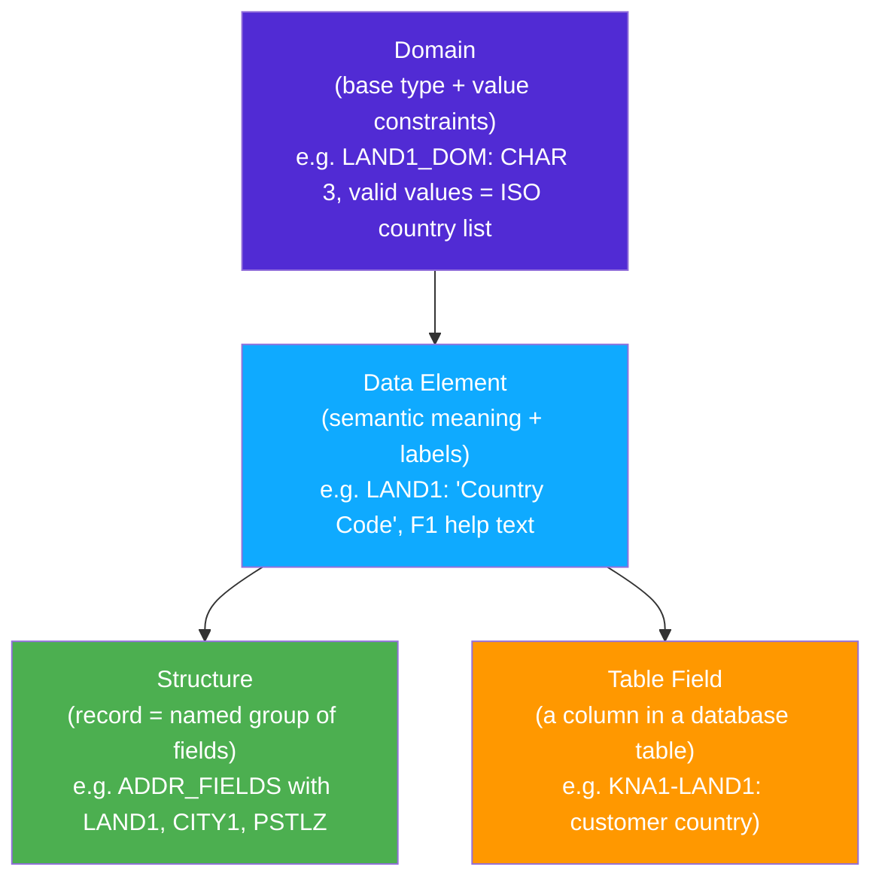
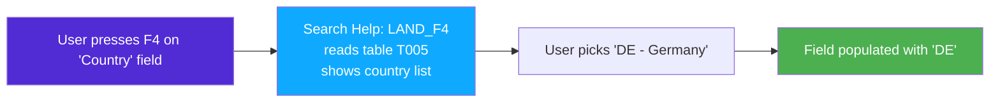

# Chapter 5: The Data Dictionary (DDIC) — SAP's Schema Layer

*The reason SAP data is consistent across 500 modules written over 40 years — and why your DTOs and EF models don't scale to that.*

---

## ☕ Why does this even exist?

Imagine you're a .NET developer at a company and you need to store a customer's country code. You create a `string CountryCode` on your `Customer` DTO. Your colleague in the billing service creates `string Country`. The HR service uses `char[3] CountryIsoCode`. Three services, three spellings, zero guarantee they mean the same thing.

Now imagine doing that across 500 application modules, 40 years, and 50,000+ database tables. You'd end up with exactly what SAP *would* have ended up with — except SAP made a different choice in the 1980s. They built the **Data Dictionary (DDIC)**: a centralized type registry where every field, every table column, and every reusable data type is defined exactly once and shared everywhere.

When SAP says a field has `Data Element LAND1`, you *know* it's a 3-character country code — in every single one of those 50,000 tables. That's the DDIC.

---

## 5.1 Why DDIC exists — centralized, reusable typing

### 1️⃣ The analogy

Think of DDIC as a company-wide type library that everyone is *forced* to use. Instead of each developer defining their own `string`, `decimal`, or record type, they pick from the catalogue. The catalogue has search helps (dropdowns for valid values), documentation, conversion routines, and semantic names baked in.

### 2️⃣ You already know this

```csharp
// Typical .NET approach — scattered, inconsistent
// Order service DTO:
public record OrderHeader(
    string OrderId,        // how long? what format?
    string CustomerId,     // 10 chars? GUID?
    decimal TotalAmount,   // how many decimal places?
    DateTime OrderDate
);

// Invoice service DTO — made by a different dev, different sprint:
public record Invoice(
    string InvoiceNumber,
    string CustId,         // same as CustomerId above? different?
    double Amount,         // decimal vs double — uh oh
    DateOnly Date
);
```

```python
# Python — same problem with dataclasses or dicts
from dataclasses import dataclass

@dataclass
class OrderHeader:
    order_id: str        # any length, any format
    customer_id: str
    total: float         # precision? currency?
    order_date: str      # datetime? ISO string? timestamp?
```

### 3️⃣ The ABAP way

In SAP, those inconsistencies simply can't happen for standard fields because the DDIC enforces a shared type. When you define a table column, you don't type `CHAR(3)` — you say "this column has Data Element `LAND1`" and the DDIC knows everything about it: length, format, valid values, label, documentation.

```abap
" In a DDIC table definition (shown as ABAP-style pseudo-code):
" Field LAND1 is not declared as CHAR(3) —
" it references the pre-existing Data Element LAND1
" which is defined once in the DDIC and shared across all tables.

" When you read it in ABAP:
DATA lv_country TYPE land1.   " land1 = CHAR length 3, country code domain
```

The DDIC is your company's enforced type contract, and it's *the* foundation skill for understanding any SAP codebase.

> 🧭 **On the job:** In interviews and code reviews, you'll hear "what's the data element?" not "what's the data type?" Learning to look up data elements in `SE11` instantly marks you as someone who knows SAP.

---

## 5.2 The layered type system: Domain → Data Element → Structure → Table

This is the single most important mental model in this chapter. Read it twice.



Let's walk up the stack.

### Domains — the base type with constraints

A **Domain** defines the *technical* type: data type (character, numeric, date…), length, and optionally a fixed list of allowed values.

```
Domain: LAND1_DOM
  Data type: CHAR
  Length:    3
  Fixed values: (none — checked against a value table T005 instead)

Domain: XFELD  (common boolean-ish domain)
  Data type: CHAR
  Length:    1
  Fixed values: ' ' = blank/false, 'X' = true/yes
```

> ⚠️ **C#/Python gotcha:** There is no `bool` in classic ABAP. The SAP convention for a boolean flag is `CHAR(1)` with domain `XFELD`: `' '` means false, `'X'` means true. You'll see this *everywhere*. `IF lv_flag = 'X'.` is the ABAP idiom for `if flag:`.

### Data Elements — semantic meaning

A **Data Element** wraps a Domain and adds human-readable meaning: field labels (short/medium/long), F1 help documentation, and optional search help assignment.

```
Data Element: LAND1
  Domain:       LAND1_DOM (CHAR 3)
  Short label:  "Ctry"
  Medium label: "Country"
  Long label:   "Country Key"
  F1 doc:       "Key for the country in which the customer/vendor is located"
```

The same Data Element `LAND1` is reused in hundreds of tables: customer master (`KNA1`), vendor master (`LFA1`), company code (`T001`), plant (`T001W`)... They all mean exactly the same thing, have the same labels in the UI, and share the same F4 dropdown.

### Structures — the record / DTO

A **Structure** is a named group of fields (using Data Elements or other structures). It has no database table — it's purely a type definition for use in ABAP programs.

```
Structure: BAPIADDR1  (a standard SAP address structure)
  STREET     TYPE AD_STREET    (Data Element → Domain → CHAR 60)
  CITY       TYPE AD_CITY1     (CHAR 40)
  POSTL_COD1 TYPE AD_PSTCD1    (CHAR 10)
  COUNTRY    TYPE LAND1        (CHAR 3)
  ...
```

Structures are what you use as *work areas* — the ABAP equivalent of a local variable that holds one row of data. We cover that in Chapter 6.

### Tables — persisted structures with a primary key

A **Transparent Table** is a structure that is also physically stored in the database. One DDIC table = one database table.

```
Table: KNA1  (Customer Master: General Data)
  MANDT  TYPE MANDT   " Client (always first, always)
  KUNNR  TYPE KUNNR   " Customer number — the primary key field
  LAND1  TYPE LAND1   " Country
  NAME1  TYPE NAME1_GP " Name 1
  ORT01  TYPE ORT01   " City
  PSTLZ  TYPE PSTLZ   " Postal code
  ... (hundreds more fields)
  Primary Key: MANDT + KUNNR
```

---

## 5.3 Transparent tables, primary keys, and MANDT

### 1️⃣ The analogy

A SAP **transparent table** is a 1:1 mapping to a physical database table — what you'd call a "table" in SQL Server, PostgreSQL, or any ORM. Nothing tricky there.

What *is* SAP-specific is the **MANDT** field.

### 2️⃣ You already know this

```csharp
// In multi-tenant .NET, you might add a TenantId to every table:
public class Order
{
    public string TenantId { get; set; }  // isolates data per tenant
    public string OrderId  { get; set; }
    // ...
}
```

### 3️⃣ The ABAP way

SAP systems are inherently **multi-client**. One SAP system installation (one set of servers) can host multiple completely isolated "clients" — each has its own data. Client 100 might be Production. Client 200 might be QA. Client 000 is the default delivery client.

The **MANDT** (Mandant = German for "client") field is always the first field in any client-dependent table and is always part of the primary key. SAP automatically filters every query by the current client — you never write `WHERE MANDT = sy-mandt` in your ABAP code (it's added automatically by Open SQL).

```abap
" You write this:
SELECT * FROM kna1 INTO TABLE @DATA(lt_customers)
  WHERE land1 = 'DE'.

" Open SQL actually sends to the DB roughly this:
" SELECT * FROM KNA1 WHERE MANDT = '100' AND LAND1 = 'DE'
"                                          ^ injected automatically
```

> ⚠️ **C#/Python gotcha:** If you ever look at a SAP table in raw SQL (e.g., via a DB browser), all tables have MANDT as the first column. Don't include it in your ABAP WHERE clauses — it's handled for you, and adding it manually is redundant (though harmless).

**Primary keys in DDIC tables**

Every DDIC table defines its primary key fields. In the DDIC, you mark fields with the "Key" checkbox. Primary key = MANDT + the technical key fields.

**Indexes**

You can define secondary indexes in DDIC (`SE11` → table → Indexes tab). These become physical DB indexes. On large tables (like `BSEG` with billions of rows in a busy SAP system), the right index is the difference between a 0.1-second query and a 10-minute one.

```abap
" Without a proper index, this hits BSEG full table scan:
SELECT * FROM bseg INTO TABLE @DATA(lt_items)
  WHERE bukrs = '1000' AND gjahr = '2024'.

" With an index on BUKRS+GJAHR, it's fast.
" Your Basis/DBA team manages production indexes,
" but you can define them in the DDIC for your own tables.
```

---

## 5.4 Table types, search helps (F4), and foreign keys

### Table types (DDIC)

Don't confuse "DDIC table types" with the database tables above. A **DDIC Table Type** is a type definition for an *internal table* — the ABAP in-memory list structure. You define the row type (a structure) and the table type (STANDARD/SORTED/HASHED), then reference it in programs with `TYPE`.

```abap
" A DDIC table type might be called: BAPIRET2TAB
" Row type: structure BAPIRET2 (standard SAP return message structure)
" Table type: STANDARD TABLE

DATA lt_messages TYPE bapiret2tab.  " uses the DDIC table type
```

This lets you use the same table type across multiple programs and BAPIs without redefining it every time.

### Search Helps (F4 helps) — the dropdown catalogue

When a user clicks on a field in a SAP screen and presses **F4**, they get a dropdown/search popup with valid values. This is the **Search Help** (also called F4 help). It's defined in the DDIC and attached to a Data Element or directly to a table field.



From an ABAP developer's perspective: if a field has a search help attached to its Data Element, users get F4 for free — no coding needed.

### Foreign Keys

DDIC lets you define foreign key relationships between tables, similar to SQL foreign keys. The "check table" provides the valid values.

```
Table:     ZCUSTOMER_ORDERS
Field:     LAND1  (Type: LAND1)
Foreign Key → Check Table: T005 (Countries)
              Key Fields:  T005-MANDT = ZCUSTOMER_ORDERS-MANDT
                           T005-LAND1 = ZCUSTOMER_ORDERS-LAND1
```

This means SAP will validate that `LAND1` entered by the user actually exists in `T005` — and automatically generates an F4 search help from `T005`.

> 🧭 **On the job:** Understanding search helps and foreign keys matters when building dialog screens or OData services. "Why isn't my F4 help working?" is a common question — 90% of the time, the search help isn't attached to the right Data Element.

---

## 5.5 SE11 walkthrough — building your first custom table

Let's make it concrete. We'll build a simple table called `ZORDERS` (custom objects always start with `Z` or `Y`).

### Opening SE11

Type `SE11` in the SAP GUI command field and press Enter. This is the **ABAP Dictionary** transaction — your home for all DDIC work. Alternatively, in ADT right-click your package → New → Other ABAP Repository Object → Dictionary → Database Table.

```
SE11 main screen:
  [ ] Database table    [ZORDERS         ] [Display] [Change] [Create]
  [ ] View
  [ ] Data type
  [ ] Type group
  [ ] Domain
  [ ] Search help
  [ ] Lock object
```

### Creating the table (prose walkthrough)

**Step 1 — Basic attributes**

Enter `ZORDERS` in the Database Table field and click Create. Fill in:
- Short Description: `Customer Orders (demo)`
- Delivery Class: `A` (application table — stores transaction data)
- Data Browser/Table View Maintenance: `Display/Maintenance Allowed`

**Step 2 — Fields**

Click the Fields tab. You'll add columns one by one:

| Field | Key | Data Element | Description |
|-------|-----|-------------|-------------|
| MANDT | ✓ | MANDT | Client |
| ORDER_ID | ✓ | SYSUUID_C32 | Order UUID (or use a custom DE) |
| KUNNR | | KUNNR | Customer Number |
| NETWR | | NETWR | Net Value |
| WAERS | | WAERS | Currency |
| ERDAT | | ERDAT | Creation Date |
| ERZET | | ERZET | Creation Time |
| ERNAM | | ERNAM | Created By |

Notice: you type a Data Element name in the "Data Element" column, and SE11 automatically fills in the length, type, and labels. That's the DDIC in action — you're *referencing* existing semantic types, not inventing new ones.

**Step 3 — Technical settings**

From the menu: Extras → Technical Settings:
- Data Class: `APPL0` (master and transaction data — most common)
- Size Category: `0` (small table, up to ~600 rows) or `1` for medium

**Step 4 — Activate**

Press the **Activate** button (or F8). SAP will:
1. Validate your field definitions against the DDIC.
2. Create the physical database table.
3. Prompt you for a transport request (see Chapter 4).

After activation, `ZORDERS` exists as both a DDIC definition and a real database table. You can immediately `SELECT * FROM zorders` in ABAP.

### Viewing table content

After your table exists, you can view/edit its contents with transaction `SE16` (Data Browser) or `SE16N`. Type the table name, press Enter, and you get a spreadsheet-style view of the rows. Excellent for debugging.

```
SE16 → Table name: ZORDERS → Execute
→ Shows all rows currently in ZORDERS as a grid
```

> 💡 **SE16 vs SE16N:** SE16 is the classic viewer. SE16N is a newer version with more filter options. On S/4HANA systems, `SE16H` (with HANA-accelerated display) is also available.

---

## The C#/Python parallel — side by side

Let's put it all together with a realistic comparison. You're building an orders feature.

### C# — Entity Framework approach

```csharp
// The "scattered DTO + EF model" approach common in .NET

// 1. Domain model / EF entity
[Table("Orders")]
public class Order
{
    [Key]
    public Guid OrderId { get; set; }

    [Required, MaxLength(10)]
    public string CustomerId { get; set; }   // no shared type — just a string

    [Column(TypeName = "decimal(15,2)")]
    public decimal NetAmount { get; set; }

    [MaxLength(5)]
    public string Currency { get; set; }     // "USD"? "EUR"? any 5-char string

    public DateTime CreatedAt { get; set; }
}

// 2. EF DbContext
public class AppDbContext : DbContext
{
    public DbSet<Order> Orders { get; set; }
}

// 3. Usage
using var db = new AppDbContext();
var deOrders = db.Orders
    .Where(o => o.Currency == "EUR")
    .ToList();
```

```python
# Python — SQLAlchemy / dataclass approach
from dataclasses import dataclass
from datetime import datetime
from sqlalchemy import Column, String, Numeric, DateTime
from sqlalchemy.orm import DeclarativeBase

class Base(DeclarativeBase):
    pass

class Order(Base):
    __tablename__ = "orders"

    order_id:   str       # no enforcement of format
    customer_id: str      # could be anything
    net_amount: float     # float precision issues
    currency:   str       # no F4 help, no validation
    created_at: datetime
```

### SAP ABAP — DDIC + Open SQL approach

```abap
" 1. DDIC table ZORDERS exists (defined in SE11 as shown above)
"    Fields use standard Data Elements: KUNNR, NETWR, WAERS, ERDAT
"    WAERS has F4 help automatically (currency key from T009)
"    KUNNR has foreign key to KNA1 (customer master)

" 2. Reading data in ABAP
SELECT order_id, kunnr, netwr, waers
  FROM zorders
  INTO TABLE @DATA(lt_orders)
  WHERE waers = 'EUR'.

" lt_orders is typed automatically from the DDIC definition —
" no separate DTO class needed.

" 3. Reading a single row into a work area (structure)
DATA ls_order TYPE zorders.    " ABAP knows the shape from DDIC
SELECT SINGLE * FROM zorders
  INTO @ls_order
  WHERE order_id = @lv_id.

IF sy-subrc = 0.
  WRITE: / ls_order-kunnr, ls_order-netwr, ls_order-waers.
ENDIF.
```

The key differences:
- No separate "DTO class" needed — `TYPE zorders` gives you the right structure automatically.
- `WAERS` already has F4 help and validation built in because of its Data Element.
- `KUNNR` already has a foreign key to the customer master — SE11 enforces referential meaning.
- The labels that appear in ALV reports ("Currency", "Customer") come from the Data Element, not from your code.

> ⚠️ **C#/Python gotcha:** ABAP types are RIGHT-padded with spaces, not null-terminated. A `CHAR(10)` field containing 'HELLO' is actually 'HELLO     ' (5 trailing spaces). When comparing: `IF ls-field = 'HELLO'.` works fine (ABAP ignores trailing spaces in CHAR comparisons), but when passing to external systems (REST APIs, files), you'll often need `CONDENSE` or `TRIM` to strip the padding. This catches every C#/Python dev at least once.

---

## 5.6 Quick reference — SE11 object types

| SE11 object | ABAP keyword | .NET/Python parallel |
|---|---|---|
| Domain | Referenced via Data Element | `enum` constraints / `[Range]` attribute |
| Data Element | `TYPE <data_element>` | Named type alias + documentation |
| Structure | `TYPE <structure>` | `record` / `@dataclass` (no table) |
| Transparent Table | `SELECT FROM <table>` | EF `DbSet<T>` + DB table |
| View (DDIC) | `SELECT FROM <view>` | DB View / EF query type |
| Table Type | `TYPE <table_type>` | `List<T>` type definition |
| Search Help | Attached to Data Element | ComboBox / `[Select]` attribute |
| Lock Object | `ENQUEUE_*` FMs | Pessimistic DB locking |

---

## 🧠 Recap

- The **DDIC** is SAP's centralized type system. It prevents the "every developer defines their own string" chaos across 50,000+ tables.
- The layer cake: **Domain** (base type + constraints) → **Data Element** (semantic meaning + labels) → **Structure** (record/DTO) → **Table** (persisted structure).
- **MANDT** is SAP's built-in multi-tenancy column — always the first key field, automatically filtered by Open SQL.
- **Search helps** (F4) are defined in the DDIC and give users dropdowns for free.
- **SE11** is your toolbox for all DDIC objects — tables, structures, domains, data elements, search helps.
- Custom objects use the `Z` or `Y` namespace prefix. Always.
- `TYPE <ddic_object>` in ABAP code pulls the type directly from the DDIC — no separate DTO class needed.

---

*[← Contents](../content.md) | [← Previous: ABAP on Eclipse (ADT)](04-abap-on-eclipse-adt.md) | [Next: ABAP Syntax Basics →](06-abap-syntax-basics.md)*
