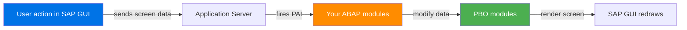
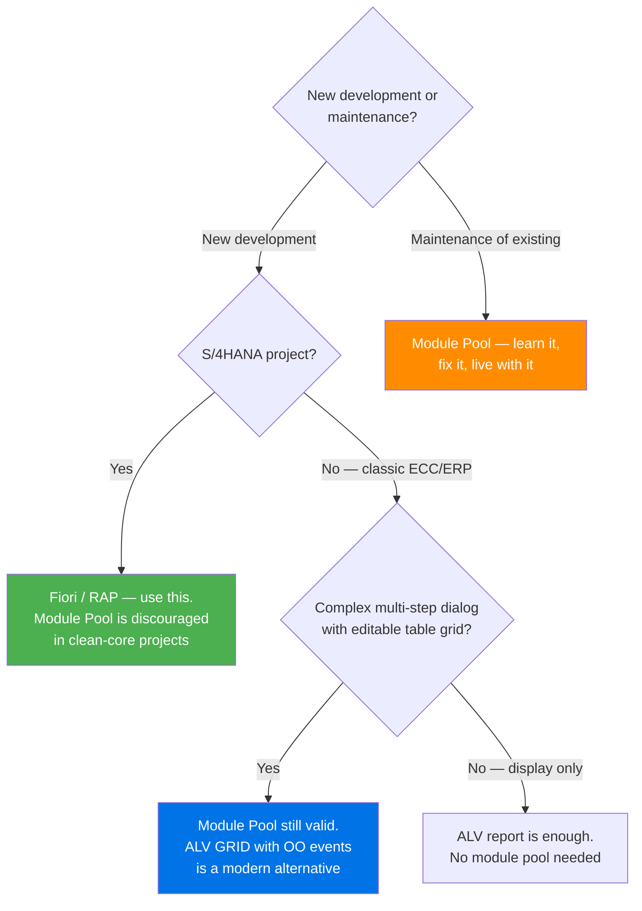

# Chapter 9: Module Pool (Dialog) Programming

*The SAP GUI has its own event-driven UI framework — older than WinForms but built on exactly the same ideas. Here's how to read and maintain it without going mad.*

---

## ☕ Before we start: a frank word about where this fits

Module Pool programming is **SAP's desktop UI technology from the 1980s–2000s**. It uses SAP GUI screens (called "dynpros") instead of HTML, and it fires events in a flow-logic language instead of C# events or Python callbacks. Almost every large SAP installation has thousands of these programs — some standard, many custom — and they will not disappear overnight.

You will probably not *design* a new module pool from scratch. But you **will** be handed tickets like:

- "When the user presses F5 on Screen 200, validate the material number."
- "The table control on Screen 100 only shows 10 rows — make it scrollable."
- "Add a new field to this custom dialog."

Those tickets require understanding the flow-logic model. That's what this chapter is for.

---

## 9.1 What a Dialog Program Is

### 1️⃣ The analogy

Imagine WinForms or Tkinter: you design a form in a visual editor, connect event handlers (button click, field changed, form load), and the framework calls your handlers when the user interacts. SAP GUI dialogs work *exactly* like that — screen designer, PBO/PAI events, module handlers. The runtime is just different (it's inside the SAP application server, not on the client) and the vocabulary is different (Screen → Form, PBO → Load, PAI → ButtonClick).



### 2️⃣ You already know this

```csharp
// WinForms analogy
public partial class OrderForm : Form
{
    // PBO equivalent — fires when the form loads / redraws
    protected override void OnLoad(EventArgs e)
    {
        base.OnLoad(e);
        txtMaterial.Text = _defaultMaterial;
        btnSave.Enabled  = false;         // set UI state
    }

    // PAI equivalent — fires when user clicks Save
    private void btnSave_Click(object sender, EventArgs e)
    {
        string okCode = "SAVE";           // in ABAP this is the OK_CODE field
        if (string.IsNullOrEmpty(txtMaterial.Text))
        {
            MessageBox.Show("Material is required");
            return;
        }
        SaveOrder(txtMaterial.Text);
        Close();
    }
}
```

```python
# Tkinter analogy
import tkinter as tk

class OrderForm(tk.Frame):
    def __init__(self, master):
        super().__init__(master)
        self._build_ui()
        self._pbo()          # PBO — set initial state

    def _pbo(self):          # Process Before Output
        self.mat_var.set("DEFAULT-MAT")
        self.save_btn.config(state=tk.DISABLED)

    def _pai_save(self):     # Process After Input — Save button
        if not self.mat_var.get():
            tk.messagebox.showerror("Error", "Material is required")
            return
        self._save_order(self.mat_var.get())
        self.master.destroy()
```

### 3️⃣ The ABAP way

A **module pool** (also called a **dialog program**) consists of:

| Piece | Where it lives | What it does |
|---|---|---|
| The ABAP program | `SE38` (type M) | Global data, subroutines, modules |
| Screens (dynpros) | `SE51` | Visual layout + **flow logic** |
| GUI Status | `SE41` | Menu bars, toolbars, function key assignments |
| GUI Title | `SE41` | The title bar text for each screen |

They all share the same program name and travel in the same transport together.

> ⚠️ **C#/Python gotcha:** There is no single source file. A module pool is a *collection of objects* under one program name. When you look at a dialog program in `SE80` (Repository Browser) you'll see the ABAP include files, the screen list, the GUI statuses, and the GUI titles all hanging off the same node.

---

## 9.2 Screens, PBO, and PAI — The Core Loop

### Screen 100: the Visual Designer (SE51)

Every screen has two parts you edit in `SE51`:

1. **The Layout** — the visual painter where you drag fields, buttons, and table controls.
2. **The Flow Logic** — a mini-language that declares which ABAP modules to call on PBO and PAI.

```abap
" ── FLOW LOGIC (lives inside the screen in SE51, NOT in your ABAP file) ──

PROCESS BEFORE OUTPUT.
  MODULE status_0100.           " set GUI status, fill fields
  MODULE fill_material_data.    " populate screen fields from memory

PROCESS AFTER INPUT.
  MODULE user_command_0100.     " read OK_CODE, branch on it
```

That's the entire flow logic for a typical screen. Every `MODULE` statement calls an ABAP module back in your program file.

### The modules in your ABAP program

```abap
*&---------------------------------------------------------------------*
*& Module Pool  ZSALES_ORDER_DIALOG
*& Type         M (Dialog Program)
*&---------------------------------------------------------------------*
PROGRAM zsales_order_dialog.

" ── Global data ─────────────────────────────────────────────────────
DATA: ok_code   TYPE sy-ucomm,       " current function code (button press)
      save_code TYPE sy-ucomm,
      gs_order  TYPE zorder_header.  " custom order structure

" ── PBO Module: fires before the screen is shown ────────────────────
MODULE status_0100 OUTPUT.
  " Set the GUI status (toolbar/menu bar) and title
  SET PF-STATUS 'MAIN_STATUS'.       " name defined in SE41
  SET TITLEBAR  'TITLE_ORDER'
    WITH gs_order-order_id.          " dynamic title text
  CLEAR ok_code.
ENDMODULE.

MODULE fill_material_data OUTPUT.
  " Copy data from memory into screen fields
  " (screen fields have the SAME names as your global variables or
  "  structure components — ABAP links them by name automatically)
  MOVE-CORRESPONDING gs_order TO gs_order.   " often a no-op if names match
ENDMODULE.

" ── PAI Module: fires after the user does something ─────────────────
MODULE user_command_0100 INPUT.
  save_code = ok_code.          " save before CLEAR wipes it
  CLEAR ok_code.

  CASE save_code.
    WHEN 'SAVE' OR 'SJVE'.      " function codes from SE41 GUI status
      PERFORM validate_and_save.

    WHEN 'BACK' OR 'CLOS' OR 'EXIT'.
      LEAVE TO SCREEN 0.        " screen 0 = leave the dialog, back to caller

    WHEN 'DETAIL'.
      LEAVE TO SCREEN 200.      " navigate to a detail screen

    WHEN OTHERS.
      " ignore unknown codes
  ENDCASE.
ENDMODULE.
```

> 💡 **The name-binding trick:** SAP links screen fields to ABAP variables *by name*. If your screen has a field named `GS_ORDER-MATERIAL` and your global structure is `gs_order` with component `material`, the runtime automatically copies between them at PBO (screen ← ABAP) and PAI (ABAP ← screen). No explicit assignment needed for simple cases. This feels like magic until you know the rule.

### Navigation between screens

```abap
" Go to a specific screen number
LEAVE TO SCREEN 200.

" Set the next screen programmatically (before returning from PBO/PAI)
SET SCREEN 200.   " then LEAVE SCREEN

" Leave the entire dialog and return to the caller
LEAVE TO SCREEN 0.

" Call a screen as a sub-dialog (popup-like; returns when that screen leaves)
CALL SCREEN 300.
```

---

## 9.3 Screen Elements, Table Controls, GUI Status, and OK_CODE

### Screen elements

In `SE51` Layout you place elements by dict/attribute:

| Element type | ABAP equivalent | Analogy |
|---|---|---|
| Text field (input) | Global var or structure field with matching name | `TextBox` |
| Text (output only) | Same, but attribute "Output Only" checked | `Label` |
| Pushbutton | Triggers a function code in PAI | `Button` |
| Checkbox | `CHAR(1)` field, `X` = checked | `CheckBox` |
| Radio button | Group of `CHAR(1)` fields | `RadioButton` group |
| Table Control | Internal table displayed as a grid inline | `DataGridView` (basic) |
| Subscreen | Another screen embedded inside this one | `UserControl` |

### Table controls

A **table control** is an inline scrollable table on a screen. It's the predecessor to ALV for dialog programs.

```abap
" In SE51 flow logic — scroll handling for a table control
PROCESS BEFORE OUTPUT.
  MODULE status_0100.
  LOOP AT gt_items INTO gs_item        " gt_items = your internal table
    WITH CONTROL tc_items              " TC_ITEMS = table control name from SE51
    CURSOR tc_items-current_line.
    MODULE fill_tc_line.               " fill one row at a time
  ENDLOOP.

PROCESS AFTER INPUT.
  LOOP AT gt_items.
    MODULE read_tc_line.               " read changed rows back
  ENDLOOP.
  MODULE user_command_0100.
```

```abap
" In the ABAP program
MODULE fill_tc_line OUTPUT.
  " gs_item is already set by the LOOP AT — just populate any calculated fields
  IF gs_item-quantity > 0.
    gs_item-total = gs_item-quantity * gs_item-unit_price.
  ENDIF.
  MODIFY gt_items FROM gs_item.
ENDMODULE.

MODULE read_tc_line INPUT.
  " Collect changes the user typed in the table control
  IF tc_items-line_sel = 'X'.        " user selected this row
    gs_item-selected = abap_true.
  ENDIF.
  MODIFY gt_items FROM gs_item
    INDEX tc_items-current_line.
ENDMODULE.
```

### GUI Status and OK_CODE (SE41)

The **GUI Status** is the menu bar + toolbar + function key mapping. You create/edit it in `SE41` under your program name.

Every button and menu item has a **function code** (up to 20 chars, convention: 4 chars in uppercase like `SAVE`, `BACK`, `CLOS`). When the user clicks a button, SAP puts its function code into the global field `OK_CODE` (or `SY-UCOMM`) and fires PAI.

```abap
" Best practice: copy and clear OK_CODE at top of PAI
MODULE user_command_0100 INPUT.
  DATA(lv_code) = ok_code.    " copy
  CLEAR ok_code.              " must clear — otherwise re-triggering on re-PBO

  CASE lv_code.
    WHEN 'SAVE'. ...
    WHEN 'BACK'. LEAVE TO SCREEN 0.
    WHEN 'EXIT'. LEAVE PROGRAM.
  ENDCASE.
ENDMODULE.
```

> ⚠️ **C#/Python gotcha:** Forgetting to `CLEAR ok_code` at the start of your PAI module is a classic bug. If you don't clear it, the same function code re-fires on the next PBO/PAI cycle, causing double-saves or infinite loops. Clear it first, save a copy, branch on the copy.

### Calling a module pool from a report or transaction

```abap
" From any ABAP program, call a dialog screen:
CALL TRANSACTION 'ZSD_ORDER'   " calls the START_NEW_TASK transaction
  AND SKIP FIRST SCREEN.        " bypass the first screen if defaults are set

" Or directly:
SET SCREEN 100.
CALL SCREEN 100.                " enters screen 100 of the current program
```

Module pools are usually called via a **transaction code** that you create in `SE93` and map to program + screen 100.

---

## 9.4 When to Still Use Module Pool vs. Going to Fiori

Let's be honest. Here's the real-world decision matrix:



**Honest summary:**

| Scenario | Use Module Pool? |
|---|---|
| New S/4HANA development | No — use RAP/Fiori |
| Classic ECC — complex editable form | Yes, or ALV OO with edit mode |
| Classic ECC — multi-step wizard UI | Yes |
| Maintaining existing dialog program | Yes — you have no choice |
| Simple data display | No — use ALV report |
| New development on ECC but headed for S/4 | Fiori custom app if budget allows; module pool otherwise |

> 🧭 **On the job:** When you join a team and see `CALL TRANSACTION 'ZXY...'` everywhere, those are probably module pools. Your job will be: understand the flow logic, find the right PAI module, make the change, test. You will do this dozens of times before you write your first Fiori app — and that's fine. The skill transfers directly to debugging even standard SAP transactions.

---

## A Realistic Mini Module Pool — End to End

Here is a stripped-down but structurally complete example of a custom order dialog — the kind of thing you'd be asked to maintain.

```abap
*&---------------------------------------------------------------------*
*& Module Pool  ZSIMPLE_DIALOG
*& Screens    : 100 (header), 200 (confirmation popup)
*& Transaction: ZSD_SIMPLE (created in SE93)
*&---------------------------------------------------------------------*
PROGRAM zsimple_dialog.

TABLES: zmaterial_h.           " screen field auto-binding uses TABLES declaration

DATA: ok_code    TYPE sy-ucomm,
      gs_matl    TYPE zmaterial_h,
      gv_changed TYPE abap_bool.

"─────────────────────────────────────────────────────────────────────
" Screen 100 — Main Input Form
" (Flow logic in SE51 calls these modules)
"─────────────────────────────────────────────────────────────────────

MODULE init_screen_100 OUTPUT.
  " Called on FIRST load only (checked via a flag)
  IF gv_changed IS INITIAL.
    CLEAR gs_matl.
    gs_matl-plant = '1000'.    " default plant
  ENDIF.
  SET PF-STATUS 'STATUS_100'.
  SET TITLEBAR  'TITLE_100'.
  CLEAR ok_code.
ENDMODULE.

MODULE user_cmd_100 INPUT.
  DATA(lv_code) = ok_code.
  CLEAR ok_code.

  CASE lv_code.
    WHEN 'SAVE'.
      PERFORM validate_input.
      IF sy-subrc = 0.
        PERFORM save_material.
        MESSAGE 'Material saved successfully.' TYPE 'S'.
        LEAVE TO SCREEN 0.
      ENDIF.

    WHEN 'RESET'.
      CLEAR gs_matl.
      gv_changed = abap_false.

    WHEN 'BACK' OR 'EXIT' OR 'CLOS'.
      IF gv_changed = abap_true.
        CALL SCREEN 200.        " confirmation popup
      ELSE.
        LEAVE TO SCREEN 0.
      ENDIF.
  ENDCASE.
ENDMODULE.

"─────────────────────────────────────────────────────────────────────
" Screen 200 — Discard-Changes Popup
"─────────────────────────────────────────────────────────────────────

MODULE status_200 OUTPUT.
  SET PF-STATUS 'STATUS_200'.
  SET TITLEBAR  'TITLE_200'.
  CLEAR ok_code.
ENDMODULE.

MODULE user_cmd_200 INPUT.
  DATA(lv_code) = ok_code.
  CLEAR ok_code.
  CASE lv_code.
    WHEN 'YES'.
      LEAVE TO SCREEN 0.        " discard and leave
    WHEN 'NO'.
      LEAVE TO SCREEN 100.      " back to editing
  ENDCASE.
ENDMODULE.

"─────────────────────────────────────────────────────────────────────
" Helpers
"─────────────────────────────────────────────────────────────────────

FORM validate_input.
  IF gs_matl-matnr IS INITIAL.
    MESSAGE 'Material number is required' TYPE 'E'.
    sy-subrc = 4.
    RETURN.
  ENDIF.
  sy-subrc = 0.
ENDFORM.

FORM save_material.
  " real code would INSERT/UPDATE into ZMATERIAL_H
  gv_changed = abap_false.
ENDFORM.
```

> 💡 **The `TABLES` statement:** Line `TABLES: zmaterial_h.` declares a special **table work area** — a single global structure that shares a name with the screen fields. ABAP's runtime automatically syncs it with screen fields of the same name on every PBO/PAI cycle. It's old but you'll see it in every legacy dialog program. In modern code you'd use explicit `gs_matl` and `MOVE-CORRESPONDING`, but `TABLES` is still valid and common.

---

## 🧠 Recap

| Dialog concept | ABAP term | WinForms / Tkinter analogue |
|---|---|---|
| Visual screen designer | `SE51` Layout Painter | Windows Forms Designer / Tk widget layout |
| Fires before screen shows | `PBO` module | `Form.Load` / `__init__` + initial draw |
| Fires after user action | `PAI` module | `Button.Click` / `command=` callback |
| Which button was pressed | `OK_CODE` / `SY-UCOMM` | `sender` cast + action string |
| Toolbar/menu definition | `SE41` GUI Status | `MenuStrip` / `Menu()` |
| Navigate to another screen | `LEAVE TO SCREEN n` | `form2.Show(); this.Hide()` |
| Exit the dialog | `LEAVE TO SCREEN 0` | `this.Close()` |
| Inline editable grid | Table Control | `DataGridView` (basic) |

The flow-logic pattern is simple once you internalize PBO = "fill the screen" and PAI = "read + react." The rest is just vocabulary.

---

*[← Contents](../content.md) | [← Previous: Reports — Classical & ALV](08-reports-classical-and-alv.md) | [Next: Smartforms & Adobe Forms →](10-smartforms-and-adobe-forms.md)*
