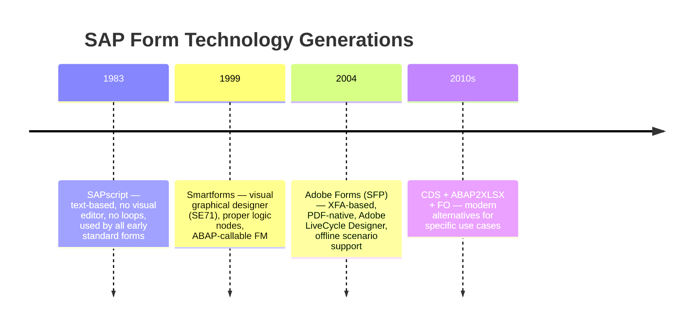
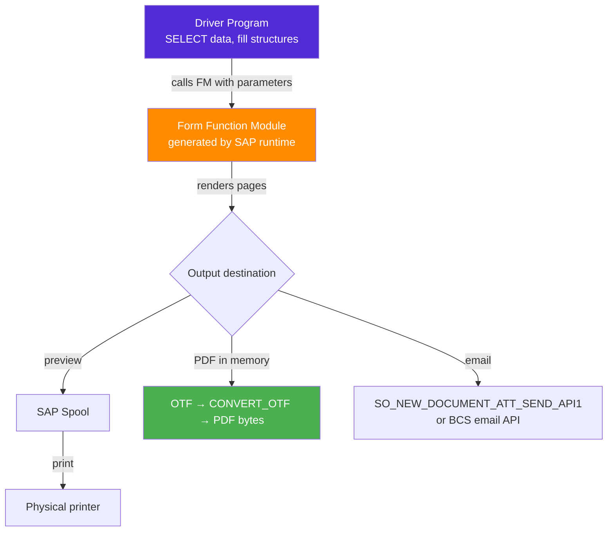
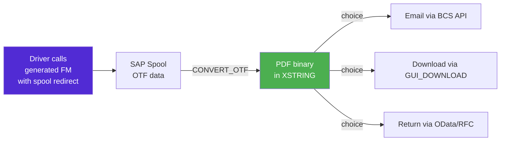
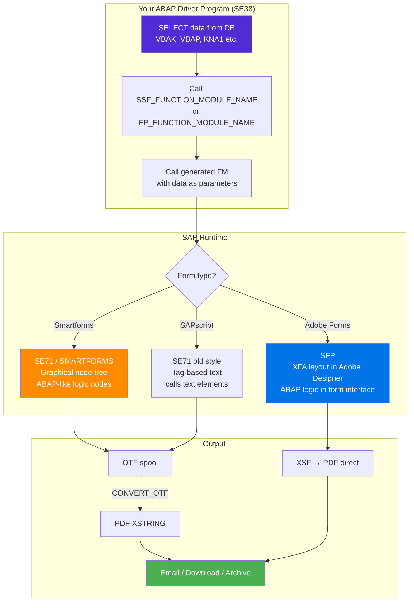

# Chapter 10: Smartforms & Adobe Forms

*SAP doesn't print the way you expect — and once you understand why, a whole category of "fix this invoice" tickets becomes straightforward.*

---

## ☕ Why does SAP printing feel so different?

In a .NET or Python app, generating a PDF means calling a library — `PdfSharp`, `ReportLab`, `WeasyPrint`, whatever — and you control every pixel. In SAP, printing has been around since the 1980s and evolved through three generations of tooling, each solving the problems of the one before it. To maintain SAP forms — or be trusted to modify one — you need to understand all three.

Here's the coffee-chat version: SAP separates **"who fetches the data"** (a driver program) from **"who lays it out"** (a form). Your first job when you see a broken invoice is to figure out which half broke.

---

## 10.1 Why SAP Prints the Way It Does

### 1️⃣ The analogy

SAP's print architecture is exactly like a **templating engine + a controller**:

- The **controller** (`driver program`) selects data, massages it, then calls the template.
- The **template** (`form`) receives the data as parameters and does all the visual work — text, logos, conditional sections, loops over line items.

You've done this before:

```csharp
// C# Razor: controller passes a model to a view
public IActionResult PrintInvoice(int orderId)
{
    var model = _invoiceService.GetInvoice(orderId);   // driver logic
    return View("InvoiceTemplate", model);             // hand off to template
}
```

```python
# Python Jinja2: script passes data to a template
from jinja2 import Environment, FileSystemLoader

env = Environment(loader=FileSystemLoader("templates"))
tmpl = env.get_template("invoice.html")
data = get_invoice_data(order_id)          # driver logic
pdf_html = tmpl.render(**data)             # hand off to template
```

SAP does exactly the same split — just with its own tools for both halves.

### 2️⃣ The output formats SAP works with

| Format | What it is | Where it goes |
|---|---|---|
| **OTF** (Output Text Format) | SAP's internal page-description language | Spool → printer / PDF conversion |
| **PDF** | Standard PDF via Adobe technology | Email attachment, download, archive |
| **HTML** | Web-based output | Portal / browser display |
| **XSF** | XML-based stream (Adobe Forms only) | PDF rendering engine |

You rarely deal with OTF directly, but you'll hear the term `CONVERT_OTF` whenever someone asks "how do I get a PDF from ABAP?" — that function converts OTF to PDF in memory.

> 🧭 **On the job:** When a user says "the invoice prints fine but we can't email it as a PDF," the answer almost always involves calling `CONVERT_OTF` or using `SSF_FUNCTION_MODULE_NAME` + `CONVERT_OTF_2_PDF`. Both are covered in section 10.4.

---

## 10.2 Timeline: SAPscript → Smartforms → Adobe Forms

### The three generations



### When you'll encounter each one

| Technology | T-code | Still new today? | When you'll see it |
|---|---|---|---|
| **SAPscript** | `SE71` | Almost never | Ancient standard forms (old dunning letters, old purchase orders) |
| **Smartforms** | `SMARTFORMS` | Rarely for greenfield; common in ECC legacy | Most medium-age custom forms (2000–2015) |
| **Adobe Forms (SFP)** | `SFP` | Yes — still the standard for PDF-heavy output in S/4HANA | New custom forms, complex layout, offline PDF |
| **ABAP2XLSX / ALV** | — | Yes | Excel output (not print) |

> ⚠️ **C#/Python gotcha:** Unlike your templating libraries, you *cannot* just write HTML/CSS to control layout. SAPscript uses a proprietary tag syntax. Smartforms uses a tree of "nodes" in a visual editor. Adobe Forms uses Adobe's XFA format (edited in Adobe LiveCycle Designer, embedded in SE80/SFP). Each has its own learning curve — but the **driver program pattern** is identical across all three.

---

## 10.3 The Driver-Program + Form Pattern

This is the mental model that makes every SAP print ticket solvable. Burn it in.



**Key insight:** The form tool (Smartforms or Adobe Forms) generates an ABAP **function module** automatically. You never call the form by its name directly — you ask the runtime for the generated FM name, then call that FM. This indirection allows SAP to version and regenerate the FM without changing your driver code.

### 3️⃣ The ABAP driver pattern — Smartforms

```abap
*& Driver program for a Smartforms invoice (ZINVOICE_SF)
REPORT zdrive_smartforms_invoice.

PARAMETERS p_vbeln TYPE vbak-vbeln.   " sales order number

START-OF-SELECTION.
  " 1. Select data (driver logic)
  DATA gs_header TYPE zsd_invoice_header.
  DATA gt_items  TYPE TABLE OF zsd_invoice_item.

  SELECT SINGLE * FROM vbak INTO CORRESPONDING FIELDS OF gs_header
    WHERE vbeln = p_vbeln.

  SELECT vbap~posnr vbap~matnr vbap~netwr vbap~menge vbap~meins
    FROM vbap INTO CORRESPONDING FIELDS OF TABLE gt_items
    WHERE vbeln = p_vbeln.

  " 2. Get the generated function module name for your Smartform
  DATA lv_fm_name TYPE rs38l_fnam.

  CALL FUNCTION 'SSF_FUNCTION_MODULE_NAME'
    EXPORTING
      formname           = 'ZINVOICE_SF'    " your Smartforms name
    IMPORTING
      fm_name            = lv_fm_name
    EXCEPTIONS
      no_form            = 1
      no_function_module = 2
      OTHERS             = 3.

  IF sy-subrc <> 0.
    MESSAGE 'Smartform ZINVOICE_SF not found or not generated.' TYPE 'E'.
    RETURN.
  ENDIF.

  " 3. Build the control structures (output options)
  DATA ls_control  TYPE ssfctrlop.
  DATA ls_composer TYPE ssfcompop.

  ls_control-no_dialog = abap_true.       " suppress the print dialog
  ls_control-preview   = abap_false.      " set TRUE for on-screen preview

  ls_composer-tdnoprev = abap_false.
  ls_composer-tddest   = 'LP01'.          " spool destination / printer

  " 4. Call the generated FM — passing YOUR data as the form's interface
  CALL FUNCTION lv_fm_name
    EXPORTING
      control_parameters = ls_control
      output_parameters  = ls_composer
      p_header           = gs_header      " matches Smartforms interface
      p_vbeln            = p_vbeln
    TABLES
      t_items            = gt_items
    EXCEPTIONS
      formatting_error   = 1
      internal_error     = 2
      send_error         = 3
      user_canceled      = 4
      OTHERS             = 5.

  IF sy-subrc <> 0.
    MESSAGE 'Error printing invoice' TYPE 'E'.
  ENDIF.
```

> 💡 **The interface contract:** The parameters you pass to the generated FM (`p_header`, `t_items` above) must **exactly match what you defined on the Smartforms Interface tab** (in the `SMARTFORMS` transaction). If the names or types don't match, the generated FM call fails. This mismatch is the #1 cause of "the form worked yesterday and broke today after a transport."

### The Adobe Forms (SFP) equivalent driver

Adobe Forms follows the same pattern. The difference: you use `FP_FUNCTION_MODULE_NAME` instead of `SSF_FUNCTION_MODULE_NAME`.

```abap
" Get the FM name for an Adobe Form
DATA lv_fm_name TYPE funcname.

CALL FUNCTION 'FP_FUNCTION_MODULE_NAME'
  EXPORTING
    i_name     = 'ZINVOICE_ADF'     " Adobe Form name (SFP)
  IMPORTING
    e_funcname = lv_fm_name
  EXCEPTIONS
    not_found  = 1
    OTHERS     = 2.

IF sy-subrc <> 0.
  MESSAGE 'Adobe Form ZINVOICE_ADF not found.' TYPE 'E'.
  RETURN.
ENDIF.

" Open the PDF form processing
CALL FUNCTION 'FP_JOB_OPEN'
  CHANGING
    ie_outputparams = ls_fp_output
  EXCEPTIONS
    cancel          = 1
    usage_error     = 2
    OTHERS          = 3.

" Call the generated FM (same pattern as Smartforms)
CALL FUNCTION lv_fm_name
  EXPORTING
    /1bcdwb/docparams = ls_docparams
    p_header          = gs_header
    p_vbeln           = p_vbeln
  TABLES
    t_items           = gt_items
  EXCEPTIONS
    usage_error       = 1
    OTHERS            = 2.

" Close the job — this finalizes the PDF
CALL FUNCTION 'FP_JOB_CLOSE'
  IMPORTING
    e_result    = ls_result
  EXCEPTIONS
    usage_error = 1
    OTHERS      = 2.
```

---

## 10.4 Generating a PDF from ABAP — The OTF Route

Sometimes you need the PDF bytes in memory — to email it, archive it, or return it via an RFC/OData service. The classic route: print to spool in OTF format, then convert with `CONVERT_OTF`.

### The mental model



### Getting PDF bytes in memory

```abap
*& Converts a Smartforms spool job to PDF bytes in memory
FORM get_pdf_from_smartforms
  IMPORTING  iv_vbeln   TYPE vbak-vbeln
  EXPORTING  ev_pdf_xstr TYPE xstring.

  " ── 1. Print to spool with capture ─────────────────────────────
  DATA: ls_control  TYPE ssfctrlop,
        ls_composer TYPE ssfcompop,
        ls_job_info TYPE ssfcrescl,
        lt_otf      TYPE itcotf,            " OTF table
        lt_pdf_tab  TYPE TABLE OF tline.    " raw PDF lines

  ls_control-no_dialog    = abap_true.
  ls_control-getotf       = abap_true.      " capture OTF, don't spool
  ls_composer-tdnoprev    = abap_true.

  " ── 2. Get FM name and call (same as before) ────────────────────
  DATA lv_fm_name TYPE rs38l_fnam.
  CALL FUNCTION 'SSF_FUNCTION_MODULE_NAME'
    EXPORTING formname = 'ZINVOICE_SF'
    IMPORTING fm_name  = lv_fm_name.

  " (Call lv_fm_name here with your data — same as section 10.3)
  " ... abbreviated for space ...
  " After call, the OTF data is in ls_job_info-otfdata

  " ── 3. Convert OTF → PDF ────────────────────────────────────────
  DATA: lt_pdf_lines TYPE TABLE OF tline,
        lv_pdf_size  TYPE i.

  CALL FUNCTION 'CONVERT_OTF'
    EXPORTING
      format                = 'PDF'
    IMPORTING
      bin_filesize          = lv_pdf_size
    TABLES
      otf                   = lt_otf        " OTF lines from job_info
      doctab_archive        = lt_pdf_lines  " output: PDF in TLINE chunks
    EXCEPTIONS
      err_max_linewidth     = 1
      err_format            = 2
      err_conv_not_possible = 3
      OTHERS                = 4.

  IF sy-subrc <> 0.
    RETURN.
  ENDIF.

  " ── 4. Assemble the TLINE table into a single XSTRING ───────────
  DATA lv_pdf_str TYPE string.
  LOOP AT lt_pdf_lines INTO DATA(ls_line).
    CONCATENATE lv_pdf_str ls_line-tdline INTO lv_pdf_str.
  ENDLOOP.
  ev_pdf_xstr = lv_pdf_str.   " in production, use proper binary assembly
ENDFORM.
```

> ⚠️ **C#/Python gotcha:** `CONVERT_OTF` returns a `TABLE OF TLINE` — chunks of 132 characters each. You have to concatenate them into a single binary (`XSTRING`) to get a proper PDF. Use the utility function `SCMS_BINARY_TO_XSTRING` or loop with `CONCATENATE` to do this cleanly. Many online examples skip this step and wonder why their PDF is corrupt.

### Using Adobe Forms to get PDF directly

Adobe Forms can return the PDF as an `XSTRING` more cleanly:

```abap
" FP_JOB_OPEN with e-mail / memory output option
DATA ls_fp_output TYPE sfpoutputparams.
ls_fp_output-nodialog  = abap_true.
ls_fp_output-dest      = ' '.      " empty = memory, not printer

CALL FUNCTION 'FP_JOB_OPEN'
  CHANGING  ie_outputparams = ls_fp_output.

" ... call generated FM ...

DATA ls_result TYPE sfpjoboutput.
CALL FUNCTION 'FP_JOB_CLOSE'
  IMPORTING e_result = ls_result.

" ls_result-pdf contains the XSTRING PDF directly — no CONVERT_OTF needed
DATA(lv_pdf) = ls_result-pdf.
```

> 💡 **This is why Adobe Forms is preferred for new development:** you get a clean `XSTRING` PDF back from `FP_JOB_CLOSE` without the OTF dance. For email/download scenarios, this is the stack to use.

---

## Putting It All Together — The Complete Mental Map



### Quick reference: which FM does what

| Function module | Purpose |
|---|---|
| `SSF_FUNCTION_MODULE_NAME` | Get generated FM name for a Smartform |
| `FP_FUNCTION_MODULE_NAME` | Get generated FM name for an Adobe Form |
| `FP_JOB_OPEN` | Initialize an Adobe Forms print job |
| `FP_JOB_CLOSE` | Close Adobe job, collect PDF bytes |
| `CONVERT_OTF` | Convert OTF spool data to PDF (or other format) |
| `SO_NEW_DOCUMENT_ATT_SEND_API1` | Legacy email with attachment (XSTRING) |
| `GUI_DOWNLOAD` | Save bytes to the user's local PC |

> 🧭 **On the job:** The most common ticket pattern is: "Extend this invoice to also show the delivery date." Your workflow is: (1) open the form in `SMARTFORMS` or `SFP`, find the line-item loop node, add the new field there. (2) Check if `FLPDAT` (or whatever field you need) is already in the interface structure — if not, add it in the Interface tab. (3) Update the driver to also select and pass that field. (4) Regenerate and test. The form and the driver must stay in sync — that's the only tricky part.

---

## A Minimal Smartforms Walkthrough (What You'd Do in SE80)

You won't build a Smartform from scratch in your first week, but you will *navigate* one. Here's the tree structure you'll see in the `SMARTFORMS` transaction:

```
ZINVOICE_SF (Smartform)
├── Interface
│   ├── Import Parameters
│   │   ├── P_VBELN   TYPE VBAK-VBELN
│   │   └── P_HEADER  TYPE ZSD_INVOICE_HEADER
│   └── Tables
│       └── T_ITEMS   TYPE TABLE OF ZSD_INVOICE_ITEM
├── Global Settings
│   ├── Form Interface (alias of above)
│   └── Global Definitions (internal work areas)
└── Pages and Windows
    ├── FIRST (page)
    │   ├── HEADER_WINDOW
    │   │   └── Text node: company name, logo graphic
    │   ├── ADDRESS_WINDOW
    │   │   └── Text node: &P_HEADER-NAME1&, &P_HEADER-CITY&
    │   └── MAIN_WINDOW
    │       ├── Text node: header (column headings)
    │       ├── LOOP node: LOOP AT T_ITEMS INTO WA_ITEM
    │       │   └── Text node: &WA_ITEM-POSNR&  &WA_ITEM-MATNR&  &WA_ITEM-NETWR&
    │       └── Text node: totals
    └── NEXT (page — overflow)
        └── MAIN_WINDOW (continuation of loop)
```

The `&field_name&` syntax inside text nodes is how Smartforms substitutes variable values — similar to `{{variable}}` in Jinja2 or `@Model.FieldName` in Razor.

> ⚠️ **C#/Python gotcha:** Smartforms substitution is done at *rendering time* by the spool engine, not at compile time. A typo in `&WA_ITEM-NETWRR&` won't cause a syntax error — it just prints blank. Always check your field names match the structures you defined in the Interface tab.

---

## 🧠 Recap

| Concept | SAP term | Analogy |
|---|---|---|
| Code that fetches data and calls the form | Driver program | MVC Controller / Jinja2 render script |
| The visual layout definition | Smartform (SE71) / Adobe Form (SFP) | Razor View / Jinja2 template |
| Runtime-generated wrapper | Generated function module | Compiled template class |
| How you get the FM name | `SSF_FUNCTION_MODULE_NAME` / `FP_FUNCTION_MODULE_NAME` | Template engine `get_template()` |
| SAP's internal page-description format | OTF | Postscript / intermediate format |
| OTF → PDF conversion | `CONVERT_OTF` | `WeasyPrint.write_pdf()` |
| Adobe Forms native PDF output | `FP_JOB_CLOSE` → `e_result-pdf` | `ReportLab.output()` |
| Field substitution in form text | `&FIELDNAME&` | `{{variable}}` / `@Model.Field` |

The driver-form split is the insight that unlocks all SAP print work. Once you know which half to look in — data selection (driver) or layout/field names (form) — debugging a broken invoice goes from intimidating to mechanical.

---

*[← Contents](../content.md) | [← Previous: Module Pool Programming](09-module-pool-programming.md) | [Next: ABAP Objects / OOP →](11-abap-oop.md)*
