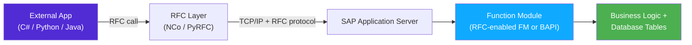

# Chapter 12: Function Modules, RFC & BAPI

*The original "API layer" of SAP — older than classes, still everywhere, and the gateway between your C#/.NET or Python app and the SAP back end.*

---

## ☕ Setting the scene

Before ABAP had classes, it had **function modules** — named, callable units of logic that live in containers called **function groups**. Think of a function group as a static C# class full of public static methods, all sharing some private state.

Function modules are still all over real-world SAP systems. You will read them, debug them, call them, and occasionally write them. More importantly, **BAPIs** — SAP's official business APIs — are function modules with a stable interface. And **RFC** (Remote Function Call) is the mechanism that lets C# or Python code call these function modules over the network.

The chain looks like this:



Let's build the full picture, layer by layer.

---

## 12.1 Function Modules and Function Groups

### 1️⃣ The analogy

A **function group** is a container — like a static class or a Python module. A **function module** is a named function inside that container. All function modules in the same group share a private data area (called the "global data" of the group) — so if FM_A sets a variable, FM_B in the same group can read it. This is how stateful FMs maintain data across calls.

You create and browse function modules in **SE37** (transaction code). Type `SE37` in the command bar, enter an FM name like `BAPI_ACC_DOCUMENT_POST`, and you see the full interface.

### 2️⃣ You already know this

```csharp
// C# mental model: a static class full of methods sharing private state
public static class OrderFunctions          // ← this is the "function group"
{
    private static string _currentUser;     // ← shared "global data" of the group

    public static void SetUser(string user) { _currentUser = user; }

    public static Order GetOrder(string orderId) { /* ... */ }
    public static void SaveOrder(Order order)    { /* ... */ }
}
```

```python
# Python mental model: a module with module-level state
# file: order_functions.py     ← this is the "function group"
_current_user = None           # ← shared state

def set_user(user: str):   global _current_user; _current_user = user
def get_order(order_id: str): ...
def save_order(order: dict):  ...
```

### 3️⃣ The ABAP way

```abap
" You don't write a function group definition by hand — you create it in SE37/ADT
" and SAP generates the boilerplate. But conceptually it looks like this:

FUNCTION-POOL zgp_order_utils.   " Function group declaration (in a special include)

" Shared data — accessible by all FMs in this group
DATA gv_current_user TYPE uname.

" ---- FUNCTION ZFM_SET_USER -------------------------------------------------
FUNCTION zfm_set_user.
*"----------------------------------------------------------------------
*"*"Local Interface:
*"  IMPORTING
*"     VALUE(IV_USER) TYPE UNAME
*"----------------------------------------------------------------------
  gv_current_user = iv_user.
ENDFUNCTION.

" ---- FUNCTION ZFM_GET_ORDER ------------------------------------------------
FUNCTION zfm_get_order.
*"----------------------------------------------------------------------
*"*"Local Interface:
*"  IMPORTING
*"     VALUE(IV_ORDER_ID) TYPE VBELN
*"  EXPORTING
*"     VALUE(ES_ORDER)    TYPE VBAK
*"  EXCEPTIONS
*"     NOT_FOUND = 1
*"     OTHERS    = 2
*"----------------------------------------------------------------------
  SELECT SINGLE * FROM vbak INTO es_order
    WHERE vbeln = iv_order_id.
  IF sy-subrc <> 0.
    RAISE not_found.
  ENDIF.
ENDFUNCTION.
```

> ⚠️ **C#/Python gotcha:** The comment block `*"----------------------------------------------------------------------` in the middle of the function is SAP GUI's auto-generated parameter documentation. Don't delete it. ADT shows this more cleanly, but you'll see it in classic SE37.

> 🧭 **On the job:** In SE37, press `F8` to test-run a function module directly — fill in the input parameters and execute. This is the fastest way to understand what an FM does before you call it from ABAP code. You'll use this constantly.

---

## 12.2 IMPORTING / EXPORTING / CHANGING / TABLES Parameters & EXCEPTIONS

### 1️⃣ The analogy

Function modules have four kinds of parameters and one exception list. Think of `IMPORTING` and `EXPORTING` as normal pass-by-value input/output. `CHANGING` is pass-by-reference (read *and* write). `TABLES` is the internal-table parameter from pre-OOP ABAP — you still see it in older FMs and all BAPIs.

### 2️⃣ You already know this

```csharp
// C# ref/out analogy
public void ProcessOrder(
    string orderId,             // IMPORTING (input)
    out Order result,           // EXPORTING (output)
    ref decimal totalAmount,    // CHANGING (in+out)
    List<OrderItem> items)      // TABLES (table parameter)
{ ... }
```

```python
# Python — everything is by reference anyway, but conceptually:
def process_order(
    order_id: str,              # IMPORTING
    items: list[dict]           # TABLES
) -> tuple[dict, Decimal]:      # EXPORTING (returned as tuple)
    ...
```

### 3️⃣ The ABAP way

```abap
FUNCTION zfm_process_order.
*"----------------------------------------------------------------------
*"*"Local Interface:
*"  IMPORTING
*"     VALUE(IV_ORDER_ID)    TYPE VBELN        " input, passed by value
*"     VALUE(IV_MODE)        TYPE CHAR1 DEFAULT 'A'   " optional with default
*"  EXPORTING
*"     VALUE(EV_DOC_NUMBER)  TYPE VBELN        " output, only written to
*"  CHANGING
*"     VALUE(CV_TOTAL_AMOUNT) TYPE WRBTR       " input AND output
*"  TABLES
*"     IT_ITEMS              STRUCTURE VBAP    " internal table (old style)
*"  EXCEPTIONS
*"     ORDER_NOT_FOUND = 1
*"     INVALID_AMOUNT  = 2
*"     OTHERS          = 3
*"----------------------------------------------------------------------

  DATA ls_header TYPE vbak.

  " Read the order header
  SELECT SINGLE * FROM vbak INTO ls_header
    WHERE vbeln = iv_order_id.

  IF sy-subrc <> 0.
    RAISE order_not_found.     " sets sy-subrc = 1 in the caller
  ENDIF.

  " Update the changing parameter
  cv_total_amount = cv_total_amount + ls_header-netwr.

  ev_doc_number = ls_header-vbeln.

ENDFUNCTION.
```

**Calling a function module:**

```abap
DATA: lv_doc_number  TYPE vbeln,
      lv_total       TYPE wrbtr VALUE '0.00',
      lt_items       TYPE TABLE OF vbap.

CALL FUNCTION 'ZFM_PROCESS_ORDER'
  EXPORTING
    iv_order_id      = '0000000042'
    iv_mode          = 'A'
  IMPORTING
    ev_doc_number    = lv_doc_number
  CHANGING
    cv_total_amount  = lv_total
  TABLES
    it_items         = lt_items
  EXCEPTIONS
    order_not_found  = 1
    invalid_amount   = 2
    OTHERS           = 3.

IF sy-subrc <> 0.
  WRITE: / |FM call failed, sy-subrc = { sy-subrc }|.
ELSE.
  WRITE: / |Doc: { lv_doc_number }, Total: { lv_total }|.
ENDIF.
```

> 💡 **sy-subrc:** After almost every ABAP operation — `SELECT`, `CALL FUNCTION`, `READ TABLE`, `OPEN DATASET` — check `sy-subrc`. Zero means success. Non-zero means something went wrong. It's ABAP's universal status code. Think of it as a combination of `Environment.ExitCode` and a database return code.

---

## 12.3 RFC — Remote Function Call

### 1️⃣ The analogy

RFC is SAP's own RPC protocol — like gRPC but from the 1990s and proprietary. An RFC-enabled function module is a function module with a checkbox ticked in SE37 ("Remote-enabled module"). That checkbox makes it callable from external programs — other SAP systems, C# apps, Python scripts, Java.

### 2️⃣ RFC-enabled FM in ABAP (what makes it "RFC")

In SE37, open the function module → *Attributes* tab. The "Processing Type" dropdown lets you choose:

| Type | Meaning |
|------|---------|
| Normal Function Module | Not callable remotely |
| Remote-Enabled Module | Callable via RFC from anywhere |
| Update Module | Called asynchronously in LUW (database transaction) |
| Immediate Start, No Restart | Background RFC variant |

When you write an RFC-enabled FM, all parameters must be **pass-by-value** (not pass-by-reference), because the data must be serialized over the network. The `TABLES` parameters still work. `CHANGING` does not work for RFC.

```abap
FUNCTION zfm_get_material_rfc.
*"----------------------------------------------------------------------
*"*"Remote-Enabled Module — all params PASS BY VALUE
*"  IMPORTING
*"     VALUE(IV_MATNR)    TYPE MATNR
*"  EXPORTING
*"     VALUE(ES_MATERIAL) TYPE MARA
*"  EXCEPTIONS
*"     MATERIAL_NOT_FOUND = 1
*"----------------------------------------------------------------------

  SELECT SINGLE * FROM mara INTO es_material
    WHERE matnr = iv_matnr.

  IF sy-subrc <> 0.
    RAISE material_not_found.
  ENDIF.

ENDFUNCTION.
```

> ⚠️ **C#/Python gotcha:** RFC parameter names have a length limit of 30 characters. All types must be flat (no nested structures/tables inside structures in old RFC — newer `deep` RFC relaxes this). If your interface returns a table, use a `TABLES` parameter, not an internal table in `EXPORTING`.

---

## 12.4 BAPIs — SAP's Official Business APIs

### 1️⃣ The analogy

A **BAPI** (Business Application Programming Interface) is a function module that SAP has designated as a *stable, supported, object-oriented* API into business logic. SAP ships hundreds of them for every major business process — creating orders, posting documents, reading customer master data.

BAPIs are:
- **RFC-enabled** — callable from C#, Python, other SAP systems.
- **Object-oriented in design** — each BAPI corresponds to a Business Object (visible in **SWO1**), e.g., `BUS2032` is a Sales Order.
- **Stable** — SAP won't break the interface between releases (unlike internal function modules or database tables you shouldn't touch directly).
- **Transactional** — they typically don't commit data themselves. You must call `BAPI_TRANSACTION_COMMIT` after a write BAPI. This is intentional — it lets you chain multiple BAPIs in one database transaction.

### 2️⃣ Why not just write directly to the database?

```csharp
// Tempting but WRONG in SAP
dbContext.SalesOrders.Add(new SalesOrder { ... });
dbContext.SaveChanges();
```

```abap
" Tempting but WRONG in SAP
INSERT INTO vbak VALUES ls_header.   " Never do this!
```

SAP's tables have complex interdependencies. A sales order touches `VBAK`, `VBAP`, `VBEP`, `VBUK`, `VBUP`, `LIPS`, possibly `LIKP`, and triggers follow-on documents in FI. Writing directly to one table silently corrupts the data. **Always use BAPIs or SAP's own function modules for business operations.**

### 3️⃣ Finding the right BAPI

- In SE37, search for `BAPI_*` — you get hundreds.
- In **SWO1**, browse Business Objects by business process area.
- Google `BAPI create sales order SAP` — the community has documented the common ones thoroughly.
- In **SE37**, test a BAPI interactively before writing code — fill the parameters, press F8, check the RETURN table.

Common BAPIs you'll encounter:

| BAPI | What it does |
|------|-------------|
| `BAPI_ACC_DOCUMENT_POST` | Post a financial (FI) document |
| `BAPI_SALESORDER_CREATEFROMDAT2` | Create a sales order |
| `BAPI_PO_CREATE1` | Create a purchase order |
| `BAPI_GOODSMVT_CREATE` | Goods movement (goods receipt, issue) |
| `BAPI_CUSTOMER_CREATEFROMDATA1` | Create a customer master |
| `BAPI_TRANSACTION_COMMIT` | Commit the current LUW (always call after write BAPIs!) |
| `BAPI_TRANSACTION_ROLLBACK` | Roll back the current LUW |

> 🧭 **On the job:** "Can you make the system create a PO when a Google Form is submitted?" The answer is: call `BAPI_PO_CREATE1` via RFC from a Python Cloud Function. Once you know that pattern, you can build almost any SAP integration.

---

## 12.5 Calling SAP from C# and Python

### SAP Connector for .NET (NCo)

SAP distributes a .NET library — **SAP Connector for .NET** (NCo) — for calling RFC/BAPI from C#. Download from SAP Support Portal (free, requires S-user). Add the NuGet package or reference the DLL.

```csharp
// C# — calling BAPI_SALESORDER_CREATEFROMDAT2 via SAP NCo
using SAP.Middleware.Connector;

// 1. Configure the RFC destination (usually in app.config / code)
RfcConfigParameters config = new RfcConfigParameters();
config[RfcConfigParameters.Name]     = "SAP_PROD";
config[RfcConfigParameters.AppServerHost] = "192.168.1.10";
config[RfcConfigParameters.SystemNumber]  = "00";
config[RfcConfigParameters.Client]        = "100";
config[RfcConfigParameters.User]          = "DEVELOPER";
config[RfcConfigParameters.Password]      = "secret";
config[RfcConfigParameters.Language]      = "EN";

RfcDestination destination = RfcDestinationManager.GetDestination(config);

// 2. Get a handle to the function
IRfcFunction bapi = destination.Repository.CreateFunction("BAPI_SALESORDER_CREATEFROMDAT2");

// 3. Fill the header structure
IRfcStructure header = bapi.GetStructure("ORDER_HEADER_IN");
header["DOC_TYPE"]    = "TA";
header["SALES_ORG"]   = "1000";
header["DISTR_CHAN"]   = "10";
header["DIVISION"]     = "00";
header["PURCH_NO_C"]   = "PO-2024-001";

// 4. Fill partner (customer)
IRfcTable partners = bapi.GetTable("ORDER_PARTNERS");
partners.Append();
partners["PARTN_ROLE"] = "AG";   // AG = Sold-to party
partners["PARTN_NUMB"] = "0000001000";

// 5. Fill items
IRfcTable items = bapi.GetTable("ORDER_ITEMS_IN");
items.Append();
items["ITM_NUMBER"]   = "000010";
items["MATERIAL"]     = "TG11";
items["PLANT"]        = "1000";
items["TARGET_QTY"]   = 5;

// 6. Execute
bapi.Invoke(destination);

// 7. Read results
IRfcTable returnTable = bapi.GetTable("RETURN");
string salesOrder = bapi.GetString("SALESDOCUMENT");

foreach (IRfcStructure row in returnTable)
{
    if (row.GetString("TYPE") == "E" || row.GetString("TYPE") == "A")
        Console.Error.WriteLine($"Error: {row.GetString("MESSAGE")}");
}

if (!string.IsNullOrEmpty(salesOrder))
{
    // 8. COMMIT — mandatory after write BAPIs
    IRfcFunction commit = destination.Repository.CreateFunction("BAPI_TRANSACTION_COMMIT");
    commit["WAIT"] = "X";
    commit.Invoke(destination);
    Console.WriteLine($"Sales order created: {salesOrder}");
}
```

### PyRFC (Python)

**PyRFC** is the Python wrapper around the same SAP RFC SDK. Install with `pip install pyrfc` (requires the SAP RFC SDK native libraries).

```python
# Python — calling the same BAPI with pyrfc
from pyrfc import Connection, ABAPApplicationError

# 1. Connect
conn = Connection(
    ashost='192.168.1.10',
    sysnr='00',
    client='100',
    user='DEVELOPER',
    passwd='secret',
    lang='EN'
)

# 2. Call BAPI — all parameters as Python dicts / lists
result = conn.call(
    'BAPI_SALESORDER_CREATEFROMDAT2',
    ORDER_HEADER_IN={
        'DOC_TYPE':  'TA',
        'SALES_ORG': '1000',
        'DISTR_CHAN': '10',
        'DIVISION':  '00',
        'PURCH_NO_C': 'PO-2024-001',
    },
    ORDER_PARTNERS=[
        {'PARTN_ROLE': 'AG', 'PARTN_NUMB': '0000001000'},
    ],
    ORDER_ITEMS_IN=[
        {'ITM_NUMBER': '000010', 'MATERIAL': 'TG11', 'PLANT': '1000', 'TARGET_QTY': '5'},
    ],
)

sales_doc = result.get('SALESDOCUMENT', '').strip()
return_msgs = result.get('RETURN', [])

# 3. Check for errors
errors = [r for r in return_msgs if r.get('TYPE') in ('E', 'A')]
if errors:
    for e in errors:
        print(f"SAP Error: {e['MESSAGE']}")
else:
    # 4. Commit
    conn.call('BAPI_TRANSACTION_COMMIT', WAIT='X')
    print(f"Sales order created: {sales_doc}")

conn.close()
```

> ⚠️ **C#/Python gotcha:** Always check the `RETURN` table before committing. BAPIs don't throw exceptions for business errors — they put error messages in the `RETURN` table with `TYPE = 'E'`. A successful call with no commit is completely silent — the data just never gets written. We cover this in depth in Chapter 13.

> 🧭 **On the job:** "Write a Python script that creates a PO in SAP for each row in this Excel file" — you'll get this request within your first six months. The answer: pandas reads Excel, you loop, you call `BAPI_PO_CREATE1` via PyRFC for each row. That's the entire architecture.

---

## 🧠 Recap

- **Function modules** live in **function groups** (SE37). They have `IMPORTING`, `EXPORTING`, `CHANGING`, `TABLES` parameters and a numeric `EXCEPTIONS` list checked via `sy-subrc`.
- **RFC-enabled FMs** can be called over the network — all parameters must be pass-by-value.
- **BAPIs** are SAP-certified, stable, RFC-enabled function modules for business operations. Never write directly to business tables — use BAPIs.
- **After any write BAPI** you must call `BAPI_TRANSACTION_COMMIT` (with `WAIT = 'X'`) to actually persist the data.
- **C# / NCo** and **Python / PyRFC** both map function modules to native data structures. The pattern is always: connect → call → check RETURN → commit.

---

*[← Contents](../content.md) | [← Previous: ABAP Objects / OOP](11-abap-oop.md) | [Next: Hands-On BAPI_ACC_DOCUMENT_POST →](13-handson-bapi-acc-document-post.md)*
