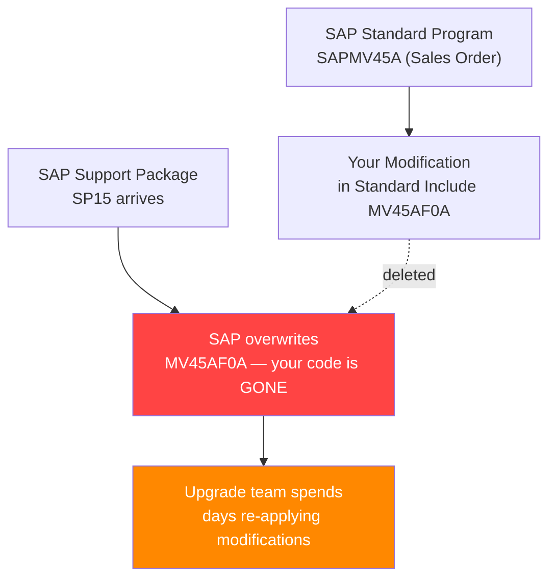
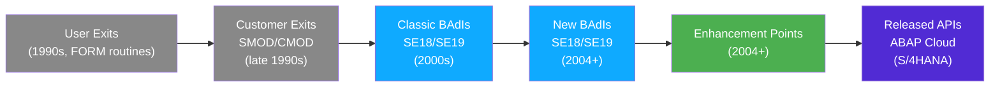
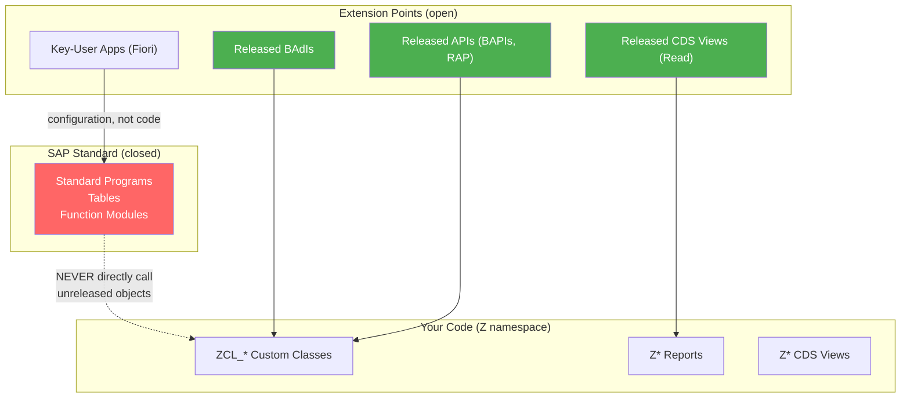

# Chapter 14: Enhancing Standard SAP (the Safe Way)

*You will never, ever modify a SAP standard program directly. Here's what you do instead — and why the rules exist.*

---

## ☕ The cardinal rule

On day one at an SAP shop, someone will tell you: **"Never touch the standard."** It sounds religious. It has a perfectly rational explanation.

SAP ships updates (Support Packages, Enhancement Packages, major releases). When SAP upgrades the system, it overwrites standard programs, function modules, and includes. If you edited a standard include directly, your change is silently gone after the next transport. Worse: SAP won't let you modify most standard objects unless you obtain an **access key** — a one-time unlock code from SAP that effectively says "we warned you." The system is designed to protect you from yourself.

So how do you customize behavior? SAP provides a layered set of extension points — places where SAP deliberately left hooks for you to plug in. Think of it as the most elaborate middleware/event system you've ever seen, evolved over 40 years.

---

## 14.1 Why You Must Not Modify Standard Code

### The upgrade problem



Even if you don't lose your code (some systems track modifications), every SAP upgrade requires a **modification adjustment** — a manual diff to re-apply your changes to the new standard version. One modification on a heavily-changed object can take days.

### The clean core problem (S/4HANA)

In S/4HANA, SAP went further. They introduced **ABAP Cloud** and **clean core** policies. Standard code that was previously modifiable is now **system namespace** and modification is outright blocked. The only legal extension points are **released APIs** and SAP-published extension mechanisms. If your system has modifications, your S/4HANA migration cost grows dramatically.

> 🧭 **On the job:** "Can you just quickly change this field in the sales order screen?" — this request will come from a business analyst. The correct answer is "let me find the right BAdI or user exit for that, not the standard code."

---

## 14.2 The Enhancement Spectrum

SAP's extension mechanisms evolved over 30 years. You need to know all of them because you'll find all of them in real systems.



### User Exits (Classic, largely obsolete)

SAP inserted empty `FORM` subroutine calls like `CALL CUSTOMER-FUNCTION '001'` inside standard programs. You add code to a specific include to fill these empty routines. These are hard-coded per program and there aren't many of them.

```abap
" Example user exit in standard code (you'll SEE this, not write it):
CALL CUSTOMER-FUNCTION '001'
  EXPORTING ...
  IMPORTING ....
```

### Customer Exits — SMOD / CMOD

An organized version of user exits. SAP groups exits for a business process into an **enhancement** (visible in **SMOD** — SAP Modifications). You activate them in a **project** (visible in **CMOD** — Customer Modifications).

- **SMOD**: Browse available customer exits for a function area.
- **CMOD**: Create a project, assign exits to it, write your code in the generated include.

This is still how many older systems are customized. You'll read this code constantly.

### Classic BAdIs (Business Add-Ins) — SE18/SE19

BAdI stands for **Business Add-In**. These are object-oriented extension points defined by SAP. Each BAdI has:
- A **definition** (visible in **SE18**): the interface that your implementation must fulfill.
- One or more **implementations** (created in **SE19**, or ADT): your custom class that implements the interface.

Classic BAdIs (pre-2004) could only have one active implementation per client. "New" BAdIs (post-2004, based on Enhancement Spots) can have multiple implementations, with a filter mechanism to decide which one runs.

### Enhancement Points (Implicit and Explicit)

SAP added **implicit enhancement spots** to every standard program — invisible hooks at the beginning and end of every form, function module, and method. You can inject code without touching the standard source.

**Explicit enhancement points** are named placeholders SAP deliberately inserted for common extension scenarios.

You add code via the **Enhancement Framework** — in SE80, edit a standard program, go to Enhancement → Create Enhancement. You're writing code that "lives alongside" the standard without modifying it.

### Comparison to patterns you know

```text
C#/.NET / Python concept              SAP equivalent
──────────────────────────────────    ──────────────────────────────
Event handlers / pub-sub              BAdI implementations
Middleware pipeline (ASP.NET)         Enhancement spots (before/after hooks)
Dependency Injection / IoC            BAdI (SAP injects your class at runtime)
Strategy pattern                      BAdI with multiple implementations + filter
Python monkey-patching (the bad way)  Direct modification (NEVER do this)
Open/Closed Principle                 Enhancement Framework — open for extension,
                                      closed for modification
```

> 💡 **The architectural insight:** BAdIs are SAP's implementation of the **Open/Closed Principle** — the same design principle you know from SOLID. The standard code is closed for modification; your BAdI implementation is the open extension point. If you think of it that way, the whole system makes perfect sense.

---

## 14.3 How to Find the Right Exit or BAdI

Finding the right extension point is often the hardest part. Here are the proven techniques:

### Method 1: Debug the standard transaction

1. Open the transaction you want to enhance (e.g., `VA01` — Create Sales Order).
2. Set a breakpoint in SE38/ADT on the main program (`SAPMV45A`).
3. Execute the transaction. When it hits the breakpoint, use the **debugger** to step through.
4. Watch for calls to `CALL CUSTOMER-FUNCTION`, calls to BAdI methods (usually via `GET BADI` / `CALL BADI`), or enhancement spots.

### Method 2: Where-Used on the Business Object

1. In **SWO1**, find the business object (e.g., `BUS2032` = Sales Order).
2. Browse its BAdIs — they're documented there.

### Method 3: SAP Documentation / Notes

Search [SAP Help Portal](https://help.sap.com) or SAP Notes for the transaction + "user exit" or "BAdI." SAP documentation for popular transactions (VA01, ME21N, FB60) lists all available extension points.

### Method 4: SMOD/SE18 Search

In **SMOD**, use the search to find exits for a component (e.g., `SD` module). In **SE18**, search for BAdIs by package or area.

### Method 5: Enhancement Spot in SE38

Open the standard program in SE38 → Utilities → Find Enhancement Spots. This lists every enhancement spot available in that program.

> 🧭 **On the job:** The debugger method (Method 1) is the most reliable for finding exactly where in the code flow a hook exists. Step through the transaction, and when you see `GET BADI lo_badi FILTERS ...` followed by `CALL BADI lo_badi->some_method`, you've found your extension point.

---

## 14.4 Implementing a BAdI Step by Step (SE19)

Let's implement a concrete example: adding a custom validation to sales order creation using the BAdI `BADI_SALESORDER_CHANGE` (available in standard systems).

### Step 1: Open SE18 to understand the BAdI definition

1. Type `SE18` in the command field.
2. Enter `BADI_SALESORDER_CHANGE`, press Display.
3. You see the interface: `IF_EX_BADI_SALESORDER_CHANGE` with methods like `PROCESS_ITEM`, `PROCESS_HEADER`, etc.
4. Look at the method signature — note what parameters are available (what data SAP will pass you).

### Step 2: Create the implementation in SE19

1. Type `SE19` in the command field.
2. Choose "Create Implementation" — enter the BAdI name `BADI_SALESORDER_CHANGE`.
3. Give your implementation a name: `ZBADI_SO_CUSTOM_VALIDATION`.
4. SAP generates a class `ZCL_IM_SO_CUSTOM_VALIDATION` that implements the BAdI interface.
5. Double-click the class to open it — you'll see stub methods for each interface method.

### Step 3: Write your implementation

```abap
"------------------------------------------------------------------
" ZCL_IM_SO_CUSTOM_VALIDATION
" BAdI implementation for BADI_SALESORDER_CHANGE
" (SE19 generates this class; you fill in the methods)
"------------------------------------------------------------------
CLASS zcl_im_so_custom_validation DEFINITION
  PUBLIC FINAL
  CREATE PUBLIC.

  PUBLIC SECTION.
    INTERFACES if_ex_badi_salesorder_change.  " SAP-generated interface

ENDCLASS.

CLASS zcl_im_so_custom_validation IMPLEMENTATION.

  " Called by SAP during sales order header processing
  METHOD if_ex_badi_salesorder_change~process_header.
    " im_header is the sales order header structure (passed by SAP)
    " cx_messages is a table for error messages (write here to show errors)

    " Custom rule: block sales orders without a purchase order reference
    IF im_header-purch_no_c IS INITIAL.
      " Add an error message — SAP will display this and block saving
      DATA(ls_msg) = VALUE bapiret2(
        type    = 'E'
        id      = 'Z_CUSTOM_MSGS'   " your custom message class
        number  = '001'
        message = 'Purchase order number is mandatory for this order type'
      ).
      APPEND ls_msg TO ch_messages.
    ENDIF.

  ENDMETHOD.

  " Called for each line item
  METHOD if_ex_badi_salesorder_change~process_item.
    " Custom rule: block materials starting with 'TEST' in production client
    IF sy-mandt = '100' AND im_item-material(4) = 'TEST'.
      DATA(ls_msg) = VALUE bapiret2(
        type    = 'E'
        id      = 'Z_CUSTOM_MSGS'
        number  = '002'
        message = 'TEST materials are not allowed in production client'
      ).
      APPEND ls_msg TO ch_messages.
    ENDIF.
  ENDMETHOD.

ENDCLASS.
```

### Step 4: Activate and test

1. Activate the implementation in SE19 (green checkmark icon).
2. Open `VA01` (Create Sales Order).
3. Try saving without a PO number — your error message should appear.

> ⚠️ **C#/Python gotcha:** The BAdI implementation is a *class*, but SAP instantiates it for you — you never write `NEW zcl_im_...`. SAP's runtime calls `GET BADI` to find active implementations and `CALL BADI` to invoke them. Your class must implement all methods of the interface, even if some are empty stubs.

### In ADT (the modern way)

In ABAP Development Tools (Eclipse), right-click your package → New → Other ABAP Repository Object → Business Add-In Implementation. The wizard walks you through the same steps as SE19 but with a nicer UI. The resulting object is identical.

---

## 14.5 Clean Core in S/4HANA: Released APIs and Extensibility

### What "Clean Core" means

S/4HANA introduced a formal separation between **SAP standard** and **customer code**. The goal: make upgrades near-zero-effort by ensuring customer code only touches interfaces that SAP guarantees will be stable.



### Two tiers of extensibility

| Tier | Who | Tool | What you can do |
|------|-----|------|----------------|
| **Key-User extensibility** | Functional consultants, power users | Fiori apps (BAdI Builder, Custom Fields and Logic, Custom CDS) | No-code / low-code: add custom fields, simple logic |
| **Developer extensibility** | ABAP developers | ADT, SE19, Enhancement Framework | Full code: BAdI implementations, released API calls, custom CDS views |

### The ABAP Test Cockpit (ATC) and Released APIs

In ABAP Cloud (and increasingly in standard S/4HANA), the **ABAP Test Cockpit** checks your code against clean-core rules:
- Are you accessing unreleased tables or function modules?
- Are you using deprecated syntax?
- Are you calling SAP internal objects that aren't released for customer use?

An object is "released" if it has the release status `Released` in the object's property dialog (in ADT, right-click → Properties → API Status). Common released objects:
- `CL_BCS_*` — Business Communication Services (email sending)
- `CL_SALV_*` — ALV Grid OO classes
- BAPIs — by definition, all BAPIs are released
- CDS views with the annotation `@AccessControl.authorizationCheck: #NOT_REQUIRED` (varies)

> 🧭 **On the job:** When you join an S/4HANA project, ask: "Are we on clean core?" If yes, run ATC checks on your code before transport. If the ATC check shows red "Use of Non-Released Object," you need to find a released replacement. The skill of finding released API alternatives is what separates modern ABAP developers from legacy ones.

### Be honest: the shift is real and ongoing

Classic enhancement techniques — CMOD, user exits, classic BAdIs — still work on ECC and older S/4HANA systems. Many live systems use them extensively. You must know them.

But for new development on S/4HANA, the direction is clear: released BAdIs, released APIs, RAP business objects (Chapter 35), key-user extensibility where possible. The sooner you build those habits, the more valuable you become.

---

## 🧠 Recap

- **Never modify SAP standard code directly** — upgrades will overwrite your changes, and S/4HANA migration costs skyrocket.
- The extension spectrum: User Exits → Customer Exits (SMOD/CMOD) → Classic BAdIs → New BAdIs (SE18/SE19) → Enhancement Points. You'll encounter all of them.
- **BAdIs are SAP's DI / Open-Closed mechanism** — SAP injects your implementing class at runtime. You write the class; SAP instantiates it.
- **Find the right exit**: debug the transaction, use SMOD/SE18, read SAP docs, or check the Enhancement Spots list in SE38.
- **SE18** = view BAdI definitions. **SE19** = create your implementation.
- **Clean Core / S/4HANA**: use only released APIs and extension points. ATC checks enforce this. Two tiers: key-user (no-code) and developer (BAdI, RAP, released APIs).

---

*[← Contents](../content.md) | [← Previous: Hands-On BAPI_ACC_DOCUMENT_POST](13-handson-bapi-acc-document-post.md) | [Next: Data Migration: BDC & LSMW →](15-data-migration-lsmw-bdc.md)*
