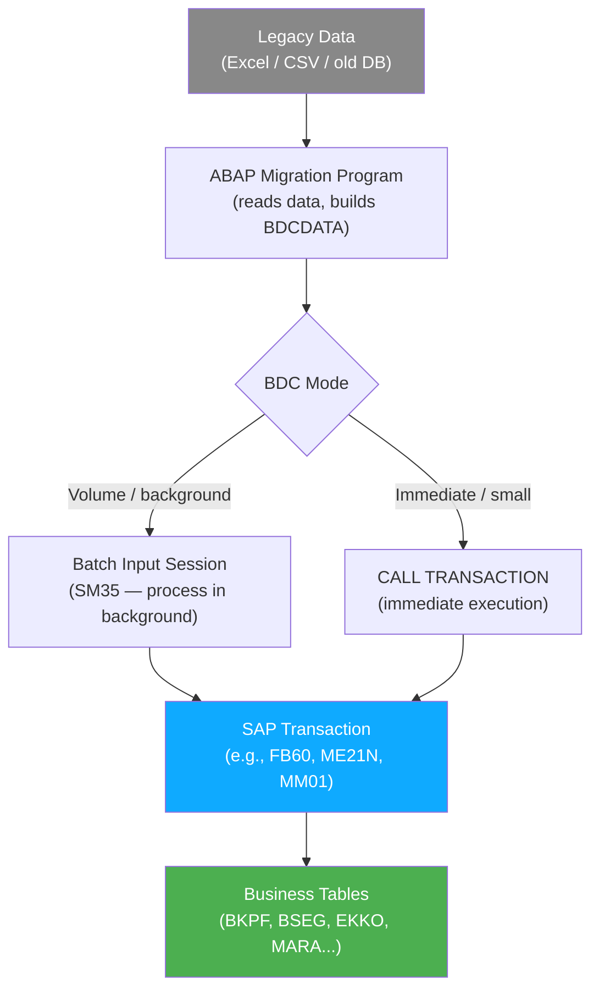
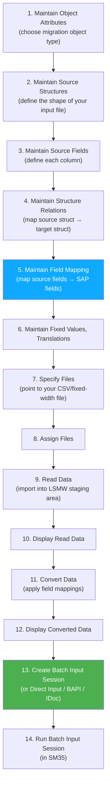

# Chapter 15: Data Migration — BDC & LSMW

*Loading legacy data into SAP: the art of teaching a computer to fill in forms at machine speed.*

---

## ☕ The migration problem, plainly stated

Every SAP go-live has this conversation:

> Business: "We have 20,000 open purchase orders in the old system in an Excel file. We need them all in SAP by Monday."
> Consultant: "We'll need BDC or LSMW for that."
> You (new ABAP dev): "...what?"

This chapter explains what that means and how to do it.

---

## 15.1 The Migration Problem: Loading Legacy Data into SAP Transactions

### 1️⃣ The analogy

Imagine you have a Python script that needs to fill out a web form 20,000 times — a registration form with 15 fields per record. You'd use Selenium or Playwright to automate the browser: navigate to the form, fill field A, fill field B, click Submit, repeat.

BDC is exactly this — except the "browser" is the SAP GUI and the "form" is a SAP transaction screen.

### 2️⃣ You already know this

```python
# Python Playwright analogy — what BDC does conceptually
from playwright.sync_api import sync_playwright

data = [
    {"vendor": "100001", "amount": "1500.00", "gl_account": "400000"},
    {"vendor": "100002", "amount": "2300.00", "gl_account": "400000"},
    # ... 20,000 more rows from the Excel file
]

with sync_playwright() as p:
    browser = p.chromium.launch()
    page = browser.new_page()

    for row in data:
        page.goto("http://sap-app/transaction/FB60")   # Vendor Invoice
        page.fill("#vendor_field",  row["vendor"])
        page.fill("#amount_field",  row["amount"])
        page.fill("#gl_account",    row["gl_account"])
        page.click("#save_button")
        # Check for errors, log result
```

BDC does the same thing at the ABAP level — instead of DOM selectors, you specify **screen number + field name** coordinates.

### The core data structure: BDCDATA

Every BDC program is ultimately about filling a table of type `BDCDATA`. Each row tells SAP either:
- "Navigate to this screen" (`FNAM = 'BDC_OKCODE'` / `BDC_CURSOR` entries), or
- "Put this value in this field" on the current screen.

```abap
" The BDCDATA structure — think of it as a screen-fill instruction
DATA ls_bdc TYPE bdcdata.

" Each row is one of:
"  - BDC_DYNPRO  → "go to this program/screen"
"  - BDC_CURSOR  → "put cursor on this field"
"  - BDC_OKCODE  → "press this button/function key"
"  - field name  → "set this field to this value"
```

---

## 15.2 BDC — Batch Data Communication

### Two modes of BDC

| Mode | How | Best for |
|------|-----|---------|
| **Batch Input Session** | Build a session object via FM `BDC_OPEN_GROUP` / `BDC_INSERT` / `BDC_CLOSE_GROUP`, then process in SM35 | Large volumes, background processing, auditable |
| **CALL TRANSACTION** | Call the FM `CALL TRANSACTION` directly in your code | Immediate execution, smaller volumes, simpler error handling |



### Helper FORMs pattern

Almost all BDC programs use two standard helper FORM routines — `BDC_DYNPRO` and `BDC_FIELD` — that append rows to a local BDCDATA table. You'll see this pattern in every legacy BDC program:

```abap
*&---------------------------------------------------------------------*
*& BDC Helper FORMs — include these in any BDC program
*& (in modern ABAP you'd make these methods of a class; in classic ABAP
*&  they're FORMs in a local include or subroutine pool)
*&---------------------------------------------------------------------*

FORM bdc_dynpro USING prog dynr.
  " Tells BDC: "move to this program's screen number"
  DATA: ls_bdcdata LIKE LINE OF gt_bdcdata.   " gt_bdcdata = global BDCDATA table
  CLEAR ls_bdcdata.
  ls_bdcdata-program  = prog.
  ls_bdcdata-dynpro   = dynr.
  ls_bdcdata-dynbegin = 'X'.
  APPEND ls_bdcdata TO gt_bdcdata.
ENDFORM.

FORM bdc_field USING fnam fval.
  " Sets a field value on the current screen
  DATA: ls_bdcdata LIKE LINE OF gt_bdcdata.
  CLEAR ls_bdcdata.
  ls_bdcdata-fnam = fnam.
  ls_bdcdata-fval = fval.
  APPEND ls_bdcdata TO gt_bdcdata.
ENDFORM.
```

### CALL TRANSACTION example — posting a vendor invoice via FB60

```abap
REPORT zbdc_vendor_invoice_load.

*----------------------------------------------------------------------*
* Types & Data
*----------------------------------------------------------------------*
TYPES: BEGIN OF ty_invoice_data,
         vendor   TYPE lfa1-lifnr,    " vendor number
         amount   TYPE bseg-wrbtr,    " amount
         gl_acct  TYPE bseg-hkont,    " GL account
         ref_doc  TYPE bkpf-xblnr,    " reference document
       END OF ty_invoice_data.

DATA: gt_bdcdata   TYPE TABLE OF bdcdata,
      gt_messages  TYPE TABLE OF bdcmsgcoll,
      gs_options   TYPE ctu_params.

" Sample data — in reality this comes from a file read or SELECT from a Z-table
DATA(lt_invoices) = VALUE TABLE OF ty_invoice_data(
  ( vendor = '0000100001' amount = '1500.00' gl_acct = '400000' ref_doc = 'INV-001' )
  ( vendor = '0000100002' amount = '2300.00' gl_acct = '400000' ref_doc = 'INV-002' )
).

*----------------------------------------------------------------------*
* CALL TRANSACTION options
*----------------------------------------------------------------------*
gs_options-dismode = 'N'.    " N = no display (background), E = display on error
gs_options-updmode = 'S'.    " S = synchronous update
gs_options-racommit = 'X'.   " ABAP commit after each transaction call

*----------------------------------------------------------------------*
* MAIN LOOP — one CALL TRANSACTION per invoice
*----------------------------------------------------------------------*
LOOP AT lt_invoices INTO DATA(ls_inv).

  REFRESH gt_bdcdata.
  REFRESH gt_messages.

  " ── Screen 1: FB60 initial screen ──
  PERFORM bdc_dynpro USING 'SAPMF05L' '0100'.
  PERFORM bdc_field  USING 'RF05L-NEWBS'     '31'.              " posting key 31 = vendor invoice
  PERFORM bdc_field  USING 'RF05L-NEWKO'     ls_inv-vendor.
  PERFORM bdc_field  USING 'BDC_OKCODE'      '/00'.             " Enter

  " ── Screen 2: Document header ──
  PERFORM bdc_dynpro USING 'SAPMF05L' '0300'.
  PERFORM bdc_field  USING 'BKPF-BLDAT'      sy-datum.          " document date
  PERFORM bdc_field  USING 'BKPF-BUDAT'      sy-datum.          " posting date
  PERFORM bdc_field  USING 'BKPF-BUKRS'      '1000'.            " company code
  PERFORM bdc_field  USING 'BKPF-WAERS'      'USD'.             " currency
  PERFORM bdc_field  USING 'BKPF-XBLNR'      ls_inv-ref_doc.    " reference
  PERFORM bdc_field  USING 'RF05L-WRBTR'      ls_inv-amount.     " amount
  PERFORM bdc_field  USING 'BDC_OKCODE'      '/00'.

  " ── Screen 3: G/L offset line ──
  PERFORM bdc_dynpro USING 'SAPMF05L' '0300'.
  PERFORM bdc_field  USING 'RF05L-NEWBS'     '40'.              " posting key 40 = debit
  PERFORM bdc_field  USING 'RF05L-NEWKO'     ls_inv-gl_acct.
  PERFORM bdc_field  USING 'BDC_OKCODE'      '/00'.

  " ── Screen 4: G/L item details ──
  PERFORM bdc_dynpro USING 'SAPMF05L' '0300'.
  PERFORM bdc_field  USING 'RF05L-WRBTR'     ls_inv-amount.
  PERFORM bdc_field  USING 'BDC_OKCODE'      'BU'.              " BU = Post/Save

  " ── Execute the transaction ──
  CALL TRANSACTION 'FB60'
    USING    gt_bdcdata
    OPTIONS  FROM gs_options
    MESSAGES INTO gt_messages.

  " ── Evaluate result ──
  DATA(lv_success) = abap_false.

  LOOP AT gt_messages INTO DATA(ls_msg).
    IF ls_msg-msgtyp = 'S' AND ls_msg-msgnr = '344'.
      " Message F5 344: "Document & posted"
      lv_success = abap_true.
      WRITE: / |OK: Vendor { ls_inv-vendor } | &
               |Ref { ls_inv-ref_doc } | &
               |Doc: { ls_msg-msgv1 }|.
    ELSEIF ls_msg-msgtyp = 'E' OR ls_msg-msgtyp = 'A'.
      WRITE: / |ERR: Vendor { ls_inv-vendor } | &
               |Ref { ls_inv-ref_doc } | &
               |Msg: { ls_msg-msgtx }|.
    ENDIF.
  ENDLOOP.

ENDLOOP.

WRITE: / '--- Migration complete ---'.

*----------------------------------------------------------------------*
* BDC Helper FORMs
*----------------------------------------------------------------------*
FORM bdc_dynpro USING prog TYPE c dynr TYPE c.
  DATA ls_bdcdata TYPE bdcdata.
  CLEAR ls_bdcdata.
  ls_bdcdata-program  = prog.
  ls_bdcdata-dynpro   = dynr.
  ls_bdcdata-dynbegin = 'X'.
  APPEND ls_bdcdata TO gt_bdcdata.
ENDFORM.

FORM bdc_field USING fnam TYPE c fval TYPE c.
  DATA ls_bdcdata TYPE bdcdata.
  CLEAR ls_bdcdata.
  ls_bdcdata-fnam = fnam.
  ls_bdcdata-fval = fval.
  APPEND ls_bdcdata TO gt_bdcdata.
ENDFORM.
```

> ⚠️ **C#/Python gotcha:** The screen numbers (`'0100'`, `'0300'`) and field names (`'BKPF-BLDAT'`) are SAP screen-designer names. You can't guess these — you record them with **SHDB** (next section). The program names (`'SAPMF05L'`) are the ABAP programs behind each screen. A recording shows you exactly what to put here.

---

## 15.3 Recording a Transaction with SHDB

**SHDB** (Batch Input Transaction Recorder) records your manual steps in a transaction and generates the exact BDCDATA map for you. It's the essential first step for any BDC project.

### How to use SHDB

1. Type `SHDB` in the command field.
2. Click "New Recording."
3. Enter a recording name (e.g., `ZREC_FB60`) and the transaction to record (e.g., `FB60`).
4. Click Start — the transaction opens in recording mode.
5. **Fill in the transaction manually** with realistic test data. Every field you touch and every Enter/Save you press is recorded.
6. When done, click Stop Recording.

You now have a recording. SHDB shows you:

| Column | What it tells you |
|--------|------------------|
| Program | The ABAP program name for `BDC_DYNPRO` |
| Screen | The screen number for `BDC_DYNPRO` |
| Field Name | The field name for `BDC_FIELD` |
| Field Value | The value you entered (use this as the template, replace with variable) |

7. From the recording, you can generate a ABAP program automatically: Select the recording → Program → Generate Program. SAP generates a skeleton BDC report with all the `PERFORM bdc_dynpro` and `PERFORM bdc_field` calls filled in. **You replace the hardcoded test values with your data variables.**

> 🧭 **On the job:** SHDB recording → generate program → replace hardcoded values with variables → loop over your data → test on 5 records → test on 50 → run full migration. This is the real workflow. The generated program is ugly but correct. Clean it up, add error handling and logging, and you're done.

---

## 15.4 LSMW — The Low-Code Migration Workbench

**LSMW** (Legacy System Migration Workbench) is a guided, step-by-step tool for data migration. It's designed for functional consultants and developers who want a structured, repeatable migration process without writing raw BDC code.

Access LSMW via the **LSMW** transaction.

### The 14 steps of LSMW

LSMW guides you through a fixed sequence of steps:



### LSMW migration types

In Step 1, you choose how LSMW will load the data:

| Type | How | When to use |
|------|-----|-------------|
| **Batch Input Recording** | Uses an SHDB recording — the most common | Any transaction that has no BAPI |
| **Batch Input (Standard)** | Uses SAP's pre-built recording objects | Standard business objects SAP has mapped |
| **BAPI** | Calls a BAPI for you | When a suitable BAPI exists (preferred) |
| **IDoc** | Generates IDocs | When the receiving system uses IDocs |
| **Direct Input** | Uses SAP's direct-input programs | Material master, customer master special programs |

> 💡 **Practical tip:** LSMW with "Batch Input Recording" is the most flexible option — you record the transaction in SHDB, reference the recording in LSMW Step 1, and LSMW handles all the field-mapping UI for you. You provide a CSV file; LSMW handles the BDC machinery.

### Field mapping in Step 5

The most important step. You map each column from your source file to the corresponding BDCDATA field SAP recorded. For calculated or constant fields, LSMW gives you a mini-ABAP editor:

```abap
" LSMW field mapping expression example (in the Step 5 ABAP editor):

" Map the date field — convert from DDMMYYYY source to YYYYMMDD SAP format
BUDAT = |{ SOURCE_DATE+4(4) }{ SOURCE_DATE+2(2) }{ SOURCE_DATE(2) }|.

" Use a constant for the company code (same for all records)
BUKRS = '1000'.

" Convert amount — remove thousands separator from source
WRBTR = SOURCE_AMOUNT.   " if already in correct numeric format
```

---

## 15.5 Modern Alternative: S/4HANA Migration Cockpit (LTMC / Fiori)

SAP's current best-practice tool for S/4HANA go-live migrations is the **SAP S/4HANA Migration Cockpit**, also called **LTMC** (in older releases) or found as a Fiori app ("Migrate Your Data").

### Why it's better

| Aspect | BDC / LSMW | Migration Cockpit |
|--------|-----------|-------------------|
| Interface | SAP GUI (SE38 / LSMW transaction) | Fiori web UI |
| Data prep | CSV/fixed-width manually | Excel templates with embedded validations |
| Error display | SM35 session log, hard to read | Clear error list with field-level messages |
| Object coverage | Any transaction | ~250 pre-built migration objects (BP, material, open items, etc.) |
| Simulation | Test run in separate session | Simulate mode built in |
| Auditability | Manual logging | Full migration audit trail |
| Clean core | Technically uses BDC under the hood | Uses BAPIs and released APIs — clean core aligned |

### How it works (high level)

1. Open the "Migrate Your Data" Fiori app (or transaction `LTMC`).
2. Create a migration project.
3. Choose a migration object — e.g., "Business Partner," "Open Purchase Orders," "General Ledger Account Master."
4. Download the Excel template for that object — it has one sheet per structure, with column headers matching the SAP field names.
5. Fill the template with your legacy data.
6. Upload the Excel.
7. Run the simulation — errors appear per-row with clear messages.
8. Fix errors in the Excel, re-upload.
9. Run the actual migration.

> 🧭 **On the job:** If you're on an S/4HANA implementation and someone asks "how do we load the open AR items?", the answer is Migration Cockpit, object "Open Items in Accounts Receivable." If the object you need isn't in the Cockpit's 250-object catalog, you fall back to LSMW or BDC. Know both.

> ⚠️ **C#/Python gotcha:** The Migration Cockpit is functionally similar to writing an ETL pipeline — Extract (Excel export from legacy), Transform (clean and map fields), Load (Cockpit uploads to SAP). Python data engineers instantly recognize the pattern. The Cockpit is just a managed, SAP-aware ETL tool that removes the need to write ABAP.

---

## Comparison: BDC vs LSMW vs Migration Cockpit

```text
   You are a Python dev writing ETL:
   ─────────────────────────────────────────────────────────────────
   pandas reads CSV               → LSMW reads your flat file (Step 7-9)
   DataFrame.apply(transform)     → LSMW field mapping rules (Step 5)
   requests.post(api, data=row)   → LSMW runs BDC session (Step 13-14)
   pd.errors / logging            → SM35 session errors / LSMW error list

   Migration Cockpit equivalent:
   ─────────────────────────────────────────────────────────────────
   Fill Excel template            → Extract/Transform
   Upload to Cockpit              → Load
   Simulate                       → Dry run (--dry-run flag)
   Go                             → Actual load
```

---

## 🧠 Recap

- **BDC** (Batch Data Communication) automates SAP transactions at the screen level — it's headless Selenium for SAP. Two modes: `CALL TRANSACTION` (immediate) and Batch Input Session (SM35, background).
- **BDCDATA** is the instruction table: rows of `BDC_DYNPRO` (screen navigation), `BDC_CURSOR` / `BDC_OKCODE` (buttons), and field values.
- **SHDB** records your manual steps and generates the BDCDATA map for you. Always record first, then build your program from the recording.
- **LSMW** wraps the BDC machinery in a 14-step guided wizard. Choose "Batch Input Recording" for the most flexible approach. Step 5 (field mapping) is where you spend most of your time.
- **SAP S/4HANA Migration Cockpit** (LTMC / Fiori) is the modern best practice for S/4HANA go-lives — Excel templates, built-in validation, simulation mode, ~250 pre-built objects.
- For new S/4HANA implementations: Migration Cockpit first, LSMW/BDC as fallback for objects not covered.

---

*[← Contents](../content.md) | [← Previous: Enhancing Standard SAP](14-abap-enhancements.md) | [Next: CDS Views →](16-cds-views.md)*
