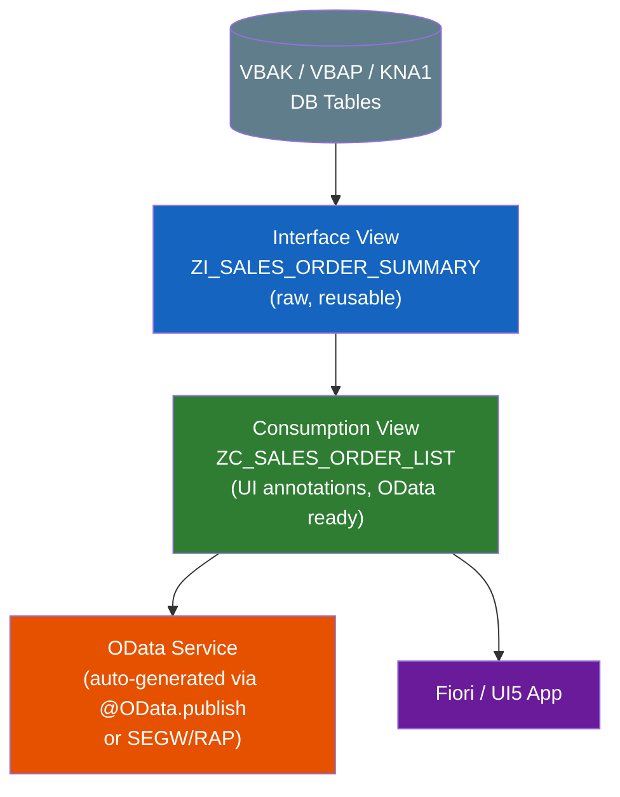
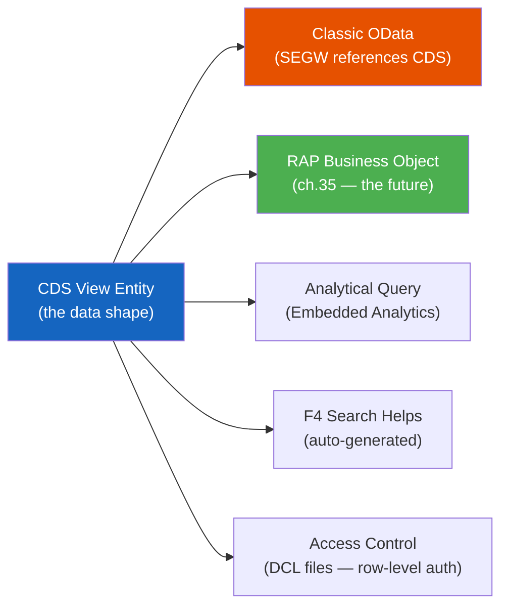

# Chapter 16: CDS Views (Core Data Services)

*Where the database does the heavy lifting — and your code gets a lot shorter.*

---

## ☕ The mental model first

Imagine you have a huge SQL Server full of normalized tables. Every time you build a report, a Fiori app, or an API, you write the same five-table JOIN again. Sometimes in a stored view, sometimes in EF, sometimes inline in a controller. The logic is scattered; performance varies.

Now imagine a world where you define that JOIN once, in a special annotated view that the database engine optimizes — and that same definition automatically powers your OData API, your Fiori UI field labels, your search help, and your authorization checks. You write it once; everything downstream just consumes it.

That's **CDS — Core Data Services**. It's SAP's "push logic down to the database" paradigm, and on HANA it's extremely fast. Instead of pulling raw rows into ABAP and joining them in memory (which was the old way), you define the shape of your data at the database level, and ABAP becomes just the thin orchestration layer on top.

> 💡 **Why this matters right now:** S/4HANA is being built on CDS views. If you want to work on modern ABAP projects, CDS is not optional — it's the foundation for OData services, RAP objects, Fiori apps, and analytical reporting. Recruiters who say "S/4HANA ABAP" basically mean "you write CDS."

---

## 16.1 Why CDS exists: the code-to-data paradigm

### 1️⃣ The analogy

Old ABAP style: drive a truck to the warehouse (database), load the entire stock, drive back to your office, then sort and filter it there. That works when the warehouse is small. With HANA holding hundreds of gigabytes, you sort and filter *at the warehouse* and only carry the exact pallet you need.

CDS is the instruction sheet you hand to the warehouse. The database reads it and hands you exactly what you asked for — already joined, already filtered, already shaped.

### 2️⃣ You already know this

```csharp
// C# — Entity Framework projection (a "view" in code)
var result = dbContext.SalesOrders
    .Include(so => so.Customer)
    .Where(so => so.Status == "OPEN")
    .Select(so => new SalesOrderDto
    {
        OrderId   = so.Id,
        Customer  = so.Customer.Name,
        NetAmount = so.NetAmount
    })
    .ToList();

// EF translates this to a SQL JOIN + WHERE + SELECT.
// The database does the work. You get back a projection.
```

```python
# Python — SQLAlchemy ORM query
from sqlalchemy.orm import joinedload

orders = (
    session.query(SalesOrder)
    .options(joinedload(SalesOrder.customer))
    .filter(SalesOrder.status == "OPEN")
    .with_entities(
        SalesOrder.id.label("order_id"),
        Customer.name.label("customer"),
        SalesOrder.net_amount
    )
    .all()
)
```

```sql
-- Classic SQL CREATE VIEW
CREATE VIEW V_OPEN_ORDERS AS
SELECT so.id, c.name AS customer, so.net_amount
FROM   sales_orders so
JOIN   customers c ON c.id = so.customer_id
WHERE  so.status = 'OPEN';
```

All three push work to the database and give you a clean projection. CDS is the ABAP/HANA equivalent — but richer.

### 3️⃣ The ABAP way (the CDS difference)

A CDS view does everything a SQL view does, *plus*:

| Feature | SQL View | EF Projection | CDS View |
|---------|----------|---------------|----------|
| Push computation to DB | ✅ | ✅ | ✅ |
| Annotations for UI labels | ❌ | ❌ | ✅ `@UI.lineItem` |
| Auto-expose as OData | ❌ | ❌ | ✅ `@OData.publish` |
| Authorization checks inline | ❌ | ❌ | ✅ `@AccessControl.authorizationCheck` |
| Associations (navigable joins) | ❌ | Partial | ✅ |
| Parameters (like a parameterized view) | ❌ | ❌ | ✅ |
| Search help generation | ❌ | ❌ | ✅ `@Search.searchable` |
| HANA analytic cube support | ❌ | ❌ | ✅ |

That annotation layer is what makes CDS so powerful in the SAP ecosystem. You annotate once; the framework does the rest.

> 🧭 **On the job:** You will hear "VDM — Virtual Data Model." SAP's own CDS views (the ones shipped with S/4HANA) are organized in layers: Interface views (raw, `I_`), Consumption views (for Fiori apps, `C_`), and Composite views. Your custom views follow the same naming convention in most shops.

---

## 16.2 Your first CDS view in ADT

CDS views live in ADT (Eclipse with ABAP Development Tools). You don't write them in SE80 or SE11 — you write them as `.ddls` source files in your package.

### Creating a view in ADT

1. Right-click your package → **New → Other ABAP Repository Object → Core Data Services → Data Definition**
2. Choose **Define View Entity** template (the modern syntax — more on that below)
3. Name it. Convention: `ZI_` prefix for interface views, `ZC_` for consumption views.

### The modern syntax: `DEFINE VIEW ENTITY`

SAP has two generations of CDS syntax. The old one is `DEFINE VIEW` (sometimes called "classic CDS"). The modern one — and the one you should write — is `DEFINE VIEW ENTITY`. It maps more cleanly to the RAP framework, has better association handling, and is what SAP recommends for all new development.

> ⚠️ **C#/Python gotcha:** You will see lots of examples online using `DEFINE VIEW` (without `ENTITY`). It still works, but don't write new code that way. It's like writing ASP.NET Web API controllers with `HttpHandler` from 2004 — valid, just not where the world is heading.

### 2️⃣ You already know this

```csharp
// C# — simple LINQ projection from a DbSet<SalesOrder>
public class SalesOrderSummaryDto
{
    public string OrderId    { get; set; }
    public string CustomerId { get; set; }
    public string OrderType  { get; set; }
    public decimal NetValue  { get; set; }
    public string Currency   { get; set; }
}

var summaries = dbContext.SalesOrders
    .Select(so => new SalesOrderSummaryDto
    {
        OrderId    = so.Vbeln,
        CustomerId = so.Kunnr,
        OrderType  = so.Auart,
        NetValue   = so.Netwr,
        Currency   = so.Waerk
    });
```

### 3️⃣ The ABAP way

```abap
" File: ZI_SALES_ORDER_SUMMARY.ddls
" (Saved as a Data Definition in ADT — this IS the source)

@AbapCatalog.viewEnhancementCategory: [#NONE]
@AccessControl.authorizationCheck: #NOT_REQUIRED
@Metadata.ignorePropagatedAnnotations: true
@ObjectModel.usageType:{
    serviceQuality: #X,
    sizeCategory: #S,
    dataClass: #TRANSACTIONAL
}
@EndUserTexts.label: 'Sales Order Summary'

define view entity ZI_SALES_ORDER_SUMMARY
  as select from vbak                    -- VBAK = sales order header table
  association [0..*] to vbap as _Items
    on $projection.SalesOrder = _Items.vbeln
{
  key vbeln      as SalesOrder,          -- key field, aliased to CamelCase
      kunnr      as SoldToParty,
      auart      as OrderType,
      netwr      as NetValue,
      waerk      as TransactionCurrency,

      /* Formatted date — HANA function pushed down */
      cast( erdat as abap.dats )         as CreationDate,

      /* Virtual link to items — this is an association, not a JOIN yet */
      _Items
}
```

Key things to notice:

- **`define view entity`** — the modern keyword.
- **`as select from vbak`** — just like `FROM` in SQL; `vbak` is the SAP sales order header table.
- **`key vbeln`** — marks the primary key field of the view.
- **Aliases in CamelCase** — SAP naming convention for CDS fields; the underlying column is uppercase (`vbeln`), the exposed name is `SalesOrder`.
- **`_Items`** — the association (navigation, not yet a JOIN). We'll cover this next.

> 🛠️ **In ADT:** After saving the `.ddls` file, press **F8** to activate it. You can preview the data directly in the Data Preview tab. If there are syntax errors, the ADT editor underlines them like VS Code.

### Adding a second table (a real join)

```abap
@AbapCatalog.viewEnhancementCategory: [#NONE]
@AccessControl.authorizationCheck: #NOT_REQUIRED
@EndUserTexts.label: 'Sales Order with Customer Name'

define view entity ZI_SALES_ORDER_WITH_CUST
  as select from vbak
  inner join   kna1 on  kna1.kunnr = vbak.kunnr  -- KNA1 = customer master
{
  key vbak.vbeln  as SalesOrder,
      vbak.auart  as OrderType,
      vbak.netwr  as NetValue,
      vbak.waerk  as Currency,
      kna1.kunnr  as SoldToParty,
      kna1.name1  as CustomerName,
      kna1.land1  as Country
}
```

This is a straightforward INNER JOIN — identical in intent to your SQL or EF `.Include()`.

---

## 16.3 Associations, annotations, and parameters

### 16.3.1 Associations — the join you navigate later

An association is a *declared relationship* between two view entities. Think of it like a navigation property in EF (`Customer.Orders`). The JOIN doesn't happen until something *uses* the association — either another view that expands it, or an OData `$expand` call.

```abap
define view entity ZI_SALES_ORDER_FULL
  as select from vbak
  " Declare the association; join condition is on key
  association [0..*] to ZI_SALES_ORDER_LINE as _Items
    on $projection.SalesOrder = _Items.SalesOrder
  association [1..1] to I_Customer          as _Customer
    on $projection.SoldToParty = _Customer.Customer
{
  key vbeln  as SalesOrder,
      kunnr  as SoldToParty,
      netwr  as NetValue,

  " Expose the associations so consumers can navigate them
      _Items,
      _Customer
}
```

```abap
" ZI_SALES_ORDER_LINE — the line item view (simplified)
define view entity ZI_SALES_ORDER_LINE
  as select from vbap          -- VBAP = sales order item table
{
  key vbeln  as SalesOrder,
  key posnr  as SalesOrderItem,
      matnr  as Material,
      kwmeng as OrderQuantity,
      meins  as BaseUnit
}
```

```csharp
// C# EF equivalent — navigation properties declared on the model
public class SalesOrder
{
    public string OrderId   { get; set; }
    public string SoldTo    { get; set; }
    public decimal NetValue { get; set; }

    // Navigation properties — EF can JOIN these when you call .Include()
    public ICollection<SalesOrderItem> Items    { get; set; }
    public Customer                    Customer { get; set; }
}
```

The parallel is direct. In EF you declare navigation properties and call `.Include()`; in CDS you declare associations and a consumer calls `$expand` (in OData) or uses `\_Items` in another CDS view.

### 16.3.2 Annotations — the magic layer

Annotations are metadata decorators. You've seen them on classes in C# (`[HttpGet]`, `[Required]`) or Python (`@app.route`). CDS annotations work the same way — they attach instructions to the view or its fields.

The most important annotation families:

```abap
" ── ON THE VIEW ──────────────────────────────────────────
@AbapCatalog.viewEnhancementCategory: [#NONE]   " internal catalog hint

" Auto-publish this view as an OData service (classic approach)
@OData.publish: true

" On the job you'll see this on Fiori app backing views:
@UI.headerInfo: {
    typeName:       'Sales Order',
    typeNamePlural: 'Sales Orders',
    title: { type: #FIELD, value: 'SalesOrder' }
}

" ── ON FIELDS ─────────────────────────────────────────────
{
  key vbeln  as SalesOrder,

  " Show this field in a Fiori list/table column
  @UI.lineItem: [{ position: 10 }]
  " Show it in the object page header
  @UI.selectionField: [{ position: 10 }]
  " Human-readable label in the UI
  @EndUserTexts.label: 'Sales Order'

      vbeln  as SalesOrder,

  " Currency field — tells UI5 which field holds the currency code
  @Semantics.amount.currencyCode: 'TransactionCurrency'
  @UI.lineItem: [{ position: 50 }]
      netwr  as NetValue,

      waerk  as TransactionCurrency,

  " Search relevance
  @Search.defaultSearchElement: true
  @Search.fuzzinessThreshold: 0.8
      kunnr  as SoldToParty
}
```

> ⚠️ **C#/Python gotcha:** Annotations look like comments (`@Something`), but they are NOT comments — they compile and affect runtime behavior. If you mistype one, activation will fail with a cryptic error. ADT gives you code completion for annotation values (Ctrl+Space), so use it.

### 16.3.3 Parameters — the parameterized view

Sometimes you need to filter at the view level based on a runtime value — like a fiscal year, a company code. CDS supports parameters:

```abap
define view entity ZI_FI_DOCUMENT_BY_YEAR
  with parameters
    p_gjahr : gjahr,               " fiscal year — a DDIC type
    p_bukrs : bukrs                " company code
  as select from bkpf              " BKPF = accounting document header
{
  key belnr  as AccountingDocument,
      gjahr  as FiscalYear,
      bukrs  as CompanyCode,
      blart  as DocumentType,
      bldat  as DocumentDate,
      dmbtr  as AmountInLocalCurrency
}
where
      gjahr = $parameters.p_gjahr
  and bukrs = $parameters.p_bukrs
```

Calling it from ABAP with parameters:

```abap
" Consume the parameterized view from Open SQL
SELECT *
  FROM zi_fi_document_by_year( p_gjahr = '2024', p_bukrs = '1000' )
  INTO TABLE @DATA(lt_docs).

" Exactly like calling a parameterized SQL view or table-valued function
```

```csharp
// C# equivalent — parameterized DB query / TVF
var docs = dbContext.FiDocuments
    .FromSqlInterpolated(
        $"SELECT * FROM V_FI_DOCUMENT_BY_YEAR({year}, {companyCode})")
    .ToList();
```

---

## 16.4 Interface views vs. consumption views (the VDM layering)

SAP's standard CDS model has three layers. In your custom projects, you'll typically have two:



| Layer | Prefix | Purpose | Has UI annotations? |
|-------|--------|---------|---------------------|
| Interface / Basic | `ZI_` or `I_` | Joins raw tables, reusable by any consumer | Rarely |
| Consumption | `ZC_` or `C_` | Adds `@UI`, `@OData`, restructures for a specific app | Yes |

Why two layers? Interface views stay stable even when the Fiori app changes layout. Consumption views adapt to each app without touching the underlying data logic. It's the same reason you separate a DTO from your domain model in C#.

> 🧭 **On the job:** In code reviews you'll be asked "is this an interface view or a consumption view?" If you put `@UI.lineItem` annotations on an `I_` view, you'll hear about it. Keep the layers clean.

---

## 16.5 CDS as the foundation for OData & RAP

CDS views are not just a nicer way to write JOINs. They are the *foundation* on which SAP builds everything modern:



- **Chapter 18** covers the OData big picture, and you'll see CDS referenced constantly.
- **Chapter 35** (RAP) is almost entirely CDS-first — you define your business object *in* CDS and RAP generates the OData service automatically.

> 💡 **The shift to understand:** In classic ABAP, you wrote code and occasionally queried a table. In modern S/4HANA ABAP, you **model data in CDS first** and write ABAP code only for business logic that the model can't express. Data shape lives in CDS; behavior lives in ABAP classes. The same separation-of-concerns idea you know from MVC or clean architecture.

---

## 🧠 Recap

| Concept | C#/Python equivalent | ABAP/CDS |
|---------|---------------------|----------|
| SQL CREATE VIEW | SQL View | `DEFINE VIEW ENTITY` |
| EF projection / DTO shape | `Select(x => new Dto {...})` | CDS field list with aliases |
| Navigation property | `Customer.Orders` (EF) | CDS association `_Items` |
| Eager load | `.Include(x => x.Items)` | `$expand` on OData or `\_Items` in another view |
| Attribute / decorator | `[JsonPropertyName("x")]` | `@UI.lineItem`, `@OData.publish` |
| Table-valued function param | TVF / `FromSqlInterpolated` | `with parameters` in CDS |
| Repository layer (data shape) | DbContext + DTO | Interface CDS view (`ZI_`) |
| ViewModel / API contract | ViewModel / Response DTO | Consumption CDS view (`ZC_`) |

**Five things to remember:**
1. CDS = annotated SQL view that runs on HANA, not in ABAP memory.
2. `DEFINE VIEW ENTITY` is the modern syntax — use it for all new work.
3. Associations = navigation properties; they don't cost a JOIN until consumed.
4. Annotations wire the view to UI labels, OData, search, and auth — one source of truth.
5. CDS is the foundation for RAP, OData, and Fiori — learn it well and everything else becomes easier.

---

*[← Contents](../content.md) | [← Previous: Data Migration: BDC & LSMW](15-data-migration-lsmw-bdc.md) | [Next: AMDP →](17-amdp.md)*
