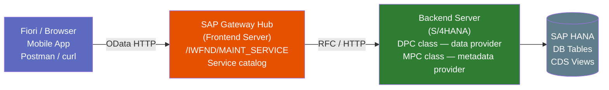

# Chapter 18: OData & REST — The Big Picture

*The gateway to Part VI — understand this chapter and the next eight chapters will make sense.*

---

## ☕ The mental model first

You already know REST. You've built ASP.NET Web API controllers or FastAPI endpoints. You know GET/POST/PUT/DELETE, JSON responses, status codes, and how to use `HttpClient` or `requests` to call them. That knowledge is 100% transferable here.

OData is REST — but with **a standardized vocabulary on top**. Instead of every API team inventing their own query parameter names and URL conventions, OData defines them once: `$filter`, `$expand`, `$orderby`, `$top`, `$skip`, `$count`, `$select`. Every OData service speaks the same language. A client that knows OData can query *any* OData service — a bit like how every SQL database responds to `SELECT * FROM table WHERE x = y`, regardless of the vendor.

**SAP Gateway** is SAP's OData server. It sits between Fiori apps (and other clients) and the S/4HANA backend system. Understanding Gateway's architecture is the prerequisite for everything in Part VI.

> 🎯 **This chapter is the map.** We're not building anything here — we're orienting you so that when you do build in chapters 22–31, every piece fits into a coherent picture. Don't skip it, even if you already know REST well.

---

## 18.1 REST you know — what OData adds

### 1️⃣ The analogy

Plain REST is like having a phone conversation: you and the other party make up the rules as you go. `GET /orders?status=open&limit=10` works, but only if the server decided to name the parameter `status` and `limit`. Another server might use `state` and `pageSize`. Every API is a special snowflake.

OData is like having a standardized contract: everyone agrees that "filter rows" is always `$filter`, "limit results" is always `$top`, "include related records" is always `$expand`. You learn it once; it works everywhere.

### 2️⃣ You already know this

```python
# Python — plain REST with requests
import requests

# Every API has its own parameter names — you have to read docs each time
resp = requests.get(
    "https://api.example.com/orders",
    params={"status": "open", "limit": 10, "sort": "date_desc"}
)
orders = resp.json()
```

```csharp
// C# — plain ASP.NET Web API — custom query params, no standard
[HttpGet("orders")]
public IActionResult GetOrders(
    [FromQuery] string status,
    [FromQuery] int pageSize = 10,
    [FromQuery] string sortBy = "date")
{
    // ...
}
```

```
# OData — standardized URL, works the same on ANY OData service
GET /sap/opu/odata/sap/ZSALES_SRV/SalesOrderSet
    ?$filter=Status eq 'OPEN'
    &$top=10
    &$orderby=CreationDate desc
    &$select=SalesOrder,Customer,NetValue
    &$expand=Items
    &$inlinecount=allpages
```

The OData URL has a standard grammar that every OData client library understands. You don't need to read the docs for each new service — you just need to know what's in the `$metadata` document (coming up in 18.5).

### What OData adds on top of plain REST

| Feature | Plain REST | OData |
|---------|-----------|-------|
| Query / filter | Custom params | `$filter` — standard syntax |
| Pagination | Custom `page`/`limit` | `$top` + `$skip` |
| Related records | Custom `include` | `$expand` |
| Field selection | Custom `fields` | `$select` |
| Count of total results | Custom or header | `$inlinecount=allpages` or `$count` |
| Sorting | Custom `sort` | `$orderby` |
| Service description / schema | OpenAPI/Swagger (optional) | `$metadata` (always there) |
| Batch requests | Not standard | `$batch` |

> 💡 **OData version note:** SAP Gateway mostly uses **OData v2**. OData v4 exists and is newer, and RAP (Chapter 35) produces v4 services. If you see a URL with `/v2/` or `/v4/` in it, that's the hint. Most of Part VI teaches v2 — what you'll encounter on most SAP projects today.

---

## 18.2 OData URL conventions

This is the vocabulary you'll type every day in the browser and in Postman while testing.

### Base URL structure

```
https://<host>:<port>/sap/opu/odata/sap/<SERVICE_NAME>/<EntitySet>
```

Example:
```
https://my-s4.corp.com:44300/sap/opu/odata/sap/ZSALES_SRV/SalesOrderSet
```

| Segment | Meaning |
|---------|---------|
| `/sap/opu/odata/sap/` | Fixed Gateway prefix — always the same |
| `ZSALES_SRV` | Your service name (registered in `/IWFND/MAINT_SERVICE`) |
| `SalesOrderSet` | The entity set name (a collection of `SalesOrder` entities) |

### The query options

```
# Get sales orders for customer C0001, open status, newest first, 20 per page
GET .../SalesOrderSet
    ?$filter=SoldToParty eq 'C0001' and LifecycleStatus eq 'N'
    &$orderby=CreationDate desc
    &$top=20
    &$skip=0
    &$select=SalesOrder,SoldToParty,NetAmountInTransCrcy,TransactionCurrency
    &$inlinecount=allpages
    &$format=json
```

```
# Navigate to a single entity by key
GET .../SalesOrderSet('0000000100')

# Navigate to a related entity set (association)
GET .../SalesOrderSet('0000000100')/to_Item

# Expand related data inline
GET .../SalesOrderSet('0000000100')?$expand=to_Item
```

### `$filter` expression syntax

```
# Equals
$filter=Status eq 'OPEN'

# Comparison operators: eq, ne, gt, ge, lt, le
$filter=NetValue gt 1000.00

# Logical operators: and, or, not
$filter=Status eq 'OPEN' and SoldToParty eq 'C0001'

# String functions
$filter=substringof('Acme', CustomerName)    " contains
$filter=startswith(CustomerName, 'Ac')

# Date comparison (OData v2 — date literal format)
$filter=CreationDate gt datetime'2024-01-01T00:00:00'
```

> ⚠️ **C#/Python gotcha:** OData string literals use **single quotes**, not double. `$filter=Status eq "OPEN"` will fail; `$filter=Status eq 'OPEN'` is correct. Also, OData keys in URLs are quoted: `SalesOrderSet('0000000100')` — the key is inside the parentheses and quoted if it's a string type.

---

## 18.3 SAP Gateway architecture

### 1️⃣ The analogy

Imagine a building with a reception desk (the Gateway hub) and an office floor in the back (the backend S/4HANA system). Visitors (Fiori apps, mobile clients, third-party systems) talk to reception. Reception knows which office handles which request and forwards accordingly. The office (backend) does the real work and hands the answer back to reception, which packages it as a nice OData response and hands it to the visitor.

### The components



| Component | Where | What it does |
|-----------|-------|-------------|
| **Gateway Hub (Frontend Server)** | Separate SAP system or embedded | Receives OData HTTP requests; routes to backend |
| **`/IWFND/MAINT_SERVICE`** | Frontend server | Service activation & registration console |
| **MPC class** (Metadata Provider Class) | Backend | Defines entity types, properties, associations — the schema |
| **DPC class** (Data Provider Class) | Backend | Implements GET_ENTITY, GET_ENTITYSET, CREATE_ENTITY etc. — the data logic |
| **DPC_EXT class** | Backend | Your extension of the DPC class — where YOU write code |
| **SEGW** (Service Builder) | Backend | The tool (t-code) to build MPC + DPC + register the service |

> 🧭 **On the job:** In many S/4HANA installations the Gateway hub and the backend are the **same system** ("embedded deployment"). You'll hear "embedded Gateway." The architecture is the same; it's just that the frontend and backend are the same SAP system instance. `/IWFND/MAINT_SERVICE` still exists on that system.

### Embedded vs. Hub deployment

```
Embedded (most common):                Hub deployment:
┌─────────────────────┐                ┌───────────┐    ┌───────────────┐
│  S/4HANA            │                │  Gateway  │    │  S/4HANA      │
│  ┌───────────────┐  │                │  Hub      │───▶│  Backend      │
│  │  GW Hub Layer │  │                │  /IWFND/  │    │  SEGW / DPC   │
│  │  SEGW / DPC   │  │                └───────────┘    └───────────────┘
│  └───────────────┘  │
│  HANA DB            │
└─────────────────────┘
```

---

## 18.4 Two ways to build OData in SAP

This is the most important orientation decision you'll make on a new project. There are two distinct worlds:

### Option 1: SEGW — Service Builder (classic, what Part VI teaches)

- **Tool:** transaction `SEGW` on the backend system.
- **How it works:** You define entity types, entity sets, and associations in a GUI wizard. SEGW generates the MPC and DPC class stubs. You add business logic by extending the DPC class (`ZCL_<SERVICE>_DPC_EXT`).
- **Age:** Available since SAP NetWeaver 7.31; still dominant on most real-world projects.
- **When you'll use it:** Any legacy or classic ABAP system (ECC or older S/4HANA), any project already using SEGW services, and most OData work you'll do in the next few years on existing landscapes.

### Option 2: RAP — RESTful Application Programming Model (modern)

- **Tool:** ADT (Eclipse) — CDS View Entities + Behavior Definitions + Behavior Implementations.
- **How it works:** You define a CDS View Entity, write a Behavior Definition (`.bdef`), and ABAP runtime auto-generates OData v4 endpoints. Zero SEGW needed.
- **Age:** Introduced in S/4HANA 1909; the strategic direction for all new development.
- **When you'll use it:** New Greenfield S/4HANA projects, BTP ABAP Environment.
- **Covered in:** Chapter 35.

> 🎯 **Why Part VI uses SEGW:** The majority of SAP projects you'll encounter are on systems that have been running for years. SEGW services are everywhere. Understanding how the DPC/MPC pattern works gives you the mental model to maintain and extend the huge amount of existing code out there — and to understand *why* RAP is better when you get to chapter 35. Learn both.

```
Part VI road map:
Ch.18 — OData big picture (this chapter, SEGW + Gateway)
Ch.21 — Entity types, properties, XML & JSON
Ch.22 — Service methods, import parameters
Ch.23 — GET_ENTITY & GET_ENTITYSET (reading data)
Ch.24 — Search strings & query options
Ch.25 — Create, Update & Delete
Ch.26 — Associations
Ch.27 — Header + item (the classic order + line items pattern)
Ch.28 — Function Imports
Ch.29 — CREATE_DEEP_ENTITY
Ch.30 — GET_EXPANDED_ENTITYSET
Ch.31 — File upload & download
```

---

## 18.5 The `$metadata` document and service activation

### The `$metadata` document

Every OData service has a `$metadata` endpoint. It's the machine-readable schema — like a Swagger/OpenAPI spec, but in XML and always present (no setup needed).

```
GET https://my-s4.corp.com:44300/sap/opu/odata/sap/ZSALES_SRV/$metadata
```

Returns XML describing:
- Every EntityType (fields, types, keys)
- Every EntitySet (the collections)
- Every NavigationProperty (the associations)
- Every FunctionImport (the RPC-style operations)

```xml
<!-- Fragment of a $metadata response -->
<EntityType Name="SalesOrderType">
  <Key>
    <PropertyRef Name="SalesOrder"/>
  </Key>
  <Property Name="SalesOrder"     Type="Edm.String" Nullable="false" MaxLength="10"/>
  <Property Name="SoldToParty"    Type="Edm.String" MaxLength="10"/>
  <Property Name="NetAmountInTransCrcy" Type="Edm.Decimal" Precision="16" Scale="3"/>
  <Property Name="TransactionCurrency" Type="Edm.String" MaxLength="5"/>
  <NavigationProperty Name="to_Item"
    Relationship="ZSALES_SRV.to_SalesOrderItem"
    FromRole="FromRole_SalesOrderItem"
    ToRole="ToRole_SalesOrderItem"/>
</EntityType>

<EntitySet Name="SalesOrderSet" EntityType="ZSALES_SRV.SalesOrderType"/>
```

> 💡 **Practical tip:** Whenever you encounter a new OData service, open `$metadata` first. It tells you everything — field names, types, which navigation properties are available, what FunctionImports exist. In browser dev tools, it's usually the first XHR call a Fiori app makes.

### Activating a service — `/IWFND/MAINT_SERVICE`

After you build a service in SEGW on the backend, you need to activate it on the Gateway hub so clients can reach it. This is done via t-code `/IWFND/MAINT_SERVICE`.

**Steps to activate a new service:**

1. Open `/IWFND/MAINT_SERVICE` (on the Gateway / frontend system).
2. Click **Add Service**.
3. Enter the System Alias (the RFC connection pointing to your backend) and search for the service by technical name.
4. Select the service and click **Add Selected Services**.
5. Assign it to a package and transport.
6. The service is now live. Test it with the built-in **Gateway Client** (`/IWFND/GW_CLIENT`) — this is your built-in Postman inside SAP.

```
/IWFND/GW_CLIENT — the Gateway test client
  ┌──────────────────────────────────────────────────────┐
  │ Request URI: /sap/opu/odata/sap/ZSALES_SRV/$metadata │
  │ HTTP Method: GET                                     │
  │ [Execute]                                            │
  │                                                      │
  │ Response:   200 OK                                   │
  │ Body:       <edmx:Edmx ...>...</edmx:Edmx>           │
  └──────────────────────────────────────────────────────┘
```

> 🧭 **On the job:** You will spend real time in `/IWFND/GW_CLIENT`. Bookmark it. It's the fastest way to test OData calls without setting up Postman. You can set HTTP headers, send request bodies for CREATE/UPDATE, and inspect the raw response — all inside SAP GUI.

### The service catalog

```
/IWFND/MAINT_SERVICE — shows all activated services on the Gateway hub
  Filter by:  Technical Service Name (e.g., ZSALES_SRV)
              System Alias
              Package

  Actions:    Activate / Deactivate
              Delete
              Error log
              Test (opens GW Client)
              Show metadata
```

> ⚠️ **C#/Python gotcha:** Activating a SEGW service in `/IWFND/MAINT_SERVICE` is a *separate step* from building it in SEGW. If a service works in SEGW's "Generate and Publish" test but 404s from Postman, the most common cause is that it hasn't been activated in `/IWFND/MAINT_SERVICE` on the correct system. This trips up everyone the first time.

---

## 🧠 Recap

| Concept | C#/Python equivalent | SAP OData |
|---------|---------------------|-----------|
| REST API | ASP.NET Web API / FastAPI | SAP Gateway + OData service |
| API schema / Swagger | `swagger.json` / OpenAPI | `$metadata` XML document |
| Query params (custom) | `?status=open&limit=10` | `$filter`, `$top`, `$skip`, `$orderby` |
| Eager-load related data | `.Include()` / `joinedload()` | `$expand` |
| Field selection | `fields=x,y` (custom) | `$select` |
| API controller | Web API `ControllerBase` | DPC_EXT class method |
| API model class | DTO / Response class | MPC class entity type |
| API builder / scaffolding | Minimal API / attribute routing | SEGW (classic) or RAP (modern) |
| Service registration | Program.cs `AddControllers()` | `/IWFND/MAINT_SERVICE` activation |
| In-browser API tester | Swagger UI | `/IWFND/GW_CLIENT` |

**Five things to remember:**
1. OData = REST + standardized query vocabulary (`$filter`, `$expand`, `$top`, etc.).
2. SAP Gateway is the OData server — it routes requests from clients to backend DPC logic.
3. MPC = schema (what fields exist); DPC = implementation (what data comes back).
4. SEGW is the classic builder (what Part VI teaches); RAP is the modern way (Chapter 35).
5. Every OData service has a `$metadata` document — read it first when you encounter a new service.

---

*[← Contents](../content.md) | [← Previous: AMDP](17-amdp.md) | [Next: Consumer Proxy / SPROXY →](19-consumer-proxy-sproxy.md)*
