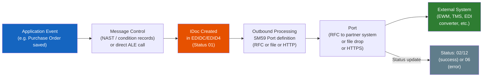
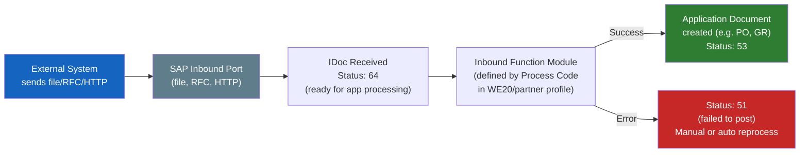

# Chapter 20: ALE & IDocs — SAP's Classic Messaging

*Strongly-typed messages on SAP's internal message bus — older than Kafka, still running the world's supply chains.*

---

## ☕ The mental model first

Every distributed system eventually solves the same problem: System A needs to tell System B "something happened." Maybe a purchase order was created in SAP. Maybe a goods receipt needs to go to a warehouse system. Maybe a customer master change in the central SAP needs to replicate to five satellite systems.

Modern solutions use Kafka, RabbitMQ, Azure Service Bus, SNS/SQS. SAP's solution, built in the mid-1990s and still running on the majority of SAP landscapes today, is **ALE/IDoc**.

- **ALE** = Application Link Enabling — the framework that decides *who* talks to *whom* and *when*.
- **IDoc** = Intermediate Document — the strongly-typed message envelope that carries the data.

An IDoc is essentially a Kafka message with a rigidly defined schema — except the schema is defined in SAP's data dictionary rather than Avro/Protobuf/JSON Schema, and the broker is SAP's own messaging layer rather than a Kafka cluster.

> 🧭 **On the job:** IDoc knowledge is one of the most common interview topics for ABAP developers. Even if you never write new IDocs, you *will* be asked to debug a failed one, reprocess a stuck batch, or explain the difference between outbound and inbound flow. This chapter gives you exactly what you need for that conversation.

---

## 20.1 IDoc: the strongly-typed message envelope

### 1️⃣ The analogy

Imagine a Kafka topic where every message is not just bytes or JSON, but a strictly structured object with three mandatory parts baked in:

```
Kafka message (modern):                  IDoc (SAP):
┌──────────────────────┐                ┌──────────────────────────┐
│ Headers (metadata)   │    ≈           │ Control Record            │
│   topic, partition   │                │   (who sent it, who gets  │
│   offset, timestamp  │                │    it, message type, date)│
├──────────────────────┤                ├──────────────────────────┤
│ Key                  │    ≈           │ (no direct equivalent —   │
│                      │                │  key is in control record)│
├──────────────────────┤                ├──────────────────────────┤
│ Payload (bytes/JSON) │    ≈           │ Data Records              │
│   the actual message │                │   (segments of business   │
│                      │                │    data — see below)      │
├──────────────────────┤                ├──────────────────────────┤
│ (Status tracked by   │    ≈           │ Status Records            │
│  consumer offset)    │                │   (processing history:    │
│                      │                │    sent, delivered, error)│
└──────────────────────┘                └──────────────────────────┘
```

The fundamental difference: an IDoc is **one document in a database table** (`EDIDC` for control records, `EDID4` for data segments, `EDIDS` for status). The "broker" is SAP itself. You can query IDocs like any SAP table — they never disappear from the system unless explicitly archived.

### The three parts of every IDoc

#### 1. Control Record (table `EDIDC`)

The envelope header. One record per IDoc.

| Field | Meaning | Example |
|-------|---------|---------|
| `DOCNUM` | Unique IDoc number | `0000000000012345` |
| `MESTYP` | Message type | `ORDERS` (purchase order) |
| `IDOCTP` | Basic IDoc type | `ORDERS05` |
| `SNDPRT` / `SNDPRN` | Sender partner type/number | `LS` / `S4HANA_DEV` |
| `RCVPRT` / `RCVPRN` | Receiver partner type/number | `LS` / `EWM_SYSTEM` |
| `CREDAT` / `CRETIM` | Creation date/time | `20240315` / `143022` |
| `STATUS` | Current processing status | `02` = sent, `53` = delivered OK |
| `DIRECT` | Direction | `1` = outbound, `2` = inbound |

#### 2. Data Records (table `EDID4`) — the segments

The payload — a list of **segments**, each representing one logical entity in the message. Think of them like the lines of a strongly-typed JSON array, where each line's structure is defined by a DDIC type.

```
IDoc ORDERS05 for a Purchase Order:
  E1EDK01  (Header segment — one occurrence)
    ├─ purchase org, document type, currency
  E1EDP01  (Item segment — one per line item)
    ├─ item number, material, quantity, unit
  E1EDP19  (Material description — per item)
  E1EDK14  (Org data — one per org unit)
  E1EDKT1  (Header texts)
  E1EDPT1  (Item texts)
```

Each segment type has a fixed DDIC structure — field names, lengths, types are defined and immutable. This is the schema. No schema evolution without a new IDoc type version.

```csharp
// C# analogy — a strongly-typed message with nested segments
public class PurchaseOrderIdoc
{
    public IdocControlRecord Control  { get; set; }   // envelope
    public PurchaseOrderHeader Header { get; set; }   // E1EDK01
    public List<PurchaseOrderItem> Items { get; set; } // E1EDP01[]
    public List<PurchaseOrderText> Texts { get; set; } // E1EDKT1[]
}
```

#### 3. Status Records (table `EDIDS`)

A running audit log of every state change an IDoc went through — created, sent to port, acknowledged, delivered to inbound processing function module, error encountered, reprocessed. Each status change appends a new record.

Status codes you'll encounter constantly:

| Code | Meaning | Outbound / Inbound |
|------|---------|---------------------|
| `01` | IDoc generated | Both |
| `02` | Passed to port OK | Outbound |
| `03` | Data passed to port | Outbound |
| `06` | Error during translation | Outbound |
| `12` | Dispatch OK | Outbound |
| `30` | IDoc ready for dispatch | Outbound |
| `51` | Application document not posted | Inbound |
| `53` | Application document posted | Inbound |
| `64` | IDoc ready to be transferred to application | Inbound |
| `68` | Error — no further processing | Both |

> 💡 **Status 53 is happy path on inbound.** Status 51 means it arrived but failed to post — this is the most common thing you'll be asked to fix. See section 20.4.

---

## 20.2 Basic types, message types, and partner profiles

### IDoc types and message types — what's the difference?

| Term | What it is | Example |
|------|-----------|---------|
| **Basic IDoc type** (IDoc type) | The data structure — segments + fields | `ORDERS05`, `DESADV01`, `MATMAS05` |
| **Message type** | The *business meaning* — what the IDoc represents | `ORDERS`, `DESADV`, `MATMAS` |
| **Extension IDoc type** | A custom extension of a basic type with extra segments | `ZORDERS05_EXT` |

One message type can be carried by multiple IDoc type versions. `ORDERS` (purchase order) is usually carried by `ORDERS05` today, but older systems might use `ORDERS04`. The message type is what you configure in partner profiles; the IDoc type is the data structure.

### Partner profiles — WE20

**Transaction: `WE20`**

Partner profiles define the routing: for *this sender/receiver pair*, using *this message type*, do *this* (call this function module inbound, use this port outbound).

```
WE20 — Partner Profiles
  Partner Number: S4HANA_DEV
  Partner Type:   LS (Logical System)
  ┌───────────────────────────────────────────────────────────┐
  │ Outbound Parameters                                       │
  │  Message type: ORDERS                                     │
  │  IDoc type:    ORDERS05                                   │
  │  Port:         ZEWM_PORT (RFC or file port)               │
  │  Output mode:  Transfer IDoc immediately                  │
  └───────────────────────────────────────────────────────────┘
  ┌───────────────────────────────────────────────────────────┐
  │ Inbound Parameters                                        │
  │  Message type: DESADV (delivery advice)                   │
  │  IDoc type:    DESADV01                                   │
  │  Process code: DESADV (triggers inbound function module)  │
  └───────────────────────────────────────────────────────────┘
```

> 🧭 **On the job:** The first time an IDoc isn't flowing, check WE20 *first*. Missing or wrong partner profiles are the #1 cause of "IDocs aren't going through." Specifically: check that the message type is configured for the right partner number, the port is correct, and the output mode isn't set to "collect."

---

## 20.3 Outbound vs. inbound flow

### Outbound — SAP sends an IDoc to an external system



**Key outbound pieces:**
- **Message control** (NAST): Output conditions on business documents (like print output for a form, but for IDocs). When the PO is saved, NAST evaluates conditions and triggers IDoc creation.
- **Port**: Configured in WE21 — defines how the IDoc leaves SAP (RFC connection, file system path, HTTP endpoint).
- **SM59**: RFC destinations — the underlying connection config for RFC ports.

### Inbound — SAP receives an IDoc from an external system



**Key inbound pieces:**
- **Process code**: Links a message type to the ABAP function module that processes the IDoc and creates the application document (e.g., posting a goods receipt, creating a sales order).
- **Status 64 → 53**: The happy path. Status 64 = received and waiting; status 53 = application document successfully created.
- **Status 51**: The "fix me" status. Application document failed to post. You diagnose and reprocess.

> ⚠️ **C#/Python gotcha:** In SAP, "inbound" means *incoming to SAP* (SAP receives it). "Outbound" means SAP *sends it*. This seems obvious but many integration documents from partners use the opposite convention (from *their* system's perspective). Always clarify whose perspective "inbound/outbound" refers to when reading specs.

---

## 20.4 Monitoring and reprocessing — the daily toolkit

This is where you'll spend real time on the job. IDocs fail. Your job is to find them, understand why, fix the root cause, and reprocess.

### WE02 / WE05 — IDoc display

**Transaction: `WE02`** (also `WE05` — slightly different layout, same data)

The IDoc list monitor. Use it to search for IDocs by:
- Message type (e.g., `ORDERS`)
- Status (e.g., `51` for failed inbound)
- Direction (inbound / outbound)
- Partner number
- Date range

```
WE02 — IDoc List
  Selection:
    Message type:  ORDERS
    Status:        51       ← failed inbound
    Date from/to:  20240315 / 20240315
    Direction:     2        ← inbound

  Results: 3 IDocs with status 51
    → IDoc 0000000000012345   Status 51   Error: Material M-100 not found
    → IDoc 0000000000012346   Status 51   Error: Vendor V-200 not in system
    → IDoc 0000000000012347   Status 51   Error: Duplicate PO number
```

Drill into an IDoc to see:
1. **Control record** — sender, receiver, message type, timestamps
2. **Data segments** — the actual payload (you can read the field values)
3. **Status records** — the full history, including the error message in the failing step

> 💡 **Reading an IDoc in WE02:** Double-click a segment to expand it and see the field values. The error message in the status records (usually status 51 text) tells you exactly what went wrong — "Material X does not exist in plant Y", "Duplicate document number", "Partner not found in customer master". Fix the root cause first, then reprocess.

### WE19 — Test tool (the IDoc sandbox)

**Transaction: `WE19`**

WE19 lets you take an existing IDoc, edit its segment data, and reprocess it as a test — without creating a new IDoc from scratch. It's invaluable for:
- Testing inbound processing after you've fixed a configuration issue
- Simulating inbound messages without needing the sending system
- Debugging: create a minimal IDoc, test what happens

```
WE19 — Test Tool for IDoc Processing
  Input IDoc number: 0000000000012345
  [Execute]

  → Opens the IDoc editor: you can edit any segment field
  → Then choose: Process inbound   (run the inbound function module)
                 Outbound dispatch  (resend)
                 Save as new IDoc
```

> 🧭 **On the job:** When a new EDI integration goes live and the first test IDocs fail, WE19 is how you iterate. Fix one field, retest in WE19, see what the next error is. It's the step-by-step debugger for IDoc processing — much faster than waiting for the external partner to resend.

### BD87 — Inbound IDoc reprocessing

**Transaction: `BD87`**

BD87 is for **bulk reprocessing** of failed inbound IDocs. After you fix the root cause (create the missing material, correct the vendor master, fix a config issue), select the stuck IDocs in BD87 and reprocess them — they'll run through the inbound function module again.

```
BD87 — Status Monitor for ALE Messages
  Selection:
    Status:  51 (Error: application document not posted)
    Date:    Today

  Results: 47 IDocs with status 51
  → Select all
  → [Reprocess]

  After reprocessing: 45 now show status 53 (success), 2 still at 51
  → Drill into the remaining 2 for further investigation
```

> ⚠️ **C#/Python gotcha:** Reprocessing an IDoc does not create a new IDoc number — it runs the same IDoc through the inbound function module again and updates the existing status records. If the same IDoc has been reprocessed five times, you'll see five status entries in WE02. This is the audit trail — never delete IDoc status records, even after successful reprocessing.

### The complete monitoring cheat sheet

| T-code | What you do there |
|--------|-------------------|
| `WE02` / `WE05` | View IDocs: search by status, message type, partner, date. Read error details. |
| `WE19` | Test and debug: edit an IDoc's data, reprocess manually, simulate inbound |
| `BD87` | Bulk reprocess failed inbound IDocs (status 51/64) after root cause is fixed |
| `WE20` | Partner profiles: configure routing, ports, process codes |
| `WE21` | Port definitions: where IDocs go (RFC, file, HTTP) |
| `WE30` | IDoc type editor: view segment definitions |
| `WE31` | Segment editor: view field definitions of a segment |
| `SALE` | ALE configuration: distribution model (which message type goes to which system) |
| `SM58` | tRFC queue: if IDocs are stuck in async RFC queues |

---

## 🧠 Recap

| Concept | Modern messaging equivalent | SAP IDoc / ALE |
|---------|---------------------------|----------------|
| Message / event | Kafka message / RabbitMQ message | IDoc |
| Message schema | Avro / Protobuf / JSON Schema | Basic IDoc type (e.g., `ORDERS05`) |
| Message topic / type | Kafka topic name | Message type (e.g., `ORDERS`) |
| Message header/envelope | Kafka record metadata | Control record (`EDIDC`) |
| Payload | Kafka message value | Data segments (`EDID4`) |
| Consumer offset / ACK | Kafka consumer group offset | Status records (`EDIDS`) — `53` = processed |
| Dead-letter queue | DLQ | Status 51 IDocs — fix and reprocess via BD87 |
| Message broker config | Consumer group + topic config | Partner profiles (`WE20`) |
| Connection/endpoint config | Broker URL in consumer config | Port definition (`WE21`) + RFC destination (`SM59`) |
| Schema registry | Confluent Schema Registry | DDIC — segment types defined in `WE31` |
| Message replay | Re-consume from DLQ | `BD87` reprocess / `WE19` test tool |

**Six things to remember:**
1. An IDoc = control record (who/what/when) + data segments (the payload) + status records (the audit trail).
2. Outbound = SAP sends; inbound = SAP receives. Always clarify whose perspective you're using.
3. Status 53 = inbound success; status 51 = inbound failed to post application document — this is your most common fix-it task.
4. WE02/WE05: find and read IDocs. WE19: test and debug one IDoc. BD87: bulk reprocess failed inbound after root cause is fixed.
5. Partner profiles in WE20: if an IDoc isn't flowing, check here first.
6. IDocs are durable — they stay in the database and have a full status history. You can always reprocess.

---

*[← Contents](../content.md) | [← Previous: Consumer Proxy / SPROXY](19-consumer-proxy-sproxy.md) | [Next: OData Entity Types →](21-odata-entity-types-xml-json.md)*
