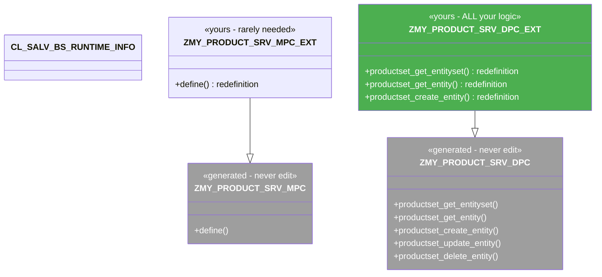

# Chapter 22: Service Methods & Import Parameters

*Where your code actually lives, what method maps to which HTTP verb, and how to read what the client sent.*

---

## ☕ The big picture first

In the last chapter you built the data model — the *shape* of your data. This chapter is about the *behaviour* — where you write the code that responds to `GET /ProductSet`, `POST /ProductSet`, `DELETE /ProductSet('P-100')`, and so on.

The answer is always: **in the `*_DPC_EXT` class**. The rest of this chapter is the detail of exactly what that means.

---

## 22.1 The MPC/DPC class family — which one you code in

### 1️⃣ The analogy

Imagine a generated base controller that SAP creates from your SEGW model, with all the right method signatures stubbed out. You never edit that base controller because SEGW will overwrite it. Instead you inherit from it and *redefine* (override) the methods you need. That subclass is your `_EXT` class.

### 2️⃣ You already know this

```csharp
// C# analogy — a generated base you never touch
// (imagine the codegen tool produced this)
public abstract class ProductServiceBase
{
    public virtual IEnumerable<Product> GetEntitySet() => throw new NotImplementedException();
    public virtual Product GetEntity(string key)      => throw new NotImplementedException();
    public virtual Product CreateEntity(Product body) => throw new NotImplementedException();
    public virtual Product UpdateEntity(string key, Product body) => throw new NotImplementedException();
    public virtual void    DeleteEntity(string key)   => throw new NotImplementedException();
}

// YOU write this — the extension class:
public class ProductServiceImpl : ProductServiceBase
{
    public override IEnumerable<Product> GetEntitySet()
    {
        return _db.Products.ToList();   // your logic here
    }
}
```

### 3️⃣ The ABAP way

SEGW generates four classes. Here's the full picture:

```
ZMY_PRODUCT_SRV_MPC          ← Model Provider base   (REGENERATED — never touch)
  └── ZMY_PRODUCT_SRV_MPC_EXT  ← Model Provider Ext  (yours — rarely needed)

ZMY_PRODUCT_SRV_DPC          ← Data Provider base    (REGENERATED — never touch)
  └── ZMY_PRODUCT_SRV_DPC_EXT  ← Data Provider Ext   (yours — ALL your logic)
```



**The MPC (Model Provider)** handles `$metadata`. You almost never touch `_MPC_EXT` unless you're building dynamic metadata — for example, adding properties at runtime based on customising tables.

**The DPC (Data Provider)** handles all data operations. `_DPC_EXT` is where you live.

> ⚠️ **C#/Python gotcha:** The DPC base class (`_DPC`) has method stubs that raise `cx_sy_no_handler` (not implemented) by default. If you call an operation and get a scary 501 error, it means you forgot to redefine the method in `_DPC_EXT`. That's normal and expected — SEGW doesn't generate the implementations, only the signatures.

### Opening _DPC_EXT in SE24

Transaction `SE24` → enter class name `ZMY_PRODUCT_SRV_DPC_EXT` → click **Change**. Go to the **Methods** tab. You'll see every operation SEGW knows about, all inherited from the base. Right-click a method → **Redefine** to start overriding it.

> 🧭 **On the job:** You can also double-click a method name directly in the SEGW tree (on the entity set row under **Service Implementation**) and it opens `SE24` for you, pre-scrolled to the right method. That's the faster workflow.

---

## 22.2 Method → HTTP verb mapping

This is the table you'll memorise by end of week one on the job:

| HTTP Verb + URL example | OData operation | DPC_EXT method to redefine |
|---|---|---|
| `GET /ProductSet` | Read collection | `PRODUCTSET_GET_ENTITYSET` |
| `GET /ProductSet('P-100')` | Read single entity | `PRODUCTSET_GET_ENTITY` |
| `POST /ProductSet` | Create new entity | `PRODUCTSET_CREATE_ENTITY` |
| `PUT /ProductSet('P-100')` | Full update | `PRODUCTSET_UPDATE_ENTITY` |
| `PATCH /ProductSet('P-100')` | Partial update (MERGE in OData v2) | `PRODUCTSET_UPDATE_ENTITY` (same method!) |
| `DELETE /ProductSet('P-100')` | Delete | `PRODUCTSET_DELETE_ENTITY` |

Notice the pattern: **`<EntitySetName>_<OPERATION>`** in upper case, underscores as separators.

For `SalesOrderHeaderSet` it becomes `SALESORDERHEADERSET_GET_ENTITYSET`, and so on.

> 💡 **PATCH vs PUT:** OData v2 uses the verb `MERGE` (an HTTP extension) for partial updates, though modern clients send `PATCH`. SAP's framework routes both to the same `UPDATE_ENTITY` method. Inside the method you can check `io_tech_request_context->get_http_method( )` to tell them apart if you need different behaviour.

### The full method signature (GET_ENTITYSET)

When you redefine `PRODUCTSET_GET_ENTITYSET` in `SE24`, ABAP shows you this signature:

```abap
METHOD productset_get_entityset.
  " Importing:
  "   IV_ENTITY_NAME        TYPE string
  "   IV_ENTITY_SET_NAME    TYPE string
  "   IV_SOURCE_NAME        TYPE string
  "   IT_FILTER_SELECT_OPTIONS TYPE /IWBEP/T_MGW_SELECT_OPTION
  "   IS_PAGING             TYPE /IWBEP/S_MGW_PAGING
  "   IT_KEY_TAB            TYPE /IWBEP/T_MGW_TECH_PAIRS
  "   IT_NAVIGATION_PATH    TYPE /IWBEP/T_MGW_NAVIGATION_PATH
  "   IT_ORDER              TYPE /IWBEP/T_MGW_SORTING_ORDER
  "   IS_FILTER_SELECT_OPTIONS TYPE /IWBEP/S_MGW_SELECT_OPTION
  "   IO_TECH_REQUEST_CONTEXT TYPE REF TO /IWBEP/IF_MGW_REQ_ENTITYSET
  "
  " Changing:
  "   CT_DATA               TYPE TABLE   " ← fill this with results
  "
  " Exporting:
  "   ES_RESPONSE_CONTEXT   TYPE /IWBEP/IF_MGW_APPL_SRV_RUNTIME=>TY_S_MGW_RESPONSE_CONTEXT

ENDMETHOD.
```

That looks overwhelming the first time. We'll break down every parameter in section 22.3.

---

## 22.3 Reading what the client sent — io_tech_request_context & friends

### 1️⃣ The analogy

In any web framework the "request context" object is where you find everything the client sent: route parameters, query string values, the body, headers. In OData / DPC_EXT, that object is `io_tech_request_context`.

### 2️⃣ You already know this

```csharp
// ASP.NET Web API — how you get incoming data
[HttpGet("{id}")]
public IActionResult GetById(
    string id,                          // route param  → IT_KEY_TAB
    [FromQuery] string filter,          // ?$filter=... → IT_FILTER_SELECT_OPTIONS
    [FromQuery] int top = 50,           // ?$top=       → IS_PAGING-top
    [FromQuery] int skip = 0,           // ?$skip=      → IS_PAGING-skip
    [FromQuery] string orderby = "")    // ?$orderby=   → IT_ORDER
{
    // ...
}
```

```python
# FastAPI equivalent
@app.get("/ProductSet")
def get_products(
    product_id: str | None = None,   # route param   → IT_KEY_TAB
    filter: str | None = None,       # $filter       → IT_FILTER_SELECT_OPTIONS
    top: int = 50,                   # $top          → IS_PAGING
    skip: int = 0,                   # $skip         → IS_PAGING
    orderby: str = ""                # $orderby      → IT_ORDER
):
    ...
```

### 3️⃣ The ABAP way — the main import parameters decoded

#### IT_KEY_TAB — route parameters (the key)

```abap
" Type: /IWBEP/T_MGW_TECH_PAIRS
" A table of name-value pairs for the key in the URL:
"   GET /ProductSet('P-100')  → IT_KEY_TAB: { name='ProductId', value='P-100' }

" Reading a single key (the most common pattern):
DATA(lv_product_id) = VALUE #( it_key_tab[ name = 'ProductId' ]-value
                                OPTIONAL ).

" Or use the convenience method:
io_tech_request_context->get_keys(
  IMPORTING
    et_key_tab = DATA(lt_keys) ).
READ TABLE lt_keys WITH KEY name = 'ProductId' INTO DATA(ls_key).
DATA(lv_product_id) = ls_key-value.
```

#### IT_FILTER_SELECT_OPTIONS — $filter expressions

```abap
" Type: /IWBEP/T_MGW_SELECT_OPTION
" Each entry is a field + a ranges table (SIGN/OPTION/LOW/HIGH).
" This is the ABAP ranges concept you know from SELECT-OPTIONS.

LOOP AT it_filter_select_options INTO DATA(ls_filter).
  CASE ls_filter-property.
    WHEN 'Price'.
      " ls_filter-select_options is a ranges table you can
      " drop straight into a SELECT WHERE field IN ranges.
  ENDCASE.
ENDLOOP.
```

#### IS_PAGING — $top and $skip

```abap
" Type: /IWBEP/S_MGW_PAGING
" IS_PAGING-top  = value of $top  (0 = not supplied → return all)
" IS_PAGING-skip = value of $skip (0 = not supplied → start from beginning)

DATA(lv_top)  = is_paging-top.   " e.g. 25
DATA(lv_skip) = is_paging-skip.  " e.g. 50 (start from row 51)
```

#### IT_ORDER — $orderby

```abap
" Type: /IWBEP/T_MGW_SORTING_ORDER
" Each row: property name + order direction (ascending/descending)

LOOP AT it_order INTO DATA(ls_order).
  " ls_order-property  = 'Price'
  " ls_order-order     = /IWBEP/IF_MGW_APPL_SRV_RUNTIME=>GC_SORT_ORDER-ascending
ENDLOOP.
```

#### io_tech_request_context — the rich request object

```abap
" The interface /IWBEP/IF_MGW_REQ_ENTITYSET exposes many helpers:

" The raw $filter string (if you want to parse it yourself):
DATA(lv_filter_string) = io_tech_request_context->get_osql_where_clause( ).

" $search value (free-text search):
DATA(lv_search) = io_tech_request_context->get_search_expression( ).

" $inlinecount=allpages flag:
DATA(lv_inlinecount) = io_tech_request_context->get_inlinecount( ).

" Which fields were requested via $select:
DATA(lt_select_props) = io_tech_request_context->get_select_properties( ).

" The HTTP method (GET/POST/PUT/PATCH/DELETE/MERGE):
DATA(lv_http_method) = io_tech_request_context->get_http_method( ).
```

> 💡 `io_tech_request_context` is your single biggest friend in the DPC_EXT. It has more methods than you'll ever use. In ADT or SE24 you can type `io_tech_request_context->` and use code completion to browse them all.

---

## 22.4 Returning data and setting status/messages

### Returning data

The `ct_data` / `er_entity` changing/exporting parameters are how you hand data back to the framework.

```abap
" For GET_ENTITYSET — fill CT_DATA (a generic table)
DATA ls_product TYPE zcl_zmy_product_srv_mpc=>ts_product.  " generated type
ls_product-product_id = 'P-100'.
ls_product-name       = 'Precision Lathe T500'.
ls_product-price      = '4250.00'.
ls_product-currency   = 'EUR'.
APPEND ls_product TO ct_data.

" For GET_ENTITY — fill ER_ENTITY (a structure reference)
er_entity = ls_product.
```

The framework serialises `ct_data` / `er_entity` into XML or JSON automatically. You just fill the ABAP structure — you never write a JSON encoder.

### Setting the inline count (for paging)

```abap
" After SELECTing the paged slice, tell the client how many total records exist.
" This populates @odata.count / $inlinecount in the response.
es_response_context-inlinecount = lv_total_count.
```

### Raising business errors

```abap
" For a validation failure, raise the standard OData business exception:
RAISE EXCEPTION TYPE /iwbep/cx_mgw_busi_exception
  EXPORTING
    textid   = /iwbep/cx_mgw_busi_exception=>business_error
    http_status_code = /iwbep/cx_mgw_busi_exception=>gcs_http_status_codes-bad_request
    message  = 'Price must be greater than zero'.

" The framework catches this and converts it into a proper OData error response:
" HTTP 400
" { "error": { "code": "...", "message": { "lang": "en", "value": "Price must..." } } }
```

> ⚠️ **C#/Python gotcha:** Do NOT raise a plain `cx_root` or `cx_sy_*` exception in a DPC_EXT method — it'll cause a generic 500. Always use `/IWBEP/CX_MGW_BUSI_EXCEPTION` for expected business errors so the client gets a proper OData error body. We cover this in detail in ch 25.

### The response context for GET_ENTITYSET

```abap
" es_response_context is of type /IWBEP/IF_MGW_APPL_SRV_RUNTIME=>TY_S_MGW_RESPONSE_CONTEXT
" The field you set most often:
es_response_context-inlinecount = <total row count before paging>.
```

---

## ☕ Putting it together — a minimal GET_ENTITYSET skeleton

Here's a skeleton that shows all the pieces working together, before we fill in the real SELECT in ch 23:

```abap
METHOD productset_get_entityset.

  " ── 1. Read paging params ─────────────────────────────────────
  DATA(lv_top)  = is_paging-top.
  DATA(lv_skip) = is_paging-skip.

  " ── 2. Read filter (we'll use it properly in ch 24) ──────────
  " For now, accept any filter silently
  DATA lt_price_range TYPE RANGE OF kbetr.

  LOOP AT it_filter_select_options INTO DATA(ls_sel_opt)
      WHERE property = 'Price'.
    APPEND LINES OF ls_sel_opt-select_options TO lt_price_range.
  ENDLOOP.

  " ── 3. Declare result table typed to the generated MPC type ───
  DATA lt_products TYPE TABLE OF zcl_zmy_product_srv_mpc=>ts_product.

  " ── 4. SELECT (simplified — ch 23 expands this) ───────────────
  SELECT matnr AS product_id
         maktx AS name            " via join to MAKT
    INTO CORRESPONDING FIELDS OF TABLE @lt_products
    FROM mara
    UP TO 100 ROWS.

  " ── 5. Return results ─────────────────────────────────────────
  ct_data = CORRESPONDING #( lt_products ).

ENDMETHOD.
```

That's the skeleton. Chapters 23–25 flesh it out into something production-ready.

---

## 🧠 Recap

- The two class families: **MPC** (model/metadata) and **DPC** (data). The `_EXT` suffixed subclasses are yours — everything else is regenerated by SEGW.
- **All your logic goes in `*_DPC_EXT`**. Never edit the base `_DPC`.
- Method naming pattern: **`<ENTITYSETNAME>_<OPERATION>`** — e.g. `PRODUCTSET_GET_ENTITYSET`, `PRODUCTSET_CREATE_ENTITY`.
- The request parameters are: `IT_KEY_TAB` (route keys), `IT_FILTER_SELECT_OPTIONS` (WHERE clauses), `IS_PAGING` ($top/$skip), `IT_ORDER` ($orderby), and `IO_TECH_REQUEST_CONTEXT` (everything else).
- Return data by filling `CT_DATA` (collection) or `ER_ENTITY` (single). The framework serialises it — you never write JSON.
- For errors, always raise `/IWBEP/CX_MGW_BUSI_EXCEPTION` — not a plain exception.

---

*[← Contents](../content.md) | [← Previous: Entity Types, XML & JSON](21-odata-entity-types-xml-json.md) | [Next: Reading Data — GET_ENTITY & GET_ENTITYSET →](23-odata-read-crud-get-entity.md)*
