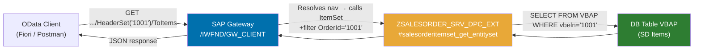

# Chapter 26: Associations — Principal & Dependent Entity Sets

*How to teach the OData service that SalesOrderHeader owns SalesOrderItem — and let the URL say so.*

---

## 26.1 What is an association? ☕

Picture a foreign key relationship in SQL Server:

```sql
-- SQL Server
CREATE TABLE SalesOrderHeader (
    OrderId   VARCHAR(10) PRIMARY KEY,
    Customer  VARCHAR(10),
    NetAmount DECIMAL(15,2)
);

CREATE TABLE SalesOrderItem (
    OrderId  VARCHAR(10),
    ItemNo   VARCHAR(6),
    Material VARCHAR(18),
    Quantity DECIMAL(13,3),
    FOREIGN KEY (OrderId) REFERENCES SalesOrderHeader(OrderId)
);
```

That `FOREIGN KEY` constraint tells SQL Server "every item *belongs to* a header." Now imagine baking that relationship into your **URL** so a client can say:

```http
GET /sap/opu/odata/sap/ZSALESORDER_SRV/SalesOrderHeaderSet('0000001001')/ToItems
```

…and the service *navigates* from the header to its items automatically. That's an **OData association**.

### The three moving parts

| OData concept | SQL analogy | EF Core analogy |
|---|---|---|
| **Association** | FOREIGN KEY constraint definition | Navigation property type |
| **Referential constraint** | The FK column mapping (Principal PK → Dependent FK) | `HasForeignKey(...)` |
| **Navigation property** | The JOIN path (not a column — a direction) | `virtual ICollection<Item> Items` |

> 💡 In OData v2 (which SEGW uses), navigation properties live on the entity type. A client appends `/<NavPropName>` to a single-entity URL and the service routes the call to the *dependent* entity's `GET_ENTITYSET` method, passing the source key through a special segment parameter — `io_tech_request_context` tells you *how you got here*.

---

## 26.2 You already know this

### C# — Entity Framework navigation property

```csharp
// C# / EF Core
public class SalesOrderHeader
{
    public string OrderId   { get; set; }
    public string Customer  { get; set; }
    public decimal NetAmount { get; set; }

    // Navigation property — EF follows the FK automatically
    public virtual ICollection<SalesOrderItem> Items { get; set; }
}

public class SalesOrderItem
{
    public string OrderId  { get; set; }   // FK
    public string ItemNo   { get; set; }
    public string Material { get; set; }
    public decimal Quantity { get; set; }

    public virtual SalesOrderHeader Header { get; set; }
}

// Fluent API mapping
modelBuilder.Entity<SalesOrderHeader>()
    .HasMany(h => h.Items)
    .WithOne(i => i.Header)
    .HasForeignKey(i => i.OrderId);
```

When you call `context.SalesOrderHeaders.Include(h => h.Items)`, EF resolves the FK — exactly what `$expand=ToItems` does in OData.

### Python — SQLAlchemy relationship

```python
# Python / SQLAlchemy
class SalesOrderHeader(Base):
    __tablename__ = "sales_order_header"
    order_id   = Column(String(10), primary_key=True)
    customer   = Column(String(10))
    net_amount = Column(Numeric(15, 2))
    items      = relationship("SalesOrderItem", back_populates="header")

class SalesOrderItem(Base):
    __tablename__ = "sales_order_item"
    order_id  = Column(String(10), ForeignKey("sales_order_header.order_id"), primary_key=True)
    item_no   = Column(String(6),  primary_key=True)
    material  = Column(String(18))
    quantity  = Column(Numeric(13, 3))
    header    = relationship("SalesOrderHeader", back_populates="items")
```

---

## 26.3 The ABAP/OData way — building it in SEGW 🛠️

### Step-by-step in SEGW (transaction `SEGW`)

Open your project (`ZSALESORDER_SRV`). You already have **SalesOrderHeader** and **SalesOrderItem** entity types from Chapters 23–25. Now wire them together.

#### 1 — Create the Association

In the object tree, right-click **Associations → Create**.

| Field | Value |
|---|---|
| Association name | `SalesOrderHeader_To_Items` |
| Principal entity type | `SalesOrderHeader` |
| Principal cardinality | `1` |
| Dependent entity type | `SalesOrderItem` |
| Dependent cardinality | `Many` |

#### 2 — Set the Referential Constraint

Still in the association editor, switch to the **Referential Constraints** tab:

| Principal property | Dependent property |
|---|---|
| `OrderId` | `OrderId` |

This tells the framework: the `OrderId` key on the header is the same column as `OrderId` on the item. The gateway runtime uses this to build the SQL (or lets you use it yourself in `GET_ENTITYSET`).

#### 3 — Add Navigation Properties

Right-click **Navigation Properties → Create** under your **SalesOrderHeader** entity type:

| Field | Value |
|---|---|
| Navigation property name | `ToItems` |
| Association | `SalesOrderHeader_To_Items` |
| From role | `Principal` |
| To role | `Dependent` |

Optionally add the reverse navigation on **SalesOrderItem**:

| Field | Value |
|---|---|
| Navigation property name | `ToHeader` |
| Association | `SalesOrderHeader_To_Items` |
| From role | `Dependent` |
| To role | `Principal` |

#### 4 — Assign Entity Sets to the Association Set

The metadata XML needs an **AssociationSet** that binds your two **EntitySet** names to the association. SEGW creates it automatically when you right-click **Association Sets → Create**:

| Field | Value |
|---|---|
| Association Set name | `SalesOrderHeader_To_ItemsSet` |
| Association | `SalesOrderHeader_To_Items` |
| Entity Set 1 | `SalesOrderHeaderSet` |
| Entity Set 2 | `SalesOrderItemSet` |

#### 5 — Generate

Hit the **Generate** button (or `F8`). SEGW regenerates `ZSALESORDER_SRV_MPC` (the model provider class) and the stub in `ZSALESORDER_SRV_DPC_EXT` (your extension class). The metadata document now exposes the association.

```xml
<!-- Excerpt from $metadata after generation -->
<Association Name="SalesOrderHeader_To_Items">
  <End Type="ZSALESORDER_SRV.SalesOrderHeader" Multiplicity="1"   Role="Principal" />
  <End Type="ZSALESORDER_SRV.SalesOrderItem"   Multiplicity="*"   Role="Dependent" />
  <ReferentialConstraint>
    <Principal Role="Principal">
      <PropertyRef Name="OrderId" />
    </Principal>
    <Dependent Role="Dependent">
      <PropertyRef Name="OrderId" />
    </Dependent>
  </ReferentialConstraint>
</Association>

<NavigationProperty
  Name="ToItems"
  Relationship="ZSALESORDER_SRV.SalesOrderHeader_To_Items"
  FromRole="Principal"
  ToRole="Dependent" />
```

---

## 26.4 Implementing the navigation in DPC_EXT 🔁

When a client hits `SalesOrderHeaderSet('1001')/ToItems`, the gateway framework calls the **SalesOrderItem** entity set's `GET_ENTITYSET` method — but it passes the *navigation context* so you know you arrived via a nav property and what the source key was.

The key object is `io_tech_request_context`. Call `get_navigation_path( )` on it to find out how deep the navigation chain is, and use the `filter_select_options` that the framework pre-populates from the referential constraint.

```abap
CLASS zsalesorder_srv_dpc_ext DEFINITION
  INHERITING FROM zsalesorder_srv_dpc
  FINAL
  CREATE PUBLIC.

PUBLIC SECTION.
  METHODS salesorderitemset_get_entityset REDEFINITION.
ENDCLASS.

CLASS zsalesorder_srv_dpc_ext IMPLEMENTATION.

  METHOD salesorderitemset_get_entityset.
    "-----------------------------------------------------------------------
    " Called for both:
    "   GET /SalesOrderItemSet?$filter=OrderId eq '1001'
    "   GET /SalesOrderHeaderSet('1001')/ToItems
    " The framework fills io_filter_select_options from the referential
    " constraint automatically in the navigation case.
    "-----------------------------------------------------------------------

    DATA: lt_items  TYPE TABLE OF zsalesorder_item,
          ls_item   TYPE zsalesorder_item,
          ls_entity TYPE zcl_zsalesorder_srv_mpc=>ts_salesorderitem.

    " --- Pull the OrderId filter (present in both call paths) ---------------
    DATA(lt_filters) = io_tech_request_context->get_filter( )->get_filter_select_options( ).

    DATA lv_order_id TYPE vbeln_va.
    LOOP AT lt_filters INTO DATA(ls_filter) WHERE property = 'OrderId'.
      LOOP AT ls_filter-select_options INTO DATA(ls_opt).
        IF ls_opt-option = 'EQ'.
          lv_order_id = ls_opt-low.
        ENDIF.
      ENDLOOP.
    ENDLOOP.

    " --- Check how we arrived (direct vs navigation) -----------------------
    DATA(lv_is_navigation) = abap_false.
    TRY.
      DATA(lo_nav) = io_tech_request_context->get_navigation_path( ).
      IF lo_nav IS NOT INITIAL.
        lv_is_navigation = abap_true.
        " For navigation, the framework may also supply the key via
        " get_source_key( ) — useful for multi-key scenarios
      ENDIF.
    CATCH cx_root. " Navigation path not available (direct call)
    ENDTRY.

    " --- Database read ------------------------------------------------------
    IF lv_order_id IS NOT INITIAL.
      SELECT vbeln AS order_id,
             posnr AS item_no,
             matnr AS material,
             kwmeng AS quantity,
             vrkme  AS uom,
             netwr  AS net_value
        FROM vbap
        INTO TABLE @lt_items
        WHERE vbeln = @lv_order_id.
    ELSE.
      " Direct call without filter — apply paging
      DATA(lv_skip) = io_tech_request_context->get_top_skip_inline_count(
                        )-skip.
      DATA(lv_top)  = io_tech_request_context->get_top_skip_inline_count(
                        )-top.
      IF lv_top IS INITIAL.
        lv_top = 100.  " Safety cap
      ENDIF.

      SELECT vbeln AS order_id,
             posnr AS item_no,
             matnr AS material,
             kwmeng AS quantity,
             vrkme  AS uom,
             netwr  AS net_value
        FROM vbap
        INTO TABLE @lt_items
        UP TO @lv_top ROWS
        OFFSET @lv_skip.
    ENDIF.

    " --- Map to OData entity ------------------------------------------------
    LOOP AT lt_items INTO ls_item.
      CLEAR ls_entity.
      ls_entity-order_id  = ls_item-order_id.
      ls_entity-item_no   = ls_item-item_no.
      ls_entity-material  = ls_item-material.
      ls_entity-quantity  = ls_item-quantity.
      ls_entity-uom       = ls_item-uom.
      ls_entity-net_value = ls_item-net_value.
      APPEND ls_entity TO et_entityset.
    ENDLOOP.

  ENDMETHOD.

ENDCLASS.
```

> ⚠️ **C#/Python gotcha:** You might expect a dedicated "navigation handler" method to override — like a separate route in Web API. There isn't one. The framework just calls the *dependent* entity set's regular `GET_ENTITYSET`, but with the filter already pre-populated from the referential constraint. Always read from `io_tech_request_context` to figure out the context, don't assume one code path.

---

## 26.5 Worked example — the full request/response flow 🎯

### Request: navigate from header to its items

```http
GET /sap/opu/odata/sap/ZSALESORDER_SRV/SalesOrderHeaderSet('0000001001')/ToItems
Accept: application/json
```

### Response

```json
{
  "d": {
    "results": [
      {
        "__metadata": {
          "type": "ZSALESORDER_SRV.SalesOrderItem",
          "uri": "/sap/opu/odata/sap/ZSALESORDER_SRV/SalesOrderItemSet(OrderId='0000001001',ItemNo='000010')"
        },
        "OrderId":   "0000001001",
        "ItemNo":    "000010",
        "Material":  "LAPTOP-X1",
        "Quantity":  "2.000",
        "Uom":       "EA",
        "NetValue":  "2400.00"
      },
      {
        "__metadata": {
          "type": "ZSALESORDER_SRV.SalesOrderItem",
          "uri": "/sap/opu/odata/sap/ZSALESORDER_SRV/SalesOrderItemSet(OrderId='0000001001',ItemNo='000020')"
        },
        "OrderId":   "0000001001",
        "ItemNo":    "000020",
        "Material":  "MOUSE-USB",
        "Quantity":  "1.000",
        "Uom":       "EA",
        "NetValue":  "29.99"
      }
    ]
  }
}
```

### Request: navigate from item back to its header

```http
GET /sap/opu/odata/sap/ZSALESORDER_SRV/SalesOrderItemSet(OrderId='0000001001',ItemNo='000010')/ToHeader
Accept: application/json
```

> 🧭 **On the job:** Interviewers love asking "how does a client get items for a specific order?" The expected answer is the navigation URL above — not a filter on `SalesOrderItemSet`. Both work, but navigation is the *OData-native* answer and shows you understand the model.

### Architecture map



---

## 🧠 Recap

- An **association** is a named relationship between two entity types with a **referential constraint** (which property is the FK).
- A **navigation property** gives clients a URL path to traverse the relationship: `HeaderSet('x')/ToItems`.
- In SEGW: create the Association → set the Referential Constraint → create Navigation Properties → create the Association Set → Generate.
- In code: you only override `GET_ENTITYSET` on the dependent side. The framework pre-populates filters from the constraint. Use `io_tech_request_context` to detect the call path.
- The reverse navigation (`ToHeader`) requires a `GET_ENTITY` redefinition on the header side (same pattern — just return a single entity).

*[← Contents](../content.md) | [← Previous: Search Strings & Query Options](25-odata-create-update-delete.md) | [Next: Header + Item Data in One Service →](27-odata-header-and-item.md)*
