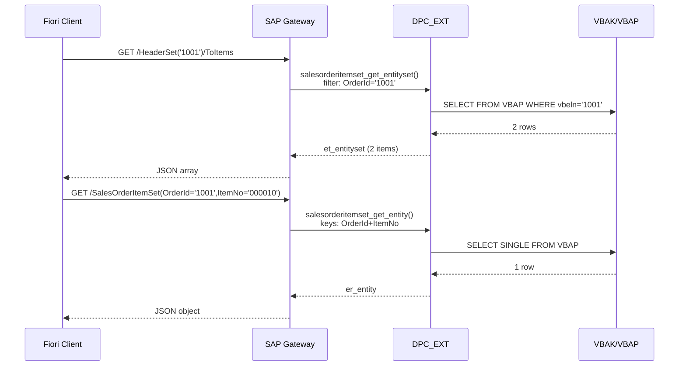

# Chapter 27: Header + Item Data in One Service

*The sales order pattern is everywhere in SAP — here's how to model and serve it cleanly with OData.*

---

## 27.1 Why header/item is *everywhere* in SAP ☕

Ask any SD consultant to name the most important table in their world and they'll say `VBAK` (sales order header) without blinking. Ask for the second — `VBAP` (sales order item). Every business document in SAP follows this two-level structure:

| Business document | Header table | Item table |
|---|---|---|
| Sales Order | VBAK | VBAP |
| Delivery | LIKP | LIPS |
| Billing Document (Invoice) | VBRK | VBRP |
| Purchase Order | EKKO | EKPO |
| Accounting Document | BKPF | BSEG |

The pattern is always the same: one row in the header table describes *what the document is* (customer, date, total), and *N* rows in the item table describe *what's in it* (line items, materials, quantities).

### Why this shape?

Think about a shopping cart. The cart itself has one delivery address, one payment method, one discount code. But it can have fifty different products. Stuffing all fifty products' details into a single "cart" row would be a nightmare — so you split it: one header, many items. SAP has followed this pattern for 40 years across every module. You will encounter it on day one of your first ticket.

> 🧭 **On the job:** When a senior consultant says "VBAK/VBAP" in a standup, they mean "go look at the sales order header and its items." When they say "BKPF/BSEG", think "accounting document and its line items." Learn these pairs — they come up in every interview.

---

## 27.2 You already know this

### C# — nested aggregate root

```csharp
// C# — this is the same pattern, just OOP-shaped
public record SalesOrderHeader
{
    public string   OrderId    { get; init; }
    public string   Customer   { get; init; }
    public DateTime OrderDate  { get; init; }
    public decimal  NetAmount  { get; init; }
    public string   Currency   { get; init; }
    public string   Status     { get; init; }

    // The "N" side — typed collection of items
    public List<SalesOrderItem> Items { get; init; } = new();
}

public record SalesOrderItem
{
    public string  OrderId   { get; init; }   // FK back to header
    public string  ItemNo    { get; init; }
    public string  Material  { get; init; }
    public decimal Quantity  { get; init; }
    public string  Uom       { get; init; }
    public decimal NetValue  { get; init; }
}

// Web API — return the header only
[HttpGet("{orderId}")]
public async Task<SalesOrderHeader> GetHeader(string orderId) { ... }

// Web API — return items for a header
[HttpGet("{orderId}/items")]
public async Task<List<SalesOrderItem>> GetItems(string orderId) { ... }

// Web API — return header WITH items embedded
[HttpGet("{orderId}/full")]
public async Task<SalesOrderHeader> GetHeaderWithItems(string orderId)
{
    var header = await _repo.GetHeader(orderId);
    header = header with { Items = await _repo.GetItems(orderId) };
    return header;
}
```

### Python — dataclass aggregate

```python
from dataclasses import dataclass, field
from typing import List

@dataclass
class SalesOrderItem:
    order_id: str
    item_no:  str
    material: str
    quantity: float
    uom:      str
    net_value: float

@dataclass
class SalesOrderHeader:
    order_id:   str
    customer:   str
    order_date: str
    net_amount: float
    currency:   str
    status:     str
    items: List[SalesOrderItem] = field(default_factory=list)

# FastAPI — navigation endpoint
@app.get("/orders/{order_id}/items")
def get_items(order_id: str) -> List[SalesOrderItem]:
    return db.query(SalesOrderItem).filter_by(order_id=order_id).all()
```

The OData service you're about to build is the *same thing* — just using SAP's OData vocabulary instead of Web API routes.

---

## 27.3 The ABAP/OData way — wiring both entity sets 🛠️

You already have the two entity types and the association from Chapter 26. This chapter walks through the *complete service* — both entity sets implemented, the nav property working, and some URL examples that show every call path a Fiori app would actually make.

### Entity type definitions (recap)

```abap
"-----------------------------------------------------------------------
" In MPC_EXT (ZSALESORDER_SRV_MPC_EXT) — only if you need custom props
" Usually SEGW generates this automatically from the DDIC structure
"-----------------------------------------------------------------------
CLASS zsalesorder_srv_mpc_ext DEFINITION
  INHERITING FROM zsalesorder_srv_mpc
  FINAL
  CREATE PUBLIC.
ENDCLASS.
CLASS zsalesorder_srv_mpc_ext IMPLEMENTATION.
  " Extend define( ) only if you add properties not in DDIC
ENDCLASS.
```

The generated MPC already declares `SalesOrderHeader` with these properties:

| Property | ABAP field | Type | Key? |
|---|---|---|---|
| `OrderId` | `VBELN` | `Edm.String` | ✓ |
| `Customer` | `KUNNR` | `Edm.String` | |
| `OrderDate` | `AUDAT` | `Edm.DateTime` | |
| `NetAmount` | `NETWR` | `Edm.Decimal` | |
| `Currency` | `WAERK` | `Edm.String` | |
| `Status` | `GBSTK` | `Edm.String` | |

And `SalesOrderItem`:

| Property | ABAP field | Type | Key? |
|---|---|---|---|
| `OrderId` | `VBELN` | `Edm.String` | ✓ |
| `ItemNo` | `POSNR` | `Edm.String` | ✓ |
| `Material` | `MATNR` | `Edm.String` | |
| `Quantity` | `KWMENG` | `Edm.Decimal` | |
| `Uom` | `VRKME` | `Edm.String` | |
| `NetValue` | `NETWR` | `Edm.Decimal` | |

### DPC_EXT — both entity sets implemented

```abap
CLASS zsalesorder_srv_dpc_ext DEFINITION
  INHERITING FROM zsalesorder_srv_dpc
  FINAL
  CREATE PUBLIC.

PUBLIC SECTION.
  " Header CRUD
  METHODS salesorderheaderset_get_entity    REDEFINITION.
  METHODS salesorderheaderset_get_entityset REDEFINITION.
  " Item reads (navigation + direct)
  METHODS salesorderitemset_get_entityset   REDEFINITION.
  METHODS salesorderitemset_get_entity      REDEFINITION.

PRIVATE SECTION.
  " Shared helpers
  METHODS map_vbak_to_entity
    IMPORTING is_vbak    TYPE vbak
    RETURNING VALUE(rs_entity) TYPE zcl_zsalesorder_srv_mpc=>ts_salesorderheader.

  METHODS map_vbap_to_entity
    IMPORTING is_vbap    TYPE vbap
    RETURNING VALUE(rs_entity) TYPE zcl_zsalesorder_srv_mpc=>ts_salesorderitem.

ENDCLASS.

CLASS zsalesorder_srv_dpc_ext IMPLEMENTATION.

  "=========================================================================
  " HEADER — single entity (GET /SalesOrderHeaderSet('1001'))
  "=========================================================================
  METHOD salesorderheaderset_get_entity.

    DATA(ls_key) = io_tech_request_context->get_keys( ).
    DATA lv_order_id TYPE vbeln_va.
    READ TABLE ls_key INTO DATA(ls_k) WITH KEY name = 'OrderId'.
    lv_order_id = ls_k-value.

    SELECT SINGLE *
      FROM vbak
      INTO @DATA(ls_vbak)
      WHERE vbeln = @lv_order_id.

    IF sy-subrc <> 0.
      RAISE EXCEPTION TYPE /iwbep/cx_mgw_busi_exception
        EXPORTING
          textid = /iwbep/cx_mgw_busi_exception=>entity_not_found.
    ENDIF.

    er_entity = map_vbak_to_entity( ls_vbak ).

  ENDMETHOD.

  "=========================================================================
  " HEADER — entity set (GET /SalesOrderHeaderSet)
  "=========================================================================
  METHOD salesorderheaderset_get_entityset.

    DATA lt_vbak TYPE TABLE OF vbak.

    " Simple implementation — production code adds filter/sort/paging
    SELECT vbeln, kunnr, audat, netwr, waerk, gbstk
      FROM vbak
      INTO CORRESPONDING FIELDS OF TABLE @lt_vbak
      UP TO 200 ROWS.

    LOOP AT lt_vbak INTO DATA(ls_vbak).
      APPEND map_vbak_to_entity( ls_vbak ) TO et_entityset.
    ENDLOOP.

  ENDMETHOD.

  "=========================================================================
  " ITEM — entity set (direct + navigation)
  "   GET /SalesOrderItemSet?$filter=OrderId eq '1001'
  "   GET /SalesOrderHeaderSet('1001')/ToItems
  "=========================================================================
  METHOD salesorderitemset_get_entityset.

    DATA lt_vbap TYPE TABLE OF vbap.
    DATA lv_order_id TYPE vbeln_va.

    " Harvest OrderId from either a $filter or the referential constraint
    DATA(lt_filters) = io_tech_request_context->get_filter(
                         )->get_filter_select_options( ).

    LOOP AT lt_filters INTO DATA(ls_filter) WHERE property = 'OrderId'.
      LOOP AT ls_filter-select_options INTO DATA(ls_opt).
        IF ls_opt-option = 'EQ' AND ls_opt-low IS NOT INITIAL.
          lv_order_id = ls_opt-low.
        ENDIF.
      ENDLOOP.
    ENDLOOP.

    IF lv_order_id IS NOT INITIAL.
      SELECT vbeln, posnr, matnr, kwmeng, vrkme, netwr
        FROM vbap
        INTO CORRESPONDING FIELDS OF TABLE @lt_vbap
        WHERE vbeln = @lv_order_id.
    ELSE.
      SELECT vbeln, posnr, matnr, kwmeng, vrkme, netwr
        FROM vbap
        INTO CORRESPONDING FIELDS OF TABLE @lt_vbap
        UP TO 200 ROWS.
    ENDIF.

    LOOP AT lt_vbap INTO DATA(ls_vbap).
      APPEND map_vbap_to_entity( ls_vbap ) TO et_entityset.
    ENDLOOP.

  ENDMETHOD.

  "=========================================================================
  " ITEM — single entity
  "   GET /SalesOrderItemSet(OrderId='1001',ItemNo='000010')
  "=========================================================================
  METHOD salesorderitemset_get_entity.

    DATA(ls_keys) = io_tech_request_context->get_keys( ).
    DATA lv_order_id TYPE vbeln_va.
    DATA lv_item_no  TYPE posnr_co.

    READ TABLE ls_keys INTO DATA(ls_k1) WITH KEY name = 'OrderId'.
    READ TABLE ls_keys INTO DATA(ls_k2) WITH KEY name = 'ItemNo'.
    lv_order_id = ls_k1-value.
    lv_item_no  = ls_k2-value.

    SELECT SINGLE vbeln, posnr, matnr, kwmeng, vrkme, netwr
      FROM vbap
      INTO @DATA(ls_vbap)
      WHERE vbeln = @lv_order_id
        AND posnr = @lv_item_no.

    IF sy-subrc <> 0.
      RAISE EXCEPTION TYPE /iwbep/cx_mgw_busi_exception
        EXPORTING
          textid = /iwbep/cx_mgw_busi_exception=>entity_not_found.
    ENDIF.

    er_entity = map_vbap_to_entity( ls_vbap ).

  ENDMETHOD.

  "=========================================================================
  " PRIVATE HELPERS — mapping routines
  "=========================================================================
  METHOD map_vbak_to_entity.
    rs_entity-order_id   = is_vbak-vbeln.
    rs_entity-customer   = is_vbak-kunnr.
    rs_entity-order_date = is_vbak-audat.
    rs_entity-net_amount = is_vbak-netwr.
    rs_entity-currency   = is_vbak-waerk.
    rs_entity-status     = is_vbak-gbstk.
  ENDMETHOD.

  METHOD map_vbap_to_entity.
    rs_entity-order_id  = is_vbap-vbeln.
    rs_entity-item_no   = is_vbap-posnr.
    rs_entity-material  = is_vbap-matnr.
    rs_entity-quantity  = is_vbap-kwmeng.
    rs_entity-uom       = is_vbap-vrkme.
    rs_entity-net_value = is_vbap-netwr.
  ENDMETHOD.

ENDCLASS.
```

> ⚠️ **C#/Python gotcha:** Notice the `map_*` private methods. ABAP has no implicit object-to-object mapper (no AutoMapper). You wire up fields manually, or you write a helper like this. It's tedious but explicit — every developer on the team can see exactly what maps to what with no magic.

---

## 27.4 Full URL walkthrough with real responses 🎯

Here are the five URL patterns a real Fiori app would call against this service, with example responses. Test all of them in `/IWFND/GW_CLIENT`.

### URL 1 — List all headers

```http
GET /sap/opu/odata/sap/ZSALESORDER_SRV/SalesOrderHeaderSet?$format=json
```

```json
{
  "d": {
    "results": [
      {
        "__metadata": { "type": "ZSALESORDER_SRV.SalesOrderHeader" },
        "OrderId":    "0000001001",
        "Customer":   "0000001000",
        "OrderDate":  "/Date(1716508800000)/",
        "NetAmount":  "2429.99",
        "Currency":   "USD",
        "Status":     "A"
      }
    ]
  }
}
```

### URL 2 — Single header

```http
GET /sap/opu/odata/sap/ZSALESORDER_SRV/SalesOrderHeaderSet('0000001001')?$format=json
```

### URL 3 — Navigate to items (nav property)

```http
GET /sap/opu/odata/sap/ZSALESORDER_SRV/SalesOrderHeaderSet('0000001001')/ToItems?$format=json
```

```json
{
  "d": {
    "results": [
      {
        "OrderId": "0000001001", "ItemNo": "000010",
        "Material": "LAPTOP-X1",  "Quantity": "2.000",
        "Uom": "EA", "NetValue": "2400.00"
      },
      {
        "OrderId": "0000001001", "ItemNo": "000020",
        "Material": "MOUSE-USB",  "Quantity": "1.000",
        "Uom": "EA", "NetValue": "29.99"
      }
    ]
  }
}
```

### URL 4 — Direct item query with filter

```http
GET /sap/opu/odata/sap/ZSALESORDER_SRV/SalesOrderItemSet?$filter=OrderId eq '0000001001'&$format=json
```

*Returns the same items — just going directly to the ItemSet with a filter instead of navigating.*

### URL 5 — Single item by compound key

```http
GET /sap/opu/odata/sap/ZSALESORDER_SRV/SalesOrderItemSet(OrderId='0000001001',ItemNo='000010')?$format=json
```

```json
{
  "d": {
    "OrderId":  "0000001001",
    "ItemNo":   "000010",
    "Material": "LAPTOP-X1",
    "Quantity": "2.000",
    "Uom":      "EA",
    "NetValue": "2400.00"
  }
}
```

> 💡 Notice URL 4 and URL 3 return the same data. On the job, prefer URL 3 (navigation) when you have the header key — it's semantically cleaner and some Fiori controls generate it automatically from the association metadata.

### Service call flow



> 🧭 **On the job:** A Fiori List-Detail app (a very common SAP pattern) typically calls `HeaderSet` to populate the master list, then `HeaderSet('x')/ToItems` when the user taps a row. You'll be asked to build or fix exactly this in your first OData ticket.

---

## 🧠 Recap

- The header/item pattern (`VBAK/VBAP`, `EKKO/EKPO`, `BKPF/BSEG`) is fundamental to SAP and will appear in most of your tickets.
- A complete header+item service needs: two entity types, two entity sets, one association with a referential constraint, and two navigation properties.
- In DPC_EXT, you redefined `GET_ENTITY` and `GET_ENTITYSET` for both entity types. The nav property just routes to the item's `GET_ENTITYSET` with a pre-filled filter.
- Private helper methods (`map_*`) keep the field mapping explicit and testable.
- Five URL patterns cover every access mode a Fiori app will need — test them all in `/IWFND/GW_CLIENT` before handing off.

*[← Contents](../content.md) | [← Previous: Associations](26-odata-associations.md) | [Next: Function Imports →](28-odata-function-import.md)*
