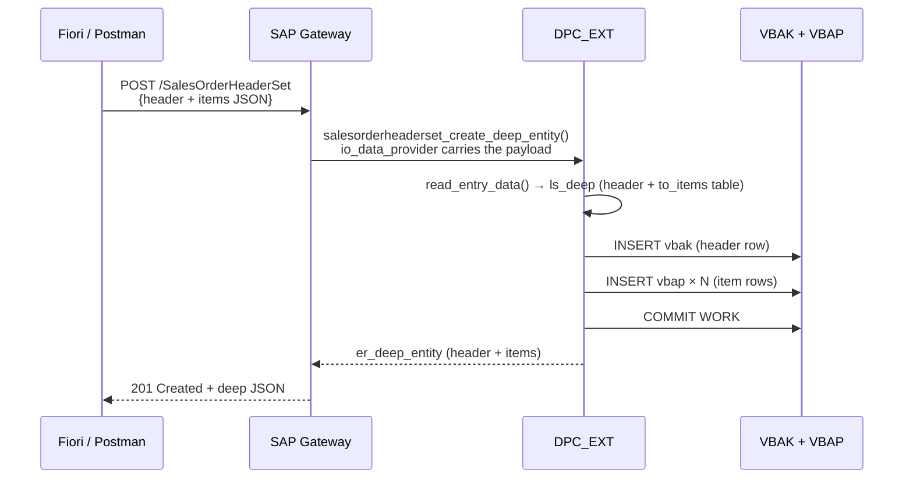

# Chapter 29: CREATE_DEEP_ENTITY

*How to POST a header and all its items in a single, transactional OData request.*

---

## 29.1 The problem — one HTTP call, two tables ☕

You're building a "New Sales Order" screen in Fiori. The user fills in:
- The order header (customer, date, notes)
- Ten line items (material, quantity, price)

In your C# or Python world you'd POST a single JSON object with the header and an embedded array of items. The Web API or FastAPI endpoint receives the whole thing, validates it, writes the header row, writes the item rows, commits — atomically.

In OData v2 with SEGW, the mechanism for this is called `CREATE_DEEP_ENTITY`. The word "deep" means: a parent entity **and** its child entities, nested, in one transactional HTTP POST.

Without deep create you'd have to:
1. `POST /SalesOrderHeaderSet` → get back the new `OrderId`
2. `POST /SalesOrderItemSet` for each item, one at a time

That's ten round-trips, no atomicity, and the client has to stitch the responses together. Deep create solves all three problems in one shot.

---

## 29.2 You already know this

### C# — nested POST body to a Web API

```csharp
// C# — the request model you'd accept in Web API
public record CreateSalesOrderRequest
{
    public string Customer  { get; init; }
    public string Currency  { get; init; }
    public string Notes     { get; init; }

    // Nested items — the "deep" part
    public List<CreateSalesOrderItemRequest> Items { get; init; } = new();
}

public record CreateSalesOrderItemRequest
{
    public string  Material { get; init; }
    public decimal Quantity { get; init; }
    public string  Uom      { get; init; }
}

// Web API endpoint
[HttpPost]
public async Task<IActionResult> CreateOrder([FromBody] CreateSalesOrderRequest req)
{
    // Validate
    if (!req.Items.Any())
        return BadRequest("At least one item is required");

    // Begin transaction
    await using var tx = await _db.BeginTransactionAsync();
    try
    {
        var header = await _orderRepo.CreateHeader(req);         // INSERT VBAK
        foreach (var item in req.Items)
            await _orderRepo.CreateItem(header.OrderId, item);   // INSERT VBAP
        await tx.CommitAsync();
        return CreatedAtAction(nameof(GetOrder), new { orderId = header.OrderId }, header);
    }
    catch
    {
        await tx.RollbackAsync();
        throw;
    }
}
```

Request body:
```json
{
  "Customer": "0000001000",
  "Currency": "USD",
  "Notes": "Rush order",
  "Items": [
    { "Material": "LAPTOP-X1", "Quantity": 2, "Uom": "EA" },
    { "Material": "MOUSE-USB", "Quantity": 1, "Uom": "EA" }
  ]
}
```

### Python — FastAPI with Pydantic nested model

```python
from pydantic import BaseModel
from typing import List

class ItemIn(BaseModel):
    material: str
    quantity: float
    uom: str

class OrderIn(BaseModel):
    customer: str
    currency: str
    notes: str
    items: List[ItemIn]

@app.post("/orders", status_code=201)
async def create_order(body: OrderIn):
    async with db.transaction():
        order_id = await db.execute(INSERT_HEADER, body)
        for item in body.items:
            await db.execute(INSERT_ITEM, order_id, item)
    return {"order_id": order_id}
```

The OData `CREATE_DEEP_ENTITY` call takes the same JSON body (nested entity) and routes it to a single ABAP method. Let's build it.

---

## 29.3 The deep structure and io_data_provider 🛠️

### The deep structure concept

SEGW generates a "deep structure" type in `MPC_EXT` — a structure whose fields hold the header data plus an internal table of items. Think of it as the ABAP counterpart of your C# `CreateSalesOrderRequest` with the embedded `List<Items>`.

The generated type looks roughly like:

```abap
" Auto-generated in ZSALESORDER_SRV_MPC — simplified for illustration
TYPES:
  BEGIN OF ts_salesorderheader_deep,
    " All header properties ...
    order_id   TYPE string,
    customer   TYPE string,
    order_date TYPE d,
    net_amount TYPE p DECIMALS 2,
    currency   TYPE string,
    status     TYPE string,
    " The nested collection — SEGW names it after the nav property
    to_items   TYPE STANDARD TABLE OF ts_salesorderitem WITH EMPTY KEY,
  END OF ts_salesorderheader_deep.
```

The `to_items` internal table is named after the **navigation property** you defined in Chapter 26 (`ToItems`). SEGW lowercases it in the ABAP type.

### Activating deep create in SEGW

In SEGW, open your **SalesOrderHeader** entity set. In the properties of the entity set, tick **"Create with deep insert"**. Save and generate.

This tells the gateway runtime:
- Accept a nested JSON body (header + items array) on POST to `SalesOrderHeaderSet`
- Route it to `CREATE_DEEP_ENTITY` instead of `CREATE_ENTITY`

---

## 29.4 Redefining CREATE_DEEP_ENTITY 🔁

```abap
CLASS zsalesorder_srv_dpc_ext DEFINITION
  INHERITING FROM zsalesorder_srv_dpc
  FINAL
  CREATE PUBLIC.

PUBLIC SECTION.
  METHODS salesorderheaderset_create_deep_entity REDEFINITION.

ENDCLASS.

CLASS zsalesorder_srv_dpc_ext IMPLEMENTATION.

  "=========================================================================
  " CREATE_DEEP_ENTITY
  " Called by: POST /SalesOrderHeaderSet with nested items in the body
  "=========================================================================
  METHOD salesorderheaderset_create_deep_entity.
    " Method signature (generated by SEGW):
    "   io_data_provider  REF TO /iwbep/if_mgw_entry_provider
    "   er_deep_entity    TYPE ts_salesorderheader_deep (out)
    "   — plus standard request context parameters

    " --- 1. Read the deep payload from the request body -------------------
    DATA ls_deep TYPE zcl_zsalesorder_srv_mpc=>ts_salesorderheader_deep.

    " io_data_provider->read_entry_data fills ls_deep from the JSON body,
    " including the nested items internal table.
    io_data_provider->read_entry_data( IMPORTING es_data = ls_deep ).

    " --- 2. Validate -------------------------------------------------------
    IF ls_deep-customer IS INITIAL.
      RAISE EXCEPTION TYPE /iwbep/cx_mgw_busi_exception
        EXPORTING
          textid  = /iwbep/cx_mgw_busi_exception=>business_error
          message = 'Customer is required'.
    ENDIF.

    IF ls_deep-currency IS INITIAL.
      RAISE EXCEPTION TYPE /iwbep/cx_mgw_busi_exception
        EXPORTING
          textid  = /iwbep/cx_mgw_busi_exception=>business_error
          message = 'Currency is required'.
    ENDIF.

    IF ls_deep-to_items IS INITIAL.
      RAISE EXCEPTION TYPE /iwbep/cx_mgw_busi_exception
        EXPORTING
          textid  = /iwbep/cx_mgw_busi_exception=>business_error
          message = 'At least one item is required'.
    ENDIF.

    " --- 3. Generate a new order number (simplified) ----------------------
    "     In a real service you'd call a number range object or a BAPI.
    "     BAPI_SALESORDER_CREATEFROMDAT2 is the standard for SD orders.
    DATA lv_new_order_id TYPE vbeln_va.

    CALL FUNCTION 'NUMBER_GET_NEXT'
      EXPORTING
        nr_range_nr = '01'
        object      = 'ZSD_ORDER'
      IMPORTING
        number      = lv_new_order_id
      EXCEPTIONS
        OTHERS      = 1.

    IF sy-subrc <> 0.
      RAISE EXCEPTION TYPE /iwbep/cx_mgw_busi_exception
        EXPORTING
          textid  = /iwbep/cx_mgw_busi_exception=>business_error
          message = 'Could not generate order number'.
    ENDIF.

    " --- 4. Build BAPI header structure ------------------------------------
    "     Real SD orders use BAPI_SALESORDER_CREATEFROMDAT2.
    "     Here we demonstrate with a simpler direct INSERT for illustration.
    DATA ls_vbak TYPE vbak.
    ls_vbak-vbeln = lv_new_order_id.
    ls_vbak-kunnr = ls_deep-customer.
    ls_vbak-audat = sy-datum.
    ls_vbak-waerk = ls_deep-currency.
    ls_vbak-gbstk = 'A'.   " Open

    " --- 5. Write the header -----------------------------------------------
    INSERT vbak FROM ls_vbak.
    IF sy-subrc <> 0.
      RAISE EXCEPTION TYPE /iwbep/cx_mgw_busi_exception
        EXPORTING
          textid  = /iwbep/cx_mgw_busi_exception=>business_error
          message = 'Header insert failed'.
    ENDIF.

    " --- 6. Write the items ------------------------------------------------
    DATA ls_vbap TYPE vbap.
    DATA lv_item_counter TYPE posnr_co VALUE '000010'.

    LOOP AT ls_deep-to_items INTO DATA(ls_item).
      CLEAR ls_vbap.
      ls_vbap-vbeln  = lv_new_order_id.
      ls_vbap-posnr  = lv_item_counter.
      ls_vbap-matnr  = ls_item-material.
      ls_vbap-kwmeng = ls_item-quantity.
      ls_vbap-vrkme  = ls_item-uom.
      ls_vbap-netwr  = ls_item-net_value.

      INSERT vbap FROM ls_vbap.
      IF sy-subrc <> 0.
        " Roll back everything — transactional integrity
        ROLLBACK WORK.
        RAISE EXCEPTION TYPE /iwbep/cx_mgw_busi_exception
          EXPORTING
            textid  = /iwbep/cx_mgw_busi_exception=>business_error
            message = |Item { ls_item-material } insert failed|.
      ENDIF.

      " Increment item counter in steps of 10 (SAP convention: 000010, 000020 ...)
      lv_item_counter = lv_item_counter + 10.
    ENDLOOP.

    " --- 7. Commit ----------------------------------------------------------
    COMMIT WORK AND WAIT.

    " --- 8. Build the deep return entity ------------------------------------
    "     Read back from DB to return accurate, DB-generated values
    SELECT SINGLE *
      FROM vbak
      INTO @DATA(ls_vbak_final)
      WHERE vbeln = @lv_new_order_id.

    DATA lt_vbap_final TYPE TABLE OF vbap.
    SELECT *
      FROM vbap
      INTO TABLE @lt_vbap_final
      WHERE vbeln = @lv_new_order_id.

    " Populate the output deep entity
    er_deep_entity-order_id   = ls_vbak_final-vbeln.
    er_deep_entity-customer   = ls_vbak_final-kunnr.
    er_deep_entity-order_date = ls_vbak_final-audat.
    er_deep_entity-net_amount = ls_vbak_final-netwr.
    er_deep_entity-currency   = ls_vbak_final-waerk.
    er_deep_entity-status     = ls_vbak_final-gbstk.

    LOOP AT lt_vbap_final INTO DATA(ls_vbap_final).
      DATA(ls_item_entity) = VALUE zcl_zsalesorder_srv_mpc=>ts_salesorderitem(
        order_id  = ls_vbap_final-vbeln
        item_no   = ls_vbap_final-posnr
        material  = ls_vbap_final-matnr
        quantity  = ls_vbap_final-kwmeng
        uom       = ls_vbap_final-vrkme
        net_value = ls_vbap_final-netwr
      ).
      APPEND ls_item_entity TO er_deep_entity-to_items.
    ENDLOOP.

  ENDMETHOD.

ENDCLASS.
```

> ⚠️ **C#/Python gotcha:** The `io_data_provider->read_entry_data( )` call is SAP's equivalent of `[FromBody]` in Web API or `body: OrderIn` in FastAPI — it deserializes the incoming JSON into your typed ABAP structure. The nested `to_items` table is populated automatically IF you've enabled "create with deep insert" in SEGW and the navigation property is defined. If the table is empty even though you sent items, check that the nav property name in ABAP exactly matches the JSON key (case is significant in JSON).

> 💡 The `ROLLBACK WORK` inside the item loop is important — if any item fails to insert, you roll back the whole thing including the header. This is your transactional boundary. In a real project, wrap this in a `TRY...CATCH` and always rollback in the catch before re-raising.

---

## 29.5 Request body, testing in /IWFND/GW_CLIENT, and response 🎯

### JSON request body

```json
{
  "Customer": "0000001000",
  "Currency": "USD",
  "ToItems": [
    {
      "Material": "LAPTOP-X1",
      "Quantity": "2.000",
      "Uom": "EA",
      "NetValue": "2400.00"
    },
    {
      "Material": "MOUSE-USB",
      "Quantity": "1.000",
      "Uom": "EA",
      "NetValue": "29.99"
    }
  ]
}
```

Note: the nested array key is `"ToItems"` — exactly matching the navigation property name in the OData metadata (case-sensitive).

### HTTP call

```http
POST /sap/opu/odata/sap/ZSALESORDER_SRV/SalesOrderHeaderSet
Content-Type: application/json
Accept: application/json
X-CSRF-Token: <token>

<body above>
```

### Testing in /IWFND/GW_CLIENT

1. Open `/IWFND/GW_CLIENT`.
2. Method = `POST`.
3. URI = `/sap/opu/odata/sap/ZSALESORDER_SRV/SalesOrderHeaderSet`.
4. Paste the JSON above into the **Request Body** tab.
5. Add headers: `Content-Type: application/json`, `Accept: application/json`.
6. Fetch a CSRF token first (GET $metadata with `X-CSRF-Token: Fetch`) and paste the returned token.
7. Execute.

### Successful response (HTTP 201 Created)

```json
{
  "d": {
    "__metadata": {
      "type": "ZSALESORDER_SRV.SalesOrderHeader",
      "uri": "/sap/opu/odata/sap/ZSALESORDER_SRV/SalesOrderHeaderSet('0000001002')"
    },
    "OrderId":    "0000001002",
    "Customer":   "0000001000",
    "OrderDate":  "/Date(1716595200000)/",
    "NetAmount":  "0.00",
    "Currency":   "USD",
    "Status":     "A",
    "ToItems": {
      "results": [
        {
          "OrderId":  "0000001002", "ItemNo": "000010",
          "Material": "LAPTOP-X1",  "Quantity": "2.000",
          "Uom": "EA", "NetValue": "2400.00"
        },
        {
          "OrderId":  "0000001002", "ItemNo": "000020",
          "Material": "MOUSE-USB",  "Quantity": "1.000",
          "Uom": "EA", "NetValue": "29.99"
        }
      ]
    }
  }
}
```

The response is itself a **deep entity** — the header with its items embedded. The framework builds this because you populated `er_deep_entity-to_items` in the method.



> 🧭 **On the job:** In a real SD scenario, you would *never* INSERT directly into `vbak` / `vbap`. You'd call `BAPI_SALESORDER_CREATEFROMDAT2`, collect the returned order number and any error messages from the RETURN table, and then commit. Direct DB manipulation bypasses change documents, pricing, availability checks, and workflow triggers. The BAPI is the correct entry point. The `INSERT` here is only for teaching the deep-create plumbing clearly.

---

## 🧠 Recap

- `CREATE_DEEP_ENTITY` is the OData v2 / SEGW mechanism for POSTing a parent entity **and** its children in a single transactional call.
- Enable it per entity set in SEGW: tick **"Create with deep insert"**.
- The deep ABAP type is auto-generated — it adds an internal table field named after the nav property.
- `io_data_provider->read_entry_data( IMPORTING es_data = ls_deep )` does the deserialization.
- Always use `ROLLBACK WORK` on any error after you've started writing, then re-raise the exception.
- Populate `er_deep_entity` (including the nested items table) to return the full created document in the response.
- In production, always go through BAPIs for SD/MM/FI writes — never direct DB INSERT.

*[← Contents](../content.md) | [← Previous: Function Imports](28-odata-function-import.md) | [Next: GET_EXPANDED_ENTITYSET →](30-odata-get-expanded-entityset.md)*
