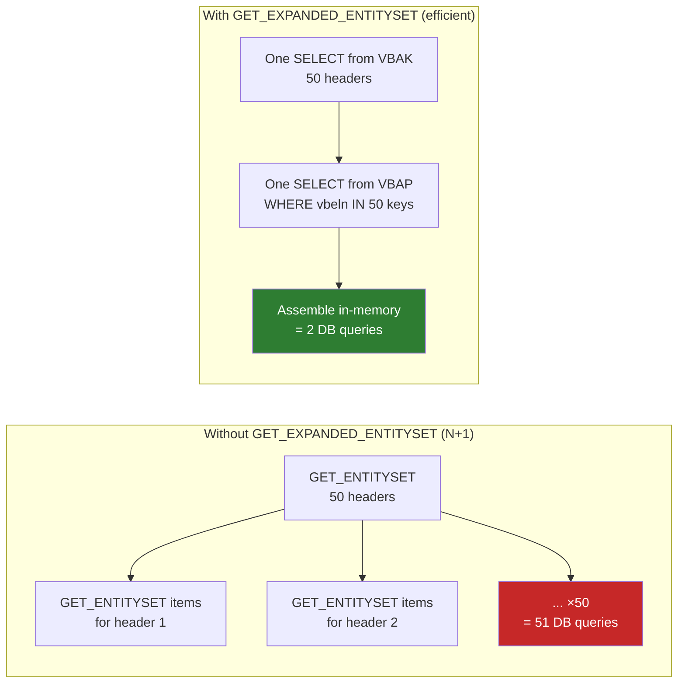

# Chapter 30: GET_EXPANDED_ENTITYSET

*Why $expand exists, why you need to implement it yourself for performance, and how to do it right.*

---

## 30.1 The $expand problem and why you redefine this method ☕

You've just built a Fiori List-Detail screen. The master list shows all sales order headers. The user clicks a header — the detail view loads the header *and* its items together. The Fiori app adds `?$expand=ToItems` to the GET request.

Without any work on your side, the gateway framework *can* handle `$expand` automatically by calling `GET_ENTITY` for the header and then calling `GET_ENTITYSET` once per header for the items. For one header, that's fine. For a list of 50 headers all expanded with items, that's:

- 1 call to `GET_ENTITYSET` for the headers → 50 rows
- 50 separate calls to `GET_ENTITYSET` for items, one per header

That's the **N+1 problem**. If you've used Entity Framework with lazy loading enabled, you've seen this destroy performance in exactly the same way.

### The EF lazy loading parallel

```csharp
// C# — EF Core with lazy loading (the N+1 trap)
var headers = await db.SalesOrderHeaders.ToListAsync();       // 1 query
foreach (var h in headers)
{
    // Each access to h.Items fires a SEPARATE database round-trip!
    foreach (var item in h.Items)                              // N queries
        Console.WriteLine(item.Material);
}

// The fix — eager loading with Include()
var headers = await db.SalesOrderHeaders
    .Include(h => h.Items)          // Single JOIN query — 1 round-trip
    .ToListAsync();
```

`GET_EXPANDED_ENTITYSET` is SAP's version of `.Include(h => h.Items)`. You write one efficient query that fetches headers AND items together, then assemble the result. The framework calls this method instead of the N+1 default behavior.

> 💡 There are two similar methods:
> - `GET_EXPANDED_ENTITYSET` — called for `GET /SalesOrderHeaderSet?$expand=ToItems` (the list)
> - `GET_EXPANDED_ENTITY` — called for `GET /SalesOrderHeaderSet('1001')?$expand=ToItems` (single entity)
>
> Implement both. This chapter covers the entityset version; the entity version follows the same pattern but reads a single header.

---

## 30.2 You already know this

### C# — eager loading in EF Core

```csharp
// C# — the efficient, single-query approach
[HttpGet]
public async Task<List<SalesOrderHeaderDto>> GetAllWithItems()
{
    return await db.SalesOrderHeaders
        .Include(h => h.Items)
        .Select(h => new SalesOrderHeaderDto
        {
            OrderId   = h.OrderId,
            Customer  = h.Customer,
            NetAmount = h.NetAmount,
            Items     = h.Items.Select(i => new SalesOrderItemDto
            {
                ItemNo   = i.ItemNo,
                Material = i.Material,
                Quantity = i.Quantity
            }).ToList()
        })
        .ToListAsync();
}
```

One round-trip to the database. One result set. All children embedded.

### Python — SQLAlchemy with joinedload

```python
from sqlalchemy.orm import joinedload

# Python — efficient eager load
headers = (
    db.query(SalesOrderHeader)
    .options(joinedload(SalesOrderHeader.items))
    .all()
)

result = [
    {
        "order_id": h.order_id,
        "customer": h.customer,
        "items": [
            {"item_no": i.item_no, "material": i.material, "quantity": i.quantity}
            for i in h.items
        ]
    }
    for h in headers
]
```

Same idea in ABAP coming up — one SELECT for headers, one SELECT for all their items, assembled in-memory.

---

## 30.3 Building the expanded response — the technical pieces 🛠️

### The key import parameters in GET_EXPANDED_ENTITYSET

When the framework calls your redefined method, these are the parameters you'll use:

| Parameter | What it is |
|---|---|
| `io_expand` | An object describing *which* nav properties were requested in $expand |
| `et_expanded_clause` | Output table — you declare which expand nodes you're returning |
| `et_expanded_tech_clause` | Technical output — maps back to internal nav property identifiers |
| `io_tech_request_context` | The full request context (filters, paging, etc.) |
| `et_entityset` | Your main output — the collection of expanded entities |

The "expanded entity" is actually a deep structure (same concept as Chapter 29, just for reading). SEGW generates `ts_salesorderheader_deep` — the header type with `to_items` as an embedded table.

### The expand descriptor: et_expanded_clause

You need to tell the framework "yes, I handled the ToItems expansion." If you don't populate `et_expanded_clause`, the framework may try to call the default expansion logic on top of yours — double work at best, wrong data at worst.

```abap
" Tell the framework: I handled the 'ToItems' expand
DATA(ls_expand) = VALUE /iwbep/s_mgw_tech_request(
  nav_prop_name = 'ToItems'
).
APPEND ls_expand TO et_expanded_clause.
```

---

## 30.4 Full implementation of GET_EXPANDED_ENTITYSET 🔁

```abap
CLASS zsalesorder_srv_dpc_ext DEFINITION
  INHERITING FROM zsalesorder_srv_dpc
  FINAL
  CREATE PUBLIC.

PUBLIC SECTION.
  METHODS salesorderheaderset_get_expanded_entityset REDEFINITION.

ENDCLASS.

CLASS zsalesorder_srv_dpc_ext IMPLEMENTATION.

  "=========================================================================
  " GET_EXPANDED_ENTITYSET
  " Called for: GET /SalesOrderHeaderSet?$expand=ToItems
  " Goal: one efficient DB round-trip instead of N+1 calls
  "=========================================================================
  METHOD salesorderheaderset_get_expanded_entityset.
    " Signature parameters we use:
    "   io_expand               — describes which nav properties to expand
    "   io_tech_request_context — gives us filter/paging/orderby
    "   et_entityset            — TYPE TABLE OF ts_salesorderheader_deep
    "   et_expanded_clause      — we must fill this to claim the expansion
    "   et_expanded_tech_clause — technical counterpart of et_expanded_clause

    " --- 0. Determine if $expand=ToItems was requested -------------------
    DATA(lv_expand_items) = abap_false.
    DATA(lt_expand_nodes) = io_expand->get_expand_list( ).

    LOOP AT lt_expand_nodes INTO DATA(ls_expand_node).
      IF ls_expand_node-nav_prop_name = 'ToItems'.
        lv_expand_items = abap_true.
      ENDIF.
    ENDLOOP.

    " --- 1. Read filters + paging -----------------------------------------
    DATA lv_filter_order_id TYPE vbeln_va.
    DATA lv_top             TYPE i.
    DATA lv_skip            TYPE i.

    DATA(lt_filters) = io_tech_request_context->get_filter(
                         )->get_filter_select_options( ).

    LOOP AT lt_filters INTO DATA(ls_filter) WHERE property = 'OrderId'.
      LOOP AT ls_filter-select_options INTO DATA(ls_opt).
        IF ls_opt-option = 'EQ'.
          lv_filter_order_id = ls_opt-low.
        ENDIF.
      ENDLOOP.
    ENDLOOP.

    DATA(ls_paging) = io_tech_request_context->get_top_skip_inline_count( ).
    lv_top  = ls_paging-top.
    lv_skip = ls_paging-skip.
    IF lv_top = 0.
      lv_top = 200.  " Safety cap
    ENDIF.

    " --- 2. Fetch all matching headers in one query -----------------------
    DATA lt_vbak TYPE TABLE OF vbak.

    IF lv_filter_order_id IS NOT INITIAL.
      SELECT *
        FROM vbak
        INTO TABLE @lt_vbak
        WHERE vbeln = @lv_filter_order_id.
    ELSE.
      SELECT *
        FROM vbak
        INTO TABLE @lt_vbak
        ORDER BY vbeln
        UP TO @lv_top ROWS
        OFFSET @lv_skip.
    ENDIF.

    IF lt_vbak IS INITIAL.
      RETURN.  " Nothing to return — et_entityset stays empty
    ENDIF.

    " --- 3. Collect all order IDs so we can fetch items in ONE query ------
    DATA lt_order_ids TYPE RANGE OF vbeln_va.
    LOOP AT lt_vbak INTO DATA(ls_h).
      APPEND VALUE #( sign = 'I' option = 'EQ' low = ls_h-vbeln )
             TO lt_order_ids.
    ENDLOOP.

    " --- 4. Fetch ALL items for those headers — single SELECT -------------
    DATA lt_vbap TYPE TABLE OF vbap.

    IF lv_expand_items = abap_true.
      SELECT *
        FROM vbap
        INTO TABLE @lt_vbap
        WHERE vbeln IN @lt_order_ids.

      " Sort items for binary search
      SORT lt_vbap BY vbeln posnr.
    ENDIF.

    " --- 5. Assemble deep entities in-memory ------------------------------
    DATA ls_deep TYPE zcl_zsalesorder_srv_mpc=>ts_salesorderheader_deep.

    LOOP AT lt_vbak INTO ls_h.
      CLEAR ls_deep.

      " Map header fields
      ls_deep-order_id   = ls_h-vbeln.
      ls_deep-customer   = ls_h-kunnr.
      ls_deep-order_date = ls_h-audat.
      ls_deep-net_amount = ls_h-netwr.
      ls_deep-currency   = ls_h-waerk.
      ls_deep-status     = ls_h-gbstk.

      " Attach items (binary search — no additional DB calls)
      IF lv_expand_items = abap_true.
        LOOP AT lt_vbap INTO DATA(ls_i) WHERE vbeln = ls_h-vbeln.
          APPEND VALUE zcl_zsalesorder_srv_mpc=>ts_salesorderitem(
            order_id  = ls_i-vbeln
            item_no   = ls_i-posnr
            material  = ls_i-matnr
            quantity  = ls_i-kwmeng
            uom       = ls_i-vrkme
            net_value = ls_i-netwr
          ) TO ls_deep-to_items.
        ENDLOOP.
      ENDIF.

      APPEND ls_deep TO et_entityset.
    ENDLOOP.

    " --- 6. Tell the framework we handled the ToItems expansion -----------
    "     Without this, the framework may try to re-expand on its own.
    IF lv_expand_items = abap_true.
      APPEND VALUE #( nav_prop_name = 'ToItems' ) TO et_expanded_clause.
      APPEND VALUE #( nav_prop_name = 'ToItems' ) TO et_expanded_tech_clause.
    ENDIF.

  ENDMETHOD.

ENDCLASS.
```

> ⚠️ **C#/Python gotcha:** Step 3 — collecting all order IDs into a range table (`lt_order_ids`) and then using `IN @lt_order_ids` in the SELECT — is the ABAP equivalent of SQL's `WHERE vbeln IN (SELECT vbeln FROM @lt_vbak)` or EF's `Where(i => orderIds.Contains(i.OrderId))`. This is the key trick that replaces N individual queries with one batch query. If you skip it and loop-SELECT inside the header loop, you're back to N+1.

> ⚠️ **C#/Python gotcha:** Steps 5 uses `LOOP AT lt_vbap INTO DATA(ls_i) WHERE vbeln = ls_h-vbeln` — this works cleanly here because `lt_vbap` is already sorted. For production code on large tables, add a hash/sorted key and use `READ TABLE` or a binary search to avoid O(n²) complexity.

---

## 30.5 Testing and performance notes 🎯

### Test URL

```http
GET /sap/opu/odata/sap/ZSALESORDER_SRV/SalesOrderHeaderSet?$expand=ToItems&$format=json
```

### Expected response shape

```json
{
  "d": {
    "results": [
      {
        "__metadata": { "type": "ZSALESORDER_SRV.SalesOrderHeader" },
        "OrderId":    "0000001001",
        "Customer":   "0000001000",
        "OrderDate":  "/Date(1716508800000)/",
        "NetAmount":  "2429.99",
        "Currency":   "USD",
        "Status":     "A",
        "ToItems": {
          "results": [
            { "OrderId": "0000001001", "ItemNo": "000010", "Material": "LAPTOP-X1", "Quantity": "2.000", "NetValue": "2400.00" },
            { "OrderId": "0000001001", "ItemNo": "000020", "Material": "MOUSE-USB", "Quantity": "1.000", "NetValue": "29.99" }
          ]
        }
      },
      {
        "__metadata": { "type": "ZSALESORDER_SRV.SalesOrderHeader" },
        "OrderId":    "0000001002",
        "Customer":   "0000002000",
        "OrderDate":  "/Date(1716595200000)/",
        "NetAmount":  "500.00",
        "Currency":   "EUR",
        "Status":     "B",
        "ToItems": {
          "results": [
            { "OrderId": "0000001002", "ItemNo": "000010", "Material": "KEYBOARD", "Quantity": "3.000", "NetValue": "500.00" }
          ]
        }
      }
    ]
  }
}
```

Each header has its items embedded inline — `"ToItems": { "results": [...] }`.

### Also implement GET_EXPANDED_ENTITY for the single-entity case

```http
GET /sap/opu/odata/sap/ZSALESORDER_SRV/SalesOrderHeaderSet('0000001001')?$expand=ToItems
```

```abap
METHOD salesorderheaderset_get_expanded_entity.
  " Same structure — read one header, read its items, assemble, return

  DATA(ls_keys) = io_tech_request_context->get_keys( ).
  READ TABLE ls_keys INTO DATA(ls_k) WITH KEY name = 'OrderId'.
  DATA(lv_order_id) = ls_k-value.

  SELECT SINGLE * FROM vbak INTO @DATA(ls_vbak) WHERE vbeln = @lv_order_id.

  IF sy-subrc <> 0.
    RAISE EXCEPTION TYPE /iwbep/cx_mgw_busi_exception
      EXPORTING textid = /iwbep/cx_mgw_busi_exception=>entity_not_found.
  ENDIF.

  DATA lt_vbap TYPE TABLE OF vbap.
  SELECT * FROM vbap INTO TABLE @lt_vbap WHERE vbeln = @lv_order_id.

  er_entity-order_id   = ls_vbak-vbeln.
  er_entity-customer   = ls_vbak-kunnr.
  er_entity-order_date = ls_vbak-audat.
  er_entity-net_amount = ls_vbak-netwr.
  er_entity-currency   = ls_vbak-waerk.
  er_entity-status     = ls_vbak-gbstk.

  LOOP AT lt_vbap INTO DATA(ls_i).
    APPEND VALUE zcl_zsalesorder_srv_mpc=>ts_salesorderitem(
      order_id  = ls_i-vbeln  item_no   = ls_i-posnr
      material  = ls_i-matnr  quantity  = ls_i-kwmeng
      uom       = ls_i-vrkme  net_value = ls_i-netwr
    ) TO er_entity-to_items.
  ENDLOOP.

  APPEND VALUE #( nav_prop_name = 'ToItems' ) TO et_expanded_clause.
  APPEND VALUE #( nav_prop_name = 'ToItems' ) TO et_expanded_tech_clause.

ENDMETHOD.
```

### Performance comparison



> 🧭 **On the job:** A Fiori app that hits `$expand` without this optimization will time out on any serious data volume. Performance tuning of `$expand` is one of the first things senior consultants check in a code review. "Did you implement GET_EXPANDED_ENTITYSET?" is a common interview question for OData roles.

---

## 🧠 Recap

- `$expand=ToItems` tells the OData service to embed the items collection inside each header in a single response.
- Without your override, the framework falls back to N+1 individual calls — one per header. This is the lazy-loading performance trap.
- `GET_EXPANDED_ENTITYSET` is your override point. Fetch headers first, collect all their keys, fetch all items in one query, assemble in-memory.
- Always populate `et_expanded_clause` and `et_expanded_tech_clause` to tell the framework you handled the expansion — otherwise it may double-expand.
- Implement `GET_EXPANDED_ENTITY` (singular) for the single-entity `?$expand=` case.
- The pattern is identical to EF Core's `.Include()` or SQLAlchemy's `joinedload()` — one query, assembled in code.

*[← Contents](../content.md) | [← Previous: CREATE_DEEP_ENTITY](29-odata-create-deep-entity.md) | [Next: Upload & Download Files in OData →](31-odata-file-upload-download.md)*
