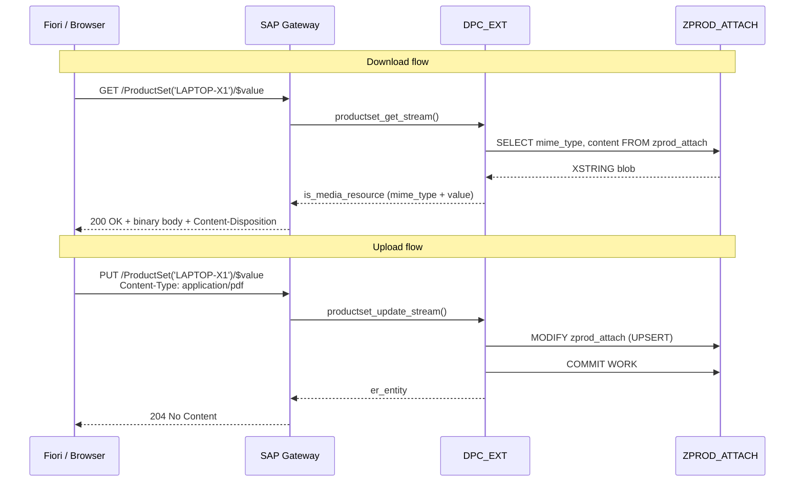

# Chapter 31: Upload & Download Files in OData

*How to turn an OData entity into a file endpoint — serving PDFs, images, and attachments via GET_STREAM and CREATE_STREAM.*

---

## 31.1 Binary content in OData — media entities ☕

In a regular REST API you'd have a dedicated file endpoint:

```
GET  /api/products/LAPTOP-X1/datasheet    → returns PDF bytes
POST /api/products/LAPTOP-X1/datasheet    → accepts PDF upload
```

You return a `FileStreamResult` in ASP.NET Core, or a `StreamingResponse` in FastAPI. The HTTP response body is the raw file bytes; the `Content-Type` header tells the client what they're receiving.

OData v2 has a first-class equivalent concept: the **media entity** (also called a media link entry or MLE). You mark an entity type as a media entity, and suddenly:

- `GET /ProductSet('LAPTOP-X1')/$value` streams the binary content
- `PUT /ProductSet('LAPTOP-X1')/$value` uploads new binary content

The entity's regular properties (name, description, etc.) are still accessible on the plain entity URL. The binary stream lives at the `/$value` suffix.

### The three-pass mental model

| Analogy | What it is |
|---|---|
| A filing cabinet where each folder has metadata labels on the outside... | ...and the actual document inside |
| `GET /products/x/datasheet` → FileStreamResult | `GET /ProductSet('x')/$value` → stream |
| `[FromForm] IFormFile file` on an upload endpoint | OData `CREATE_STREAM` / `UPDATE_STREAM` |

---

## 31.2 You already know this

### C# — file download in ASP.NET Core

```csharp
// C# — download a product datasheet
[HttpGet("{productId}/datasheet")]
public async Task<IActionResult> DownloadDatasheet(string productId)
{
    var attachment = await _attachRepo.GetDatasheet(productId);
    if (attachment == null)
        return NotFound();

    return File(
        fileContents: attachment.Content,
        contentType:  attachment.MimeType,   // e.g., "application/pdf"
        fileDownloadName: $"{productId}_datasheet.pdf"
    );
}

// C# — upload a product datasheet
[HttpPost("{productId}/datasheet")]
public async Task<IActionResult> UploadDatasheet(
    string productId,
    [FromForm] IFormFile file)
{
    using var ms = new MemoryStream();
    await file.CopyToAsync(ms);
    await _attachRepo.SaveDatasheet(productId, ms.ToArray(), file.ContentType);
    return Ok();
}
```

### Python — FastAPI file endpoints

```python
from fastapi import UploadFile
from fastapi.responses import Response

@app.get("/products/{product_id}/datasheet")
async def download_datasheet(product_id: str):
    attachment = await db.get_datasheet(product_id)
    if not attachment:
        raise HTTPException(404)
    return Response(
        content      = attachment.content,
        media_type   = attachment.mime_type,
        headers      = {"Content-Disposition": f"attachment; filename={product_id}.pdf"}
    )

@app.post("/products/{product_id}/datasheet")
async def upload_datasheet(product_id: str, file: UploadFile):
    content = await file.read()
    await db.save_datasheet(product_id, content, file.content_type)
    return {"status": "saved"}
```

Now let's do the same thing in SEGW + DPC_EXT.

---

## 31.3 Marking an entity as a media entity in SEGW 🛠️

### Step 1 — Flag the entity type

In SEGW, open the **Product** entity type. On the **Properties** tab, tick **"IsMediaLinkEntry"** (sometimes labeled "Has Stream").

This does several things automatically:
- Adds `m:HasStream="true"` to the `<EntityType>` in `$metadata`
- Tells the gateway runtime to route `/$value` requests to `GET_STREAM` and `CREATE_STREAM` / `UPDATE_STREAM`

```xml
<!-- $metadata after marking as media entity -->
<EntityType Name="Product" m:HasStream="true">
  <Key><PropertyRef Name="ProductId" /></Key>
  <Property Name="ProductId"    Type="Edm.String" Nullable="false" />
  <Property Name="ProductName"  Type="Edm.String" />
  <Property Name="Description"  Type="Edm.String" />
  <Property Name="MimeType"     Type="Edm.String" />
  <Property Name="FileName"     Type="Edm.String" />
</EntityType>
```

### Step 2 — Add a Z table to store the binary

For demo purposes, define a simple Z table `ZPROD_ATTACH` in SE11:

| Field | Type | Description |
|---|---|---|
| `PRODUCT_ID` | `CHAR 18` | Key — Product ID |
| `MIME_TYPE`  | `CHAR 100` | MIME type (e.g., application/pdf) |
| `FILE_NAME`  | `CHAR 255` | Original file name |
| `CONTENT`    | `RAWSTRING` | Binary content (LOB) |
| `CHANGED_AT` | `TIMESTAMP` | Last modified |
| `CHANGED_BY` | `UNAME` | Last modifier |

> 💡 In a production SAP system you'd typically use **GOS (Generic Object Services)** attachments stored in `SRGBTBREL` / `SOFFLOIO` via function module `GOS_API_*`. The Z table approach here keeps the teaching clear. Both patterns work with `GET_STREAM`.

### Step 3 — Generate in SEGW

Hit Generate. The DPC extension class will now have stub methods `GET_STREAM`, `CREATE_STREAM`, and `UPDATE_STREAM` available for redefinition.

---

## 31.4 Implementing GET_STREAM (download) 🔁

```abap
CLASS zsalesorder_srv_dpc_ext DEFINITION
  INHERITING FROM zsalesorder_srv_dpc
  FINAL
  CREATE PUBLIC.

PUBLIC SECTION.
  METHODS productset_get_stream    REDEFINITION.
  METHODS productset_create_stream REDEFINITION.
  METHODS productset_update_stream REDEFINITION.

ENDCLASS.

CLASS zsalesorder_srv_dpc_ext IMPLEMENTATION.

  "=========================================================================
  " GET_STREAM — download
  " Called for: GET /ProductSet('LAPTOP-X1')/$value
  "=========================================================================
  METHOD productset_get_stream.
    " Key parameters:
    "   iv_entity_name   — 'Product'
    "   it_key_tab       — table of (name, value) pairs: ProductId='LAPTOP-X1'
    "   is_media_resource — output structure to populate:
    "       value         — XSTRING (the binary bytes)
    "       mime_type     — string
    "       inline_count  — not used here

    " --- 1. Read the product ID from the key ---------------------------------
    DATA lv_product_id TYPE matnr.
    READ TABLE it_key_tab INTO DATA(ls_key) WITH KEY name = 'ProductId'.
    lv_product_id = ls_key-value.

    " --- 2. Read the binary from the Z table ---------------------------------
    SELECT SINGLE mime_type, file_name, content
      FROM zprod_attach
      INTO @DATA(ls_attach)
      WHERE product_id = @lv_product_id.

    IF sy-subrc <> 0.
      RAISE EXCEPTION TYPE /iwbep/cx_mgw_busi_exception
        EXPORTING textid = /iwbep/cx_mgw_busi_exception=>entity_not_found.
    ENDIF.

    " --- 3. Populate the media resource output structure --------------------
    "     is_media_resource is of type /iwbep/s_mgw_media_resource
    is_media_resource-mime_type = ls_attach-mime_type.
    is_media_resource-value     = ls_attach-content.

    " --- 4. Set Content-Disposition so browsers prompt "Save as..." --------
    "     The header is passed via the request context's response handler.
    DATA(lv_disposition) =
      |attachment; filename="{ ls_attach-file_name }"|.

    io_tech_request_context->get_response(
      )->set_header_field(
          iv_name  = 'Content-Disposition'
          iv_value = lv_disposition ).

  ENDMETHOD.

  "=========================================================================
  " CREATE_STREAM — upload (first time, entity key already known)
  " Called for: POST /ProductSet  (with Content-Type binary body)
  "   OR:       PUT  /ProductSet('LAPTOP-X1')/$value  (with new content)
  "
  " Note: CREATE_STREAM is called when the stream is created together
  "       with the entity. UPDATE_STREAM is for subsequent uploads.
  "       In practice, many developers implement both identically.
  "=========================================================================
  METHOD productset_create_stream.
    " Key parameters:
    "   is_media_resource — input: mime_type + value (bytes)
    "   it_key_tab        — entity keys
    "   er_entity         — output: the entity record to return
    "   is_entity_data    — optional entity properties POSTed alongside stream

    " --- 1. Read entity key + metadata from the request --------------------
    DATA lv_product_id TYPE matnr.
    READ TABLE it_key_tab INTO DATA(ls_key) WITH KEY name = 'ProductId'.
    lv_product_id = ls_key-value.

    IF lv_product_id IS INITIAL.
      RAISE EXCEPTION TYPE /iwbep/cx_mgw_busi_exception
        EXPORTING
          textid  = /iwbep/cx_mgw_busi_exception=>business_error
          message = 'ProductId is required'.
    ENDIF.

    " --- 2. Validate the incoming stream -----------------------------------
    IF is_media_resource-value IS INITIAL.
      RAISE EXCEPTION TYPE /iwbep/cx_mgw_busi_exception
        EXPORTING
          textid  = /iwbep/cx_mgw_busi_exception=>business_error
          message = 'No binary content received'.
    ENDIF.

    " --- 3. Derive file name from slug header or default -------------------
    DATA lv_mime_type TYPE string.
    DATA lv_file_name TYPE string.

    lv_mime_type = is_media_resource-mime_type.

    " Try to get file name from Content-Disposition or Slug header
    io_tech_request_context->get_request(
      )->get_header_field(
          EXPORTING iv_name  = 'Slug'
          IMPORTING ev_value = lv_file_name ).

    IF lv_file_name IS INITIAL.
      " Fall back to a generated name based on product + MIME type
      DATA(lv_extension) = COND string(
        WHEN lv_mime_type = 'application/pdf' THEN 'pdf'
        WHEN lv_mime_type CS 'image/png'      THEN 'png'
        WHEN lv_mime_type CS 'image/jpeg'     THEN 'jpg'
        ELSE 'bin'
      ).
      lv_file_name = |{ lv_product_id }_datasheet.{ lv_extension }|.
    ENDIF.

    " --- 4. Write to Z table (UPSERT — handles both create and update) -----
    DATA ls_attach TYPE zprod_attach.
    ls_attach-product_id = lv_product_id.
    ls_attach-mime_type  = lv_mime_type.
    ls_attach-file_name  = lv_file_name.
    ls_attach-content    = is_media_resource-value.
    ls_attach-changed_at = cl_abap_tstmp=>utclong2tstmp(
                             cl_abap_utclong=>get_utc_current( ) ).
    ls_attach-changed_by = sy-uname.

    MODIFY zprod_attach FROM ls_attach.

    IF sy-subrc <> 0.
      RAISE EXCEPTION TYPE /iwbep/cx_mgw_busi_exception
        EXPORTING
          textid  = /iwbep/cx_mgw_busi_exception=>business_error
          message = 'Could not save attachment'.
    ENDIF.

    COMMIT WORK AND WAIT.

    " --- 5. Return the entity metadata (not the binary — that's $value) ---
    er_entity-product_id  = lv_product_id.
    er_entity-mime_type   = lv_mime_type.
    er_entity-file_name   = lv_file_name.

  ENDMETHOD.

  "=========================================================================
  " UPDATE_STREAM — replace an existing attachment
  " Called for: PUT /ProductSet('LAPTOP-X1')/$value
  "=========================================================================
  METHOD productset_update_stream.
    " Signature is identical to CREATE_STREAM.
    " We can simply delegate — same MODIFY logic handles both insert/update.
    productset_create_stream(
      EXPORTING
        is_media_resource       = is_media_resource
        it_key_tab              = it_key_tab
        is_entity_data          = is_entity_data
        io_tech_request_context = io_tech_request_context
      IMPORTING
        er_entity = er_entity ).

  ENDMETHOD.

ENDCLASS.
```

> ⚠️ **C#/Python gotcha:** In ASP.NET Core you set response headers in the controller before returning the file. In ABAP you set them via `io_tech_request_context->get_response( )->set_header_field(...)`. The mechanism is the same — you're mutating the HTTP response object — but the path to get there is through the SAP gateway request context hierarchy.

> ⚠️ **C#/Python gotcha:** `is_media_resource-value` is of type `XSTRING` — a hex-encoded binary string in ABAP. Don't try to print it to the console; it will look like garbage. Don't convert it to `STRING` — you'll corrupt the binary data. Treat it as an opaque blob, pass it directly to/from the DB column.

---

## 31.5 Content-Type, Content-Disposition, and the full HTTP flow 🎯

### Download request and response headers

```http
GET /sap/opu/odata/sap/ZSALESORDER_SRV/ProductSet('LAPTOP-X1')/$value
Accept: application/pdf
Authorization: Basic <base64>
```

Response:
```http
HTTP/1.1 200 OK
Content-Type: application/pdf
Content-Disposition: attachment; filename="LAPTOP-X1_datasheet.pdf"
Content-Length: 204832

%PDF-1.7...
(binary content)
```

### Upload request

```http
PUT /sap/opu/odata/sap/ZSALESORDER_SRV/ProductSet('LAPTOP-X1')/$value
Content-Type: application/pdf
X-CSRF-Token: <token>
Slug: LAPTOP-X1_datasheet.pdf

%PDF-1.7...
(binary content)
```

Response:
```http
HTTP/1.1 204 No Content
```

> 💡 The `Slug` header is an OData convention for passing a suggested file name when uploading to a media entity. It's not mandatory — if absent, your code should fall back to a generated name as shown in `CREATE_STREAM` above.

### First-time upload: POST to create the entity + stream together

```http
POST /sap/opu/odata/sap/ZSALESORDER_SRV/ProductSet
Content-Type: application/pdf
X-CSRF-Token: <token>
Slug: LAPTOP-X1_datasheet.pdf

<binary content>
```

The gateway calls `CREATE_STREAM` because the POST body is binary (not JSON). To also set the product metadata (name, description) at the same time, you'd POST in `multipart/related` format — but in practice, most SAP projects create the entity first (with a standard POST sending JSON) and then PUT the stream separately.

### Testing in /IWFND/GW_CLIENT

1. Open `/IWFND/GW_CLIENT`.
2. Method = `GET`, URI = `/sap/opu/odata/sap/ZSALESORDER_SRV/ProductSet('LAPTOP-X1')/$value`.
3. Execute — the response body will be the raw binary. Look at the HTTP response code and `Content-Type` header.
4. For upload: change method to `PUT`, paste the same URI, set `Content-Type: application/pdf` in the request headers, add a small test binary payload.

> 🧭 **On the job:** Media entity streams are most commonly used for:
> - Product datasheets (PDF)
> - Customer-uploaded photos / ID documents
> - Report outputs (PDF generated from ABAP)
> - GOS (Generic Object Services) attachments exposed through OData
>
> The GOS pattern is especially common — many SAP business objects (PM orders, purchase orders, vendor master) already have GOS attachment infrastructure. Wrapping it in OData streams is a recurring consulting task.

### Full interaction diagram



---

## 🧠 Recap

- A **media entity** is an OData entity type with `m:HasStream="true"`. Clients access the binary at `/<EntitySet>('<key>')/$value`.
- Mark the entity type in SEGW → tick **IsMediaLinkEntry** → Generate.
- `GET_STREAM` populates `is_media_resource-value` (XSTRING) and `is_media_resource-mime_type`. Set `Content-Disposition` via the response object for proper file-save behavior.
- `CREATE_STREAM` and `UPDATE_STREAM` receive the binary in `is_media_resource-value`. Use `MODIFY` on your storage table for an upsert pattern.
- The `Slug` request header carries the suggested file name on upload.
- Never convert `XSTRING` to `STRING` — you will corrupt binary data.
- In production, consider GOS attachments (via `GOS_API_*` function modules) as the storage backend — it integrates with SAP's standard attachment viewing in all SAPGUI transactions.

*[← Contents](../content.md) | [← Previous: GET_EXPANDED_ENTITYSET](30-odata-get-expanded-entityset.md) | [Next: Google Form Integration →](32-google-form-integration.md)*
