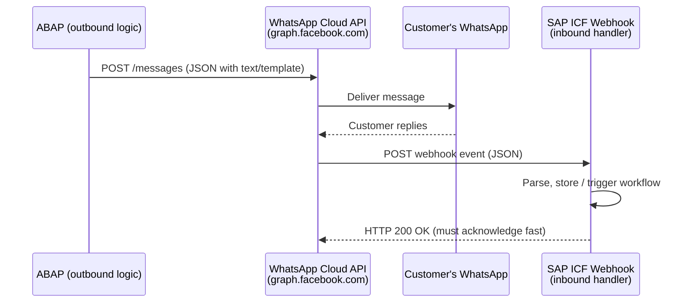

# Chapter 33: WhatsApp Integration from ABAP

*Sending order confirmations and receiving customer replies — all from ABAP, all over the WhatsApp Cloud API.*

---

## ☕ Why WhatsApp?

WhatsApp has over 2 billion active users. In many markets — Brazil, India, Germany, Turkey, the Middle East — it's the primary business communication channel. SAP shops in those regions increasingly want to send shipping notifications, payment reminders, and appointment confirmations over WhatsApp rather than SMS or email.

From a developer's perspective, the WhatsApp Cloud API (from Meta/Facebook) is just a REST API. You POST JSON to a URL. The fact that it ends up as a WhatsApp message is Meta's problem. Your job on the ABAP side is: build the JSON and call the URL. You've done both of those things before. This chapter just shows you the exact shape of the API and the ABAP plumbing.

---

## 33.1 The Scenario

Your client runs an e-commerce warehouse on SAP. When an order ships (goods issue posted in SD), they want:

1. **Outbound:** SAP sends the customer a WhatsApp message — "Your order 4500001234 has shipped. Tracking: DHL 1234567890."
2. **Inbound:** The customer can reply "STATUS" and get an automated response, or "CANCEL" to flag the order for a CSR follow-up in SAP.



> 🧭 **On the job:** The same pattern — outbound HTTP POST from ABAP + inbound ICF webhook — works for Telegram, Slack, Teams, and virtually any modern messaging API. Master this once and the pattern repeats.

---

## 33.2 WhatsApp Cloud API Basics

### What you need (all free to set up for development)

1. **Meta Developer account** — [developers.facebook.com](https://developers.facebook.com)
2. **A Meta App** with the "WhatsApp" product added.
3. **A test phone number** — Meta gives you one for free; you can message up to 5 recipient numbers without going through business verification.
4. **A permanent access token** — or a temporary one from the dashboard for testing.
5. **A webhook URL** — your SAP ICF endpoint, reachable from the internet (or via SAP Cloud Connector / ngrok in dev).

### The key identifiers

| Term | Meaning | Looks like |
|---|---|---|
| `phone_number_id` | ID of the sending WhatsApp number in Meta's system | `123456789012345` (numeric) |
| `access_token` | Bearer token for API calls | `EAADxxxxxx...` (long string) |
| `to` | Recipient's phone number | `+491771234567` (international format) |

### The `/messages` endpoint

```http
POST https://graph.facebook.com/v20.0/{phone_number_id}/messages
Authorization: Bearer {access_token}
Content-Type: application/json
```

Two message types you'll use most:

**Free-form text** (only allowed within 24 h of the customer messaging you first):
```json
{
  "messaging_product": "whatsapp",
  "to": "+491771234567",
  "type": "text",
  "text": { "body": "Your order 4500001234 has shipped!" }
}
```

**Approved template** (the only way to send a first outbound message; requires Meta approval — takes 1–2 days):
```json
{
  "messaging_product": "whatsapp",
  "to": "+491771234567",
  "type": "template",
  "template": {
    "name": "order_shipped",
    "language": { "code": "en_US" },
    "components": [
      {
        "type": "body",
        "parameters": [
          { "type": "text", "text": "4500001234" },
          { "type": "text", "text": "DHL 1234567890" }
        ]
      }
    ]
  }
}
```

> ⚠️ **C#/Python gotcha:** In test mode you can send free-form text to your own verified number without a template. In production, **all first-contact outbound messages must use an approved template.** This trips up everyone the first time they go live.

---

## 33.3 Sending FROM ABAP

### 1. The analogy

Sending a WhatsApp message from ABAP is exactly like calling any REST API from C# with `HttpClient` or from Python with `requests`. You build a JSON string, set headers, POST to a URL, and check the HTTP status code.

### 2. You already know this

```csharp
// C# — HttpClient approach
var client = new HttpClient();
client.DefaultRequestHeaders.Authorization =
    new AuthenticationHeaderValue("Bearer", accessToken);

var body = new {
    messaging_product = "whatsapp",
    to = "+491771234567",
    type = "text",
    text = new { body = $"Your order {orderId} has shipped!" }
};

var response = await client.PostAsJsonAsync(
    $"https://graph.facebook.com/v20.0/{phoneNumberId}/messages",
    body);

var responseText = await response.Content.ReadAsStringAsync();
```

```python
# Python — requests
import requests, json

headers = {
    "Authorization": f"Bearer {access_token}",
    "Content-Type": "application/json"
}
payload = {
    "messaging_product": "whatsapp",
    "to": "+491771234567",
    "type": "text",
    "text": {"body": f"Your order {order_id} has shipped!"}
}
resp = requests.post(
    f"https://graph.facebook.com/v20.0/{phone_number_id}/messages",
    headers=headers,
    json=payload
)
print(resp.status_code, resp.json())
```

### 3. The ABAP way

ABAP has two HTTP client APIs. Use `IF_WEB_HTTP_CLIENT` (available from SAP_BASIS 7.54 / ABAP Platform 1909) on modern systems — it's cleaner. Fall back to `CL_HTTP_CLIENT` on older systems.

#### Modern: IF_WEB_HTTP_CLIENT (recommended, ABAP 1909+)

```abap
CLASS zcl_whatsapp_sender DEFINITION PUBLIC FINAL CREATE PUBLIC.
  PUBLIC SECTION.
    METHODS send_order_shipped
      IMPORTING
        iv_recipient_phone TYPE string
        iv_order_id        TYPE vbeln
        iv_tracking_no     TYPE string
      RETURNING
        VALUE(rv_success)  TYPE abap_bool.

  PRIVATE SECTION.
    CONSTANTS:
      gc_base_url   TYPE string VALUE 'https://graph.facebook.com',
      gc_api_ver    TYPE string VALUE 'v20.0',
      gc_phone_id   TYPE string VALUE '123456789012345',   " your phone number ID
      gc_token      TYPE string VALUE 'EAADxxxxxxxxxx'.    " store in Secure Store in prod!
ENDCLASS.

CLASS zcl_whatsapp_sender IMPLEMENTATION.

  METHOD send_order_shipped.

    DATA: lo_http_dest  TYPE REF TO if_http_destination,
          lo_http_client TYPE REF TO if_web_http_client,
          lo_request     TYPE REF TO if_web_http_request,
          lo_response    TYPE REF TO if_web_http_response,
          lv_url         TYPE string,
          lv_body        TYPE string,
          lv_status      TYPE i.

    TRY.
        " ── 1. Build the target URL ───────────────────────────────────
        lv_url = |{ gc_base_url }/{ gc_api_ver }/{ gc_phone_id }/messages|.

        " ── 2. Create HTTP destination (SSL-capable) ──────────────────
        lo_http_dest = cl_http_destination_provider=>create_by_url( lv_url ).
        lo_http_client = cl_web_http_client_manager=>create_by_http_destination(
                           lo_http_dest ).

        " ── 3. Build JSON body ────────────────────────────────────────
        " Using string templates for simplicity; in production use
        " /UI2/CL_JSON or CL_SXML_STRING_WRITER for safety.
        lv_body = |\{"messaging_product":"whatsapp",| &&
                  |"to":"{ iv_recipient_phone }",| &&
                  |"type":"text",| &&
                  |"text":\{"body":"Your order { iv_order_id } has shipped! | &&
                  |Tracking: { iv_tracking_no }"\}\}|.

        " ── 4. Set up the request ─────────────────────────────────────
        lo_request = lo_http_client->get_http_request( ).
        lo_request->set_method( if_web_http_client=>post ).
        lo_request->set_header_field(
          i_name  = 'Content-Type'
          i_value = 'application/json' ).
        lo_request->set_header_field(
          i_name  = 'Authorization'
          i_value = |Bearer { gc_token }| ).
        lo_request->set_text( lv_body ).

        " ── 5. Execute ────────────────────────────────────────────────
        lo_response = lo_http_client->execute(
                        if_web_http_client=>post ).
        lv_status = lo_response->get_status( )-code.

        IF lv_status >= 200 AND lv_status < 300.
          rv_success = abap_true.
          " Optionally: log the wa_id from the response JSON
        ELSE.
          " Log the error body for debugging
          MESSAGE lo_response->get_text( ) TYPE 'W'.
          rv_success = abap_false.
        ENDIF.

      CATCH cx_http_no_current_session
            cx_http_not_found
            cx_web_http_client_error INTO DATA(lx_error).
        MESSAGE lx_error->get_text( ) TYPE 'E'.
        rv_success = abap_false.
    ENDTRY.

  ENDMETHOD.

ENDCLASS.
```

#### Classic: CL_HTTP_CLIENT (SAP_BASIS 7.40 and older)

```abap
" For older systems without IF_WEB_HTTP_CLIENT
DATA: lo_client   TYPE REF TO cl_http_client,
      lv_status   TYPE i,
      lv_reason   TYPE string.

cl_http_client=>create_by_url(
  EXPORTING
    url                = |https://graph.facebook.com/v20.0/{ lc_phone_id }/messages|
  IMPORTING
    client             = lo_client
  EXCEPTIONS
    argument_not_found = 1
    plugin_not_active  = 2
    internal_error     = 3
    OTHERS             = 4 ).

IF sy-subrc <> 0.
  " Handle creation error
ENDIF.

lo_client->request->set_method( if_http_request=>co_request_method_post ).
lo_client->request->set_header_field(
  name  = 'Content-Type'
  value = 'application/json' ).
lo_client->request->set_header_field(
  name  = 'Authorization'
  value = |Bearer { lc_token }| ).
lo_client->request->set_cdata( lv_body ).

lo_client->send( ).
lo_client->receive( ).
lo_client->response->get_status(
  IMPORTING code   = lv_status
            reason = lv_reason ).
```

> ⚠️ **C#/Python gotcha:** `CL_HTTP_CLIENT=>create_by_url` needs an **SSL certificate** for `graph.facebook.com` imported in STRUST (`SSL client SSL Client (Standard)`). If you get `ICMAN` or `SSL handshake failed` errors, that's why — ask your basis admin to import the certificate chain, or use transaction `STRUST` yourself on a dev system.

### Building safe JSON in ABAP

String templates work for simple cases. For anything with user data (names, addresses) that might contain quotes or backslashes, use the JSON serializer:

```abap
" Structured JSON building with /UI2/CL_JSON (available from 7.40 SP08)
TYPES: BEGIN OF ty_text,
         body TYPE string,
       END OF ty_text.

TYPES: BEGIN OF ty_wa_msg,
         messaging_product TYPE string,
         to                TYPE string,
         type              TYPE string,
         text              TYPE ty_text,
       END OF ty_wa_msg.

DATA ls_msg TYPE ty_wa_msg.
ls_msg-messaging_product = 'whatsapp'.
ls_msg-to                = iv_recipient_phone.
ls_msg-type              = 'text'.
ls_msg-text-body         = |Your order { iv_order_id } has shipped!|.

DATA(lv_json) = /ui2/cl_json=>serialize(
                  data         = ls_msg
                  pretty_name  = /ui2/cl_json=>pretty_mode-camel_case ).
```

> 💡 `/UI2/CL_JSON` is the de-facto standard JSON library in classic ABAP. It serializes ABAP structures to JSON and deserializes back. The `pretty_name` parameter controls whether `MY_FIELD` becomes `myField` (camelCase) or `MY_FIELD` (upper). WhatsApp's API uses snake_case, so pass `pretty_mode-low_case` or map your structure field names manually.

---

## 33.4 Receiving INTO SAP — The Webhook

When a customer replies to your WhatsApp message, Meta POSTs a JSON payload to your webhook URL. You need to expose an HTTP endpoint in SAP to receive it.

### ICF node setup (SICF)

In transaction `SICF`:
1. Navigate to `/default_host/sap/zgwa/webhook`.
2. Create a new node `webhook`, assign handler class `ZCL_WHATSAPP_WEBHOOK`.
3. Activate the node.

> 🧭 **On the job:** For internet-facing webhooks, you'd normally put this behind SAP Cloud Connector or an API Gateway. For dev/testing, tools like `ngrok` create a temporary public HTTPS tunnel to your local SAP system. Meta requires HTTPS for webhook registration.

### Webhook verification (one-time challenge)

When you register the webhook URL in Meta's dashboard, it sends a `GET` request with `hub.challenge` to verify you own the endpoint. You must echo back the challenge value.

```abap
" Part of ZCL_WHATSAPP_WEBHOOK=>handle_request
IF server->request->get_method( ) = 'GET'.
  DATA(lv_mode)      = server->request->get_form_field( 'hub.mode' ).
  DATA(lv_token)     = server->request->get_form_field( 'hub.verify_token' ).
  DATA(lv_challenge) = server->request->get_form_field( 'hub.challenge' ).

  " Your verify token — set it when registering in Meta dashboard
  IF lv_mode = 'subscribe' AND lv_token = 'MY_VERIFY_TOKEN_ABC123'.
    server->response->set_status( code = 200 reason = 'OK' ).
    server->response->set_cdata( lv_challenge ).
  ELSE.
    server->response->set_status( code = 403 reason = 'Forbidden' ).
  ENDIF.
  RETURN.
ENDIF.
```

### Processing inbound messages

```abap
" Part of ZCL_WHATSAPP_WEBHOOK=>handle_request — POST branch
METHOD if_http_extension~handle_request.

  " ── Always ACK quickly (Meta retries if no 200 within ~5 sec) ────
  server->response->set_status( code = 200 reason = 'OK' ).
  server->response->set_cdata( '{}' ).
  server->response->set_header_field(
    name = 'Content-Type' value = 'application/json' ).

  IF server->request->get_method( ) = 'POST'.
    DATA(lv_body) = server->request->get_cdata( ).

    " ── Parse the JSON to a structure ────────────────────────────────
    " Simplified: read the from, text, and message ID
    " In real code, use /UI2/CL_JSON with a proper type mapping
    " to handle the full Meta webhook schema (changes/value/messages)

    TYPES: BEGIN OF ty_wa_text,
             body TYPE string,
           END OF ty_wa_text.

    TYPES: BEGIN OF ty_wa_message,
             id   TYPE string,
             from TYPE string,
             type TYPE string,
             text TYPE ty_wa_text,
           END OF ty_wa_message.

    TYPES ty_messages TYPE STANDARD TABLE OF ty_wa_message WITH EMPTY KEY.

    " The actual Meta payload is nested:
    " { "entry": [{ "changes": [{ "value": { "messages": [...] } }] }] }
    " For brevity, assume you've extracted the messages array already:
    DATA lt_messages TYPE ty_messages.
    " ... (parse with /UI2/CL_JSON or CL_SXML_STRING_READER) ...

    LOOP AT lt_messages INTO DATA(ls_msg).
      CASE to_upper( ls_msg-text-body ).
        WHEN 'STATUS'.
          " Trigger async RFC / background job to send order status
          zcl_whatsapp_sender=>send_order_status_reply(
            iv_phone = ls_msg-from ).
        WHEN 'CANCEL'.
          " Store cancellation request in Z-table for CSR action
          INSERT INTO zwa_cancel_req VALUES @(
            VALUE zwa_cancel_req(
              wa_msg_id  = ls_msg-id
              phone      = ls_msg-from
              req_ts     = sy-datum
              status     = 'OPEN' ) ).
        WHEN OTHERS.
          " Log unrecognised message for analytics
          " ...
      ENDCASE.
    ENDLOOP.
  ENDIF.

ENDMETHOD.
```

> ⚠️ **C#/Python gotcha:** **Return 200 immediately, then process.** If your ABAP logic takes more than ~5 seconds, Meta marks the delivery as failed and retries — you'll process the same message multiple times. Return the 200 at the top of the handler, then do the work. For heavy processing, enqueue a background job (via `CL_ABAP_BEHV` or a simple function module in `UPDATE TASK`).

---

## 33.5 Testing + Notes on Cost and Sandbox

### Testing in the Meta sandbox

1. In the Meta Developer dashboard, go to **WhatsApp → API Setup**.
2. Use the provided test phone number (format: `+1 555 xxx xxxx`).
3. Add your personal number as a recipient (Meta requires you to send a message to your own number first — an "opt-in" for the test sandbox).
4. Use the **"Send Message"** button in the dashboard UI to test templates.
5. Use `curl` or Postman to test your actual SAP service via the access token shown in the dashboard.

### Testing your SAP webhook locally

```bash
# Simulate a Meta inbound webhook call to your ICF endpoint
curl -X POST https://your-sap-host/sap/zgwa/webhook \
  -H "Content-Type: application/json" \
  -d '{
    "entry": [{
      "changes": [{
        "value": {
          "messages": [{
            "id": "wamid.test123",
            "from": "+491771234567",
            "type": "text",
            "text": { "body": "STATUS" }
          }]
        }
      }]
    }]
  }'
```

### Cost notes

| Tier | Cost |
|---|---|
| **Development** | Free — up to 1,000 free conversations/month per phone number |
| **Production** | Charged per conversation (24-hour window), rates vary by country — roughly €0.02–€0.10 per conversation |
| **Template messages** | Charged even in the first message of a window |
| **Free-form replies** | Free within a 24-hour customer service window |

> 💡 For a proof-of-concept or a small internal tool (say, 50 shipment notifications/day), the cost is genuinely negligible. Make sure to discuss the business number registration and Meta Business Verification with your client before going live — it takes a few days and requires official company documents.

---

## 🧠 Recap

- WhatsApp Cloud API is just a REST API — POST JSON with a Bearer token, same as any other service.
- On the ABAP side: use `IF_WEB_HTTP_CLIENT` (modern) or `CL_HTTP_CLIENT` (classic) to send; expose an `IF_HTTP_EXTENSION` ICF handler to receive.
- Don't forget SSL certificates in STRUST for outbound HTTPS calls.
- Always return HTTP 200 from your webhook immediately, then process asynchronously.
- Production outbound messages must use Meta-approved templates — plan ahead for the approval time.
- This scenario + the Google Forms integration (Chapter 32) make a compelling two-project "integration portfolio" section on your CV.

---

*[← Contents](../content.md) | [← Previous: Google Form → SAP Integration](32-google-form-integration.md) | [Next: Fiori & UI5 for ABAP Developers →](34-fiori.md)*
