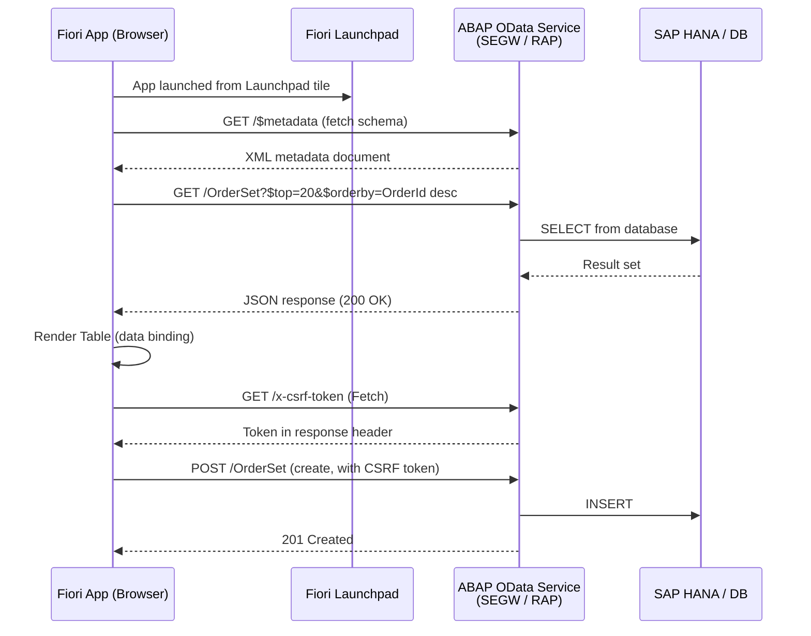
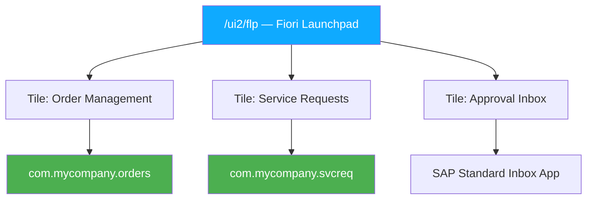

# Chapter 34: Fiori & UI5 for ABAP Developers

*SAP's modern web UX — what it is, how it works, and how your OData services power it.*

---

## ☕ The story so far — and why UI matters now

You've spent the last dozen chapters building services. OData endpoints that READ, CREATE, UPDATE, DELETE. A Google Form integration. WhatsApp notifications. Beautiful, useful, invisible back-end work.

But at some point your project manager will say: "Can we put a nice screen on this?" That's when Fiori enters the picture.

Fiori is SAP's modern web user interface platform. It's the answer to the (very fair) criticism that SAP GUI looked like it was designed in 1992 — because most of it was. Fiori launched around 2013 and has been SAP's strategic UI direction ever since. If you're targeting S/4HANA roles, Fiori knowledge is expected, not optional.

The good news: if you understand React, Angular, or Vue, you'll feel at home faster than you think.

---

## 34.1 What Fiori Is

### The analogy

Think of Fiori as SAP's equivalent of a design system + component library + deployment platform, all in one. It's not just a visual style guide — it includes:

- **SAPUI5**: the JavaScript framework (think "SAP's version of Angular")
- **OpenUI5**: the open-source version of SAPUI5 (same engine, no SAP license needed)
- **Fiori Design Guidelines**: SAP's equivalent of Google Material Design — rules for layout, color, interaction
- **Fiori Launchpad (FLP)**: the browser-based portal where all Fiori apps live, equivalent to a Windows Start menu or a web app launcher

When your client says "we want a Fiori app for this," they usually mean one of two things:
1. **Fiori Elements app** — a metadata-driven UI that generates itself from OData annotations. Minimal JS required. Fast to build.
2. **Freestyle UI5 app** — a hand-coded UI5 application with full design freedom. More work, more flexibility.

> 🧭 **On the job:** In most enterprise projects, 80% of custom UI work is Fiori Elements (fast and consistent). Freestyle UI5 is used when requirements genuinely can't be met by the generated UI — complex drag-and-drop, heavily customized layouts, embedded visualizations. Don't build freestyle if Fiori Elements covers the need.

---

## 34.2 UI5 vs the Frameworks You Know

### The mental model

| Concept | React/Angular/Vue | SAPUI5 |
|---|---|---|
| Component | `<MyComponent />` | SAPUI5 control (e.g., `sap.m.Button`) |
| Template / markup | JSX / HTML template | XML View (`.view.xml`) |
| Controller logic | Component class / TS file | Controller (`.controller.js` / `.controller.ts`) |
| Data binding | State / props / `@Input` | MVC + Model binding (JSON Model, OData Model) |
| Router | React Router / Angular Router | `sap.ui.core.routing.Router` |
| Package manager | npm | npm / SAP CDN |
| Build tool | webpack / Vite | UI5 Tooling (`@ui5/cli`) |
| Design system | Material UI / Tailwind | SAPUI5 controls + Fiori Guidelines |

SAPUI5 follows the **MVC pattern** strictly:
- **Model** — the data (a JSON model or the OData V2/V4 model)
- **View** — the XML view that describes the UI declaratively
- **Controller** — the JavaScript/TypeScript class that handles events and logic

### A simple UI5 XML View

```xml
<!-- webapp/view/OrderList.view.xml -->
<mvc:View
    controllerName="com.mycompany.orders.controller.OrderList"
    xmlns:mvc="sap.ui.core.mvc"
    xmlns="sap.m"
    xmlns:core="sap.ui.core"
    displayBlock="true">

    <Page title="Open Orders" showNavButton="false">
        <content>
            <!-- Table bound to the OData entity set /OrderSet -->
            <Table id="ordersTable"
                   items="{/OrderSet}"
                   mode="SingleSelectMaster"
                   selectionChange=".onOrderSelected">
                <columns>
                    <Column><Text text="Order ID"/></Column>
                    <Column><Text text="Customer"/></Column>
                    <Column><Text text="Status"/></Column>
                    <Column><Text text="Total"/></Column>
                </columns>
                <items>
                    <ColumnListItem>
                        <cells>
                            <ObjectIdentifier title="{OrderId}"/>
                            <Text text="{CustomerName}"/>
                            <ObjectStatus text="{Status}"
                                state="{= ${Status} === 'OPEN' ? 'Warning' :
                                          ${Status} === 'SHIPPED' ? 'Success' : 'None'}"/>
                            <ObjectNumber number="{NetAmount}"
                                         unit="{Currency}"/>
                        </cells>
                    </ColumnListItem>
                </items>
            </Table>
        </content>
    </Page>

</mvc:View>
```

### The matching controller

```javascript
// webapp/controller/OrderList.controller.js
sap.ui.define([
    "sap/ui/core/mvc/Controller",
    "sap/ui/model/odata/v2/ODataModel",
    "sap/m/MessageToast"
], function(Controller, ODataModel, MessageToast) {
    "use strict";

    return Controller.extend("com.mycompany.orders.controller.OrderList", {

        onInit: function() {
            // The OData model is usually set at the component level (manifest.json)
            // and available via this.getView().getModel().
            // Here we can do view-level initialization.
            var oModel = this.getOwnerComponent().getModel();
            oModel.attachRequestFailed(function(oEvent) {
                MessageToast.show("OData request failed: " +
                    oEvent.getParameter("message"));
            });
        },

        onOrderSelected: function(oEvent) {
            var oItem    = oEvent.getParameter("listItem");
            var sOrderId = oItem.getBindingContext().getProperty("OrderId");

            // Navigate to detail view
            this.getOwnerComponent().getRouter().navTo("detail", {
                orderId: encodeURIComponent(sOrderId)
            });
        }

    });
});
```

> ⚠️ **C#/Python gotcha:** UI5 uses `sap.ui.define` / AMD-style module loading, not ES6 `import`. This is a historical artifact — UI5 predates ES6 modules. Modern UI5 (with TypeScript support) allows `import`, but many real-world codebases still use the AMD style. Don't let it throw you.

### How the OData model wires in

In `manifest.json` (the app descriptor, equivalent to Angular's `app.module.ts`):

```json
{
  "sap.app": {
    "id": "com.mycompany.orders",
    "type": "application",
    "dataSources": {
      "mainService": {
        "uri": "/sap/opu/odata/sap/ZORDERS_SRV/",
        "type": "OData",
        "settings": { "odataVersion": "2.0" }
      }
    }
  },
  "sap.ui5": {
    "models": {
      "": {
        "dataSource": "mainService",
        "settings": {
          "defaultOperationMode": "Server",
          "autoExpandSelect": true
        }
      }
    }
  }
}
```

Once this is configured, every XML view binding like `{/OrderSet}` or `{OrderId}` automatically goes to your ABAP OData service. The UI5 OData model handles CSRF token fetching, batch requests, and caching transparently — you don't write any XHR/fetch code.

> 💡 That `""` model key means "default model." In your XML, `{/OrderSet}` means "read from the default model's `/OrderSet` entity set." Named models use `{modelName>/...}`.

---

## 34.3 Fiori Elements vs Freestyle UI5

### Fiori Elements — the "convention over configuration" approach

Fiori Elements generates entire pages (List Report, Object Page, Worklist, Analytical List Page) from your OData service's **annotations**. You write CDS annotations; Fiori Elements reads them and builds the UI at runtime.

Think of it as: your CDS view is the schema, your annotations are the configuration, and Fiori Elements is the framework that turns that config into a working Fiori app. No JavaScript views, no controllers (or very minimal ones).

```cds
-- CDS annotations that drive a Fiori Elements List Report
@UI.lineItem: [
  { position: 10, label: 'Order ID',    value: #VALUE, importance: #HIGH },
  { position: 20, label: 'Customer',    value: #VALUE, importance: #HIGH },
  { position: 30, label: 'Net Amount',  value: #VALUE },
  { position: 40, label: 'Status',      value: #VALUE,
    criticality: #StatusCriticality }
]
@UI.selectionField: [
  { position: 10, element: 'Status' },
  { position: 20, element: 'CustomerName' }
]
define view entity ZC_OrderList
  as projection on ZI_Order
{
  key OrderId,
      CustomerName,
      @Semantics.amount.currencyCode: 'Currency'
      NetAmount,
      Currency,
      Status,
      StatusCriticality  -- computed: 1=red, 2=yellow, 3=green
}
```

That's enough to get a fully functional, SAP-standard list report with filters, sorting, and column selection — zero JavaScript.

### When to choose which

| Scenario | Use |
|---|---|
| Standard master-detail, list report, object page | **Fiori Elements** |
| Approval workflow with simple form | **Fiori Elements** |
| Complex drag-and-drop scheduling board | **Freestyle UI5** |
| Custom chart/visualization with D3 | **Freestyle UI5** |
| Need to extend an SAP standard Fiori app | **Fiori Elements + UI5 Flexibility** |
| Rapid prototyping for a stakeholder demo | **Fiori Elements** (fastest) |

> 🧭 **On the job:** Most junior ABAP developer job descriptions now list "Fiori Elements" as a skill. SAP is pushing hard for annotations-driven UI. Learn Fiori Elements first — it directly leverages your CDS knowledge from Chapter 16.

---

## 34.4 How a Fiori App Talks to Your OData Service

The conversation between a Fiori app and your ABAP OData service is exactly what you'd expect after Chapter 23–30:



The browser never talks directly to the database — everything goes through your OData service. This is why well-designed OData services (good authorization checks, proper error messages, meaningful entity structures) make Fiori development fast and your ABAP team happy.

---

## 34.5 The Fiori Launchpad, Tools, and Deployment

### The Fiori Launchpad (FLP)

The Launchpad (`/ui2/flp` in your browser URL) is the container all Fiori apps run in. Think of it as the browser's "desktop" for SAP — tiles, groups, and notifications. When you deploy a Fiori app, you're adding a tile to this launchpad.



### SAP Business Application Studio (BAS)

For Fiori development, ditch the local IDE. Use **SAP Business Application Studio** — SAP's cloud-based IDE (think "VS Code in a browser, pre-configured for Fiori"). It's available via SAP BTP and comes with:

- **Fiori tools** (yeoman generators for all Fiori Elements floorplans)
- Built-in UI5 language server (autocompletion for XML views)
- Direct SAP system connectivity (via destination service)
- Preview with live reload

If you must work locally, install the **SAP Fiori Tools** extension in VS Code. It gives you the same generators.

### Creating a Fiori Elements app in BAS (the steps)

1. Open BAS → New Project from Template → SAP Fiori Application.
2. Choose **List Report Object Page** (the most common floorplan).
3. Select your OData service (connect to your SAP system via destination).
4. Select the main entity type (`OrderSet`).
5. BAS generates the complete app skeleton — `manifest.json`, view, controller stubs.
6. Press **Run** to preview against your live SAP system.

The generated `manifest.json` wires the app to your OData service automatically. You only need to add annotations on the CDS/OData side to customize columns, filters, and actions.

### Deployment to ABAP (BSP / ABAP Repository)

```bash
# Deploy from BAS or local using the Fiori tools CLI
npx fiori deploy --config ui5-deploy.yaml

# Or via the BAS GUI: Run → Deploy Application
```

This uploads the compiled app to the ABAP MIME Repository (via transaction `SE38` / report `ZABAPGIT` or the BSP application). After deployment, register the app in **SPRO → SAP Fiori → Configure** to add a Launchpad tile.

> 🧭 **On the job:** In many shops, Fiori deployment and Launchpad tile configuration are done by a "Fiori administrator" role. You need to understand the flow, but you may not do the actual Launchpad configuration yourself on day one.

---

## 🧠 Recap

- **SAPUI5** is SAP's JavaScript framework — MVC architecture, XML views, JavaScript controllers, OData model binding. Analogous to Angular.
- **Fiori Elements** generates UI from CDS annotations — almost no JavaScript needed. This is the preferred approach for new development.
- **Freestyle UI5** when you need full design control; choose it sparingly.
- A Fiori app talks to your OData service via the **OData V2/V4 model** — the same services you built in Part VI.
- **SAP Business Application Studio** is the go-to IDE; Fiori tools generators give you a running app in minutes.
- CDS annotations from Chapter 16 + OData from Part VI + Fiori Elements = a full, modern, deployable SAP application with very little extra code.

Up next: RAP — the framework that unifies CDS, OData V4, and behavior logic into a single, coherent model. Chapter 35 is where everything comes together.

---

*[← Contents](../content.md) | [← Previous: WhatsApp Integration from ABAP](33-whatsapp-integration.md) | [Next: RAP — RESTful Application Programming →](35-rap-restful-application-programming.md)*
