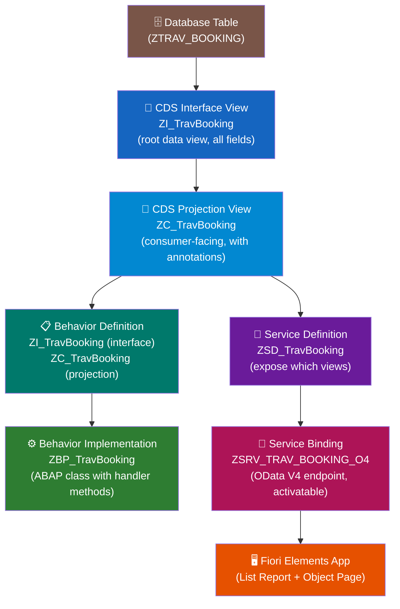
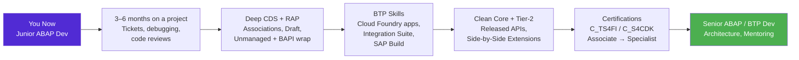

# Chapter 35: RAP — RESTful Application Programming (The Finale)

*The framework that unifies everything you've learned — CDS, OData V4, behavior logic, and Fiori — into a single, coherent, modern development model.*

---

## ☕ We made it

You started this book as a C# or Python developer who could code but felt lost in SAP's vocabulary. You've now built reports, dialog programs, OData CRUD services, a Google Forms integration, a WhatsApp notification service, and a Fiori app. You know `SE11`, `SE37`, `SEGW`, `SICF`, CDS views, and Open SQL.

This chapter is the finale — and it earns that title. RAP (RESTful Application Programming) is not just another technology. It's SAP's answer to the question: *"What would we build if we designed SAP development from scratch today?"* 

The answer is a layered, model-driven, OData V4-first framework where the database, the API, the business logic, and the UI all speak the same language. It's genuinely good engineering. And it's the skill SAP is hiring for right now.

Let's build something real.

---

## 35.1 What RAP Is — and Why It Replaces SEGW

### The problem with the old way

You used SEGW (SAP Gateway Service Builder) in Part VI. It works. But it has problems:

- **Boilerplate explosion.** Creating an OData service required creating entity types, entity sets, associations, mappings, then implementing 20+ handler methods — most of them identical (`MERGE_ENTITY` calls `UPDATE_ENTITY`, etc.).
- **No single source of truth.** The database table, the ABAP structure, the OData entity type, and the UI annotations all lived in different places, maintained separately, drifting apart.
- **No framework-managed persistence.** SEGW left all DB operations to you — `INSERT`, `UPDATE`, `DELETE`, `SELECT` in every method. Duplicate logic everywhere.
- **OData V2 only (natively).** No V4, no draft handling, no deep operations without heroic manual effort.

### What RAP gives you instead

RAP inverts the model. You define **what the data looks like** (CDS views) and **what operations are allowed** (Behavior Definition), and the RAP framework handles:

- All OData V4 exposure (service definition + service binding = done)
- Persistence for managed scenarios (the framework writes the `INSERT`/`UPDATE`/`DELETE`)
- Draft handling (save in progress, discard, activate — built-in)
- Instance authorization, feature control (which fields are editable per record?)
- ETags for optimistic locking
- Deep operations (save a header and items in one call)

> 💡 The analogy: SEGW is like writing a REST API in raw `HttpContext` and writing all your SQL by hand. RAP is like using Entity Framework Core with ASP.NET Core's controller scaffolding — the framework handles the plumbing, you write the business rules.

> 🧭 **On the job:** For any **new** custom application on S/4HANA 1909 or newer / BTP ABAP Environment, use RAP. SEGW-based services are maintained, not extended. Recruiters for S/4HANA Greenfield projects list RAP explicitly. Interviewers will ask: "What's the difference between managed and unmanaged RAP?" — we'll answer that in 35.3.

---

## 35.2 The RAP Stack, Layer by Layer

RAP is a stack of artifacts, each building on the one below. The whole thing looks like this:



| Layer | What it is | Your analogy |
|---|---|---|
| **Database Table** | The DDIC table with persistence fields | SQL table / EF entity class |
| **Interface View** | The "full" CDS view — all fields, no filtering | The domain model / data entity |
| **Projection View** | Consumer-facing CDS — subset of fields + annotations | The DTO / API response shape + Swagger annotations |
| **Behavior Definition** | What operations exist (CRUD, actions, validations) | The `[HttpPost]` / route metadata + validators |
| **Behavior Implementation** | The ABAP class that implements the rules | The Service class / Controller implementation |
| **Service Definition** | Declares which views are exposed | ASP.NET route registration |
| **Service Binding** | The actual OData V4 endpoint, activatable | The published API endpoint |

> 💡 The separation of Interface View and Projection View is intentional. The interface view is your internal data contract — stable, comprehensive. The projection view is what you expose per consumer — potentially different projections for different use cases.

---

## 35.3 Managed vs Unmanaged — the Interview Question

This is the most common RAP interview question. Here's the clear answer:

### Managed scenario

The **RAP framework manages persistence** — it knows how to `INSERT`, `UPDATE`, and `DELETE` your Z-table. You annotate the behavior definition with `managed;` and provide only the logic the framework can't infer (validations, determinations, custom actions).

**Use when:** You're building a greenfield app on a new Z-table. The data model is yours to define.

```abap
" Behavior Definition snippet — managed
managed; " <-- framework handles CRUD persistence

define behavior for ZI_TravBooking alias Booking
  persistent table ztrav_booking
  lock master
  authorization master ( instance )
  etag master LastChangedAt
{
  create;
  update;
  delete;

  field ( readonly ) BookingId, LastChangedAt, CreatedBy;
  field ( mandatory ) CustomerId, FlightDate, FlightPrice;

  determination SetInitialStatus on modify { create; }
  validation    CheckFlightDate  on save    { create; update; }

  action ConfirmBooking result [1] $self;
  action CancelBooking;

  mapping for ztrav_booking corresponding
  {
    BookingId      = booking_id;
    CustomerId     = customer_id;
    FlightDate     = flight_date;
    FlightPrice    = flight_price;
    CurrencyCode   = currency_code;
    Status         = booking_status;
    CreatedBy      = created_by;
    LastChangedAt  = last_changed_at;
  }
}
```

### Unmanaged scenario

**You manage persistence yourself** — typically because you're wrapping existing logic: BAPIs, function modules, complex legacy tables with non-standard keys. The framework calls your methods, but you write the `INSERT`/`UPDATE`/`DELETE` (or the BAPI calls).

**Use when:** You're modernizing a legacy process. You want the OData V4 interface and Fiori Elements UI but the actual save logic must go through existing BAPIs.

```abap
" Behavior Definition snippet — unmanaged
unmanaged; " <-- I handle persistence myself

define behavior for ZI_TravBooking alias Booking
  implementation in class zbp_trav_booking unique
{
  create;
  update;
  delete;
  ...
}
```

```abap
" Behavior Implementation — unmanaged, you implement save( )
METHOD save_modified.
  " The framework collects changes and calls save_modified once.
  " You get tables of entities to create, update, delete.
  
  LOOP AT create-booking INTO DATA(ls_create).
    " Call BAPI or INSERT here
    BAPI_BOOKING_CREATE( ... ).
  ENDLOOP.

  LOOP AT update-booking INTO DATA(ls_update).
    BAPI_BOOKING_CHANGE( ... ).
  ENDLOOP.

  LOOP AT delete-booking INTO DATA(ls_delete).
    BAPI_BOOKING_DELETE( ... ).
  ENDLOOP.
ENDMETHOD.
```

> 🧭 **On the job:** In new S/4HANA projects, managed is the default. Unmanaged is for "RAP-wrap a BAPI" migration projects — very common in brownfield implementations where existing business logic can't be replaced yet but the client wants a modern UI.

---

## 35.4 Build a Full Managed RAP App — Step by Step

We'll build a **Travel Booking** app. Simple enough to fit in a chapter, realistic enough to show all the layers. The app lets you create, view, update, and delete travel bookings.

### Step 1: The Database Table

In ADT or SE11, create `ZTRAV_BOOKING`:

```abap
@EndUserText.label : 'Travel Bookings'
@AbapCatalog.enhancement.category : #NOT_EXTENSIBLE
@AbapCatalog.tableCategory : #TRANSPARENT
@AbapCatalog.deliveryClass : #A
@AbapCatalog.dataMaintenance : #RESTRICTED

define table ztrav_booking {
  key client        : abap.clnt not null;
  key booking_id    : /dmo/booking_id not null;   " or abap.numc(8)
  customer_id       : /dmo/customer_id;
  flight_date       : /dmo/flight_date;
  flight_price      : /dmo/flight_price;
  currency_code     : /dmo/currency_code;
  booking_status    : /dmo/booking_status;        " 'N'=New,'B'=Booked,'X'=Cancelled
  created_by        : syuname;
  last_changed_at   : timestampl;
}
```

> 💡 SAP's ABAP Flight Reference Scenario (`/DMO/` types) is the standard tutorial data model — great for practice. Use it. Real projects use their own domain types from SE11.

### Step 2: CDS Interface View (the "I_" view)

```cds
@AbapCatalog.viewEnhancementCategory: [#NONE]
@AccessControl.authorizationCheck: #CHECK
@EndUserText.label: 'Travel Booking - Interface View'
@Metadata.ignorePropagatedAnnotations: true
@ObjectModel.usageType:{
  serviceQuality: #X,
  sizeCategory: #S,
  dataClass: #MIXED
}

define root view entity ZI_TravBooking
  as select from ztrav_booking
{
  key booking_id      as BookingId,
      customer_id     as CustomerId,
      flight_date     as FlightDate,
      flight_price    as FlightPrice,
      currency_code   as CurrencyCode,
      booking_status  as Status,
      created_by      as CreatedBy,
      last_changed_at as LastChangedAt
}
```

Key annotations:
- `define root view entity` — this is a RAP root node (not a child)
- `@AccessControl.authorizationCheck: #CHECK` — tells the framework to enforce CDS access control (DCL objects). Use `#NOT_REQUIRED` in early dev, switch to `#CHECK` before go-live.

### Step 3: CDS Projection View (the "C_" view)

```cds
@EndUserText.label: 'Travel Booking - Projection View'
@AccessControl.authorizationCheck: #NOT_REQUIRED

@UI.headerInfo: {
  typeName:       'Booking',
  typeNamePlural: 'Bookings',
  title:          { type: #STANDARD, value: 'BookingId' },
  description:    { type: #STANDARD, value: 'CustomerId' }
}

define root view entity ZC_TravBooking
  provider contract transactional_query
  as projection on ZI_TravBooking
{
  @UI.facet: [
    { id: 'BookingInfo', type: #IDENTIFICATION_REFERENCE,
      label: 'Booking Details', position: 10 }
  ]

  @UI.lineItem:        [{ position: 10, importance: #HIGH }]
  @UI.identification:  [{ position: 10 }]
  key BookingId,

  @UI.lineItem:        [{ position: 20, importance: #HIGH }]
  @UI.identification:  [{ position: 20 }]
  @UI.selectionField:  [{ position: 10 }]
  CustomerId,

  @UI.lineItem:        [{ position: 30 }]
  @UI.identification:  [{ position: 30 }]
  FlightDate,

  @Semantics.amount.currencyCode: 'CurrencyCode'
  @UI.lineItem:        [{ position: 40 }]
  @UI.identification:  [{ position: 40 }]
  FlightPrice,

  CurrencyCode,

  @UI.lineItem: [{ position: 50, criticality: 'StatusCriticality',
                   criticalityRepresentation: #WITH_ICON }]
  @UI.identification: [{ position: 50 }]
  @UI.selectionField: [{ position: 20 }]
  Status,

  @UI.hidden: true
  case Status
    when 'N' then 2   " Yellow = New
    when 'B' then 3   " Green  = Booked
    when 'X' then 1   " Red    = Cancelled
    else 0
  end                 as StatusCriticality,

  CreatedBy,
  LastChangedAt
}
```

> ⚠️ **C#/Python gotcha:** The `@UI.*` annotations in the projection view are what drive the Fiori Elements UI — they declare which fields appear in the list (`@UI.lineItem`), the detail form (`@UI.identification`), and the filter bar (`@UI.selectionField`). This is how you control the UI from the back end — no JavaScript needed.

### Step 4: Behavior Definition (Interface level)

Create in ADT: Right-click on `ZI_TravBooking` → New Behavior Definition.

```abap
managed; " Framework handles CRUD persistence

define behavior for ZI_TravBooking alias Booking
  persistent table ztrav_booking
  lock master
  authorization master ( instance )
  etag master LastChangedAt
{
  " ── Standard CRUD operations ──────────────────────────────────────
  create;
  update;
  delete;

  " ── Read-only fields (framework never lets the client change these)
  field ( readonly ) BookingId, CreatedBy, LastChangedAt;
  field ( numbering : managed ) BookingId;  " framework assigns the key

  " ── Mandatory fields (must be non-initial on create) ──────────────
  field ( mandatory ) CustomerId, FlightDate, FlightPrice, CurrencyCode;

  " ── Determinations (auto-compute field values) ────────────────────
  determination SetInitialStatus  on modify { create; }
  determination SetLastChangedAt  on modify { create; update; }

  " ── Validations (reject the save if business rules violated) ──────
  validation CheckFlightDate    on save { create; update; }
  validation CheckCustomerExist on save { create; }

  " ── Custom action (beyond standard CRUD) ─────────────────────────
  action ( features : instance ) ConfirmBooking result [1] $self;
  action ( features : instance ) CancelBooking;

  " ── Mapping: CDS field names ↔ DB column names ────────────────────
  mapping for ztrav_booking corresponding
  {
    BookingId     = booking_id;
    CustomerId    = customer_id;
    FlightDate    = flight_date;
    FlightPrice   = flight_price;
    CurrencyCode  = currency_code;
    Status        = booking_status;
    CreatedBy     = created_by;
    LastChangedAt = last_changed_at;
  }
}
```

### Step 5: Behavior Definition (Projection level)

```abap
projection;

define behavior for ZC_TravBooking alias Booking
{
  use create;
  use update;
  use delete;

  use action ConfirmBooking;
  use action CancelBooking;
}
```

The projection behavior definition is thin — it simply says "expose these operations from the interface behavior." This is where you can restrict what each consumer is allowed to do (e.g., a read-only consumer's projection would have no `use create`).

### Step 6: Behavior Implementation Class

ADT auto-generates the class skeleton when you save the behavior definition. Fill in the methods:

```abap
CLASS zbp_trav_booking DEFINITION PUBLIC ABSTRACT FINAL
  INHERITING FROM cl_abap_behavior_handler.

  PRIVATE SECTION.

    METHODS set_initial_status    FOR DETERMINE ON MODIFY
      IMPORTING keys FOR Booking~SetInitialStatus.

    METHODS set_last_changed_at   FOR DETERMINE ON MODIFY
      IMPORTING keys FOR Booking~SetLastChangedAt.

    METHODS check_flight_date     FOR VALIDATE ON SAVE
      IMPORTING keys FOR Booking~CheckFlightDate.

    METHODS check_customer_exist  FOR VALIDATE ON SAVE
      IMPORTING keys FOR Booking~CheckCustomerExist.

    METHODS confirm_booking       FOR MODIFY
      IMPORTING keys FOR ACTION Booking~ConfirmBooking
                RESULT result.

    METHODS cancel_booking        FOR MODIFY
      IMPORTING keys FOR ACTION Booking~CancelBooking.

    METHODS get_instance_features FOR INSTANCE FEATURES
      IMPORTING keys    REQUEST    requested_features
                RESULT  result.

ENDCLASS.

CLASS zbp_trav_booking IMPLEMENTATION.

  " ── Determination: set Status = 'N' (New) on create ─────────────
  METHOD set_initial_status.
    READ ENTITIES OF zi_travbooking IN LOCAL MODE
      ENTITY Booking
        FIELDS ( Status ) WITH CORRESPONDING #( keys )
      RESULT DATA(lt_bookings).

    " Only set status if empty (freshly created)
    DELETE lt_bookings WHERE Status IS NOT INITIAL.
    CHECK lt_bookings IS NOT INITIAL.

    MODIFY ENTITIES OF zi_travbooking IN LOCAL MODE
      ENTITY Booking
        UPDATE FIELDS ( Status )
          WITH VALUE #( FOR booking IN lt_bookings
                          ( %tky   = booking-%tky
                            Status = 'N' ) ).
  ENDMETHOD.

  " ── Determination: stamp LastChangedAt ───────────────────────────
  METHOD set_last_changed_at.
    DATA(lv_now) = cl_abap_context_info=>get_system_date( ) &&
                   cl_abap_context_info=>get_system_time( ).  " simplification

    GET TIME STAMP FIELD DATA(lv_ts).

    MODIFY ENTITIES OF zi_travbooking IN LOCAL MODE
      ENTITY Booking
        UPDATE FIELDS ( LastChangedAt )
          WITH VALUE #( FOR key IN keys
                          ( %tky         = key-%tky
                            LastChangedAt = lv_ts ) ).
  ENDMETHOD.

  " ── Validation: FlightDate must be in the future ─────────────────
  METHOD check_flight_date.
    READ ENTITIES OF zi_travbooking IN LOCAL MODE
      ENTITY Booking
        FIELDS ( FlightDate ) WITH CORRESPONDING #( keys )
      RESULT DATA(lt_bookings).

    LOOP AT lt_bookings INTO DATA(ls_booking).
      IF ls_booking-FlightDate < cl_abap_context_info=>get_system_date( ).
        APPEND VALUE #(
          %tky        = ls_booking-%tky
          %state_area = 'VALIDATE_FLIGHT_DATE'
        ) TO reported-booking.

        APPEND VALUE #(
          %tky = ls_booking-%tky
        ) TO failed-booking.

        APPEND VALUE #(
          %tky = ls_booking-%tky
          %msg = new_message(
            id      = 'ZTR_BOOKING'
            number  = '001'
            severity = if_abap_behv_message=>severity-error
            v1      = ls_booking-FlightDate )
        ) TO reported-booking.
      ENDIF.
    ENDLOOP.
  ENDMETHOD.

  " ── Validation: Customer must exist in /DMO/CUSTOMER ─────────────
  METHOD check_customer_exist.
    READ ENTITIES OF zi_travbooking IN LOCAL MODE
      ENTITY Booking
        FIELDS ( CustomerId ) WITH CORRESPONDING #( keys )
      RESULT DATA(lt_bookings).

    SELECT customer_id
      FROM /dmo/customer
      FOR ALL ENTRIES IN @lt_bookings
      WHERE customer_id = @lt_bookings-CustomerId
      INTO TABLE @DATA(lt_valid_customers).

    LOOP AT lt_bookings INTO DATA(ls_booking).
      IF NOT line_exists(
            lt_valid_customers[
              table_line = ls_booking-CustomerId ] ).

        APPEND VALUE #( %tky = ls_booking-%tky ) TO failed-booking.
        APPEND VALUE #(
          %tky = ls_booking-%tky
          %msg = new_message_with_text(
            severity = if_abap_behv_message=>severity-error
            text     = |Customer { ls_booking-CustomerId } does not exist| )
        ) TO reported-booking.
      ENDIF.
    ENDLOOP.
  ENDMETHOD.

  " ── Custom Action: ConfirmBooking ────────────────────────────────
  METHOD confirm_booking.
    READ ENTITIES OF zi_travbooking IN LOCAL MODE
      ENTITY Booking
        FIELDS ( Status ) WITH CORRESPONDING #( keys )
      RESULT DATA(lt_bookings).

    " Only confirm if currently 'New'
    DELETE lt_bookings WHERE Status <> 'N'.

    MODIFY ENTITIES OF zi_travbooking IN LOCAL MODE
      ENTITY Booking
        UPDATE FIELDS ( Status )
          WITH VALUE #( FOR b IN lt_bookings
                          ( %tky  = b-%tky
                            Status = 'B' ) )  " 'B' = Booked
      REPORTED DATA(lt_reported).

    APPEND LINES OF lt_reported TO reported.

    " Return the updated entities as action result
    READ ENTITIES OF zi_travbooking IN LOCAL MODE
      ENTITY Booking ALL FIELDS WITH CORRESPONDING #( keys )
      RESULT DATA(lt_result).

    result = VALUE #( FOR b IN lt_result
                        ( %tky   = b-%tky
                          %param = b ) ).
  ENDMETHOD.

  " ── Custom Action: CancelBooking ─────────────────────────────────
  METHOD cancel_booking.
    MODIFY ENTITIES OF zi_travbooking IN LOCAL MODE
      ENTITY Booking
        UPDATE FIELDS ( Status )
          WITH VALUE #( FOR key IN keys
                          ( %tky  = key-%tky
                            Status = 'X' ) ).  " 'X' = Cancelled
  ENDMETHOD.

  " ── Instance Feature Control: disable Confirm if already Booked ──
  METHOD get_instance_features.
    READ ENTITIES OF zi_travbooking IN LOCAL MODE
      ENTITY Booking
        FIELDS ( Status ) WITH CORRESPONDING #( keys )
      RESULT DATA(lt_bookings)
      FAILED failed.

    result = VALUE #(
      FOR ls_booking IN lt_bookings
        LET confirm_feature =
          COND #( WHEN ls_booking-Status = 'N'
                  THEN if_abap_behv=>fc-o-enabled
                  ELSE if_abap_behv=>fc-o-disabled )
            cancel_feature =
          COND #( WHEN ls_booking-Status = 'X'
                  THEN if_abap_behv=>fc-o-disabled
                  ELSE if_abap_behv=>fc-o-enabled )
        IN
          ( %tky                        = ls_booking-%tky
            %action-ConfirmBooking      = confirm_feature
            %action-CancelBooking       = cancel_feature ) ).
  ENDMETHOD.

ENDCLASS.
```

> 💡 `IN LOCAL MODE` is critical. It bypasses authorization and draft handling when called from within the RAP handler — you're reading your own buffer, not hitting the database again. Always use it in determinations and validations.

### Step 7: Service Definition

```abap
@EndUserText.label: 'Travel Booking Service'

define service ZSD_TravBooking {
  expose ZC_TravBooking as Booking;
}
```

### Step 8: Service Binding

In ADT: Right-click on the Service Definition → New Service Binding:
- Name: `ZSRV_TRAV_BOOKING_O4`
- Binding type: **OData V4 — UI** (for Fiori) or **OData V4 — Web API** (for pure REST consumption)

Click **Activate** → Click **Publish**. You now have a live OData V4 endpoint at:
```
/sap/opu/odata4/sap/zsrv_trav_booking_o4/srvd/sap/zsd_travbooking/0001/
```

The `$metadata` document at that URL describes all entity types, actions, and associations — auto-generated from your CDS and behavior definition.

---

## 35.5 OData V4 Live — and a Fiori Elements App on Top

### Test the OData V4 endpoint

From ADT's service binding, click **Preview** (the "play" button next to the entity set). BAS or the ADT built-in preview opens a Fiori Elements list report against your live service.

Or test with curl/Postman:

```http
GET /sap/opu/odata4/sap/zsrv_trav_booking_o4/srvd/sap/zsd_travbooking/0001/Booking
Authorization: Basic ...
Accept: application/json

# Response
{
  "@odata.context": "$metadata#Booking",
  "value": [
    {
      "BookingId": "00000001",
      "CustomerId": "000001",
      "FlightDate": "2025-12-15",
      "FlightPrice": "450.00",
      "CurrencyCode": "EUR",
      "Status": "N",
      "StatusCriticality": 2
    }
  ]
}
```

```http
# Create a booking (OData V4 — no CSRF token needed for some bindings!)
POST /sap/opu/odata4/.../Booking
Content-Type: application/json

{
  "CustomerId": "000001",
  "FlightDate": "2026-03-20",
  "FlightPrice": "320.00",
  "CurrencyCode": "EUR"
}
```

```http
# Trigger the ConfirmBooking action
POST /sap/opu/odata4/.../Booking('00000001')/ConfirmBooking
Content-Type: application/json
{}
```

### Generate the Fiori Elements app

1. In SAP Business Application Studio: **New Project from Template → SAP Fiori Application**.
2. Choose **List Report Object Page**.
3. Connect to your system, select the OData V4 service `ZSRV_TRAV_BOOKING_O4`, entity `Booking`.
4. BAS generates the complete app. Press **Preview** — you get a fully functional list report with filters (from `@UI.selectionField`), list columns (from `@UI.lineItem`), a detail Object Page (from `@UI.identification` and `@UI.facet`), and the **Confirm Booking** and **Cancel Booking** action buttons — all from your annotations.

The connection back to what you've learned:
- CDS views from **Chapter 16** are the foundation of every RAP layer.
- The OData V4 endpoint is everything from **Part VI**, but generated automatically.
- The Fiori Elements app is exactly what **Chapter 34** described — annotations-driven, minimal JS.
- Draft handling (save as draft, resume later) is available with one extra keyword: `with draft table ztrav_booking_d;` in the behavior definition — we'd need another full chapter for that, but now you know where to look.

---

## 35.6 Where to Go Next — Your Roadmap to Senior

You've finished the core curriculum. Here's an honest map of what comes next and how long each phase typically takes.



### The honest skill priority list

**In your first job — focus on these:**

1. **Read and understand existing ABAP code.** Most junior work is maintaining and extending what's there. Be good at reading, not just writing.
2. **Open SQL and performance.** Slow SELECT queries are the most common bug category. Learn `EXPLAIN`, avoid `SELECT *`, understand database indexes.
3. **Debugging.** The ABAP debugger in ADT (breakpoints, watchpoints, object inspection) is your best friend. Get fast at it.
4. **Transport management.** Understand the development → quality → production transport chain (SE09/SE10). Releasing a transport wrong is how you break production.

> 💡 **Read this on day one:** the **[Clean ABAP style guide](https://github.com/SAP/styleguides/blob/main/clean-abap/CleanABAP.md)** (`SAP/styleguides` on GitHub). It's short, free, and it's the checklist your reviewers use. Knowing it makes the difference between "writes code that works" and "writes code the team is happy to maintain" — which is exactly the difference between junior and mid-level. See [Chapter 11.6](11-abap-oop.md) for the highlights.

**After 6 months — add these:**

5. **RAP + CDS annotations.** You've started here. Go deeper: associations, draft, authorization objects with `@AccessControl`.
6. **BTP basics.** SAP Business Technology Platform is the future. Create a free BTP trial account. Build one thing on it — an Integration Suite iFlow, a BTP ABAP Environment service, or a CAP application.
7. **Clean Core.** Understand the concept: don't modify SAP standard objects, extend instead. Released APIs (marked `@Released`) are the clean-core-compliant way to call SAP functionality from extensions.

**After 18 months — these make you senior:**

8. **Architecture.** When to use RAP vs. CAP (Cloud Application Programming model — SAP's Node.js/Java framework for BTP). When to extend on-stack vs. side-by-side.
9. **Integration Suite.** OData, REST, SOAP, IDoc — all mediated by SAP Integration Suite on BTP. Understanding this makes you valuable for enterprise integration projects.
10. **Mentoring and code review.** The move from "I can build this" to "I can teach someone else to build this" is the transition to senior.

### Certifications worth the investment

| Certification | Level | Focus |
|---|---|---|
| `C_TS4FI_2023` | Associate | SAP S/4HANA for Financial Accounting |
| `C_TS4CO_2023` | Associate | S/4HANA Controlling |
| `C_S4CDK_2023` | Associate | SAP S/4HANA Cloud, **developer** edition |
| `C_BTP200` | Associate | SAP BTP |
| `P_S4FIN_2023` | Professional | S/4HANA Finance |

> 🧭 **On the job:** The `C_S4CDK` (developer) and `C_BTP200` are the two to target first if your focus is technical. Functional module certs (`C_TS4FI`, `C_TS4CO`) are valuable if you're working on FI/CO functional configuration alongside your ABAP work.

### Practice systems — keep one running

| Option | Best for |
|---|---|
| **SAP BTP ABAP Trial** | RAP, CDS, clean core — the future-facing stack |
| **ABAP Platform Developer Edition (Docker)** | Full classic stack on your laptop |
| **SAP CAP on BTP** | Learning the Node.js/Java equivalent of RAP for BTP |
| **SAP Discovery Center** | Guided hands-on missions with free BTP credits |

> ☕ A word from the author: The developers I've seen advance fastest are the ones who build things in their own time — not tutorial repetitions, but real small projects. A Google Form integration that actually saves data. A WhatsApp notification that actually fires. A RAP app that actually solves a problem they have. You've just built all three. That's the foundation. Keep building.

---

## 🧠 The Final Recap

Across 35 chapters, here's what you've assembled:

| Skill | Chapters | SAP equivalent of... |
|---|---|---|
| ABAP syntax + modern expressions | 06–07 | C# / Python syntax |
| DDIC tables + structures | 05 | SQL schema + EF entities |
| Reports + ALV | 08 | Console apps + data grids |
| ABAP OOP | 11 | C# classes + interfaces |
| RFC + BAPI | 12–13 | Remote procedure calls + SDK methods |
| CDS Views | 16 | LINQ queries + view models |
| OData (SEGW) | 18–31 | ASP.NET Web API (the old way) |
| Google Forms integration | 32 | Webhook receiver + REST client |
| WhatsApp integration | 33 | Outbound HTTP client + webhook handler |
| Fiori / UI5 | 34 | React/Angular + Material Design |
| RAP | 35 | EF Core + ASP.NET Core scaffolding (the modern way) |

You are no longer a C# or Python developer who doesn't understand SAP. You're an ABAP developer who happens to speak C# and Python too — and that combination is genuinely rare and genuinely valuable.

Go build something. Land the job. And come back when you're the senior explaining RAP to the next newcomer.

---

*[← Contents](../content.md) | [← Previous: Fiori & UI5 for ABAP Developers](34-fiori.md) | [Next: Appendix A — C# / Python ↔ ABAP Cheat Sheet →](appendix-a-csharp-abap-cheatsheet.md)*
