# The Complete SAP Modern Development Handbook
## ABAP | RAP | CAP | BTP - A Unified Reference

---

# Table of Contents

1. [Introduction](#chapter-1-introduction)
2. [Foundation: Core Concepts](#chapter-2-foundation-core-concepts)
3. [ABAP Fundamentals](#chapter-3-abap-fundamentals)
4. [CDS Views Deep Dive](#chapter-4-cds-views-deep-dive)
5. [AMDP & HANA Optimization](#chapter-5-amdp--hana-optimization)
6. [RAP: RESTful Application Programming](#chapter-6-rap-restful-application-programming)
7. [CAP: Cloud Application Programming](#chapter-7-cap-cloud-application-programming)
8. [SAP BTP Architecture](#chapter-8-sap-btp-architecture)
9. [Integration Patterns](#chapter-9-integration-patterns)
10. [Testing Strategies](#chapter-10-testing-strategies)
11. [DevOps & CI/CD](#chapter-11-devops--cicd)
12. [Security Best Practices](#chapter-12-security-best-practices)
13. [Performance Optimization](#chapter-13-performance-optimization)
14. [Real-World Scenarios](#chapter-14-real-world-scenarios)
15. [Quick Reference Cards](#chapter-15-quick-reference-cards)

---

# Chapter 1: Introduction

## 1.1 Purpose of This Handbook

This handbook serves as a comprehensive reference for SAP developers transitioning from classical ABAP to modern cloud-native development. It bridges the gap between:

- **Traditional ABAP** (Reports, Function Modules, Dynpros)
- **Modern ABAP** (CDS, AMDP, Classes)
- **RAP** (RESTful Application Programming on ABAP)
- **CAP** (Cloud Application Programming on Node.js/Java)
- **BTP** (Business Technology Platform services)

## 1.2 The Evolution of SAP Development

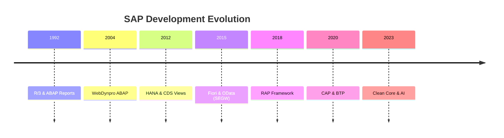

## 1.3 The "Clean Core" Philosophy

**Definition:** Keep the S/4HANA standard code unmodified to enable seamless cloud updates.

**The Three Pillars:**

| Pillar | Description | Technology |
|--------|-------------|------------|
| **Extend** | Add custom fields, logic | Key User Tools, RAP |
| **Integrate** | Connect external systems | Integration Suite, APIs |
| **Innovate** | Build new applications | BTP, CAP, AI Core |

---

# Chapter 2: Foundation - Core Concepts

## 2.1 The Modern SAP Architecture

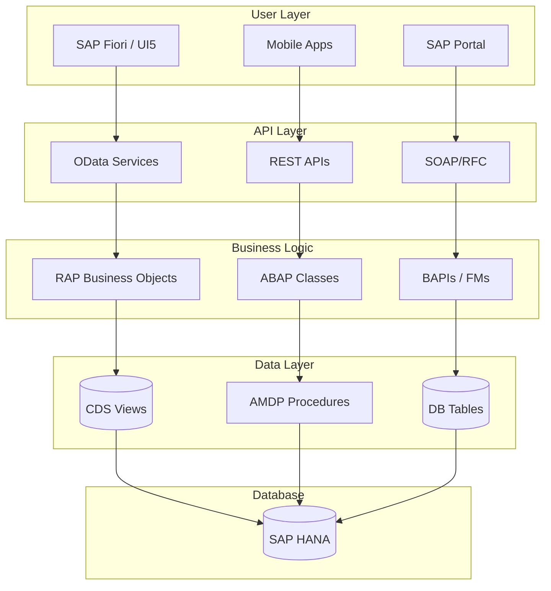

## 2.2 Key Terminology

| Term | Full Name | Purpose |
|------|-----------|---------|
| **CDS** | Core Data Services | Semantic data modeling |
| **RAP** | RESTful Application Programming | Fiori app backend framework |
| **CAP** | Cloud Application Programming | Cloud-native app framework |
| **BTP** | Business Technology Platform | SAP's cloud platform |
| **EML** | Entity Manipulation Language | RAP entity operations |
| **SADL** | Service Adaptation Description Language | OData runtime |
| **VDM** | Virtual Data Model | Layered CDS architecture |

## 2.3 When to Use What?

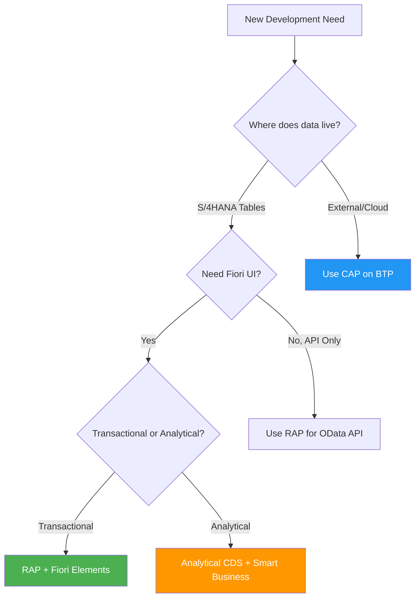

---

# Chapter 3: ABAP Fundamentals

## 3.1 Modern ABAP Syntax

### 3.1.1 Inline Declarations

```abap
" Old Style
DATA: lt_orders TYPE TABLE OF vbak,
      ls_order  TYPE vbak,
      lv_count  TYPE i.

SELECT * FROM vbak INTO TABLE lt_orders.
lv_count = lines( lt_orders ).

" Modern Style
SELECT * FROM vbak INTO TABLE @DATA(lt_orders).
DATA(lv_count) = lines( lt_orders ).
```

### 3.1.2 Constructor Expressions

```abap
" VALUE - Create structures/tables inline
DATA(ls_order) = VALUE vbak( vbeln = '100' erdat = sy-datum ).

DATA(lt_items) = VALUE tt_items(
  ( posnr = '10' matnr = 'MAT001' )
  ( posnr = '20' matnr = 'MAT002' )
).

" CORRESPONDING - Map between structures
DATA(ls_target) = CORRESPONDING ty_target( ls_source ).

" FILTER - Filter internal tables
DATA(lt_open) = FILTER #( lt_orders WHERE status = 'OPEN' ).

" REDUCE - Aggregate values
DATA(lv_total) = REDUCE decfloat34(
  INIT sum = 0
  FOR wa IN lt_items
  NEXT sum = sum + wa-amount
).
```

### 3.1.3 Iteration Expressions

```abap
" FOR - Table iteration
DATA(lt_names) = VALUE string_table(
  FOR wa IN lt_customers
  ( wa-name )
).

" COND - Conditional assignment
DATA(lv_status_text) = COND string(
  WHEN lv_status = 'A' THEN 'Active'
  WHEN lv_status = 'I' THEN 'Inactive'
  ELSE 'Unknown'
).

" SWITCH - Value mapping
DATA(lv_priority) = SWITCH i(
  lv_type
  WHEN 'URGENT' THEN 1
  WHEN 'HIGH'   THEN 2
  WHEN 'MEDIUM' THEN 3
  ELSE 4
).
```

## 3.2 Object-Oriented ABAP

### 3.2.1 Class Structure

```abap
CLASS zcl_order_service DEFINITION
  PUBLIC
  FINAL
  CREATE PUBLIC.

  PUBLIC SECTION.
    TYPES:
      BEGIN OF ty_order_result,
        order_id TYPE vbeln,
        status   TYPE char1,
        message  TYPE string,
      END OF ty_order_result.

    METHODS:
      constructor
        IMPORTING io_logger TYPE REF TO zif_logger OPTIONAL,
      
      create_order
        IMPORTING is_header TYPE ty_order_header
                  it_items  TYPE tt_order_items
        RETURNING VALUE(rs_result) TYPE ty_order_result,
      
      get_order_details
        IMPORTING iv_order_id TYPE vbeln
        RETURNING VALUE(rs_order) TYPE ty_order_full.

  PROTECTED SECTION.
    DATA: mo_logger TYPE REF TO zif_logger.

  PRIVATE SECTION.
    METHODS:
      validate_header
        IMPORTING is_header TYPE ty_order_header
        RETURNING VALUE(rv_valid) TYPE abap_bool,
      
      calculate_totals
        CHANGING cs_order TYPE ty_order_full.
ENDCLASS.

CLASS zcl_order_service IMPLEMENTATION.
  METHOD constructor.
    mo_logger = COND #(
      WHEN io_logger IS BOUND THEN io_logger
      ELSE NEW zcl_default_logger( )
    ).
  ENDMETHOD.

  METHOD create_order.
    " Implementation
  ENDMETHOD.
ENDCLASS.
```

### 3.2.2 Interface-Based Design

```abap
INTERFACE zif_data_provider.
  METHODS:
    get_customers
      IMPORTING iv_country TYPE land1
      RETURNING VALUE(rt_customers) TYPE tt_customers,
    
    get_products
      IMPORTING iv_category TYPE char10
      RETURNING VALUE(rt_products) TYPE tt_products.
ENDINTERFACE.

" Production Implementation
CLASS zcl_sap_data_provider DEFINITION.
  PUBLIC SECTION.
    INTERFACES zif_data_provider.
ENDCLASS.

" Test Mock Implementation
CLASS zcl_mock_data_provider DEFINITION FOR TESTING.
  PUBLIC SECTION.
    INTERFACES zif_data_provider.
    DATA: mt_mock_customers TYPE tt_customers.
ENDCLASS.
```

## 3.3 Exception Handling

### 3.3.1 Class-Based Exceptions

```abap
CLASS zcx_order_error DEFINITION
  INHERITING FROM cx_static_check
  FINAL
  CREATE PUBLIC.

  PUBLIC SECTION.
    INTERFACES if_t100_message.
    
    CONSTANTS:
      BEGIN OF invalid_customer,
        msgid TYPE symsgid VALUE 'ZORDER',
        msgno TYPE symsgno VALUE '001',
        attr1 TYPE scx_attrname VALUE 'MV_CUSTOMER',
        attr2 TYPE scx_attrname VALUE '',
        attr3 TYPE scx_attrname VALUE '',
        attr4 TYPE scx_attrname VALUE '',
      END OF invalid_customer.

    DATA: mv_customer TYPE kunnr READ-ONLY.

    METHODS constructor
      IMPORTING
        textid    LIKE if_t100_message=>t100key OPTIONAL
        previous  TYPE REF TO cx_root OPTIONAL
        iv_customer TYPE kunnr OPTIONAL.
ENDCLASS.

" Usage
METHOD create_order.
  IF NOT validate_customer( is_header-kunnr ).
    RAISE EXCEPTION TYPE zcx_order_error
      EXPORTING
        textid      = zcx_order_error=>invalid_customer
        iv_customer = is_header-kunnr.
  ENDIF.
ENDMETHOD.

" Catching
TRY.
    mo_service->create_order( is_header = ls_header ).
  CATCH zcx_order_error INTO DATA(lx_error).
    DATA(lv_message) = lx_error->get_text( ).
    " Handle gracefully
ENDTRY.
```

---

# Chapter 4: CDS Views Deep Dive

## 4.1 CDS View Types (VDM)

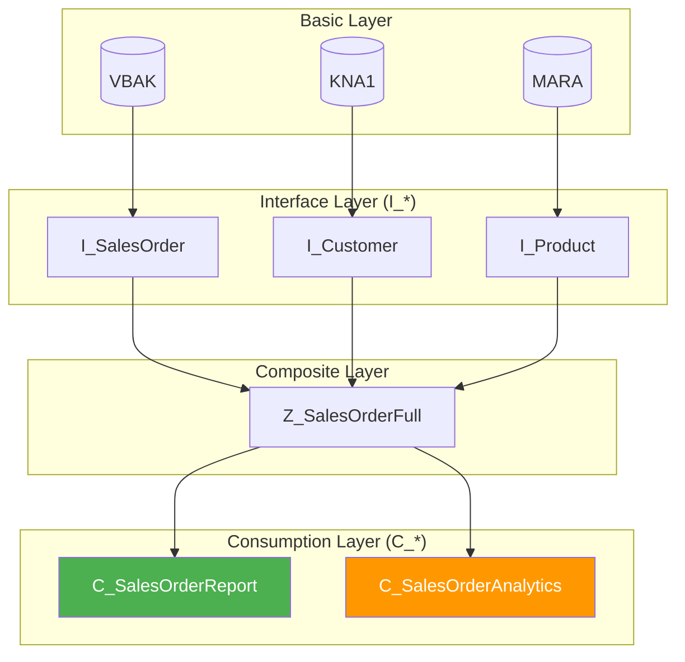

## 4.2 Basic CDS View

```abap
@AbapCatalog.sqlViewName: 'ZV_CUSTOMER'
@AbapCatalog.compiler.compareFilter: true
@AbapCatalog.preserveKey: true
@AccessControl.authorizationCheck: #CHECK
@EndUserText.label: 'Customer Master View'
@VDM.viewType: #BASIC

define view Z_I_Customer
  as select from kna1
  association [0..1] to I_Country as _Country on $projection.Country = _Country.Country
{
  key kunnr as CustomerNumber,
      name1 as CustomerName,
      land1 as Country,
      ort01 as City,
      
      // Expose association for lazy loading
      _Country
}
```

## 4.3 Composite View with Joins

```abap
@AbapCatalog.sqlViewName: 'ZV_SALESFULL'
@EndUserText.label: 'Sales Order with Customer and Items'
@VDM.viewType: #COMPOSITE

define view Z_C_SalesOrderFull
  as select from vbak as Header
  
  // Inner join - must have items
  inner join vbap as Item
    on Header.vbeln = Item.vbeln
  
  // Left join - customer may not exist
  left outer join kna1 as Customer
    on Header.kunnr = Customer.kunnr
    
  // Association for on-demand loading
  association [1] to I_Currency as _Currency
    on $projection.Currency = _Currency.Currency
{
  key Header.vbeln as SalesOrder,
  key Item.posnr   as ItemNumber,
  
  // Header fields
  Header.erdat     as CreationDate,
  Header.kunnr     as CustomerNumber,
  Header.waerk     as Currency,
  
  // Customer fields (from left join)
  Customer.name1   as CustomerName,
  
  // Item fields
  Item.matnr       as Material,
  Item.kwmeng      as Quantity,
  Item.netwr       as NetValue,
  
  // Calculated field
  @Semantics.amount.currencyCode: 'Currency'
  cast( Item.netwr * Item.kwmeng as abap.dec(15,2) ) as TotalValue,
  
  // Association
  _Currency
}
```

## 4.4 CDS with Parameters

```abap
@AbapCatalog.sqlViewName: 'ZV_ORDBYDATE'
@EndUserText.label: 'Orders by Date Range'

define view Z_Orders_By_Date
  with parameters
    p_date_from : abap.dats,
    p_date_to   : abap.dats
  as select from vbak
{
  key vbeln as SalesOrder,
      erdat as CreationDate,
      netwr as NetValue
}
where erdat between $parameters.p_date_from and $parameters.p_date_to
```

**Usage in ABAP:**
```abap
SELECT * FROM z_orders_by_date( p_date_from = '20240101', p_date_to = '20241231' )
  INTO TABLE @DATA(lt_orders).
```

## 4.5 Analytical CDS Views

```abap
@AbapCatalog.sqlViewName: 'ZV_SALES_CUBE'
@Analytics.dataCategory: #CUBE
@VDM.viewType: #CONSUMPTION

define view Z_SalesAnalytics
  as select from vbak as Header
  inner join vbap as Item on Header.vbeln = Item.vbeln
{
  // Dimensions
  @AnalyticsDetails.query.axis: #ROWS
  Header.vkorg as SalesOrg,
  
  @AnalyticsDetails.query.axis: #ROWS
  Header.kunnr as Customer,
  
  @AnalyticsDetails.query.axis: #COLUMNS
  @Semantics.calendar.year: true
  substring( cast( Header.erdat as abap.char(8) ), 1, 4 ) as Year,
  
  // Measures
  @DefaultAggregation: #SUM
  @Semantics.amount.currencyCode: 'Currency'
  Item.netwr as Revenue,
  
  @DefaultAggregation: #COUNT
  cast( 1 as abap.int4 ) as OrderCount,
  
  Header.waerk as Currency
}
```

## 4.6 UI Annotations for Fiori

```abap
@UI.headerInfo: {
  typeName: 'Sales Order',
  typeNamePlural: 'Sales Orders',
  title: { value: 'SalesOrder' },
  description: { value: 'CustomerName' }
}

define view C_SalesOrderUI
  as select from Z_C_SalesOrderFull
{
  @UI.facet: [{
    id: 'GeneralInfo',
    type: #COLLECTION,
    label: 'General Information',
    position: 10
  }]
  
  @UI: {
    lineItem: [{ position: 10, importance: #HIGH }],
    selectionField: [{ position: 10 }],
    identification: [{ position: 10 }]
  }
  key SalesOrder,
  
  @UI: {
    lineItem: [{ position: 20 }],
    selectionField: [{ position: 20 }]
  }
  CustomerNumber,
  
  @UI.lineItem: [{ position: 30 }]
  CustomerName,
  
  @UI: {
    lineItem: [{ position: 40, criticality: 'StatusCriticality' }]
  }
  Status,
  
  // Hidden field for criticality
  @UI.hidden: true
  case Status
    when 'OPEN' then 2  " Yellow
    when 'COMPLETE' then 3  " Green
    when 'CANCELLED' then 1  " Red
    else 0
  end as StatusCriticality,
  
  @UI.lineItem: [{ position: 50 }]
  @Semantics.amount.currencyCode: 'Currency'
  TotalValue,
  
  Currency
}
```

---

# Chapter 5: AMDP & HANA Optimization

## 5.1 When to Use AMDP

| Use Case | AMDP? | Reason |
|----------|-------|--------|
| Simple SELECT with WHERE | ❌ | CDS or Open SQL is sufficient |
| Complex JOIN across 10+ tables | ⚠️ | Consider, but CDS may work |
| Recursive hierarchy traversal | ✅ | HANA excels at this |
| Window functions (RANK, LAG) | ✅ | Not available in CDS |
| Fuzzy text search | ✅ | HANA-specific feature |
| Geospatial calculations | ✅ | HANA-specific feature |

## 5.2 AMDP Class Structure

```abap
CLASS zcl_hierarchy_amdp DEFINITION
  PUBLIC FINAL CREATE PUBLIC.

  PUBLIC SECTION.
    INTERFACES if_amdp_marker_hdb.  " Marks class as AMDP

    TYPES:
      BEGIN OF ty_node,
        node_id     TYPE char10,
        parent_id   TYPE char10,
        node_name   TYPE char50,
        level       TYPE int4,
      END OF ty_node,
      tt_nodes TYPE STANDARD TABLE OF ty_node WITH EMPTY KEY.

    CLASS-METHODS get_hierarchy
      IMPORTING VALUE(iv_root_id) TYPE char10
      EXPORTING VALUE(et_nodes)   TYPE tt_nodes.

    CLASS-METHODS get_aggregated_sales
      IMPORTING VALUE(iv_year) TYPE gjahr
      EXPORTING VALUE(et_sales) TYPE tt_sales_agg.

ENDCLASS.

CLASS zcl_hierarchy_amdp IMPLEMENTATION.

  METHOD get_hierarchy BY DATABASE PROCEDURE
                        FOR HDB
                        LANGUAGE SQLSCRIPT
                        OPTIONS READ-ONLY
                        USING ztree_nodes.

    -- Recursive CTE pattern
    et_nodes = SELECT
      node_id,
      parent_id,
      node_name,
      0 as level
    FROM ztree_nodes
    WHERE node_id = :iv_root_id

    UNION ALL

    SELECT
      child.node_id,
      child.parent_id,
      child.node_name,
      parent.level + 1 as level
    FROM ztree_nodes AS child
    INNER JOIN :et_nodes AS parent
      ON child.parent_id = parent.node_id
    WHERE parent.level < 50;  -- Prevent infinite loop

  ENDMETHOD.

  METHOD get_aggregated_sales BY DATABASE PROCEDURE
                              FOR HDB
                              LANGUAGE SQLSCRIPT
                              OPTIONS READ-ONLY
                              USING vbak vbap.

    et_sales = SELECT
      h.vkorg as sales_org,
      h.kunnr as customer,
      SUM(i.netwr) as total_revenue,
      COUNT(DISTINCT h.vbeln) as order_count,
      -- Window function: Rank by revenue
      RANK() OVER (PARTITION BY h.vkorg ORDER BY SUM(i.netwr) DESC) as revenue_rank
    FROM vbak AS h
    INNER JOIN vbap AS i ON h.vbeln = i.vbeln
    WHERE SUBSTRING(h.erdat, 1, 4) = :iv_year
    GROUP BY h.vkorg, h.kunnr;

  ENDMETHOD.

ENDCLASS.
```

## 5.3 AMDP with Table Functions

```abap
" CDS Table Function Definition
@EndUserText.label: 'Hierarchy via AMDP'
define table function ZTF_Hierarchy
  with parameters p_root : abap.char(10)
  returns {
    node_id   : abap.char(10);
    parent_id : abap.char(10);
    node_name : abap.char(50);
    level     : abap.int4;
  }
  implemented by method zcl_hierarchy_amdp=>get_hierarchy_tf;
```

```abap
" AMDP Implementation
METHOD get_hierarchy_tf BY DATABASE FUNCTION
                        FOR HDB
                        LANGUAGE SQLSCRIPT
                        OPTIONS READ-ONLY
                        USING ztree_nodes.

  RETURN SELECT ... FROM ztree_nodes ...;

ENDMETHOD.
```

---

# Chapter 6: RAP - RESTful Application Programming

## 6.1 RAP Architecture Overview

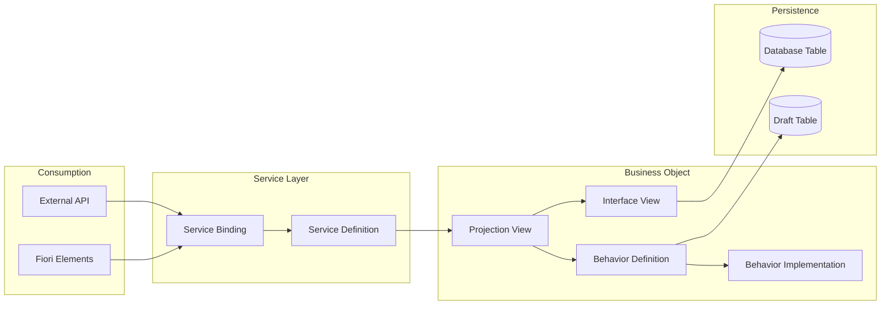

## 6.2 RAP Development Artifacts

### 6.2.1 Database Table

```abap
@EndUserText.label : 'Travel Bookings'
@AbapCatalog.enhancement.category : #NOT_EXTENSIBLE
define table ztravel {
  key client      : abap.clnt not null;
  key travel_uuid : sysuuid_x16 not null;
  travel_id       : /dmo/travel_id;
  agency_id       : /dmo/agency_id;
  customer_id     : /dmo/customer_id;
  begin_date      : /dmo/begin_date;
  end_date        : /dmo/end_date;
  booking_fee     : /dmo/booking_fee;
  total_price     : /dmo/total_price;
  currency_code   : /dmo/currency_code;
  description     : /dmo/description;
  overall_status  : /dmo/overall_status;
  created_by      : abp_creation_user;
  created_at      : abp_creation_tstmpl;
  last_changed_by : abp_lastchange_user;
  last_changed_at : abp_lastchange_tstmpl;
  local_last_changed_at : abp_locinst_lastchange_tstmpl;
}
```

### 6.2.2 Interface View (Root Entity)

```abap
@AccessControl.authorizationCheck: #CHECK
@EndUserText.label: 'Travel - Root Entity'
define root view entity ZI_Travel
  as select from ztravel
  composition [0..*] of ZI_Booking as _Booking
  association [0..1] to /DMO/I_Agency as _Agency
    on $projection.AgencyID = _Agency.AgencyID
{
  key travel_uuid as TravelUUID,
  travel_id       as TravelID,
  agency_id       as AgencyID,
  customer_id     as CustomerID,
  begin_date      as BeginDate,
  end_date        as EndDate,

  @Semantics.amount.currencyCode: 'CurrencyCode'
  booking_fee     as BookingFee,

  @Semantics.amount.currencyCode: 'CurrencyCode'
  total_price     as TotalPrice,

  currency_code   as CurrencyCode,
  description     as Description,
  overall_status  as OverallStatus,

  // Admin fields
  @Semantics.user.createdBy: true
  created_by      as CreatedBy,
  @Semantics.systemDateTime.createdAt: true
  created_at      as CreatedAt,
  @Semantics.user.lastChangedBy: true
  last_changed_by as LastChangedBy,
  @Semantics.systemDateTime.lastChangedAt: true
  last_changed_at as LastChangedAt,
  @Semantics.systemDateTime.localInstanceLastChangedAt: true
  local_last_changed_at as LocalLastChangedAt,

  // Associations
  _Booking,
  _Agency
}
```

### 6.2.3 Behavior Definition

```abap
managed implementation in class zbp_i_travel unique;
strict ( 2 );
with draft;

define behavior for ZI_Travel alias Travel
persistent table ztravel
draft table ztravel_d
etag master LocalLastChangedAt
lock master total etag LastChangedAt
authorization master ( global )
{
  // Standard Operations
  create;
  update;
  delete;

  // Field Controls
  field ( readonly ) TravelUUID, TravelID, CreatedBy, CreatedAt, LastChangedBy, LastChangedAt;
  field ( mandatory ) AgencyID, CustomerID, BeginDate, EndDate;

  // Determinations
  determination calculateTotalPrice on modify { field BookingFee; }
  determination setTravelID on save { create; }

  // Validations
  validation validateCustomer on save { field CustomerID; }
  validation validateDates on save { field BeginDate, EndDate; }

  // Actions
  action ( features : instance ) acceptTravel result [1] $self;
  action ( features : instance ) rejectTravel result [1] $self;
  static action createFromTemplate parameter ZA_TravelTemplate result [1] $self;

  // Draft Actions (standard)
  draft action Edit;
  draft action Activate optimized;
  draft action Discard;
  draft action Resume;
  draft determine action Prepare;

  // Associations
  association _Booking { create; with draft; }

  // Mapping
  mapping for ztravel
  {
    TravelUUID = travel_uuid;
    TravelID = travel_id;
    AgencyID = agency_id;
    // ... other mappings
  }
}

define behavior for ZI_Booking alias Booking
persistent table zbooking
draft table zbooking_d
etag master LocalLastChangedAt
lock dependent by _Travel
authorization dependent by _Travel
{
  update;
  delete;

  field ( readonly ) TravelUUID, BookingUUID;
  
  determination calculateFlightPrice on modify { field FlightDate, ConnectionID; }
  
  association _Travel { with draft; }
}
```

### 6.2.4 Behavior Implementation

```abap
CLASS lhc_travel DEFINITION INHERITING FROM cl_abap_behavior_handler.
  PRIVATE SECTION.
    METHODS:
      get_global_authorizations FOR GLOBAL AUTHORIZATION
        IMPORTING REQUEST requested_authorizations FOR Travel
        RESULT result,

      acceptTravel FOR MODIFY
        IMPORTING keys FOR ACTION Travel~acceptTravel
        RESULT result,

      rejectTravel FOR MODIFY
        IMPORTING keys FOR ACTION Travel~rejectTravel
        RESULT result,

      calculateTotalPrice FOR DETERMINE ON MODIFY
        IMPORTING keys FOR Travel~calculateTotalPrice,

      setTravelID FOR DETERMINE ON SAVE
        IMPORTING keys FOR Travel~setTravelID,

      validateCustomer FOR VALIDATE ON SAVE
        IMPORTING keys FOR Travel~validateCustomer,

      validateDates FOR VALIDATE ON SAVE
        IMPORTING keys FOR Travel~validateDates.
ENDCLASS.

CLASS lhc_travel IMPLEMENTATION.

  METHOD get_global_authorizations.
    " Check if user can create/update
  ENDMETHOD.

  METHOD acceptTravel.
    " Read current state
    READ ENTITIES OF ZI_Travel IN LOCAL MODE
      ENTITY Travel
        FIELDS ( OverallStatus )
        WITH CORRESPONDING #( keys )
      RESULT DATA(lt_travels).

    " Modify status
    MODIFY ENTITIES OF ZI_Travel IN LOCAL MODE
      ENTITY Travel
        UPDATE FIELDS ( OverallStatus )
        WITH VALUE #( FOR travel IN lt_travels
          ( %tky = travel-%tky
            OverallStatus = 'A' ) )  " Accepted
      FAILED failed
      REPORTED reported.

    " Return result
    READ ENTITIES OF ZI_Travel IN LOCAL MODE
      ENTITY Travel
        ALL FIELDS
        WITH CORRESPONDING #( keys )
      RESULT DATA(lt_result).

    result = VALUE #( FOR travel IN lt_result
      ( %tky = travel-%tky
        %param = travel ) ).
  ENDMETHOD.

  METHOD validateDates.
    READ ENTITIES OF ZI_Travel IN LOCAL MODE
      ENTITY Travel
        FIELDS ( BeginDate EndDate )
        WITH CORRESPONDING #( keys )
      RESULT DATA(lt_travels).

    LOOP AT lt_travels INTO DATA(ls_travel).
      IF ls_travel-EndDate < ls_travel-BeginDate.
        APPEND VALUE #(
          %tky = ls_travel-%tky
          %element-EndDate = if_abap_behv=>mk-on
        ) TO failed-travel.

        APPEND VALUE #(
          %tky = ls_travel-%tky
          %element-EndDate = if_abap_behv=>mk-on
          %msg = NEW zcm_travel(
            severity = if_abap_behv_message=>severity-error
            textid = zcm_travel=>end_date_before_begin )
        ) TO reported-travel.
      ENDIF.
    ENDLOOP.
  ENDMETHOD.

  " ... other method implementations

ENDCLASS.
```

---

*Continued in next sections...*

---

# Chapter 7: CAP - Cloud Application Programming

## 7.1 CAP Overview

CAP is SAP's framework for building cloud applications using **Node.js** or **Java**. It uses CDS (similar to ABAP CDS but different runtime) for data modeling.

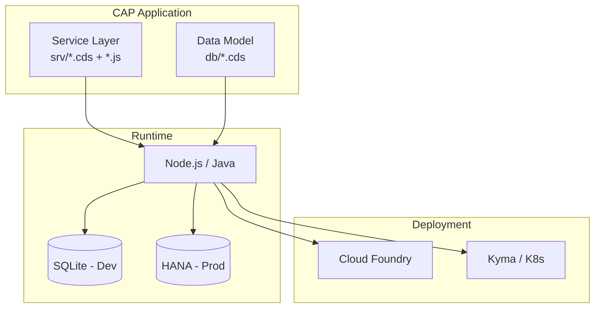

## 7.2 CAP Project Structure

```
my-cap-project/
├── app/                    # UI applications
│   └── fiori/
├── db/                     # Data models
│   ├── schema.cds          # Entity definitions
│   └── data/               # CSV seed data
├── srv/                    # Services
│   ├── service.cds         # Service definition
│   └── service.js          # Custom handlers
├── package.json
└── .cdsrc.json             # CDS configuration
```

## 7.3 CAP Data Model (db/schema.cds)

```cds
namespace my.bookshop;

using { Currency, managed, cuid } from '@sap/cds/common';

entity Books : cuid, managed {
  title       : localized String(111);
  descr       : localized String(1111);
  author      : Association to Authors;
  genre       : Association to Genres;
  stock       : Integer;
  price       : Decimal(9,2);
  currency    : Currency;
}

entity Authors : cuid, managed {
  name        : String(111);
  dateOfBirth : Date;
  dateOfDeath : Date;
  books       : Association to many Books on books.author = $self;
}

entity Genres : sap.common.CodeList {
  key ID      : Integer;
  parent      : Association to Genres;
  children    : Composition of many Genres on children.parent = $self;
}

entity Orders : cuid, managed {
  OrderNo     : String @title:'Order Number';
  Items       : Composition of many OrderItems on Items.parent = $self;
  total       : Decimal(9,2) @readonly;
  currency    : Currency;
}

entity OrderItems : cuid {
  parent      : Association to Orders;
  book        : Association to Books;
  quantity    : Integer;
  netAmount   : Decimal(9,2);
}
```

## 7.4 CAP Service Definition (srv/service.cds)

```cds
using my.bookshop from '../db/schema';

service CatalogService @(path:'/browse') {

  @readonly
  entity Books as projection on bookshop.Books {
    *,
    author.name as authorName
  } excluding { createdBy, modifiedBy };

  @requires: 'authenticated-user'
  entity Orders as projection on bookshop.Orders;

  // Unbound action
  action submitOrder (book: Books:ID, quantity: Integer) returns Orders;

  // Bound action
  action Books.addReview (rating: Integer, text: String);

  // Function
  function getTopSellers() returns array of Books;
}

// Admin service with full CRUD
@requires: 'admin'
service AdminService {
  entity Books as projection on bookshop.Books;
  entity Authors as projection on bookshop.Authors;
}
```

## 7.5 CAP Custom Handlers (srv/service.js)

```javascript
const cds = require('@sap/cds');

module.exports = cds.service.impl(async function() {

  const { Books, Orders, OrderItems } = this.entities;

  // Before CREATE handler
  this.before('CREATE', 'Orders', async (req) => {
    const { Items } = req.data;
    
    // Calculate totals
    let total = 0;
    for (const item of Items) {
      const book = await SELECT.one.from(Books).where({ ID: item.book_ID });
      item.netAmount = book.price * item.quantity;
      total += item.netAmount;
    }
    req.data.total = total;
  });

  // After READ handler
  this.after('READ', 'Books', (books) => {
    for (const book of books) {
      if (book.stock < 10) {
        book.stockWarning = 'Low Stock!';
      }
    }
  });

  // Custom action implementation
  this.on('submitOrder', async (req) => {
    const { book, quantity } = req.data;
    
    // Check stock
    const bookData = await SELECT.one.from(Books).where({ ID: book });
    if (bookData.stock < quantity) {
      return req.error(400, `Not enough stock. Available: ${bookData.stock}`);
    }

    // Create order
    const order = await INSERT.into(Orders).entries({
      Items: [{ book_ID: book, quantity: quantity }]
    });

    // Reduce stock
    await UPDATE(Books).set({ stock: { '-=': quantity } }).where({ ID: book });

    return order;
  });

  // Validation handler
  this.before('UPDATE', 'Books', (req) => {
    if (req.data.price < 0) {
      return req.error(400, 'Price cannot be negative');
    }
  });

});
```

## 7.6 CAP vs RAP Comparison

| Aspect | CAP | RAP |
|--------|-----|-----|
| **Language** | Node.js / Java | ABAP |
| **Runtime** | Cloud Foundry / Kyma | S/4HANA / BTP ABAP |
| **Database** | HANA, PostgreSQL, SQLite | HANA only |
| **Modeling** | CDS (JavaScript-like) | CDS (ABAP-like) |
| **UI** | Fiori Elements, UI5 | Fiori Elements, UI5 |
| **Use Case** | Side-by-side extensions | Core ERP extensions |
| **Data Access** | Via APIs/OData | Direct table access |

---

# Chapter 8: SAP BTP Architecture

## 8.1 BTP Service Categories

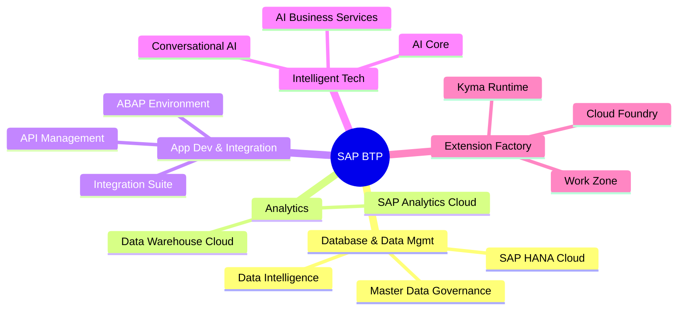

## 8.2 BTP Global Account Structure

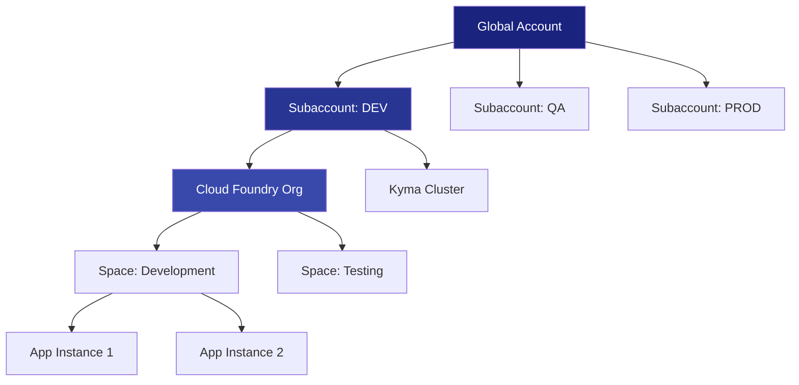

## 8.3 Key BTP Services Reference

| Service | Purpose | Use Case |
|---------|---------|----------|
| **ABAP Environment** | Run ABAP in the cloud | Lift & shift, extensions |
| **SAP HANA Cloud** | Managed HANA database | Standalone DB, DWC |
| **Integration Suite** | iPaaS (Integration) | API, Event, Process integration |
| **Destination Service** | Connectivity config | Connect to on-prem, cloud |
| **Cloud Connector** | Secure tunnel | On-prem connectivity |
| **SAP Build Apps** | Low-code development | Citizen developer apps |
| **Work Zone** | Unified launchpad | Central entry point |
| **AI Core** | ML model execution | Custom AI / GenAI |
| **Kyma** | Kubernetes runtime | Microservices, Functions |

## 8.4 Connectivity Patterns

### 8.4.1 Cloud to On-Premise

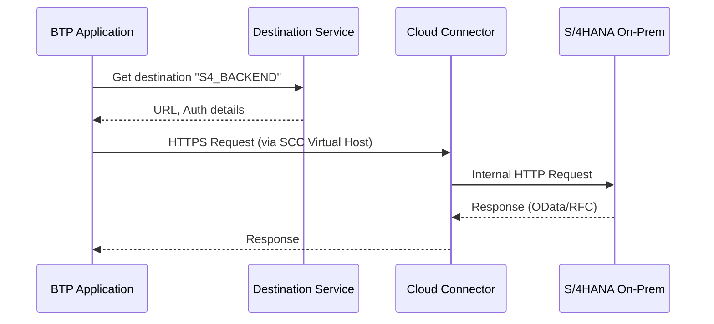

### 8.4.2 Destination Configuration

```json
{
  "Name": "S4HANA_BACKEND",
  "Type": "HTTP",
  "URL": "http://s4-virtual:443",
  "ProxyType": "OnPremise",
  "Authentication": "PrincipalPropagation",
  "sap-client": "100",
  "LocationID": "CLOUD_CONNECTOR_1"
}
```

---

# Chapter 9: Integration Patterns

## 9.1 Integration Architecture Overview

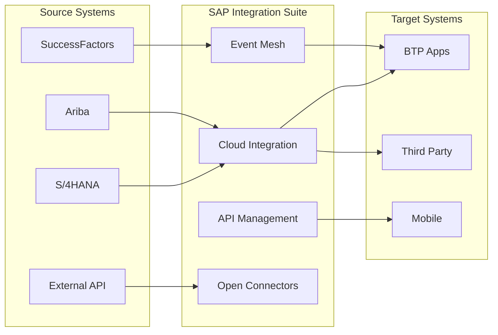

## 9.2 Event-Driven Architecture

### 9.2.1 SAP Event Mesh Flow

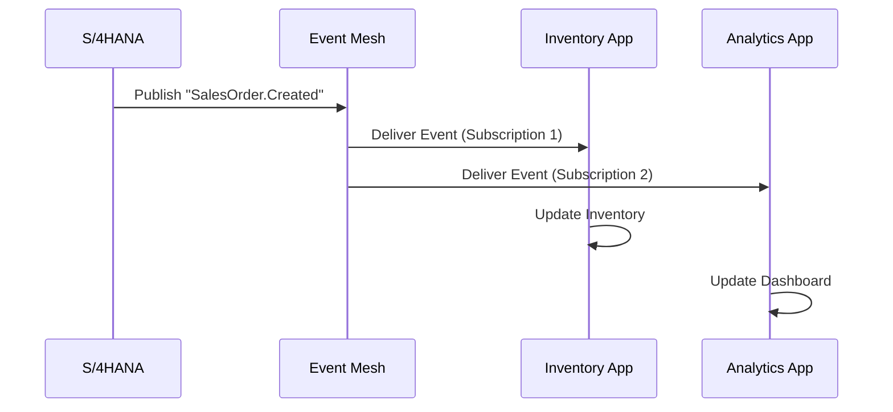

### 9.2.2 Event Schema (CloudEvents Format)

```json
{
  "specversion": "1.0",
  "type": "sap.s4.beh.salesorder.v1.SalesOrder.Created.v1",
  "source": "/default/sap.s4.beh/S4H",
  "id": "ABY7W312-1234-5678-90AB-CDEF12345678",
  "time": "2024-01-15T10:30:00Z",
  "datacontenttype": "application/json",
  "data": {
    "SalesOrder": "1000001234",
    "SalesOrganization": "1000",
    "Customer": "CUST001",
    "TotalNetAmount": 15000.00,
    "Currency": "EUR"
  }
}
```

## 9.3 API Design Best Practices

### 9.3.1 RESTful Resource Naming

```
# Good Examples
GET    /api/v1/sales-orders                    # List
GET    /api/v1/sales-orders/{id}               # Read
POST   /api/v1/sales-orders                    # Create
PUT    /api/v1/sales-orders/{id}               # Update
DELETE /api/v1/sales-orders/{id}               # Delete
POST   /api/v1/sales-orders/{id}/approve       # Action

# Bad Examples
GET    /api/getSalesOrders                     # Verb in path
POST   /api/createOrder                        # Verb in path
GET    /api/orders/delete/{id}                 # GET for delete
```

### 9.3.2 Error Response Format

```json
{
  "error": {
    "code": "ORDER_NOT_FOUND",
    "message": "Sales order 1000001234 does not exist",
    "target": "SalesOrder",
    "details": [
      {
        "code": "VALIDATION_ERROR",
        "message": "Customer ID is required",
        "target": "CustomerID"
      }
    ],
    "innererror": {
      "trace": "...",
      "timestamp": "2024-01-15T10:30:00Z"
    }
  }
}
```

---

# Chapter 10: Testing Strategies

## 10.1 Testing Pyramid

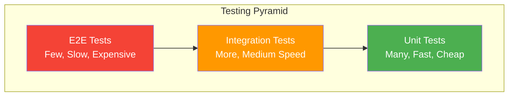

## 10.2 ABAP Unit Testing

### 10.2.1 Test Class Structure

```abap
CLASS ltc_order_service DEFINITION FINAL FOR TESTING
  DURATION SHORT
  RISK LEVEL HARMLESS.

  PRIVATE SECTION.
    CLASS-DATA: mo_environment TYPE REF TO if_osql_test_environment.
    DATA: mo_cut TYPE REF TO zcl_order_service.  " Class Under Test

    CLASS-METHODS:
      class_setup,
      class_teardown.

    METHODS:
      setup,
      teardown,
      
      " Test methods - use descriptive names
      test_create_order_success FOR TESTING,
      test_create_order_invalid_customer FOR TESTING,
      test_calculate_total_with_discount FOR TESTING,
      test_calculate_total_no_items FOR TESTING.
ENDCLASS.

CLASS ltc_order_service IMPLEMENTATION.

  METHOD class_setup.
    " Create test double environment for DB tables
    mo_environment = cl_osql_test_environment=>create(
      i_dependency_list = VALUE #(
        ( 'VBAK' )
        ( 'VBAP' )
        ( 'KNA1' )
      )
    ).
  ENDMETHOD.

  METHOD class_teardown.
    mo_environment->destroy( ).
  ENDMETHOD.

  METHOD setup.
    " Clear test data before each test
    mo_environment->clear_doubles( ).
    
    " Insert test fixtures
    mo_environment->insert_test_data(
      i_data = VALUE tt_vbak( 
        ( vbeln = '100' kunnr = 'CUST01' netwr = 1000 ) 
      )
    ).
    
    " Create instance with mocked dependencies
    mo_cut = NEW #( ).
  ENDMETHOD.

  METHOD teardown.
    CLEAR mo_cut.
  ENDMETHOD.

  METHOD test_create_order_success.
    " Arrange
    DATA(ls_header) = VALUE ty_order_header(
      kunnr = 'CUST01'
      erdat = sy-datum
    ).
    DATA(lt_items) = VALUE tt_order_items(
      ( matnr = 'MAT001' kwmeng = 10 netpr = 100 )
    ).

    " Act
    DATA(ls_result) = mo_cut->create_order(
      is_header = ls_header
      it_items  = lt_items
    ).

    " Assert
    cl_abap_unit_assert=>assert_equals(
      act = ls_result-status
      exp = 'S'
      msg = 'Order creation should succeed'
    ).
    
    cl_abap_unit_assert=>assert_not_initial(
      act = ls_result-order_id
      msg = 'Order ID should be generated'
    ).
  ENDMETHOD.

  METHOD test_create_order_invalid_customer.
    " Arrange
    DATA(ls_header) = VALUE ty_order_header(
      kunnr = 'INVALID'  " Non-existent customer
      erdat = sy-datum
    ).

    " Act & Assert - Expect exception
    TRY.
        mo_cut->create_order(
          is_header = ls_header
          it_items  = VALUE #( )
        ).
        cl_abap_unit_assert=>fail( msg = 'Should have raised exception' ).
      CATCH zcx_order_error INTO DATA(lx_error).
        cl_abap_unit_assert=>assert_equals(
          act = lx_error->if_t100_message~t100key-msgno
          exp = '001'
        ).
    ENDTRY.
  ENDMETHOD.

ENDCLASS.
```

### 10.2.2 Test Double Patterns

```abap
" Interface for dependency
INTERFACE zif_stock_checker.
  METHODS check_availability
    IMPORTING iv_material TYPE matnr
              iv_quantity TYPE menge_d
    RETURNING VALUE(rv_available) TYPE abap_bool.
ENDINTERFACE.

" Production implementation
CLASS zcl_stock_checker DEFINITION.
  PUBLIC SECTION.
    INTERFACES zif_stock_checker.
ENDCLASS.

" Test double (Stub)
CLASS ltd_stock_checker DEFINITION FOR TESTING.
  PUBLIC SECTION.
    INTERFACES zif_stock_checker.
    DATA: mv_return_value TYPE abap_bool VALUE abap_true.
ENDCLASS.

CLASS ltd_stock_checker IMPLEMENTATION.
  METHOD zif_stock_checker~check_availability.
    rv_available = mv_return_value.  " Predictable response
  ENDMETHOD.
ENDCLASS.

" Usage in test
METHOD test_order_with_stock_check.
  " Arrange - inject test double
  DATA(lo_mock_stock) = NEW ltd_stock_checker( ).
  lo_mock_stock->mv_return_value = abap_true.
  
  DATA(lo_service) = NEW zcl_order_service(
    io_stock_checker = lo_mock_stock
  ).
  
  " Act & Assert...
ENDMETHOD.
```

## 10.3 CDS View Testing

```abap
CLASS ltc_cds_view DEFINITION FINAL FOR TESTING
  DURATION SHORT
  RISK LEVEL HARMLESS.

  PRIVATE SECTION.
    CLASS-DATA: mo_environment TYPE REF TO if_cds_test_environment.

    CLASS-METHODS:
      class_setup,
      class_teardown.

    METHODS:
      test_customer_filter FOR TESTING,
      test_aggregation FOR TESTING.
ENDCLASS.

CLASS ltc_cds_view IMPLEMENTATION.

  METHOD class_setup.
    mo_environment = cl_cds_test_environment=>create( 
      i_for_entity = 'Z_I_CUSTOMER' 
    ).
    
    " Provide test data for underlying tables
    mo_environment->insert_test_data(
      i_data = VALUE kna1_t(
        ( kunnr = 'C001' name1 = 'Customer A' land1 = 'US' )
        ( kunnr = 'C002' name1 = 'Customer B' land1 = 'DE' )
        ( kunnr = 'C003' name1 = 'Customer C' land1 = 'US' )
      )
    ).
  ENDMETHOD.

  METHOD class_teardown.
    mo_environment->destroy( ).
  ENDMETHOD.

  METHOD test_customer_filter.
    " Act - Query the CDS view
    SELECT * FROM z_i_customer
      WHERE Country = 'US'
      INTO TABLE @DATA(lt_result).

    " Assert
    cl_abap_unit_assert=>assert_equals(
      act = lines( lt_result )
      exp = 2
      msg = 'Should return 2 US customers'
    ).
  ENDMETHOD.

ENDCLASS.
```

## 10.4 CAP Testing (Node.js)

```javascript
const cds = require('@sap/cds');
const { expect } = require('chai');

describe('CatalogService', () => {
  let srv, Books;

  before(async () => {
    srv = await cds.connect.to('CatalogService');
    Books = srv.entities.Books;
  });

  beforeEach(async () => {
    // Reset test data
    await cds.run(DELETE.from(Books));
    await cds.run(INSERT.into(Books).entries([
      { ID: 1, title: 'Book A', stock: 100, price: 10.00 },
      { ID: 2, title: 'Book B', stock: 5, price: 20.00 }
    ]));
  });

  describe('READ Books', () => {
    it('should return all books', async () => {
      const books = await srv.run(SELECT.from(Books));
      expect(books).to.have.length(2);
    });

    it('should filter by title', async () => {
      const books = await srv.run(
        SELECT.from(Books).where({ title: 'Book A' })
      );
      expect(books).to.have.length(1);
      expect(books[0].title).to.equal('Book A');
    });
  });

  describe('submitOrder action', () => {
    it('should reduce stock on order', async () => {
      // Act
      await srv.run(srv.submitOrder({ book: 1, quantity: 10 }));

      // Assert
      const book = await srv.run(SELECT.one.from(Books).where({ ID: 1 }));
      expect(book.stock).to.equal(90);
    });

    it('should reject order if insufficient stock', async () => {
      try {
        await srv.run(srv.submitOrder({ book: 2, quantity: 100 }));
        expect.fail('Should have thrown error');
      } catch (err) {
        expect(err.code).to.equal(400);
        expect(err.message).to.include('Not enough stock');
      }
    });
  });
});
```

---

*Continued in Chapters 11-15...*

---

# Chapter 11: DevOps & CI/CD

## 11.1 ABAP Development Lifecycle

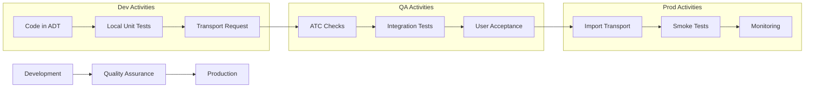

## 11.2 abapGit Workflow

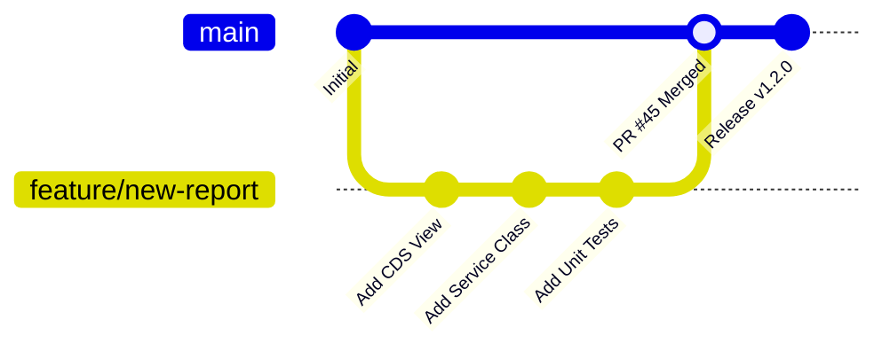

### 11.2.1 abapGit Commands

```abap
" In SE38: ZABAPGIT or via transaction ZABAPGIT

" Key Operations:
" 1. Stage Changes - Select objects to commit
" 2. Commit - Save to local Git
" 3. Push - Upload to remote (GitHub/GitLab)
" 4. Pull - Download from remote
" 5. Diff - Compare versions
```

## 11.3 gCTS (Git-enabled CTS)

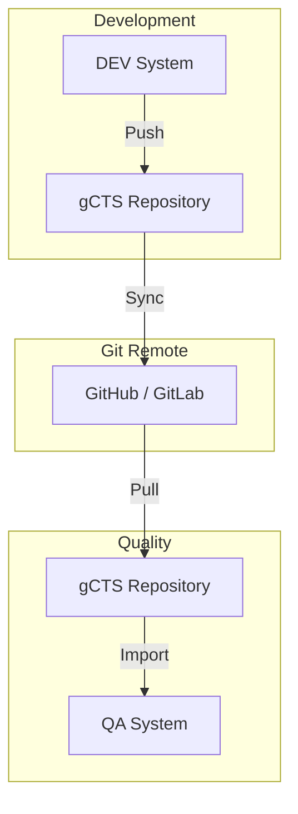

## 11.4 ATC (ABAP Test Cockpit) Configuration

### 11.4.1 Key Check Variants

| Variant | Purpose | When to Use |
|---------|---------|-------------|
| **SLIN_SEC** | Security checks | Always |
| **PERFORMANCE** | SQL performance | Always |
| **CLOUD_READY** | S/4HANA Cloud compatibility | Before go-live |
| **FUNCTIONAL** | Logic errors | Development |
| **NAMING** | Convention compliance | Code review |

### 11.4.2 Blocking Transport Release

```
Transaction: ATC
Path: Administration → Check Variant Assignment

Configuration:
- Object Type: All
- Check Variant: PERFORMANCE + CLOUD_READY
- Priority Threshold: 1 (Block on Error)
- Exemption Process: Require architecture approval
```

## 11.5 CI/CD Pipeline Example

```yaml
# .gitlab-ci.yml for CAP Project
stages:
  - build
  - test
  - deploy

variables:
  CF_API: "https://api.cf.eu10.hana.ondemand.com"

build:
  stage: build
  image: node:18
  script:
    - npm ci
    - npm run build
  artifacts:
    paths:
      - gen/

test:
  stage: test
  image: node:18
  script:
    - npm ci
    - npm run test
  coverage: '/Statements\s*:\s*(\d+\.?\d*)%/'

deploy_dev:
  stage: deploy
  image: ppiper/cf-cli
  script:
    - cf login -a $CF_API -u $CF_USER -p $CF_PASSWORD -o $CF_ORG -s dev
    - cf push -f manifest-dev.yml
  only:
    - develop

deploy_prod:
  stage: deploy
  image: ppiper/cf-cli
  script:
    - cf login -a $CF_API -u $CF_USER -p $CF_PASSWORD -o $CF_ORG -s prod
    - cf push -f manifest-prod.yml
  only:
    - main
  when: manual
```

---

# Chapter 12: Security Best Practices

## 12.1 Security Layers

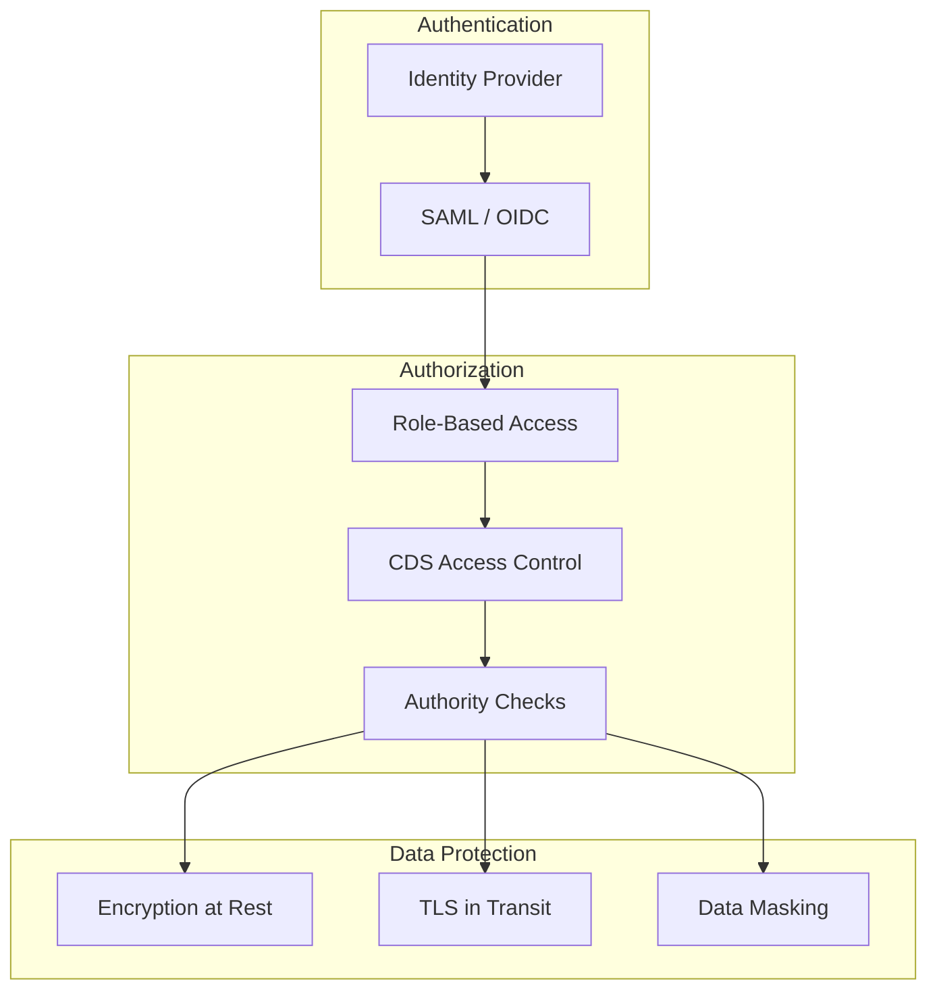

## 12.2 CDS Access Control (DCL)

### 12.2.1 Basic DCL Definition

```abap
@EndUserText.label: 'Access Control for Sales Orders'
@MappingRole: true
define role Z_SalesOrder_Access {
  grant select on Z_I_SalesOrder
    where (SalesOrganization) = aspect pfcg_auth(V_VBAK_VKO, VKORG, ACTVT='03');
}
```

### 12.2.2 Complex DCL with Multiple Conditions

```abap
define role Z_Customer_Access {
  grant select on Z_I_Customer
    where 
      // User can see customers in their sales org
      (SalesOrganization) = aspect pfcg_auth(V_VBAK_VKO, VKORG, ACTVT='03')
      
      // OR user has full access role
      or (1) = aspect pfcg_auth(Z_FULL_ACCESS, DUMMY);
}
```

## 12.3 ABAP Authority Checks

```abap
METHOD check_authorization.
  " Standard authority check
  AUTHORITY-CHECK OBJECT 'V_VBAK_VKO'
    ID 'VKORG' FIELD iv_sales_org
    ID 'VTWEG' FIELD iv_dist_channel
    ID 'SPART' FIELD iv_division
    ID 'ACTVT' FIELD '02'.  " Change

  IF sy-subrc <> 0.
    RAISE EXCEPTION TYPE zcx_auth_error
      EXPORTING
        textid = zcx_auth_error=>no_change_auth
        iv_object = 'Sales Order'.
  ENDIF.
ENDMETHOD.
```

## 12.4 CAP Security (Node.js)

### 12.4.1 xs-security.json

```json
{
  "xsappname": "my-bookshop",
  "tenant-mode": "dedicated",
  "scopes": [
    { "name": "$XSAPPNAME.admin", "description": "Admin Access" },
    { "name": "$XSAPPNAME.viewer", "description": "Read Access" }
  ],
  "role-templates": [
    {
      "name": "Admin",
      "scope-references": ["$XSAPPNAME.admin"]
    },
    {
      "name": "Viewer", 
      "scope-references": ["$XSAPPNAME.viewer"]
    }
  ]
}
```

### 12.4.2 Service Authorization

```cds
service AdminService @(requires: 'admin') {
  entity Books as projection on my.Books;
  entity Orders as projection on my.Orders;
}

service CatalogService @(requires: 'authenticated-user') {
  @readonly entity Books as projection on my.Books;
  
  @(restrict: [
    { grant: 'READ', to: 'viewer' },
    { grant: '*', to: 'admin' }
  ])
  entity Orders as projection on my.Orders;
}
```

---

# Chapter 13: Performance Optimization

## 13.1 Performance Analysis Tools

| Tool | Purpose | When to Use |
|------|---------|-------------|
| **ST05** | SQL Trace | DB performance issues |
| **SAT** | ABAP Runtime Analysis | Code hotspots |
| **ST12** | Combined Trace | Full picture |
| **SE30** | Runtime Analysis (Old) | Legacy |
| **HANA Studio** | Execution Plans | Database tuning |

## 13.2 SQL Optimization Checklist

### 13.2.1 Common Anti-Patterns

```abap
" ❌ BAD: SELECT inside LOOP
LOOP AT lt_orders INTO ls_order.
  SELECT SINGLE * FROM vbap INTO ls_item
    WHERE vbeln = ls_order-vbeln.
ENDLOOP.

" ✅ GOOD: Single SELECT with FOR ALL ENTRIES
IF lt_orders IS NOT INITIAL.
  SELECT * FROM vbap INTO TABLE @lt_items
    FOR ALL ENTRIES IN @lt_orders
    WHERE vbeln = @lt_orders-vbeln.
ENDIF.
```

```abap
" ❌ BAD: SELECT * when you need 3 fields
SELECT * FROM mara INTO TABLE @lt_mara.

" ✅ GOOD: Specify only needed fields
SELECT matnr, mtart, matkl FROM mara INTO TABLE @lt_mara.
```

```abap
" ❌ BAD: Filtering in ABAP
SELECT * FROM vbak INTO TABLE @lt_orders.
DELETE lt_orders WHERE erdat < '20240101'.

" ✅ GOOD: Filter in WHERE clause
SELECT * FROM vbak INTO TABLE @lt_orders
  WHERE erdat >= '20240101'.
```

## 13.3 Internal Table Optimization

```abap
" For LOOP WHERE - use SORTED table
DATA: lt_sorted TYPE SORTED TABLE OF ty_order WITH UNIQUE KEY vbeln.

LOOP AT lt_sorted INTO ls_order WHERE vkorg = '1000'.
  " O(log n) + linear scan of matching entries
ENDLOOP.

" For READ TABLE - use HASHED table
DATA: lt_hashed TYPE HASHED TABLE OF ty_customer WITH UNIQUE KEY kunnr.

READ TABLE lt_hashed INTO ls_customer WITH KEY kunnr = lv_kunnr.
" O(1) access time
```

## 13.4 HANA-Specific Optimizations

### 13.4.1 Use Appropriate Column Types

```sql
-- ❌ BAD: VARCHAR for fixed-length codes
country VARCHAR(3)

-- ✅ GOOD: Use CHAR for fixed-length
country CHAR(3)
```

### 13.4.2 Partition Large Tables

```sql
-- Create partitioned table (DBA task)
ALTER TABLE z_large_log
PARTITION BY RANGE (created_date) (
  PARTITION p_2023 VALUES LESS THAN ('2024-01-01'),
  PARTITION p_2024 VALUES LESS THAN ('2025-01-01'),
  PARTITION p_future VALUES LESS THAN (MAXVALUE)
);
```

---

# Chapter 14: Real-World Scenarios

## 14.1 Scenario: Custom Approval Workflow

**Requirement:** Sales orders above $10,000 need manager approval.

### Solution Architecture

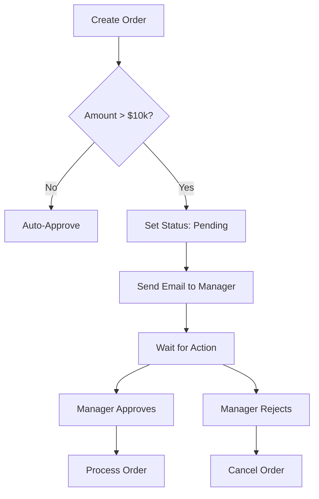

### RAP Implementation

```abap
" Behavior Definition
define behavior for ZI_SalesOrder alias Order {
  action ( features : instance ) submitForApproval result [1] $self;
  action ( features : instance ) approve result [1] $self;
  action ( features : instance ) reject result [1] $self;
  
  determination setApprovalRequired on modify { field TotalAmount; }
}

" Determination
METHOD setApprovalRequired.
  READ ENTITIES OF ZI_SalesOrder IN LOCAL MODE
    ENTITY Order
      FIELDS ( TotalAmount )
      WITH CORRESPONDING #( keys )
    RESULT DATA(lt_orders).

  LOOP AT lt_orders INTO DATA(ls_order).
    IF ls_order-TotalAmount > 10000.
      MODIFY ENTITIES OF ZI_SalesOrder IN LOCAL MODE
        ENTITY Order
          UPDATE FIELDS ( ApprovalRequired )
          WITH VALUE #( (
            %tky = ls_order-%tky
            ApprovalRequired = abap_true
          ) ).
    ENDIF.
  ENDLOOP.
ENDMETHOD.
```

## 14.2 Scenario: Data Migration Tool

**Requirement:** Migrate legacy customer data with validation.

### Architecture

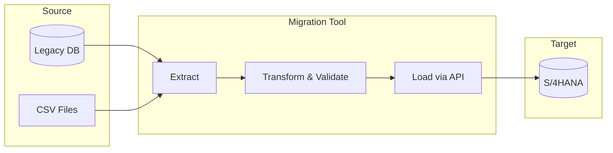

### Implementation

```abap
CLASS zcl_customer_migration DEFINITION.
  PUBLIC SECTION.
    METHODS:
      migrate
        IMPORTING it_legacy_data TYPE tt_legacy_customer
        RETURNING VALUE(rs_result) TYPE ty_migration_result.

  PRIVATE SECTION.
    METHODS:
      validate_record
        IMPORTING is_legacy TYPE ty_legacy_customer
        RETURNING VALUE(rs_valid) TYPE ty_validation_result,
      
      transform_record
        IMPORTING is_legacy TYPE ty_legacy_customer
        RETURNING VALUE(rs_new) TYPE ty_new_customer,
      
      call_customer_api
        IMPORTING is_customer TYPE ty_new_customer
        RETURNING VALUE(rs_result) TYPE ty_api_result.
ENDCLASS.

CLASS zcl_customer_migration IMPLEMENTATION.
  METHOD migrate.
    DATA: lt_errors TYPE TABLE OF ty_error,
          lv_success_count TYPE i,
          lv_error_count TYPE i.

    LOOP AT it_legacy_data INTO DATA(ls_legacy).
      " Validate
      DATA(ls_validation) = validate_record( ls_legacy ).
      IF ls_validation-is_valid = abap_false.
        APPEND VALUE #( 
          record_id = ls_legacy-id
          error_msg = ls_validation-error_message
        ) TO lt_errors.
        ADD 1 TO lv_error_count.
        CONTINUE.
      ENDIF.

      " Transform
      DATA(ls_new) = transform_record( ls_legacy ).

      " Load
      DATA(ls_api_result) = call_customer_api( ls_new ).
      IF ls_api_result-success = abap_true.
        ADD 1 TO lv_success_count.
      ELSE.
        APPEND VALUE #(
          record_id = ls_legacy-id
          error_msg = ls_api_result-error_message
        ) TO lt_errors.
        ADD 1 TO lv_error_count.
      ENDIF.
    ENDLOOP.

    rs_result = VALUE #(
      total_records = lines( it_legacy_data )
      success_count = lv_success_count
      error_count   = lv_error_count
      errors        = lt_errors
    ).
  ENDMETHOD.
ENDCLASS.
```

---

# Chapter 15: Quick Reference Cards

## 15.1 CDS Annotation Cheat Sheet

| Category | Annotation | Purpose |
|----------|------------|---------|
| **View Type** | `@VDM.viewType: #BASIC` | Interface view |
| | `@VDM.viewType: #COMPOSITE` | Joined view |
| | `@VDM.viewType: #CONSUMPTION` | UI-ready view |
| **Security** | `@AccessControl.authorizationCheck: #CHECK` | Enforce DCL |
| **UI** | `@UI.lineItem: [{ position: 10 }]` | List column |
| | `@UI.selectionField: [{ position: 10 }]` | Filter |
| | `@UI.headerInfo: { typeName: 'Order' }` | Page header |
| **Semantics** | `@Semantics.amount.currencyCode: 'Currency'` | Amount field |
| | `@Semantics.quantity.unitOfMeasure: 'Unit'` | Quantity field |
| **Analytics** | `@Analytics.dataCategory: #CUBE` | Analytical view |
| | `@DefaultAggregation: #SUM` | Measure aggregation |

## 15.2 RAP Keywords Quick Reference

```abap
" Behavior Definition Keywords
managed;                    // Auto-persistence
unmanaged;                  // Custom persistence
with draft;                 // Enable drafts

lock master;               // Root entity lock
lock dependent by _Parent; // Child lock

etag master LastChanged;   // Optimistic locking

action myAction result [1] $self;      // Instance action
static action bulkAction;              // Static action
factory action createCopy;             // Factory action

determination det1 on modify { field F1; }  // Trigger on change
determination det2 on save { create; }      // Trigger on save

validation val1 on save { field F1; }       // Save-time validation
```

## 15.3 Useful Transaction Codes

| TCode | Description |
|-------|-------------|
| **SE80** | Object Navigator |
| **SE24** | Class Builder |
| **SE11** | Data Dictionary |
| **ST05** | SQL Trace |
| **SAT** | Runtime Analysis |
| **ATC** | ABAP Test Cockpit |
| **/IWFND/MAINT_SERVICE** | OData Service Activation |
| **/IWFND/ERROR_LOG** | OData Error Logs |
| **SICF** | HTTP Service Config |
| **SMICM** | ICM Monitor |

## 15.4 CAP CLI Commands

```bash
# Project Setup
cds init my-project          # Create new project
cds add hana                  # Add HANA support
cds add xsuaa                 # Add authentication
cds add approuter             # Add app router

# Development
cds watch                     # Start dev server
cds build                     # Build for deployment
cds deploy --to hana          # Deploy to HANA

# Database
cds deploy --to sqlite        # Local SQLite
cds deploy --to hana --dry    # Preview HANA artifacts

# Service
cds compile srv/ --to edmx    # Generate OData metadata
cds compile srv/ --to openapi # Generate OpenAPI spec
```

---

# Appendix A: Glossary

| Term | Definition |
|------|------------|
| **AMDP** | ABAP Managed Database Procedure - SQLScript in ABAP |
| **BAdI** | Business Add-In - Enhancement point |
| **BDEF** | Behavior Definition - RAP behavior config |
| **BTP** | Business Technology Platform |
| **CAP** | Cloud Application Programming Model |
| **CDS** | Core Data Services - Semantic data modeling |
| **DCL** | Data Control Language - Row-level auth |
| **EML** | Entity Manipulation Language - RAP entity API |
| **gCTS** | Git-enabled Change and Transport System |
| **OData** | Open Data Protocol - REST-based data |
| **RAP** | RESTful Application Programming - ABAP framework |
| **SADL** | Service Adaptation Description Language |
| **VDM** | Virtual Data Model - CDS view layers |

---

# Appendix B: Learning Path

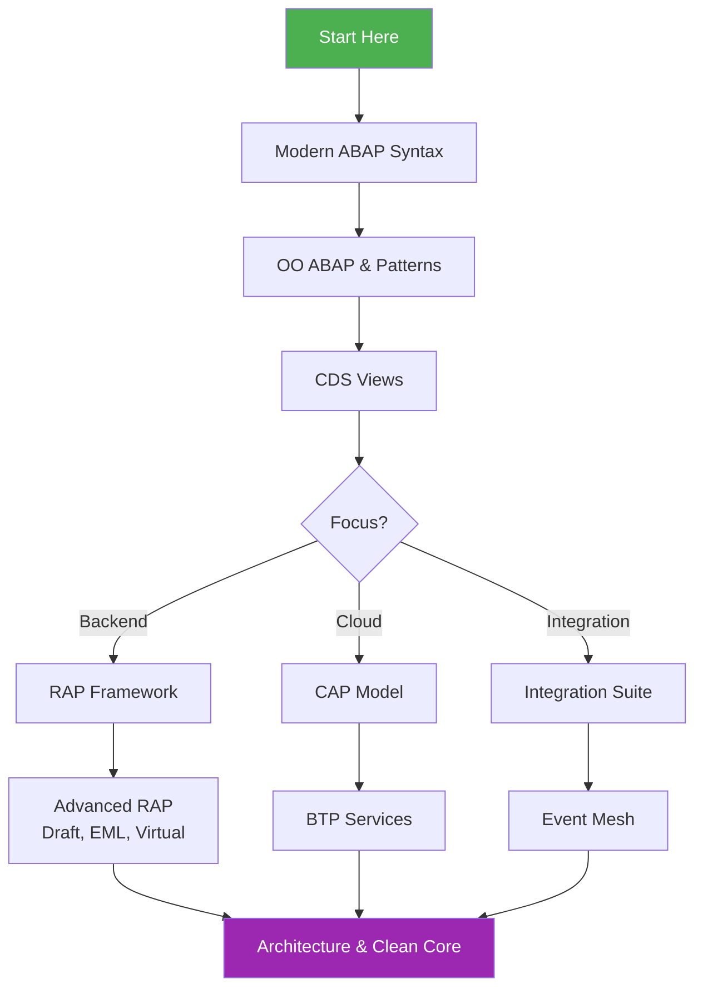

---

*End of Handbook*

**Version:** 1.0  
**Last Updated:** 2024-12-07  
**Author:** AI-Generated Reference Guide

---

> "The best code is no code at all. Every new line of code you write is a liability."
> — Use frameworks (RAP, CAP) to minimize custom code.

---

## 📫 Connect

**Beyhan MEYRALI**

[](https://linkedin.com/in/beyhanmeyrali)
[](https://github.com/beyhanmeyrali)

---

## 📄 License

This project is licensed under the **MIT License** - see the [LICENSE](LICENSE) file for details.

---

## ⭐ Star This Repository

If you find this repository helpful, please consider giving it a star! It helps others discover these resources.

---

**Happy Learning! 🚀**

> *"The best way to predict the future is to build it."*


